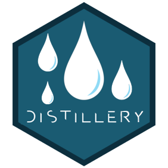

```{r setup, include = FALSE}
options(htmltools.dir.version = FALSE)
knitr::opts_chunk$set(
  fig.width=9, fig.height=3.5, fig.retina=3,
  out.width = "100%",
  cache = FALSE,
  echo = TRUE,
  message = FALSE, 
  warning = FALSE,
  fig.show = TRUE,
  hiline = TRUE
)
```

```{r xaringan-themer, include = FALSE, warning = FALSE}
library(xaringanthemer)
style_duo_accent(
  primary_color = "#1c5253",
  secondary_color = "#F4790B",
  inverse_header_color = "#FFFFFF",
  title_slide_text_color = "#FFFFFF",
  base_font_size = "22px",
  link_color = "#F4790B"
)
```

```{r metathis, echo=FALSE}
library(metathis)
meta() %>%
    meta_name("github-repo" = "aosmith16/spring-r-topics") %>% 
    meta_social(
        title = "Using distill for personal websites",
        description = paste(
            "Using distill to build personal website",
            "Spring 2021"
        ),
        url = "https://aosmith16.github.io/spring-r-topics/slides/week02_distill_websites.html",
        image = "https://aosmith16.github.io/spring-r-topics/slides/week02_distill_websites.html/week02-share-card.png",
        image_alt = paste(
            "Using distill for personal websites", 
            "Working sessions class spring 2021"
        ),
        og_type = "website",
        og_author = "Ariel Muldoon",
        twitter_card_type = "summary_large_image",
        twitter_creator = "@aosmith16"
    )
```

```{r xaringan-scribble, echo = FALSE}
xaringanExtra::use_scribble()
```

```{r xaringanExtra-clipboard, echo=FALSE}
xaringanExtra::use_clipboard()
```

```{r xaringan-tile-view, echo=FALSE}
xaringanExtra::use_tile_view()
```

```{r broadcast, echo=FALSE}
xaringanExtra::use_broadcast()
```

class: center, middle, title-slide

# Build a personal website with distill

```{r distill, echo = FALSE, out.width = "20%"}
knitr::include_graphics("figs/distill.png")
```

### Ariel Muldoon

### April 5, 2021

---

## Today's Goal

Overall

- **Create a personal website to showcase your work**

--

We will 
-     Start a **distill** website in a version-controlled directory  
-     Build a home page with package **postcards**  
-     Edit `_site.yml` to control website design
-     Do a basic theme change

---

## Resources

- The **distill** website has great material for getting started: https://rstudio.github.io/distill/  
- Thomas Mock has a nice intro to **distill** [here](https://themockup.blog/posts/2020-08-01-building-a-blog-with-distill/)  
- Alison Hill's post on **postcards**
[here](https://alison.rbind.io/post/2020-12-22-postcards-distill/) is a great start  
- The [distillery showcase](https://jhelvy.github.io/distillery/showcase.html) is great for inspiration and ideas on website design. Check out the GitHub repos of pages you want to emulate!

```{r distillery, echo = FALSE, out.width = "30%", out.extra='style="display: block;margin-left: auto;margin-right: auto;vertical-align: middle;"'}

```

---

## Where are we going?

