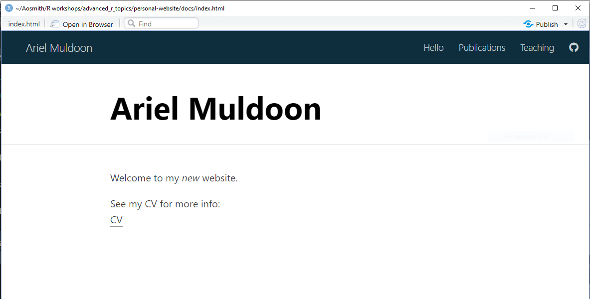

```{r setup, include = FALSE}
options(htmltools.dir.version = FALSE)
knitr::opts_chunk$set(
  fig.width=9, fig.height=3.5, fig.retina=3,
  out.width = "100%",
  cache = FALSE,
  echo = TRUE,
  message = FALSE, 
  warning = FALSE,
  fig.show = TRUE,
  hiline = TRUE
)
```

```{r xaringan-themer, include = FALSE, warning = FALSE}
library(xaringanthemer)
style_duo_accent(
  primary_color = "#1c5253",
  secondary_color = "#F4790B",
  inverse_header_color = "#FFFFFF",
  title_slide_text_color = "#FFFFFF",
  base_font_size = "22px",
  link_color = "#F4790B"
)
```

```{r metathis, echo=FALSE}
library(metathis)
meta() %>%
    meta_name("github-repo" = "aosmith16/spring-r-topics") %>% 
    meta_social(
        title = "Using distill for personal websites",
        description = paste(
            "Using distill to build personal website",
            "Spring 2021"
        ),
        url = "https://aosmith16.github.io/spring-r-topics/slides/week02_distill_websites.html",
        image = "https://aosmith16.github.io/spring-r-topics/slides/week02_distill_websites.html/week02-share-card.png",
        image_alt = paste(
            "Using distill for personal websites", 
            "Working sessions class spring 2021"
        ),
        og_type = "website",
        og_author = "Ariel Muldoon",
        twitter_card_type = "summary_large_image",
        twitter_creator = "@aosmith16"
    )
```

```{r xaringan-scribble, echo = FALSE}
xaringanExtra::use_scribble()
```

```{r xaringanExtra-clipboard, echo=FALSE}
xaringanExtra::use_clipboard()
```

```{r xaringan-tile-view, echo=FALSE}
xaringanExtra::use_tile_view()
```

```{r broadcast, echo=FALSE}
xaringanExtra::use_broadcast()
```

class: center, middle, title-slide

# Build a personal website with distill
## Part 1: Basic website with postcard

```{r distill, echo = FALSE, out.width = "15%"}
knitr::include_graphics("figs/distill.png")
```

### Ariel Muldoon

### April 5, 2021

---

## Today's Goal

Overall

- **Create a personal website to showcase your work**

--

We will 
-     Start a **distill** website in a version-controlled directory  
-     Build a home page with package **postcards**  
-     Edit `_site.yml` to control website design
-     Do a basic theme change

---

## Resources

- The **distill** website has great material for getting started: https://rstudio.github.io/distill/  
- Thomas Mock has a nice intro to **distill** [here](https://themockup.blog/posts/2020-08-01-building-a-blog-with-distill/)  
- Alison Hill's post on **postcards**
[here](https://alison.rbind.io/post/2020-12-22-postcards-distill/) is super helpful  
- The [distillery showcase](https://jhelvy.github.io/distillery/showcase.html) is great for inspiration and ideas on website design. Check out the GitHub repos of pages you want to emulate!

```{r distillery, echo = FALSE, out.width = "30%", out.extra='style="display: block;margin-left: auto;margin-right: auto;vertical-align: middle;"'}
knitr::include_graphics("figs/week02_files/distillery.png")
```

---

## Why distill?

.pull-left[
- Based on Rmarkdown
- Comparatively simple and easy to maintain  
- Templates for building interactive academic articles    
- **Con**: Not particularly flexible for customizing site layout or style 

*Alternatives: blogdown, hugodown*
]

.pull-right[
<blockquote class="twitter-tweet" data-lang="en"><p lang="en" dir="ltr">Blogdown vs distill overview</p>&mdash; Shannon Pileggi (@PipingHotData) <a href="https://twitter.com/WeAreRLadies/status/1363144545677017089">February 20, 2021</a></blockquote>
]

---

## Where are we going?

The focus today will be on making personal websites to showcase ourselves. The home page will have a pic, contact info, and a text introduction to your background. You will add additional pages to showcase your work, such as publications and presentations.

(Put screenshot of my example after running through this process here)

---

## Examples for inspiration

.pull-left[
A lot of my own approach to building a website involves looking at other websites to see what I like and what I can do. Along those lines, I'll show two example websites here along with links to the site and source code.  

The first example is a fairly complex **distill** website by [John Paul Helveston](https://jhelvy.github.io/). You'll notice he uses separate pages to showcase, e.g., publications and teaching.

]

.pull-right[
.center[]
[Site](https://jhelvy.github.io/)  
[Source code](https://github.com/jhelvy/jhelvy.github.io)
]

---

## Examples for inspiration

.pull-left[
The second example is a somewhat simpler **distill** website from [Harry Fisher](https://www.hfshr.xyz/).  One thing you might notice is the use of icons instead of labels for social and navigation links.

Take a few minutes to look at these website examples and/or go to the [distillery showcase](https://jhelvy.github.io/distillery/showcase.html) and scroll through some examples there to start thinking about what you like.

<br/>
<br/>
Other examples you might want to check out:  
[Ijeamaka Anyene](https://ijeamaka-anyene.netlify.app/)  
[Jeff Leek's](http://jtleek.com/) super simple, one-page website  
[Jannik M. Buhr](https://jmbuhr.de/)
]

.pull-right[
.center[]
[Site](https://www.hfshr.xyz/)  
[Source code](https://github.com/hfshr/distill_blog)
]

---

class: center, middle, inverse, hide-logo

# <font style="font-family: cursive; font-style:italic">Let's get started!</font>

---

## Create distill website

Open the version-controlled Project you created last week. Mine is called `personal-website`.

We'll make a website within this directory using `distill::create_website()`.  

Copy and paste the following code example into R. Change the `title` to your name before running:

```{r, eval = FALSE}
distill::create_website(dir = ".", 
                        title = "Ariel Muldoon", 
                        gh_pages = TRUE)
```

*Code explainer:*
- Since we already have a directory for the website, we use `dir = "."`. 
- You'll need to name the website with `title`. For a personal website this is usually your name.
- Finally, since we will be deploying the website via GitHub Pages, set `gh_pages` to `TRUE`.

---

## Basic website files

After running the code from the last slide you will get the basic skeleton of a **distill** website. 

.center[
```{r basic, echo = FALSE, out.width = "60%"}

```
]

We'll be going through the files that were created, editing them to personalize our websites.

???

In particular note _site.yml, index.Rmd, about.Rmd and the new "docs" folder.

---

## Build basic website

.pull-left[
**Important**: Before we proceed any further, close RStudio and then reopen your website Project.  

Once you reopen you should see a `Build` tab near your `Environment` pane. 

.center[]
]

--

.pull-right[
Go to the `Build` tab and click `Build website`. The basic website will build and then pop open in a new window.
<br/><br/>
.center[]
Click around on the navigation bar to see what is on each page. This will set us up to talk about the files we now have.
]

---

## Basic overview

- `index.Rmd`: every **distill** website *must* have an `index.Rmd` file and it needs to be in the root directory. Don't move it.   
In addition, you must have a `title` and `site: distill::distill_website` in your YAML header.

--

- `about.Rmd`: an additional example RMD file that is associated. The content is currently associated with the `About` navigation bar button.

--

- `_site.yml`: you control many aspects of your website from here, including your navigation bar.

--

- `docs` folder: where the files that make up your website are stored. Publish your website based on this folder.

???

This is a very basic overview. You may want to know more about each of these, in which case I recommend the distill "Creating a website" page.

---

## Edit `index.Rmd`

**You control your home page content by making changes to `index.Rmd`.**

.pull-left[
To start, delete the two lines of `description` in the YAML header. (You can always add this back if you want. `r emo::ji("wink")`)

My header now looks like

```
---
title: "Ariel Muldoon"
site: distill::distill_website
---
```
]

--

.pull-right[
Add text, code, and images to the body of `index.Rmd` using standard R markdown syntax. 

For practice, add a line of text but leave the setup chunk at the top of the document.

I added

```
## This is my *new* website.

### I hope you like it.
```
under the setup chunk.
]

---

## Knitting vs Building

.pull-left[
If you change a single document, like we just did with `index.Rmd`, you can use the `Knit` button at the top of your Source pane to preview the changes you made. 

Do that now and see how the output file has changed.
]

.pull-right[
.center[]
<br/><br/>
After making changes to multiple files you'll want to `Build` the entire dataset like we did after we first created our skeleton website.
]

---

## More on the `docs` folder

.pull-left[
Every time we `Knit` a file in the root directory or `Build` the entire website, all files and folders are placed in the `docs` folder.

Generally speaking you will not be doing any work in `docs` manually.

<br/><br/>

Take a look at the contents of that folder.  

]

--

.pull-right[
.center[]
Note two HTML output files from `index.Rmd` and `about.Rmd` are here (same names but end in `html`). These are literally the files that make our website. 

]

???

Distill is a static site generator, so is based on HTML documents we create. Since we are using GitHub pages to publish/deploy we have a "docs" folder by default and all HTML output from our Rmd files in the root directory are saved there.

---

## Edit the navigation bar

.pull-left[
The `_site.yml` file is key in controlling many aspects of your website. 

We will keep most of the defaults and focus on changes to the navigation bar.

The navigation bar settings are controlled under `navbar`.
]

--

.pull-right[

```{r, eval = FALSE}
name: "."
title: "Ariel Muldoon"
description: |
  Ariel Muldoon
output_dir: "docs"
*navbar:  
*  right:  
*    - text: "Home"  
*      href: index.html  
*    - text: "About"  
*      href: about.html  
output: distill::distill_article
```

At the moment our navigation menu is on the right and we're using the names `Home` and `About`.

]

---

## Edit the navigation bar

You can move the navigation menus to the right or left. Right now they are all on the right.

Change the `text` to change the menu names.

```{r, eval = FALSE}
 navbar:
   right:
*    - text: "Hello"
       href: index.html
*    - text: "Publications"
       href: about.html
```

Build or knit `index.Rmd` to see the changes.

.center[]

---

## Edit the navigation bar

You can use *icons* instead of text using Font Awesome identifiers

I'll add a link to my GitHub using the `r fontawesome::fa("github")` icon. `href` refers to a link, so must link to a web page either in `docs` or somewhere on the web.

```{r, eval = FALSE}
 navbar:
   right:
     - text: "Hello"
       href: index.html
     - text: "Publications"
       href: about.html
*    - icon: fab fa-github
*      href: https://github.com/aosmith16/personal-website
```
.center[]

---

## Add a navigation menu

If we want a local HTML file associated with a new menu we'll need a new .Rmd file.

We can do make the new file using RStudio's drop-down menus.

Go to `File > New File > R Markdown...`

Click `From Template` and then choose a `Distill Article`.

.center[]

---

## Add a navigation menu

Save the file into the root directory.

I named mine `teaching.Rmd`, so it will create an HTML file called `teaching.html`.

Add a new `navbar` menu in `_site.yml` that is associated with this file and `Build`.

```{r, eval = FALSE}
navbar:
  right:
    - text: "Hello"
      href: index.html
    - text: "Publications"
      href: about.html
*   - text: "Teaching"
*     href: teaching.html
    - icon: fab fa-github
      href: https://github.com/aosmith16/personal-website
```

.center[]

---

## Add a postcard to your website

The [**postcards** package](https://github.com/seankross/postcards) is a convenient way to create a nice landing page for your website.

Before we proceed, save whatever image you'd like to represent you in a folder called `images` in the root directory of your current Project. My file is named `ao_small.png`.

--

We'll create a postcard using `distill::create_article()`. 

```{r, eval = FALSE}
distill::create_article(file = "postcard",  
                        template = "jolla",    
                        package = "postcards")
```

*Code explainer:*
- Create the name of the .Rmd file with `file`. 
- Chose a [template](https://github.com/seankross/postcards/blob/main/README.md#the-templates) from package **postcards** with `template`.
- In `package` we list the name of the package that has the template.

???

There are currently 4 templates to choose from. See link for examples.

---

## Add a postcard to your website

Let's change the YAML header filler info to our own before we knit. Delete `label`/`url` for links you don't have.

.pull-left[
Here's what we start with:
```{r, eval = FALSE}
---
title: "Tobi Burns"
image: "tobi.jpg"
links:
  - label: LinkedIn
    url: "https://linkedin.com/"
  - label: Twitter
    url: "https://twitter.com/"
  - label: GitHub
    url: "https://github.com/"
  - label: Email
    url: "mailto:email@email.com"
output:
  postcards::jolla
---
```
]

--

.pull-right[
And here are my edits:
```{r, eval = FALSE}
---
title: "Ariel Muldoon"
image: "images/ao_small.png"
links:
  - label: LinkedIn
    url: "https://www.linkedin.com/in/arielmuldoon/"
  - label: Twitter
    url: "https://twitter.com/aosmith16"
  - label: GitHub
    url: "https://github.com/aosmith16"
  - label: Email
    url: "mailto:ariel.muldoon@gmail.com"
output:
  postcards::jolla
---
```
]

???

Note my picture is in my "images" folder, so I had to write out the path. Delete the `label` and `url` lines for any social links you don't have or add others.

---

## Add a postcard to your website

Knit `postcard.Rmd` to see the first draft.

.center[
```{r postcard1, echo = FALSE, out.width = "60%"}
knitr::include_graphics("figs/week02_files/postcard_start.png")
```
]

---

## Using icons in your postcard

I like using icons instead of words for my social links. I'll do this using R code and package **fontawesome**.

I'll try a new template while I'm at it by using `postcards::trestles` instead of `postcards::jolla`.

```{r, eval = FALSE}
---
title: "Ariel Muldoon"
image: "images/ao_small.png"
links:
  - label: '`r fontawesome::fa("linkedin", height = 25)`'
    url: "https://www.linkedin.com/in/arielmuldoon/"
  - label: '`r fontawesome::fa("twitter", height = 25)`'
    url: "https://twitter.com/aosmith16"
  - label: '`r fontawesome::fa("github", height = 25)`'
    url: "https://github.com/aosmith16"
  - label: '`r fontawesome::fa("envelope", height = 25)`'
    url: "mailto:ariel.muldoon@gmail.com"
output:
  postcards::trestles
---
```

---

## Using icons in your postcard

Here's the new look. Note that the picture I'm using is cropped to a circle (`trestles` expects a square). I also had to widen my screen a bit to see the new template correctly.

.center[
```{r postcard2, echo = FALSE, out.width = "60%"}
knitr::include_graphics("figs/week02_files/postcard_icons.png")
```
]

---

## Make postcard your home page

My new postcard is not yet a part of my website! Rather than adding it as a new menu I want it as my home page. 

I'm going to copy and paste the `postcard.Rmd` header into `index.Rmd`.

**Reminder**: Do not delete the `site: distill::distill_website` line from `index.Rmd`. You can replace everything except that.

.footnote[*YAML header example on next slide*]

---

## Make postcard your home page

```{r, eval = FALSE}
---
title: "Ariel Muldoon"
image: "images/ao_small.png"
links:
  - label: '`r fontawesome::fa("linkedin", height = 25)`'
    url: "https://www.linkedin.com/in/arielmuldoon/"
  - label: '`r fontawesome::fa("twitter", height = 25)`'
    url: "https://twitter.com/aosmith16"
  - label: '`r fontawesome::fa("github", height = 25)`'
    url: "https://github.com/aosmith16"
  - label: '`r fontawesome::fa("envelope", height = 25)`'
    url: "mailto:ariel.muldoon@gmail.com"
output:
  postcards::trestles
site: distill::distill_website
---
```

Build your website to see your new home page! `r emo::ji("tada")` You can now delete `postcard.Rmd` entirely.

---

## Change theme

While **distill** doesn't allow for major changes to the overall website structure, we can change colors and fonts to personalize the website.

Themes in **distill** are based on the CSS language. Rather than learning to write in CSS from scratch, though, we can create a file that contains all the CSS for our current website. From there we can either make small changes or, conveniently, find some other theme we like and paste it over the current theme.

Run the following code in R to create a file called `theme.css`.  It will open up by default.

```{r, eval = FALSE}
distill::create_theme()
```

---

## Change theme

In order to re-theme your whole website you'll need to point to the `theme.css` file within `_site.yml`.

This is done via `theme: theme.css`. Here I added it to the end of my current file.

```{r, eval = FALSE}
...
 navbar:
   right:
     - text: "Hello"
       href: index.html
     - text: "Publications"
       href: about.html
     - text: "Teaching"
       href: teaching.html
     - icon: fab fa-github
       href: https://github.com/aosmith16/personal-website
 output: distill::distill_article
*theme: theme.css
```

---

## Choose theme

The **distill** website has a few [example themes](https://rstudio.github.io/distill/website.html#example-themes) that are a nice place to start. 

When I made the [class website](https://aosmith16.github.io/spring-r-topics/) I copied the `theme.css` example from Piping Hot Data, pasted it over mine, and then manually changed the navigation bar color to [Beaver Orange](https://communications.oregonstate.edu/brand-guide/visual-identity/colors) (`rgb(215, 63, 9)`).

Take a moment to choose from one of the following examples and then copy and paste the code into your `theme.css`.  

[Piping Hot Data](https://rstudio.github.io/distill/website.html?panelset1=screenshot#piping-hot-data)  
[Before I Sleep](https://rstudio.github.io/distill/website.html?panelset1=screenshot&panelset2=screenshot2#before-i-sleep)  
[Tidymodels](https://rstudio.github.io/distill/website.html?panelset3=screenshot3#tidymodels)

Save the result and build the website to see the changes. Take time over the next week to find a theme you really like from the [distillery examples](https://jhelvy.github.io/distillery/showcase.html).

---

## Set theme

I used the `Tidymodels` example. After copying and pasting the `theme.css` code and building the site this is what my website home page looks like.

.center[
```{r theme, echo = FALSE, out.width = "60%"}
knitr::include_graphics("figs/week02_files/new_theme.png")
```
]

---

class: hide-logo

## Push to GitHub `r fontawesome::fa("github")`

We've been going along, adding files to the website and have started changing things but haven't pushed anything to GitHub.  

Take a moment to `Stage`, `Commit`, and `Push`. That way if you ever really make a mess of things you can revert back to a previous version of your website.

---

## For next week

- We'll be deploying the website, so you may want to flesh out your postcard information.
- If you work with .bib files from bibTex, have one available. I will provide an example, as well.

.footnote[
[Code for slides](https://github.com/aosmith16/spring-r-topics/tree/main/docs/slides)  
Slides created via the R packages:  
[**xaringan**](https://github.com/yihui/xaringan), 
[gadenbuie/xaringanthemer](https://github.com/gadenbuie/xaringanthemer), 
[gadenbuie/xaringanExtra](https://github.com/gadenbuie/xaringanExtra) 
.center[*This work is licensed under the Creative Commons Attribution-NonCommercial 4.0 International License. 
To view a copy of this license, visit http://creativecommons.org/licenses/by-nc/4.0/.*]
]