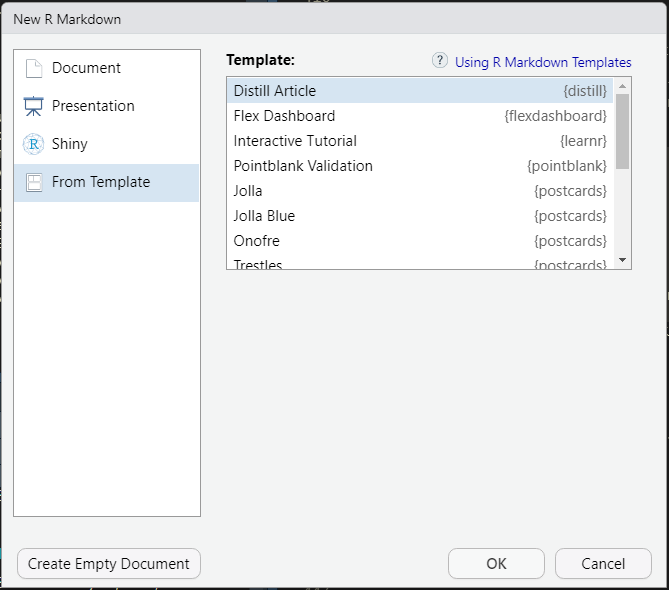
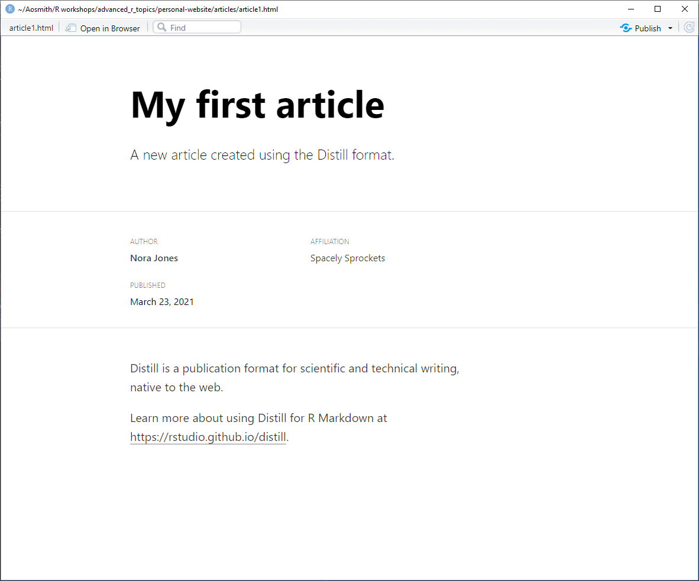
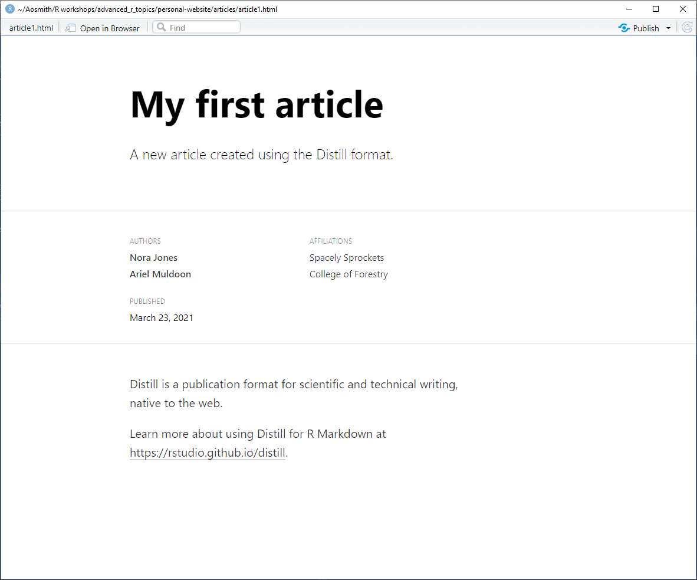
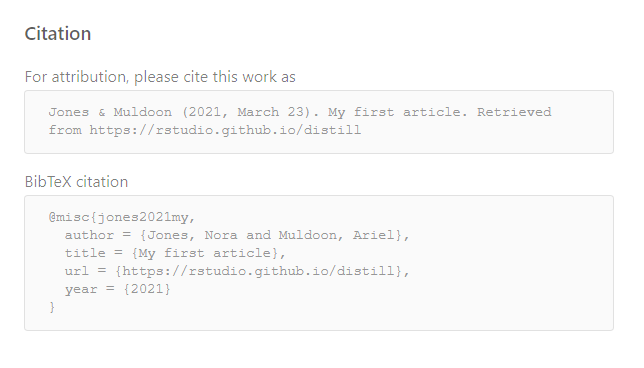
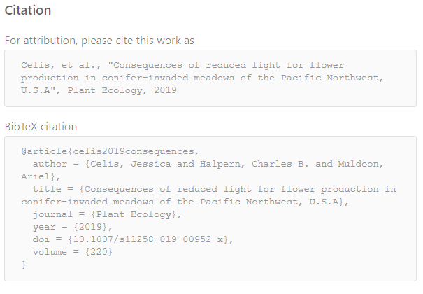
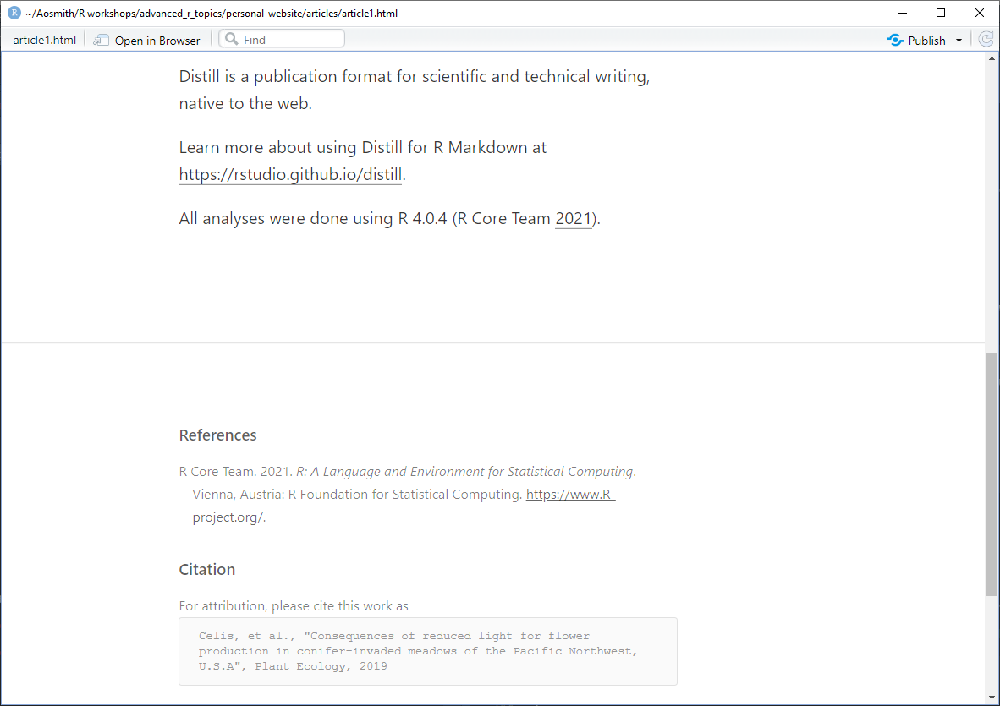
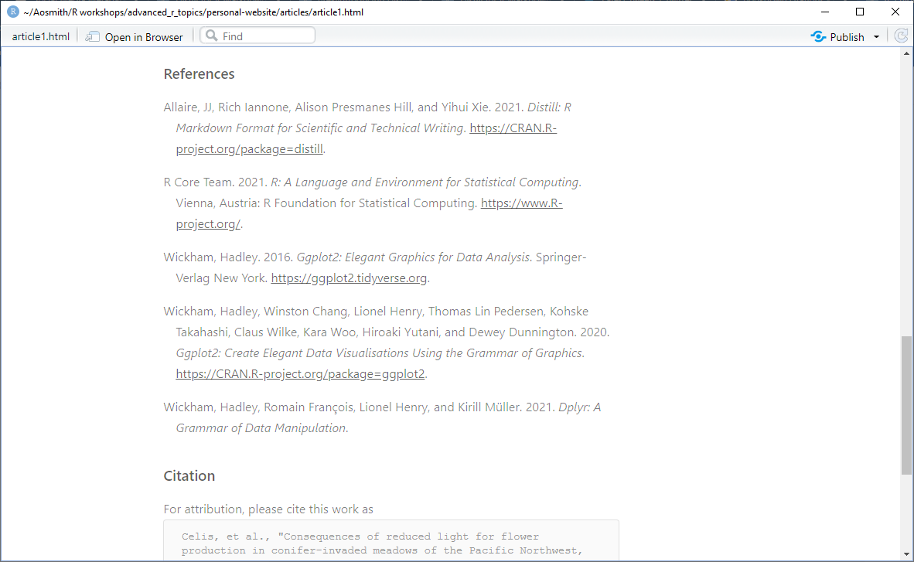
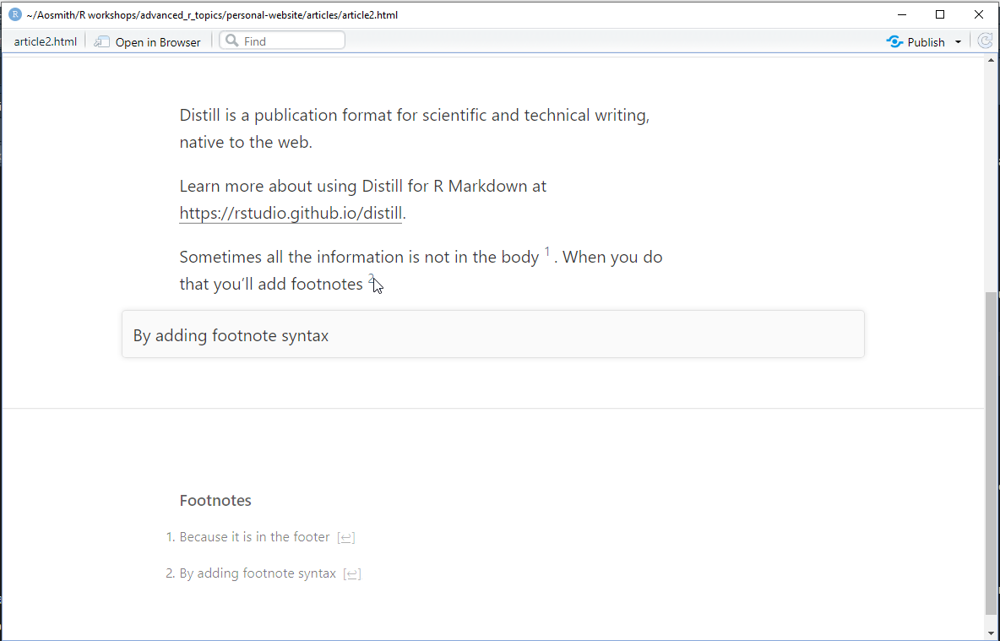
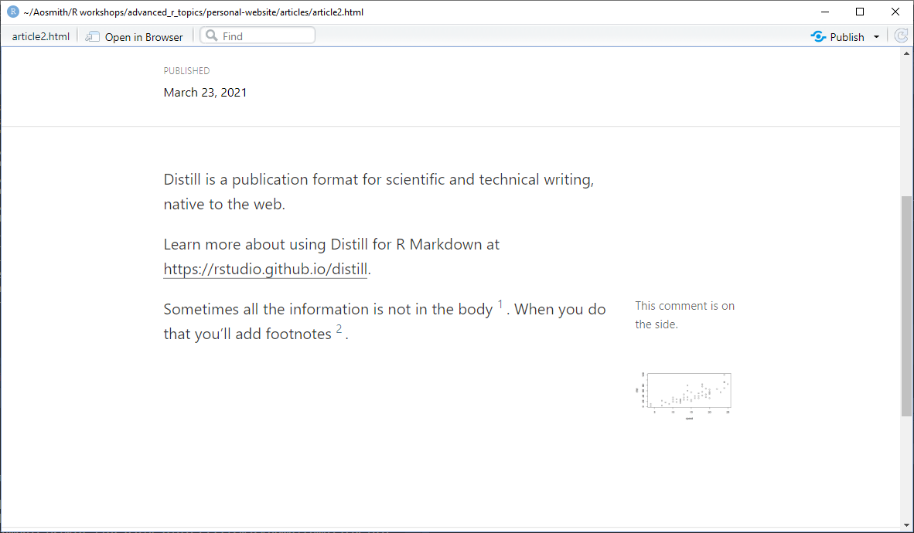
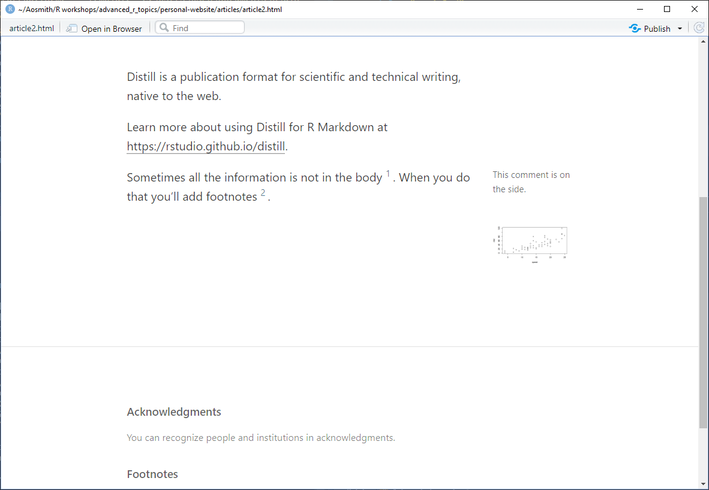

```{r setup, include = FALSE}
options(htmltools.dir.version = FALSE)
knitr::opts_chunk$set(
  fig.width=9, fig.height=3.5, fig.retina=3,
  out.width = "100%",
  cache = FALSE,
  echo = TRUE,
  message = FALSE, 
  warning = FALSE,
  fig.show = TRUE,
  hiline = TRUE
)
library(formatR)
```

```{r xaringan-themer, include = FALSE, warning = FALSE}
library(xaringanthemer)
style_duo_accent(
  primary_color = "#1c5253",
  secondary_color = "#F4790B",
  inverse_header_color = "#FFFFFF",
  title_slide_text_color = "#FFFFFF",
  base_font_size = "22px",
  link_color = "#F4790B",
  code_highlight_color = "rgba(244, 121, 11, 0.5)"
)
```

```{r metathis, echo=FALSE}
library(metathis)
meta() %>%
    meta_name("github-repo" = "aosmith16/spring-r-topics") %>% 
    meta_social(
        title = "More distill: adding articles and deploying",
        description = "Adding to and deploying a distill website",
        url = "https://aosmith16.github.io/spring-r-topics/slides/week03_distill_articles_deploy.html",
        image = "https://aosmith16.github.io/spring-r-topics/slides/week03_distill_articles_deploy.html/week02-share-card.png",
        image_alt = paste(
            "Adding articles and deploying a distill websites", 
            "Working sessions class spring 2021"
        ),
        og_type = "website",
        og_author = "Ariel Muldoon",
        twitter_card_type = "summary",
        twitter_creator = "@aosmith16"
    )
```

```{r xaringan-scribble, echo = FALSE}
xaringanExtra::use_scribble()
```

```{r xaringanExtra-clipboard, echo=FALSE}
xaringanExtra::use_clipboard()
```

```{r xaringan-tile-view, echo=FALSE}
xaringanExtra::use_tile_view()
```

```{r broadcast, echo=FALSE}
xaringanExtra::use_broadcast()
```

class: center, middle, title-slide

# Build a personal website with distill
## Part 2: Adding articles and deploying your website

```{r distill, echo = FALSE, out.width = "15%"}
knitr::include_graphics("figs/distill.png")
```

### Ariel Muldoon

### April 13, 2021

---

## Today's Goal

Overall

- **Deploy your personal website**

--

But first 
-     Add more pages with **distill** articles  
-     Overview of article features, such as citations, references, and appendices  
-     Add drop down menus to website navigation bar
-     Add links to other articles to website menu pages

--

*Before we begin:*

Make sure you either have your own `.bib` file or saved `article1.bib` from the class website onto your computer. On Windows + Chrome I right-clicked the file and used `Save as` to save.

---

## Resources

- The **distill** website has articles on [**distill** article basics](https://rstudio.github.io/distill/basics.html) as well as [citations](https://rstudio.github.io/distill/citations.html)  
- GitHub docs has an overview of publishing via GitHub Pages [here](https://docs.github.com/en/github/working-with-github-pages/configuring-a-publishing-source-for-your-github-pages-site)  

.center[
```{r distillery, echo = FALSE, out.width = "30%"}
knitr::include_graphics("figs/distill.png")
```
]

---

## Why work with distill articles?

**distill** articles are R Markdown documents with HTML output [optimized for scientific and technical communication](https://blog.rstudio.com/2020/12/07/distill/#what-is-distill). 

It is **distill** articles that we used to build a **distill** website last week and we'll continue to show options for adding more content to your website.  

--

We'll do a quick overview of a few of the `r emo::ji("bell")``r emo::ji("bell")` and whistles today.  Including:  
- Creating a citation entry  
- Adding references using a `.bib` file
- Using footnotes, asides, and appendices

But you can do so much more! Refer to the [**distill** basics](https://rstudio.github.io/distill/basics.html) overview as you start to write your own articles.

---

class: center, middle, inverse, hide-logo

# <font style="font-family: cursive; font-style:italic">Let's get started!</font>

---

## Create new distill article

Make sure you have your website RStudio Project open and ready to go. 

Create a new folder called `articles` in the root directory. We'll save the new articles here.

--

Go to `File > New File > R Markdown...`

Click `From Template` and then choose `Distill Article`.

.center[]

---

## Create new distill article

Save the file as `article1.Rmd` into the `articles` folder.

Give the article a `title` (I used `"My first article"`) and then knit it to see the output from the "filler" content.

.center[]

---

## Author information

You can see in the output that **distill** articles add author and author affiliation information at the top of the output.  If you have multiple authors, add a new `- name` entry.

I'm going to add myself as the second author. I include my affiliation, as well, but don't include any URL's so no links are added. 

```{r, eval = FALSE}
title: "My first article"
description: |
  A new article created using the Distill format.
author:
  - name: Nora Jones 
    url: https://example.com/norajones
    affiliation: Spacely Sprockets
    affiliation_url: https://example.com/spacelysprokets
*  - name: Ariel Muldoon
*    affiliation: College of Forestry
date: "`r Sys.Date()`"
output: distill::distill_article
```

.footnote[*Like always when working with the YAML header, be very careful with your spacing. Using correct indentations is important.*]

---

## Author information

.pull-left[
After knitting:
.center[]
]

.pull-right[
You can see this might be useful if you were authoring a new article on the web or if you were giving an overview of a published article.

If you don't want any author information, delete the whole `author:` section from the header.
]

---

## Citeable web article

If you are creating a stand-alone web article or presentation, you can add a citation by adding the appropriate URL to `citation_url` in the header. 

We don't currently have a URL for `article1` so I'll put in a filler to show what the output looks like. Note there are no spaces before `citation_url`.

```{r, eval = FALSE}
title: "My first article"
description: |
  A new article created using the Distill format.
author:
  - name: Nora Jones 
    url: https://example.com/norajones
    affiliation: Spacely Sprockets
    affiliation_url: https://example.com/spacelysprokets
  - name: Ariel Muldoon
    affiliation: College of Forestry
*citation_url: https://rstudio.github.io/distill
date: "`r Sys.Date()`"
output: distill::distill_article
```

---

## Citeable web article

After knitting, scroll down to the bottom of the output page. You now have a citation for the page and a BibTeX entry that readers can easily copy and paste.

.center[]

---

## Citeable journal article

If you want a journal citation instead, add information from the published article to the header. This would make sense if you were, say, putting the abstract of a published journal article in the **distill** document or writing a journal article.

I'll change the `title`, `date`, and basic `author` info and then add the `journal` title, `volume`, and `doi`. 

```{r, eval = FALSE}
title: "Consequences of reduced light for flower production in conifer-invaded meadows of the Pacific Northwest, U.S.A"
author:
  - name: Jessica Celis 
    affiliation: Institute for Applied Ecology
  - name: Charles B. Halpern
    affiliation: School of Environmental and Forest Sciences
  - name: Ariel Muldoon
    affiliation: College of Forestry
*journal: Plant Ecology
*volume: 220
*doi: "10.1007/s11258-019-00952-x"
date: "August 05, 2019"
output: distill::distill_article
```

---

## Citeable journal article

Now the citation at the bottom of the output is for the journal article.

.center[]

The BibTeX output is named using a *slug*, which it create automatically based on the given information (in this example it is `celis2019consequences`).  You can set this manually using the `slug` option in the header, as well.

---

## Citing other works

We can include citations in text and a list of references in the **distill** article if we provide a bibliography file. This can be, e.g., BibTeX or CSL. document.  

Save the `article1.bib` file I provided you into the `articles` folder.

Then refer to `article1.bib` via `bibliography` in the YAML header.

```{r, eval = FALSE}
title: "Consequences of reduced light for flower production in conifer-invaded meadows of the Pacific Northwest, U.S.A"
author:
  - name: Jessica Celis 
    affiliation: Institute for Applied Ecology
  - name: Charles B. Halpern
    affiliation: School of Environmental and Forest Sciences
  - name: Ariel Muldoon
    affiliation: College of Forestry
journal: Plant Ecology
volume: 220
doi: "10.1007/s11258-019-00952-x"
date: "August 05, 2019"
output: distill::distill_article
*bibliography: article1.bib
```

---

## Citing other works

.pull-left[
If you haven't seen a `.bib` file before, take a minute to open `article1.bib` and take a look at the elements.   

These particular citations are for R and R packages. Each entry has been given a name, which is the first element.  
]

.pull-right[]
For example, the entry for R is called `R-base`. This is how we'll refer to the citation in the text.

```{r, eval = FALSE}
*@Manual{R-base,
  title = {R: A Language and Environment for Statistical Computing},
  author = {{R Core Team}},
  organization = {R Foundation for Statistical Computing},
  address = {Vienna, Austria},
  year = {2021},
  url = {https://www.R-project.org/},
}
```
]

---

## Citing other works

.pull-left[
You cite using `@` with the entry name. To put citations in parentheses, use brackets.

For example, I'll add the following to the text of `article1.Rmd` to cite R.

```{r, eval = FALSE}
All analyses were done using R 4.0.4 [@R-base].
```

If you want a specific style of references, see instructions on how to change citation style in the [R Markdown Cookbook](https://bookdown.org/yihui/rmarkdown-cookbook/bibliography.html#changing-citation-style).
]

--

.pull-right[
Here's the output text after knitting. Note `References` are added automatically.
.center[]
]

---

## Citing other works

.pull-left[
By default, only references you refer to in the text are included in the output.  If you want all entries added to the references, add

```{r, eval = FALSE}
nocite: '@*'
```

to the YAML header.
]

--

.pull-right[
After adding this to `article1.Rmd` and knitting, all references in the `.bib` file are included.

]

---

## Create another distill article

Make another new distill article and save it as `article2.Rmd` in the `articles` folder.

We'll leave the YAML header info alone this time, and focus on the syntax for footnotes, asides, and appendices.  

---

### Footnotes

.pull-left[
The syntax for adding hoverable footnotes is `^[text]`. Footnotes are automatically numbered.

Let's add some text to the body of `article2.Rmd` to try this out. 

The text I used:

`Sometimes all the information is not in the body ^[Because it is in the footer]. 
When you do that you'll add footnotes ^[By adding footnote syntax]`.
]

--

.pull-right[
Which results in:
.center[]
]

---

### Asides

An *aside* is when you put information to the far right of the document in what is called the *gutter*. The gutter is a used, for example, in Edward Tufte's books.

The syntax for an aside uses `<aside></aside>`. 

Examples:

```
<aside>
This comment is on the side.
</aside>
```

--

You can put output from code chunks like plots in asides, as well.


    <aside>
    `r ''````{r} 
    plot(cars) 
    `r ''````
    </aside>

---

### Asides

After adding the two aside examples to `article2.Rmd`, knit to see the output.


.center[
```{r aside, echo = FALSE, out.width = "90%"}

```
]

---

### Appendices

Appendices are added at the end of the document by adding `{.appendix}` after any level 1 (`#`) or level 2 (`##`) header.

This makes sense for, e.g., acknowledgements or author's notes.

--

<br/><br/>
Let's add the following to the text in `article2.Rmd` to see this in action.
<br/><br/>
```
## Acknowledgments {.appendix}

You can recognize people and institutions in acknowledgments. 
```

---

### Appendices

An appendix is put at the bottom of the article, but before footnotes.

.center[
```{r appendix, echo = FALSE, out.width = "60%"}

```
]

---

## Adding articles as drop-down menus

---

## Adding articles to menu web pages