```{r setup, include = FALSE}
options(htmltools.dir.version = FALSE)
knitr::opts_chunk$set(
  fig.width=9, fig.height=3.5, fig.retina=3,
  out.width = "100%",
  cache = FALSE,
  echo = TRUE,
  message = FALSE, 
  warning = FALSE,
  fig.show = TRUE,
  hiline = TRUE
)
library(formatR)
```

```{r xaringan-themer, include = FALSE, warning = FALSE}
library(xaringanthemer)
style_duo_accent(
  primary_color = "#1c5253",
  secondary_color = "#F4790B",
  inverse_header_color = "#FFFFFF",
  title_slide_text_color = "#FFFFFF",
  base_font_size = "22px",
  link_color = "#F4790B",
  code_highlight_color = "rgba(244, 121, 11, 0.5)"
)
```

```{r metathis, echo=FALSE}
library(metathis)
meta() %>%
    meta_name("github-repo" = "aosmith16/spring-r-topics") %>% 
    meta_social(
        title = "More distill: adding articles and deploying",
        description = "Adding to and deploying a distill website",
        url = "https://aosmith16.github.io/spring-r-topics/slides/week04_gt_tables.html",
        image = "https://aosmith16.github.io/spring-r-topics/slides/week04_gt_tables.html/week04-share-card.png",
        image_alt = paste(
            "Getting started with package gt", 
            "Working sessions class spring 2021"
        ),
        og_type = "website",
        og_author = "Ariel Muldoon",
        twitter_card_type = "summary",
        twitter_creator = "@aosmith16"
    )
```

```{r xaringan-scribble, echo = FALSE}
xaringanExtra::use_scribble()
```

```{r xaringanExtra-clipboard, echo=FALSE}
xaringanExtra::use_clipboard()
```

```{r xaringan-tile-view, echo=FALSE}
xaringanExtra::use_tile_view()
```

```{r broadcast, echo=FALSE}
xaringanExtra::use_broadcast()
```

class: center, middle, title-slide

# Display tables with package gt
## Part 1: Building basic tables

```{r distill, echo = FALSE, out.width = "15%", fig.cap = "Logo for package gt"}
knitr::include_graphics("figs/gtlogo.svg")
```

### Ariel Muldoon

### April 20, 2021

---

## Today's Goal

Overall  
-     Build *display* tables in R with package **gt**  

--

We will  

-     Modify and format table columns    
-     Add row information with names and groups  
-     Add extra information with headers, spanners, and footers    
-     Change overall table style    

--

*Before we begin:*

Make sure you saved `week04_gt_basics.Rmd` from the class website onto your computer. We will be running code from this file.

???

Display tables are tables of output, not tables for entire datasets

---

class: hide-logo

## Resources

- Thomas Mock's [**gt** Cookbook](https://themockup.blog/static/gt-cookbook.html#Introduction)  
- The **gt** package website has a nice [intro](https://gt.rstudio.com/articles/intro-creating-gt-tables.html)    

.center[
```{r distillery, echo = FALSE, out.width = "30%", fig.cap = "Logo for package gt"}
knitr::include_graphics("figs/gtlogo.svg")
```
]

---

## Why focus on **gt**?

.pull-left[
**Pros:**
- "Grammar of tables" like **ggplot2** grammar of graphics  
- Supports HTML, LaTeX, RTF outputs  
- Follows **tidyverse** conventions  

<blockquote class="twitter-tweet" data-lang="en"><p lang="en" dir="ltr">ggplot2 for tables</p>&mdash; Charles T. Gray (@cantabile) <a href="https://twitter.com/cantabile/status/1372136281518477318">Tweet March 17, 2021</a></blockquote>
<script async src="//platform.twitter.com/widgets.js" charset="utf-8"></script>
]

.pull-right[
**Cons:**  
- Very new  
- Code gets long/complex fast (*this shared by most table-making packages in R*)
]

???

Reminder these are display tables of output

---

## Other packages for tables

There are many great packages for making display tables in R.

These include:
- **kable** and **kableExtra**, which are relatively mature  
- **flextable**, a great option for making Word tables
- **reactable** for making *interactive* tables
- And so many more!   

--

There is a nice overview of packages for tables in R at [R for the Rest of Us](https://rfortherestofus.com/2019/11/how-to-make-beautiful-tables-in-r/) and a list of them on the [**gt** website](https://gt.rstudio.com/#how-gt-fits-in-with-other-packages-that-generate-display-tables).

Also see [package **gtsummary**](https://education.rstudio.com/blog/2020/07/gtsummary/) for making summary tables like ones commonly seen in medical journals.

---

class: center, middle, inverse, hide-logo

# <font style="font-family: cursive; font-style:italic">Let's get started!</font>

---

## Running code

- Open `week04_gt_basics.Rmd`  
- I recommend switching to using the visual editor using the   button  

--

<br/><br/>
**Set up**  
We'll practice different features of package **gt** together, running example code I've already written.   
At the end of each section you'll have a chance to practice what we just covered.

---

## R packages 

We are using **gt 0.2.2** and **dplyr 1.0.5** today. Load these before we start. 

```{r, message = FALSE, warning = FALSE}
library(gt) # v. 0.2.2
library(dplyr) # v. 1.0.5
```

Also make sure you have package **webshot** installed. 

---

## Datasets

We need a couple small datasets to practice on. We will do all data manipulation steps now.

--

.pull-left[
**The `gtcars` dataset**

This dataset is data on deluxe automobiles from 2014-2017. See `?gtcars` for more information.

We'll pull out 6 rows from two countries and keep 7 of the variables.

```{r gtcars, eval = FALSE}
gtcars_small = gtcars %>%
    filter(ctry_origin %in% c("United States", "Japan")) %>%
    select(mfr:year, mpg_c, mpg_h, ctry_origin, msrp)
gtcars_small
```
]

--

.pull-right[
```{r gtcars-out, echo = FALSE}
knitr::kable(gtcars_small)
```
]

???

Data manipulation is key to making display tables and you'll often see data manipulation code along with the tables.

---

## Datasets

We need a couple small datasets to practice on. We will do all data manipulation steps now.

.pull-left[
**The `mtcars` dataset**

The `mtcars` dataset is data from 1974 Motor Trend road tests. We'll use the first 6 rows of 5 variables and add in some missing values.

```{r mtcars, eval = FALSE}
mtcars_small = mtcars %>%
    head() %>%
    mutate(
        disp = c(NA, disp[2:6]),
        qsec = c(qsec[1:5], NA)
        ) %>%
    select(disp, hp, wt, qsec, carb)
mtcars_small
```
]

--

.pull-right[
<br/><br/><br/>
```{r mtcars-out, echo = FALSE}
knitr::kable(mtcars_small)
```

]

---

## Datasets

We need a couple small datasets to practice on. We will do all data manipulation steps now.

.pull-left[
**Table of results**

Here is a small table of results from an analysis, which reports estimated ratios of medians between two groups for 4 `litterspp`.

```{r results, eval = FALSE}
results = structure(list(contrast = structure(c(1L, 1L, 1L, 1L), .Label = "DF / RA", class = "factor"), 
    litterspp = structure(1:4, .Label = c("ACMA", "ALRU", "PSME", 
    "TSHE"), class = "factor"), ratio = c(2.92534041512422, 3.98726047426825, 
    1.1303275363783, 1.69285339886012), lower.CL = c(1.35187771051096, 
    1.84261924981326, 0.522354456290416, 0.782312637958251), 
    upper.CL = c(6.33017060479877, 8.62806903340073, 2.44592598782139, 
    3.66318079369337)), row.names = c(NA, 4L), class = "data.frame")
results
```
]

--

.pull-left[
<br/><br/><br/>
```{r results-out, echo = FALSE}
knitr::kable(results)
```

]
---

## Basic **gt** usage

We start with the `gt()` function to create a basic **gt** table object. This is the first step in a typical workflow.

.pull-left[
```{r gt1, eval = FALSE}
gtcars_small %>%
    gt() #<<
```
]

.pull-right[
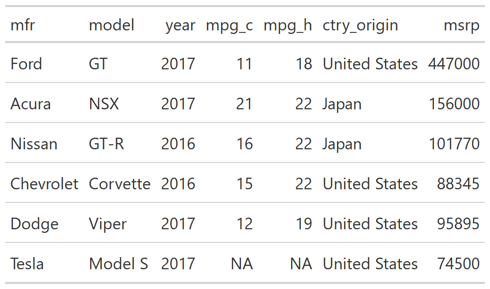
]

???

The dataset is the first argument to `gt()`. You can put your dataset within `gt()` (i.e., `gt(data = gtcars_small)`), but it is standard to use a pipe syntax when building **gt** tables so we'll be using them throughout this session.

---

## Modify columns

We're going to first focus on cleaning up the table body and columns. 

The [`cols_*()` functions](https://gt.rstudio.com/reference/index.html#section-modify-columns) allow for modifications of entire columns.

We can control the column labels, cell alignment, column width and placement as well as combine columns with `cols_*()` functions.

---

### Column labels

Relabel one or more labels using `cols_label()`.

.pull-left[
```{r gt2, eval = FALSE}
gtcars_small %>%
    gt() %>%
    cols_label( #<<
        mfr = "Manufacturer", #<<
        ctry_origin = "Country" #<<
    ) #<<
```
]

.pull-right[
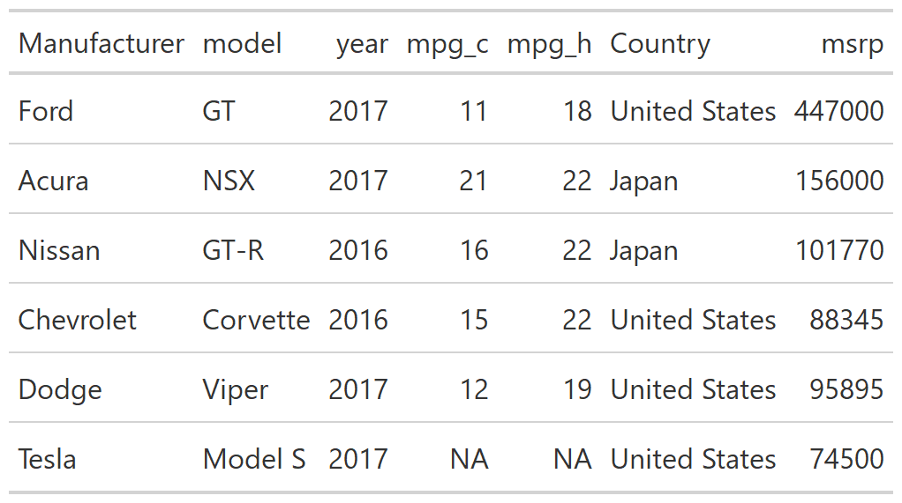
]

---

### Column labels

You can control text formatting of labels with Markdown or HTML syntax. This can be used on any text in a **gt** table.

.pull-left[
```{r gt3, eval = FALSE}
gtcars_small %>%
    gt() %>%
    cols_label( #<<
        mfr = md("**Manufacturer**"), #<<
        ctry_origin = html("<em>Country</em>") #<<
    ) #<<
```

***Code notes:***  
Use `md()` for markdown syntax and `html()` for HTML syntax.

]

.pull-right[
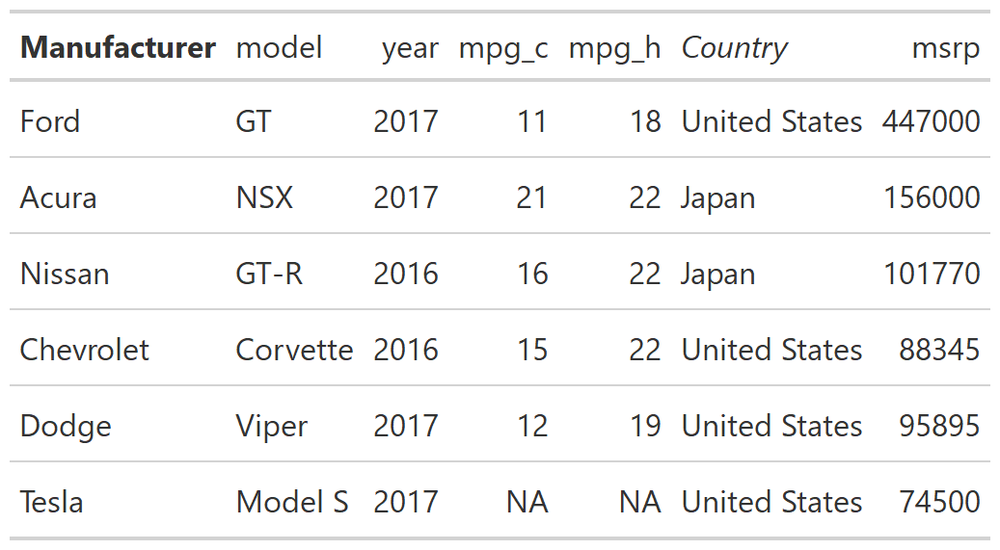
]

---

### Column alignment

Align all text within different columns using `cols_align()`. Most often we left-align text with varying length and right-align numbers.

.pull-left[
```{r gt4, eval = FALSE}
gtcars_small %>%
    gt() %>%
    cols_label(
        mfr = "Manufacturer",
        ctry_origin = "Country"
    ) %>%
    cols_align( #<<
        align = "center", #<<
        columns = vars(mfr, model) #<<
    ) #<<
```

***Code notes:***  
Align specific columns using `vars()`  
Changing labels doesn't change variable name
]

.pull-right[
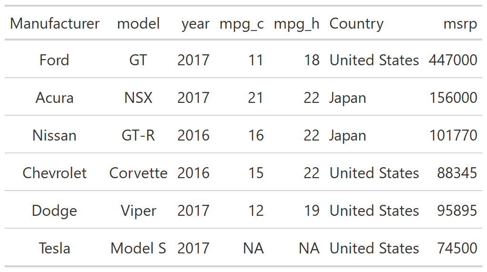

]

---

### Code alignment

Align different columns different ways by adding multiple `cols_align()` layers.

.pull-left[
```{r gt5, eval = FALSE}
gtcars_small %>%
    gt() %>%
    cols_label(
        mfr = "Manufacturer",
        ctry_origin = "Country"
    ) %>%
    cols_align(
        align = "center",
        columns = vars(mfr, model)
    ) %>%
    cols_align( #<<
        align = "left", #<<
        columns = vars(mpg_c, mpg_h, msrp) #<<
    ) #<<
```
]

.pull-right[
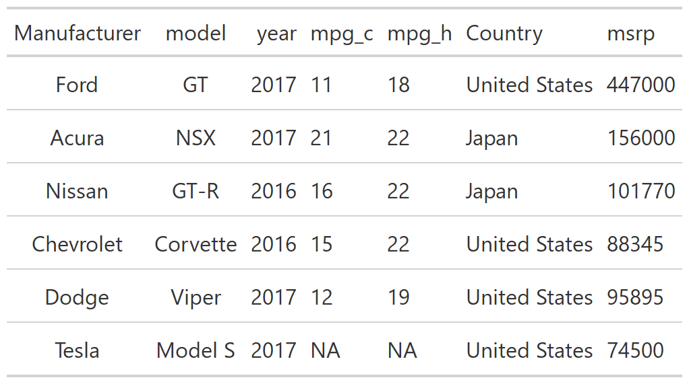

]

---

### Column order

Move columns to the start or end or wherever you'd like with the `cols_move_*()` functions.

.pull-left[
```{r gt6, eval = FALSE}
gtcars_small %>%
    gt() %>%
    cols_label(
        mfr = "Manufacturer",
        ctry_origin = "Country"
    ) %>%
    cols_move_to_start( #<<
        columns = vars(ctry_origin) #<<
    ) #<<
```
***Code notes:***
`cols_move_to_start()` to move to start, `end` to end
]

.pull-right[


]

---

### Column order

Use `cols_move()` to move a column *after* another column.

.pull-left[
```{r gt7, eval = FALSE}
gtcars_small %>%
    gt() %>%
    cols_label(
        mfr = "Manufacturer",
        ctry_origin = "Country"
    ) %>%
    cols_move_to_start(
        columns = vars(ctry_origin)
    ) %>%
    cols_move( #<<
        columns = vars(mpg_c, mpg_h),#<<
        after = vars(msrp)#<<
    )#<<
```
***Code notes:***
Move the two `mpg` columns *after* `msrp`
]

.pull-right[


]

---

### Column widths

Control with widths of columns in pixels (`px()`) or percentage of the current size (`pct()`) with `cols_width()`.

.pull-left[
```{r gt8, eval = FALSE}
gtcars_small %>%
    gt() %>%
    cols_label(
        mfr = "Manufacturer",
        ctry_origin = "Country"
    ) %>%
    cols_move_to_start(
        columns = vars(ctry_origin)
    ) %>%
    cols_width(#<<
        vars(ctry_origin) ~ px(150)#<<
    )#<<
```
]

.pull-right[
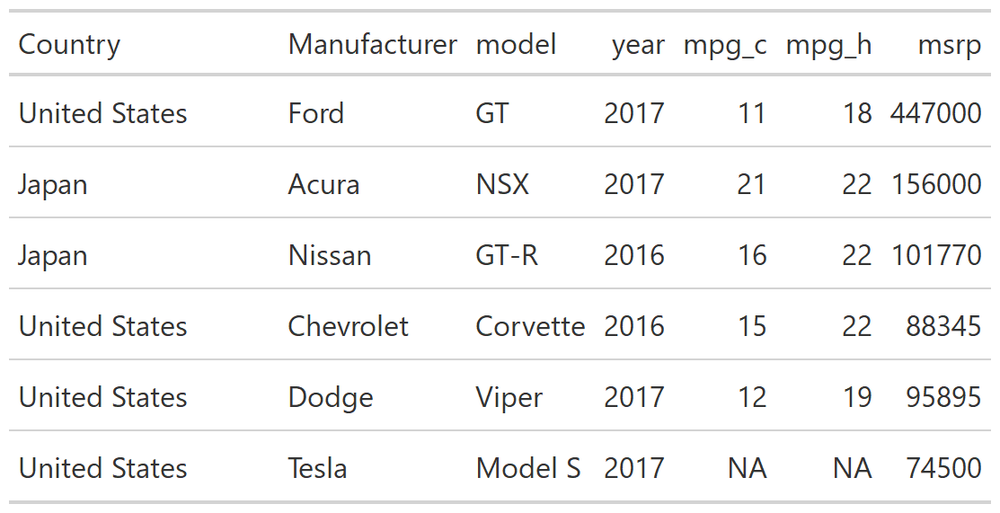

]

---

### Column widths

If you want many columns to be the same width, use `everything()` after defining the widths of other columns.

.pull-left[
```{r gt9, eval = FALSE}
gtcars_small %>%
    gt() %>%
    cols_label(
        mfr = "Manufacturer",
        ctry_origin = "Country"
    ) %>%
    cols_move_to_start(
        columns = vars(ctry_origin)
    ) %>%
    cols_width( #<<
        vars(ctry_origin, mfr, model) ~ px(120), #<<
        everything() ~ px(50) #<<
    ) #<<
```
]

.pull-right[
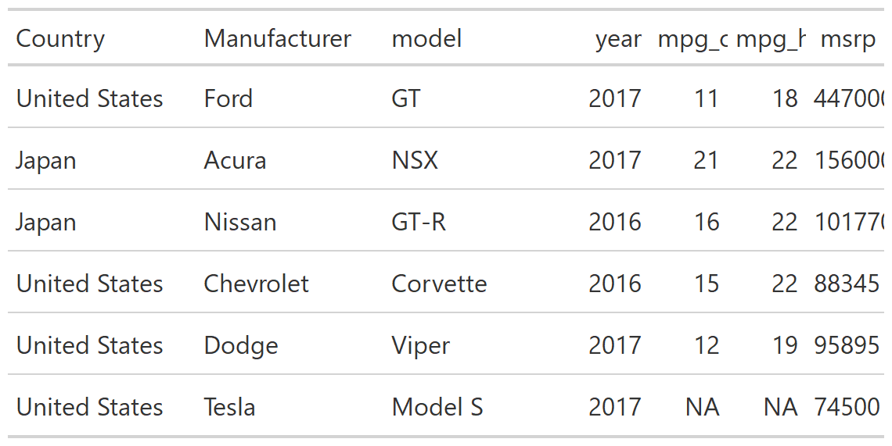
]

---

### Merging columns

You can combine multiple columns into one using `cols_merge()`.

.pull-left[
```{r gt10, eval = FALSE}
gtcars_small %>%
    gt() %>%
    cols_merge( #<<
        columns = vars(mpg_c, mpg_h) #<<
    ) #<<
```
***Code notes:***  
Combine two `mpg` columns to show range of mileage in one column
]

.pull-right[
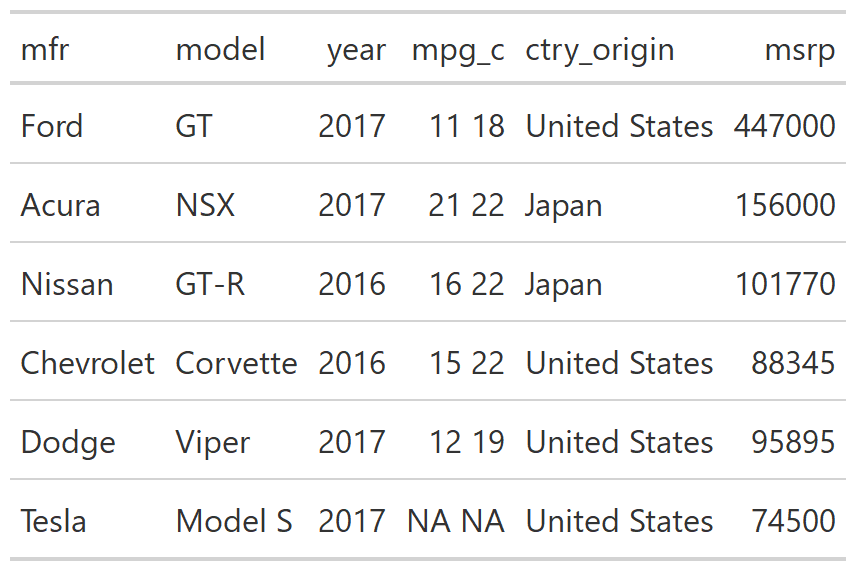
]

---

### Merging columns

By default the new column is named with the first column and the values are put together with a space between them.

.pull-left[
```{r gt11, eval = FALSE}
gtcars_small %>%
    gt() %>%
    cols_merge( #<<
        columns = vars(mpg_c, mpg_h),#<<
        pattern = "{1}-{2}"#<<
    )#<<
```
***Code notes:***  
`pattern` argument controls how column values combined  
Example puts hyphen between values  
]

.pull-right[

]

---

### Your turn

Write code in the empty code chunk that is provided. 

Using the `gtcars_small` dataset:  
-   We just made a new *merged* column called `mpg_c`. Change the name of this column to `Range`.
-   Change the name of `ctry_origin` to `Origin`.
-   Move `year` to be the first column, followed by `ctry_origin`.


```{r, echo = FALSE}
library(countdown)
countdown(minutes = 5, 
          bottom = 0,
          color_border = "#F4790B",
          color_text = "#1c5253",
          color_running_background = "#1c5253",
          color_running_text = "#F4790B",
          color_finished_background = "red",
          color_finished_text = "#1c5253")
```

---

### Your turn

Here's what I did.

.pull-left[
```{r yt1, eval = FALSE}
gtcars_small %>%
    gt() %>%
    cols_merge( 
        columns = vars(mpg_c, mpg_h),
        pattern = "{1}-{2}"
    ) %>%
    cols_label(
        mpg_c = "Range",
        ctry_origin = "Origin"
    ) %>%
    cols_move_to_start(
        columns = vars(year)
    ) %>%
    cols_move(
        columns = vars(ctry_origin),
        after = vars(year)
    )
  
```
]

.pull-right[
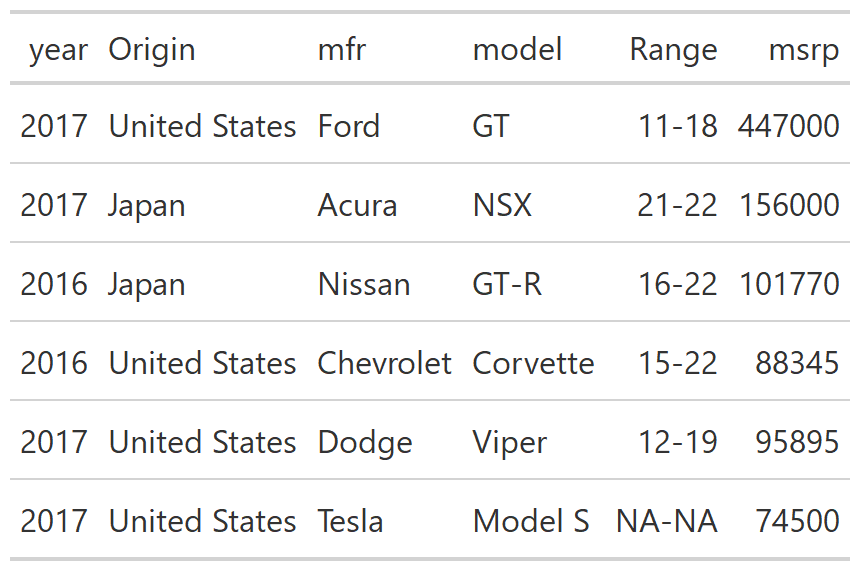
]

---

## Format columns

The **gt** package provides a series of [`fmt_*()` functions](https://gt.rstudio.com/reference/index.html#section-format-data) for formatting the values within columns. 

This can be done on entire rows or on individual cells (i.e., rows within columns).

---

### Number formatting

The function `fmt_number()` is for formatting numeric columns. We'll set the decimal place for `mpg_c` and add a suffix to `msrp`.

.pull-left[
```{r gt12, eval = FALSE}
gtcars_small %>%
    gt() %>%
    fmt_number( #<<
        columns = vars(mpg_c), #<<
        decimals = 1#<<
    ) %>%#<<
    fmt_number(#<<
        columns = vars(msrp),#<<
        decimals = 0,#<<
        suffixing = TRUE#<<
    )
```
***Code notes:***  
`decimals` defaults to 2   
`suffixing` is for adding large number suffixes like `K` for thousands
]

.pull-right[
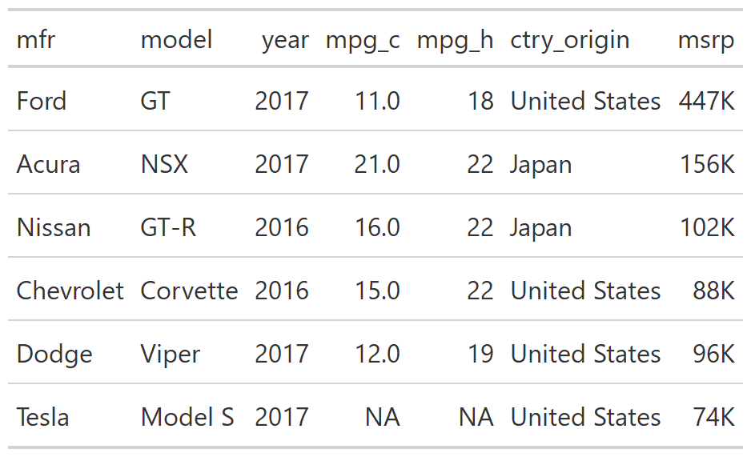
]

???

Includes, e.g., choosing the number of decimal places, setting the decimal separator (defaults to "."), and large-number suffixes such as `K` for thousands.

---

### Currency formatting

Add a currency symbol using `fmt_currency()`. We'll add a dollar sign to `msrp`. 

.pull-left[
```{r gt13, eval = FALSE}
gtcars_small %>%
    gt() %>%
    fmt_currency( #<<
        columns = vars(msrp), #<<
        currency = "USD",#<<
        decimals = 0,#<<
        suffixing = TRUE#<<
    )#<<
```
***Code notes:***  
`USD` is the default currency symbol.  
]

.pull-right[

]

???

This function has many options we won't see today, including options for how to display negative values.

---

### Currency formatting

We can change the currency symbol, using either 3-letter currency codes or common currency names. 

.pull-left[
```{r gt14, eval = FALSE}
gtcars_small %>%
    gt() %>%
    fmt_currency(
        columns = vars(msrp), 
        currency = "EUR", #<<
        decimals = 0,
        suffixing = TRUE
    )
```
***Code notes:***  
`EUR` stands for euros  
]

.pull-right[
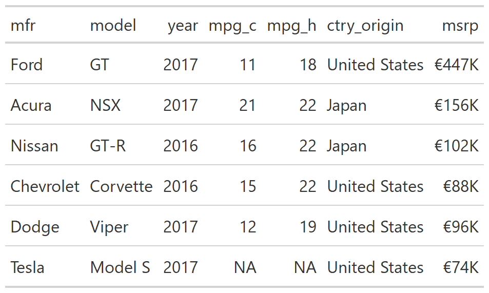
]

---

### Currency formatting

Change the currency symbol to pounds.

.pull-left[
```{r gt15, eval = FALSE}
gtcars_small %>%
    gt() %>%
    fmt_currency(
        columns = vars(msrp), 
        currency = "pound", #<<
        decimals = 0,
        suffixing = TRUE
    )
```
]

.pull-right[

]

---

### Percent formatting

Use `fmt_percent()` for percent formatting. We'll pretend the `mpg` columns are percents.

.pull-left[
```{r gt16, eval = FALSE}
gtcars_small %>%
    gt() %>% 
    fmt_percent( #<<
        columns = vars(mpg_c, mpg_h),#<<
        decimals = 0#<<
    )#<<
```
]

.pull-right[
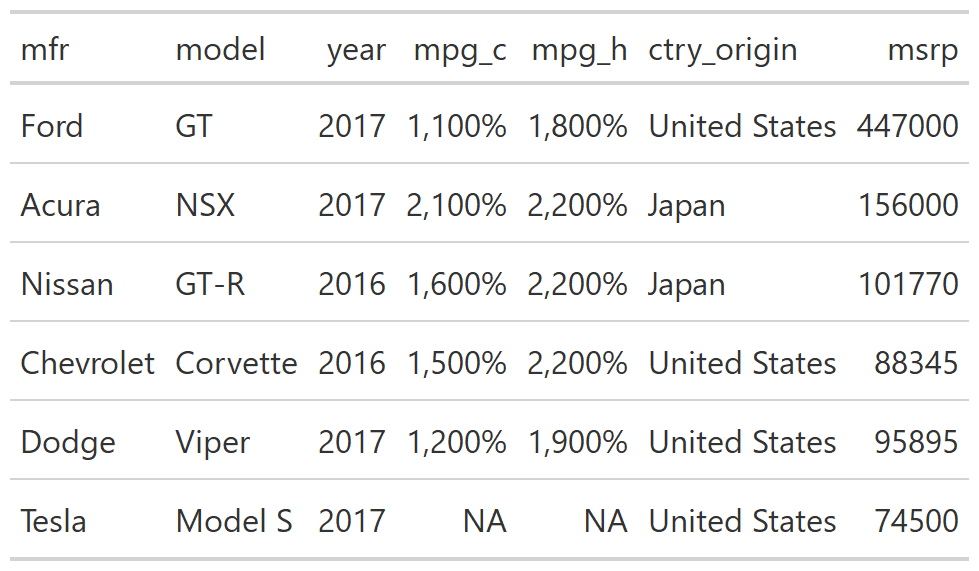
]

---

### Percent formatting

By default, the values were multiplied by 100 prior to adding the `%` symbol. Use `scale_value = FALSE` to change.

.pull-left[
```{r gt17, eval = FALSE}
gtcars_small %>%
    gt() %>% 
    fmt_percent(
        columns = vars(mpg_c, mpg_h),
        decimals = 0,
        scale_value = FALSE #<<
    )
```
]

.pull-right[
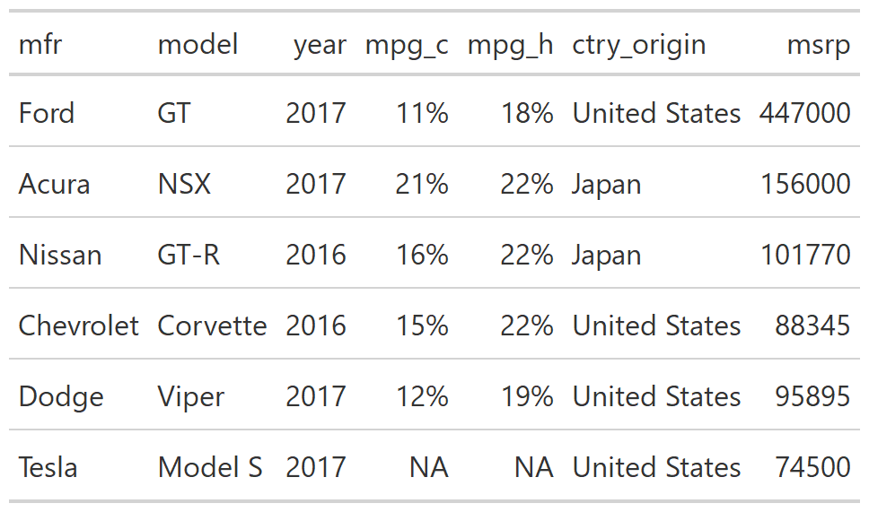
]

---

### Missing values formatting

By default missing values are shown in tables as `NA`. This can be controlled using `fmt_missing()`.

.pull-left[
```{r gt18, eval = FALSE}
gtcars_small %>%
    gt() %>%
    fmt_missing( #<<
        columns = contains("mpg") #<<
    ) #<<
```
***Code notes:***  
Note use of `contains()` select helper function.  
By default the new missing text is `---`
]

.pull-right[
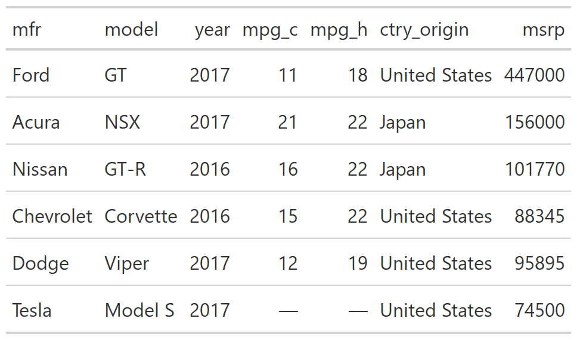
]

---

### Missing values formatting

Change the missing text to `none` with `missing_text`.

.pull-left[
```{r gt19, eval = FALSE}
gtcars_small %>%
    gt() %>%
    fmt_missing(
        columns = contains("mpg"),
        missing_text = "none" #<<
    )
```
]

.pull-right[
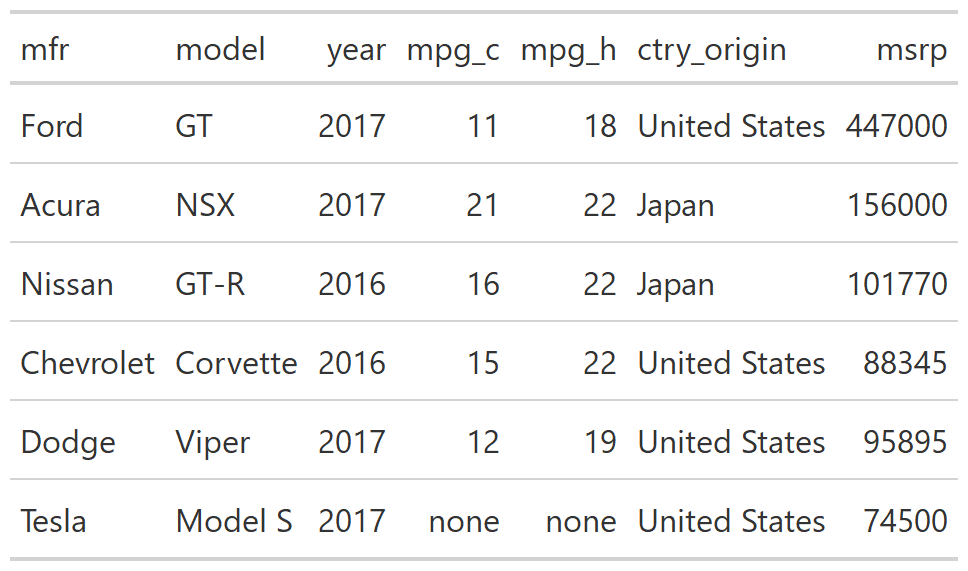
]

---

### Formatting specific cells

All the `fmt_*()` functions work on entire columns by default. We can focus on specific rows using the `rows` argument. In [Jonathan Schwabish's "Ten Guidelines for Better Tables"](https://www.cambridge.org/core/journals/journal-of-benefit-cost-analysis/article/abs/ten-guidelines-for-better-tables/74C6FD9FEB12038A52A95B9FBCA05A12), he recommends adding symbols only the first row in each column.

.pull-left[
```{r gt20, eval = FALSE}
gtcars_small %>%
    gt() %>%
    fmt_percent(
        columns = 4:5, #<<
        rows = 1, #<<
        decimals = 0,
        scale_values = FALSE
    )
```
***Code notes:***  
Choose the `rows` by index (row 1 is `1`)  
I chose the columns by position  
Note [alignment issue](https://themockup.blog/posts/2020-09-04-10-table-rules-in-r/#rule-7-remove-unit-repetition)
]

.pull-right[
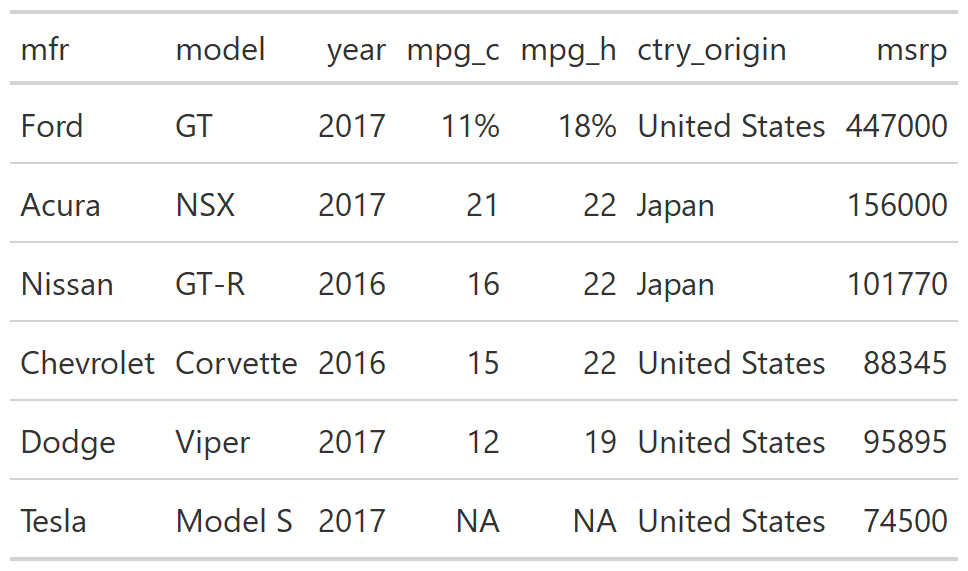
]

???

You'll note this changes the alignment of the column, which is not ideal. There is an open issue to fix this in **gt**. In the meantime, check out Thomas Mock's work-arounds in his [blog post](https://themockup.blog/posts/2020-09-04-10-table-rules-in-r/#rule-7-remove-unit-repetition).

---

### Date-time formatting

While we aren't going to explore them today, if you are working with dates, times, or date-times you'll find the respective `fmt_*()` functions for those to be useful. 

Here's a link to some examples in the **gt** Cookbook: <https://themockup.blog/static/gt-cookbook.html#Date_formatting>.

---

### Your turn

Write code in the empty code chunk that is provided. 

You will be using `mtcars_small` for this exercise.  
-   Convert `carb` to a percent with 1 decimal place, where `4` = `4.0%`.
-   Replace the missing value in `disp` with `---`.
-   Replace the missing value in `qsec` with "missing".
-   Add the `yen` currency symbol to `hp` with 0 decimal places.

```{r, echo = FALSE}
countdown(minutes = 7, 
          bottom = 0)
```

---

### Your turn

.pull-left[
```{r yt2, eval = FALSE}
mtcars_small %>%
    gt() %>%
    fmt_percent(
        columns = vars(carb),
        decimals = 1,
        scale_values = FALSE
    ) %>%
    fmt_missing(
        columns = vars(disp)
    ) %>%
    fmt_missing(
        columns = vars(qsec),
        missing_text = "missing"
    ) %>%
    fmt_currency(
        columns = vars(hp),
        currency = "yen",
        decimals = 0
    )
```
]

.pull-right[
.center[
```{r, echo = FALSE, out.width = "70%"}
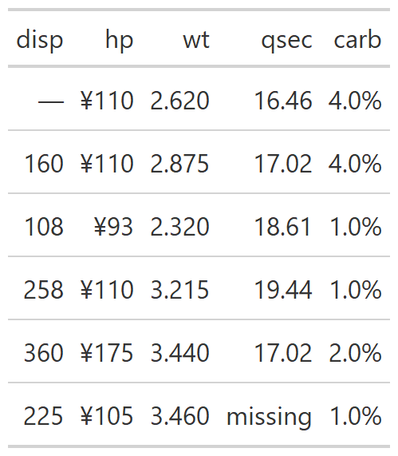
```

<!--  -->
]
]


---

class: hide-logo

## Next week

- 

.center[
```{r gt, echo = FALSE, out.width = "15%", fig.cap = "Logo for package gt"}
knitr::include_graphics("figs/gtlogo.svg")
```
]

.footnote[
[Code for slides](https://github.com/aosmith16/spring-r-topics/tree/main/docs/slides)  
Slides created via the R packages:  
[**xaringan**](https://github.com/yihui/xaringan), 
[gadenbuie/xaringanthemer](https://github.com/gadenbuie/xaringanthemer), 
[gadenbuie/xaringanExtra](https://github.com/gadenbuie/xaringanExtra) 
.center[*This work is licensed under the Creative Commons Attribution-NonCommercial 4.0 International License. 
To view a copy of this license, visit http://creativecommons.org/licenses/by-nc/4.0/.*]
]