```{r setup, include = FALSE}
options(htmltools.dir.version = FALSE)
knitr::opts_chunk$set(
  fig.width=9, fig.height=3.5, fig.retina=3,
  out.width = "100%",
  cache = FALSE,
  echo = TRUE,
  message = FALSE, 
  warning = FALSE,
  fig.show = TRUE,
  hiline = TRUE
)
library(formatR)
```

```{r xaringan-themer, include = FALSE, warning = FALSE}
library(xaringanthemer)
style_duo_accent(
  primary_color = "#1c5253",
  secondary_color = "#F4790B",
  inverse_header_color = "#FFFFFF",
  title_slide_text_color = "#FFFFFF",
  base_font_size = "22px",
  link_color = "#F4790B",
  code_highlight_color = "rgba(244, 121, 11, 0.5)"
)
```

```{r metathis, echo=FALSE}
library(metathis)
meta() %>%
    meta_name("github-repo" = "aosmith16/spring-r-topics") %>% 
    meta_social(
        title = "More distill: adding articles and deploying",
        description = "Adding to and deploying a distill website",
        url = "https://aosmith16.github.io/spring-r-topics/slides/week04_gt_tables.html",
        image = "https://aosmith16.github.io/spring-r-topics/slides/week04_gt_tables.html/week04-share-card.png",
        image_alt = paste(
            "Getting started with package gt", 
            "Working sessions class spring 2021"
        ),
        og_type = "website",
        og_author = "Ariel Muldoon",
        twitter_card_type = "summary",
        twitter_creator = "@aosmith16"
    )
```

```{r xaringan-scribble, echo = FALSE}
xaringanExtra::use_scribble()
```

```{r xaringanExtra-clipboard, echo=FALSE}
xaringanExtra::use_clipboard()
```

```{r xaringan-tile-view, echo=FALSE}
xaringanExtra::use_tile_view()
```

```{r broadcast, echo=FALSE}
xaringanExtra::use_broadcast()
```

class: center, middle, title-slide

# Display tables with package gt
## Part 1: Building basic tables

```{r distill, echo = FALSE, out.width = "15%", fig.cap = "Logo for package gt"}

```

### Ariel Muldoon

### April 20, 2021

---

## Today's Goal

Overall  
-     Build *display* tables in R with package **gt**  

--

We will  

-     Modify and format table columns    
-     Add row information with names and groups  
-     Add extra information with headers, spanners, and footers    
-     Change overall table style    

--

*Before we begin:*

Make sure you saved `week04_gt_basics.Rmd` from the class website onto your computer. We will be running code from this file.

???

Display tables are tables of output, not tables for entire datasets

---

class: hide-logo

## Resources

- Thomas Mock's [**gt** Cookbook](https://themockup.blog/static/gt-cookbook.html#Introduction)  
- The **gt** package website has a nice [intro](https://gt.rstudio.com/articles/intro-creating-gt-tables.html)    

.center[
```{r distillery, echo = FALSE, out.width = "30%", fig.cap = "Logo for package gt"}

```
]

---

## Why focus on **gt**?

.pull-left[
**Pros:**
- "Grammar of tables" like **ggplot2** grammar of graphics  
- Supports HTML, LaTeX, RTF outputs  
- Follows **tidyverse** conventions  

<blockquote class="twitter-tweet" data-lang="en"><p lang="en" dir="ltr">ggplot2 for tables</p>&mdash; Charles T. Gray (@cantabile) <a href="https://twitter.com/cantabile/status/1372136281518477318">Tweet March 17, 2021</a></blockquote>
<script async src="//platform.twitter.com/widgets.js" charset="utf-8"></script>
]

.pull-right[
**Cons:**  
- Very new so things could still change  
- Code gets long/complex fast (*this shared by most table-making packages in R*)
]

???

Reminder these are display tables of output

---

## Other packages for tables

There are many great packages for making display tables in R.

These include:
- **kable** and **kableExtra**, which are relatively mature  
- **flextable**, a great option for making Word tables
- **reactable** for making *interactive* tables
- And so many more!   

--

There is a nice overview of packages for tables in R at [R for the Rest of Us](https://rfortherestofus.com/2019/11/how-to-make-beautiful-tables-in-r/) and a list of them on the [**gt** website](https://gt.rstudio.com/#how-gt-fits-in-with-other-packages-that-generate-display-tables).

Also see [package **gtsummary**](https://education.rstudio.com/blog/2020/07/gtsummary/) for making summary tables like ones commonly seen in medical journals.

---

class: center, middle, inverse, hide-logo

# <font style="font-family: cursive; font-style:italic">Let's get started!</font>

---

## Running code

- Open `week04_gt_basics.Rmd`  
- I recommend switching to using the visual editor using the   button  

--

<br/><br/>
**Set up**  
We'll practice different features of package **gt** together, running example code I've already written.   
At the end of each section you'll have a chance to practice what we just covered.

---

## R packages 

We are using **gt 0.2.2** and **dplyr 1.0.5** today. Load these before we start. 

```{r, message = FALSE, warning = FALSE}
library(gt) # v. 0.2.2
library(dplyr) # v. 1.0.5
```

Also make sure you have package **webshot** installed. 

---

## Datasets

We need a couple small datasets to practice on. We will do all data manipulation steps now.

--

.pull-left[
**The `gtcars` dataset**

This dataset is data on deluxe automobiles from 2014-2017. See `?gtcars` for more information.

We'll pull out 6 rows from two countries and keep 7 of the variables.

```{r gtcars, eval = FALSE}
gtcars_small = gtcars %>%
    filter(ctry_origin %in% c("United States", "Japan")) %>%
    select(mfr:year, mpg_c, mpg_h, ctry_origin, msrp)
gtcars_small
```
]

.pull-right[
```{r, echo = FALSE}
gtcars_small = gtcars %>%
    filter(ctry_origin %in% c("United States", "Japan")) %>%
    select(mfr:year, mpg_c, mpg_h, ctry_origin, msrp)
```

```{r gtcars-out, echo = FALSE}
knitr::kable(gtcars_small)
```
]

???

Data manipulation is key to making display tables and you'll often see data manipulation code along with the tables.

---

## Datasets

We need a couple small datasets to practice on. We will do all data manipulation steps now.

.pull-left[
**The `mtcars` dataset**

The `mtcars` dataset is data from 1974 Motor Trend road tests. We'll use the first 6 rows of 5 variables and add in some missing values.

```{r mtcars, eval = FALSE}
mtcars_small = mtcars %>%
    head() %>%
    mutate(
        disp = c(NA, disp[2:6]),
        qsec = c(qsec[1:5], NA)
        ) %>%
    select(disp, hp, wt, qsec, carb)
mtcars_small
```
]

.pull-right[
<br/><br/><br/>
```{r, echo = FALSE}
mtcars_small = mtcars %>%
    head() %>%
    mutate(
        disp = c(NA, disp[2:6]),
        qsec = c(qsec[1:5], NA)
        ) %>%
    select(disp, hp, wt, qsec, carb)
```

```{r mtcars-out, echo = FALSE}
knitr::kable(mtcars_small)
```

]

---

## Datasets

We need a couple small datasets to practice on. We will do all data manipulation steps now.

.pull-left[
**Table of results**

Here is a small table of results from an analysis, which reports estimated ratios of medians between two groups for 4 `litterspp`.

.smaller[
```{r results, eval = FALSE}
results = structure(list(contrast = structure(c(1L, 1L, 1L, 1L), .Label = "DF / RA", class = "factor"), 
    litterspp = structure(1:4, .Label = c("ACMA", "ALRU", "PSME", 
    "TSHE"), class = "factor"), ratio = c(2.92534041512422, 3.98726047426825, 
    1.1303275363783, 1.69285339886012), lower.CL = c(1.35187771051096, 
    1.84261924981326, 0.522354456290416, 0.782312637958251), 
    upper.CL = c(6.33017060479877, 8.62806903340073, 2.44592598782139, 
    3.66318079369337)), row.names = c(NA, 4L), class = "data.frame")
results
```
]
]

.pull-left[
<br/><br/><br/>
```{r, echo = FALSE}
results = structure(list(contrast = structure(c(1L, 1L, 1L, 1L), .Label = "DF / RA", class = "factor"), 
    litterspp = structure(1:4, .Label = c("ACMA", "ALRU", "PSME", 
    "TSHE"), class = "factor"), ratio = c(2.92534041512422, 3.98726047426825, 
    1.1303275363783, 1.69285339886012), lower.CL = c(1.35187771051096, 
    1.84261924981326, 0.522354456290416, 0.782312637958251), 
    upper.CL = c(6.33017060479877, 8.62806903340073, 2.44592598782139, 
    3.66318079369337)), row.names = c(NA, 4L), class = "data.frame")
```

```{r results-out, echo = FALSE}
knitr::kable(results)
```

]
---

## Basic **gt** usage

We start with the `gt()` function to create a basic **gt** table object. This is the first step in a typical workflow.

.pull-left[
```{r gt01, eval = FALSE}
gtcars_small %>%
    gt() #<<
```
]

.pull-right[

]

???

The dataset is the first argument to `gt()`. You can put your dataset within `gt()` (i.e., `gt(data = gtcars_small)`), but it is standard to use a pipe syntax when building **gt** tables so we'll be using them throughout this session.

---

## Modify columns

We're going to first focus on cleaning up the table body and columns. 

The [`cols_*()` functions](https://gt.rstudio.com/reference/index.html#section-modify-columns) allow for modifications of entire columns.

We can control the column labels, cell alignment, column width and placement as well as combine columns with `cols_*()` functions.

---

### Column labels

Relabel one or more labels using `cols_label()`.

.pull-left[
```{r gt02, eval = FALSE}
gtcars_small %>%
    gt() %>%
    cols_label( #<<
        mfr = "Manufacturer", #<<
        ctry_origin = "Country" #<<
    ) #<<
```
]

.pull-right[
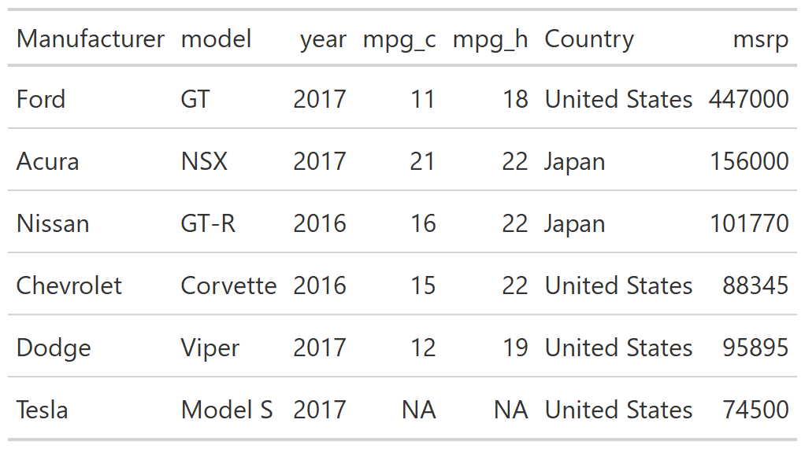
]

---

### Column labels

You can control text formatting of labels with Markdown or HTML syntax. This can be used on any text in a **gt** table.

.pull-left[
```{r gt03, eval = FALSE}
gtcars_small %>%
    gt() %>%
    cols_label( #<<
        mfr = md("**Manufacturer**"), #<<
        ctry_origin = html("<em>Country</em>") #<<
    ) #<<
```

***Code notes:***  
Use `md()` for markdown syntax and `html()` for HTML syntax.

]

.pull-right[

]

---

### Column alignment

Align all text within different columns using `cols_align()`. Most often we left-align text with varying length and right-align numbers.

.pull-left[
```{r gt04, eval = FALSE}
gtcars_small %>%
    gt() %>%
    cols_label(
        mfr = "Manufacturer",
        ctry_origin = "Country"
    ) %>%
    cols_align( #<<
        align = "center", #<<
        columns = vars(mfr, model) #<<
    ) #<<
```

***Code notes:***  
-Align specific columns using `vars()`  
-Changing labels doesn't change variable name
]

.pull-right[
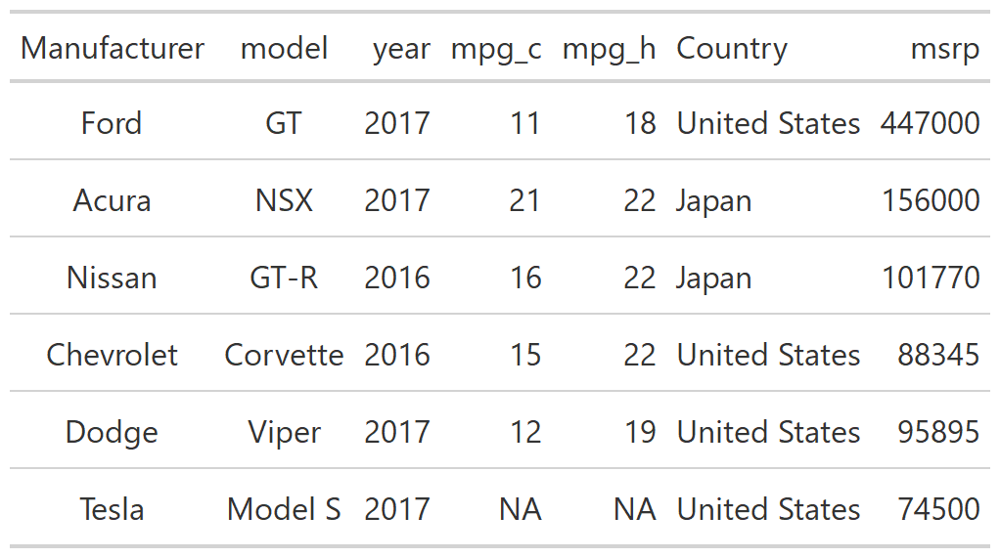

]

---

### Code alignment

Align different columns different ways by adding multiple `cols_align()` layers.

.pull-left[
.smaller[
```{r gt05, eval = FALSE}
gtcars_small %>%
    gt() %>%
    cols_label(
        mfr = "Manufacturer",
        ctry_origin = "Country"
    ) %>%
    cols_align(
        align = "center",
        columns = vars(mfr, model)
    ) %>%
    cols_align( #<<
        align = "left", #<<
        columns = vars(mpg_c, mpg_h, msrp) #<<
    ) #<<
```
]
]

.pull-right[


]

---

### Column order

Move columns to the start or end or wherever you'd like with the `cols_move_*()` functions.

.pull-left[
```{r gt06, eval = FALSE}
gtcars_small %>%
    gt() %>%
    cols_label(
        mfr = "Manufacturer",
        ctry_origin = "Country"
    ) %>%
    cols_move_to_start( #<<
        columns = vars(ctry_origin) #<<
    ) #<<
```
***Code notes:***
`cols_move_to_start()` to move to start, `*_end()` to end
]

.pull-right[
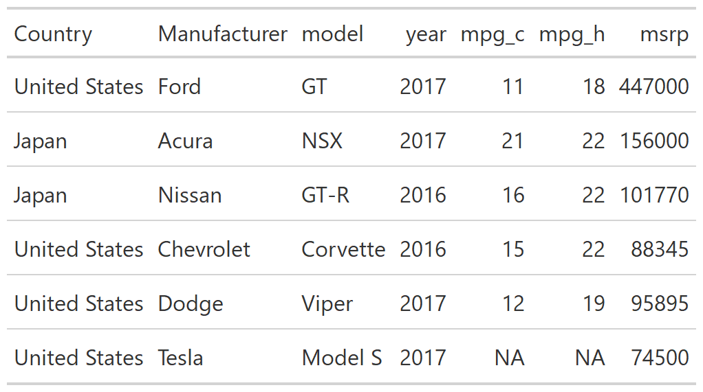

]

---

### Column order

Use `cols_move()` to move a column *after* another column.

.pull-left[
```{r gt07, eval = FALSE}
gtcars_small %>%
    gt() %>%
    cols_label(
        mfr = "Manufacturer",
        ctry_origin = "Country"
    ) %>%
    cols_move_to_start(
        columns = vars(ctry_origin)
    ) %>%
    cols_move( #<<
        columns = vars(mpg_c, mpg_h),#<<
        after = vars(msrp)#<<
    )#<<
```
***Code notes:***
Move the two `mpg` columns *after* `msrp`
]

.pull-right[
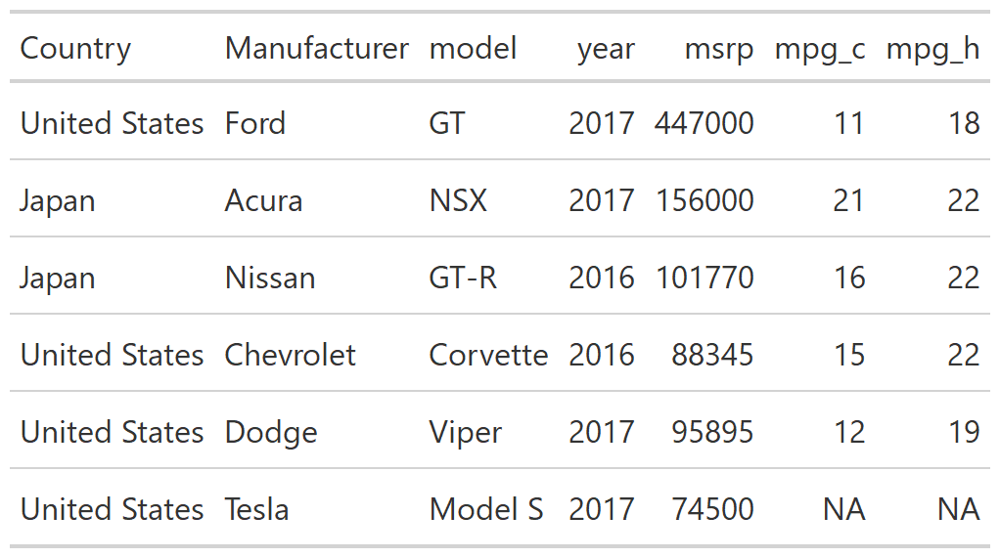

]

---

### Column widths

Control with widths of columns in pixels (`px()`) or percentage of the current size (`pct()`) with `cols_width()`.

.pull-left[
```{r gt08, eval = FALSE}
gtcars_small %>%
    gt() %>%
    cols_label(
        mfr = "Manufacturer",
        ctry_origin = "Country"
    ) %>%
    cols_move_to_start(
        columns = vars(ctry_origin)
    ) %>%
    cols_width(#<<
        vars(ctry_origin) ~ px(150)#<<
    )#<<
```
]

.pull-right[


]

---

### Column widths

If you want many columns to be the same width, use `everything()` after defining the widths of other columns.

.pull-left[
.smaller[
```{r gt09, eval = FALSE}
gtcars_small %>%
    gt() %>%
    cols_label(
        mfr = "Manufacturer",
        ctry_origin = "Country"
    ) %>%
    cols_move_to_start(
        columns = vars(ctry_origin)
    ) %>%
    cols_width( #<<
        vars(ctry_origin, mfr, model) ~ px(120), #<<
        everything() ~ px(50) #<<
    ) #<<
```
]
]

.pull-right[

]

---

### Merging columns

You can combine multiple columns into one using `cols_merge()`.

.pull-left[
```{r gt10, eval = FALSE}
gtcars_small %>%
    gt() %>%
    cols_merge( #<<
        columns = vars(mpg_c, mpg_h) #<<
    ) #<<
```
***Code notes:***  
-Combine two `mpg` columns to show range of mileage in one column  
-By default name of new column comes from first column listed
]

.pull-right[

]

---

### Merging columns

By default the new column is named with the first column and the values are put together with a space between them.

.pull-left[
```{r gt11, eval = FALSE}
gtcars_small %>%
    gt() %>%
    cols_merge( #<<
        columns = vars(mpg_c, mpg_h),#<<
        pattern = "{1}-{2}"#<<
    )#<<
```
***Code notes:***  
-`pattern` argument controls how column values combined  
-Here I put hyphen between values  
]

.pull-right[
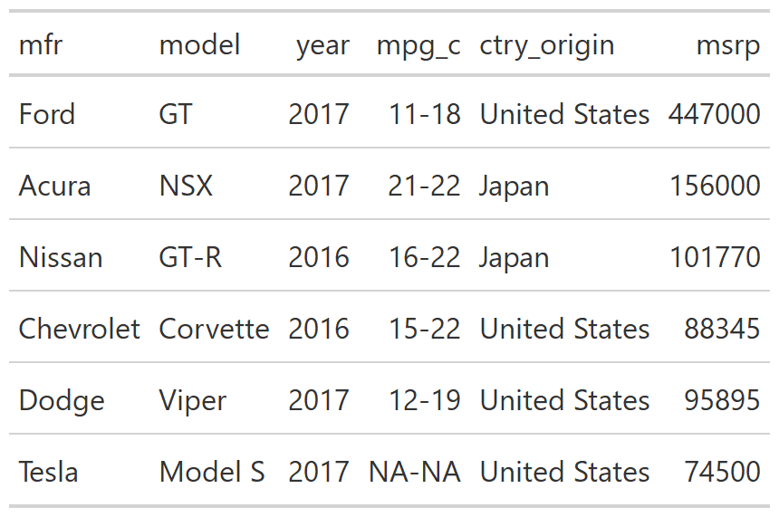
]

---

### Your turn

Write code in the empty code chunk that is provided. 

Using the `gtcars_small` dataset:  
-   We just made a new *merged* column called `mpg_c`. Change the name of this column to `Range`.
-   Change the name of `ctry_origin` to `Origin`.
-   Move `year` to be the first column, followed by `ctry_origin`.


```{r, echo = FALSE}
library(countdown)
countdown(minutes = 5, 
          bottom = 0,
          color_border = "#F4790B",
          color_text = "#1c5253",
          color_running_background = "#1c5253",
          color_running_text = "#F4790B",
          color_finished_background = "red",
          color_finished_text = "#1c5253")
```

---

### Your turn solution

.pull-left[
```{r yt1, eval = FALSE}
gtcars_small %>%
    gt() %>%
    cols_merge( 
        columns = vars(mpg_c, mpg_h),
        pattern = "{1}-{2}"
    ) %>%
    cols_label(
        mpg_c = "Range",
        ctry_origin = "Origin"
    ) %>%
    cols_move_to_start(
        columns = vars(year)
    ) %>%
    cols_move(
        columns = vars(ctry_origin),
        after = vars(year)
    )
  
```
]

.pull-right[
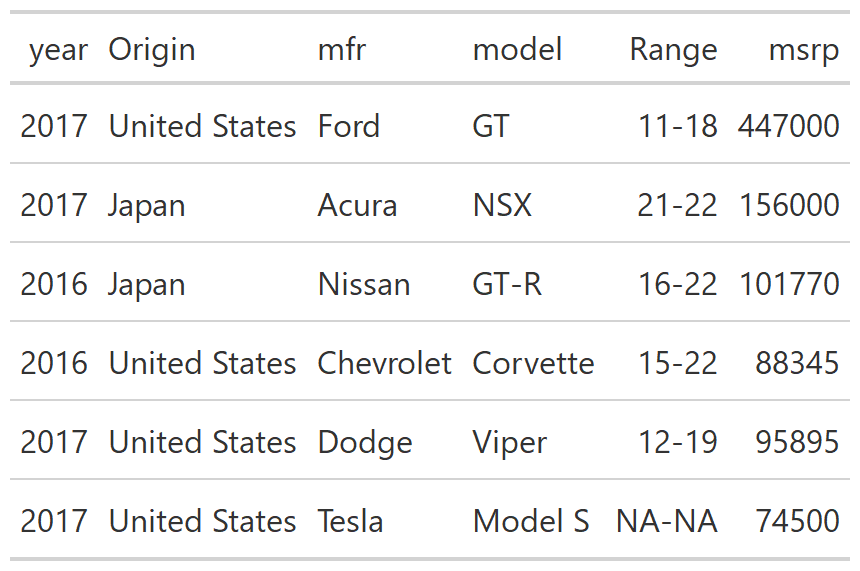
]

---

## Format columns

The **gt** package provides a series of [`fmt_*()` functions](https://gt.rstudio.com/reference/index.html#section-format-data) for formatting the values within columns. 

This can be done on entire rows or on individual cells (i.e., rows within columns).

---

### Number formatting

The function `fmt_number()` is for formatting numeric columns. We'll set the decimal place for `mpg_c` and add a suffix to `msrp`.

.pull-left[
```{r gt12, eval = FALSE}
gtcars_small %>%
    gt() %>%
    fmt_number( #<<
        columns = vars(mpg_c), #<<
        decimals = 1#<<
    ) %>%#<<
    fmt_number(#<<
        columns = vars(msrp),#<<
        decimals = 0,#<<
        suffixing = TRUE#<<
    )
```
***Code notes:***  
-`decimals` defaults to 2   
-`suffixing` is for adding large number suffixes like `K` for thousands
]

.pull-right[
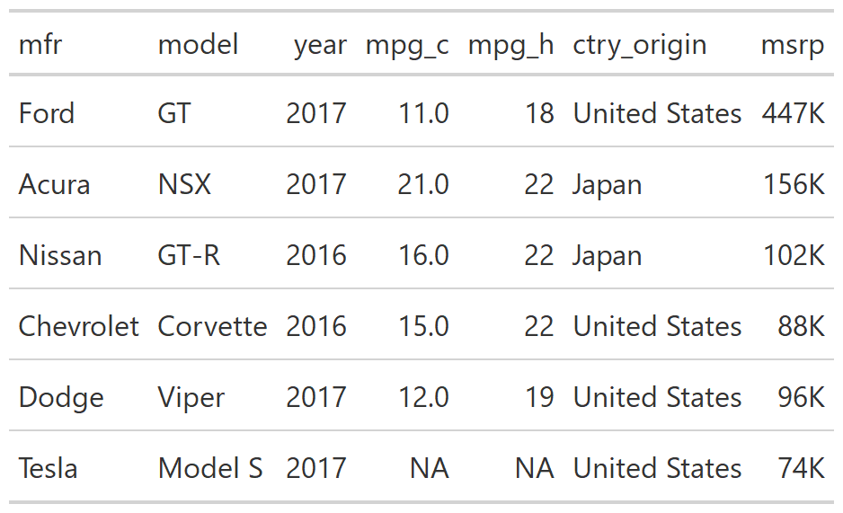
]

???

Includes, e.g., choosing the number of decimal places, setting the decimal separator (defaults to "."), and large-number suffixes such as `K` for thousands.

---

### Currency formatting

Add a currency symbol using `fmt_currency()`. We'll add a dollar sign to `msrp`. 

.pull-left[
```{r gt13, eval = FALSE}
gtcars_small %>%
    gt() %>%
    fmt_currency( #<<
        columns = vars(msrp), #<<
        currency = "USD",#<<
        decimals = 0,#<<
        suffixing = TRUE#<<
    )#<<
```
***Code notes:***  
`USD` is the default currency symbol.  
]

.pull-right[
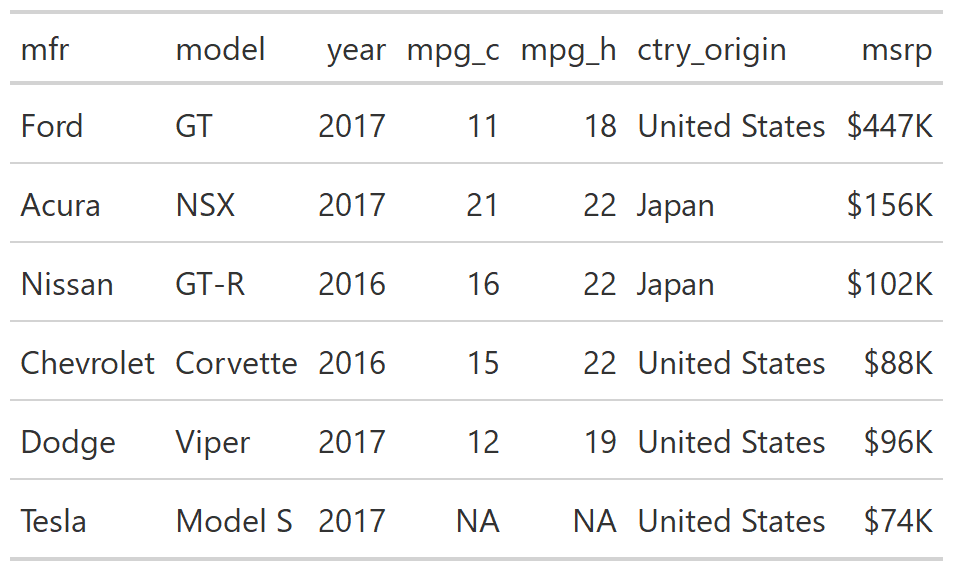
]

???

This function has many options we won't see today, including options for how to display negative values.

---

### Currency formatting

We can change the currency symbol, using either 3-letter currency codes or common currency names. 

.pull-left[
```{r gt14, eval = FALSE}
gtcars_small %>%
    gt() %>%
    fmt_currency(
        columns = vars(msrp), 
        currency = "EUR", #<<
        decimals = 0,
        suffixing = TRUE
    )
```
***Code notes:***  
`EUR` stands for euros  
]

.pull-right[

]

---

### Currency formatting

Change the currency symbol to pounds.

.pull-left[
```{r gt15, eval = FALSE}
gtcars_small %>%
    gt() %>%
    fmt_currency(
        columns = vars(msrp), 
        currency = "pound", #<<
        decimals = 0,
        suffixing = TRUE
    )
```
]

.pull-right[
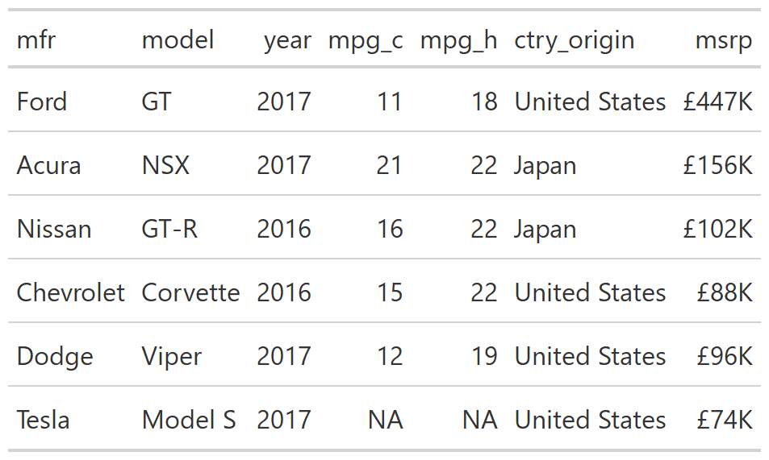
]

---

### Percent formatting

Use `fmt_percent()` for percent formatting. We'll pretend the `mpg` columns are percents.

.pull-left[
```{r gt16, eval = FALSE}
gtcars_small %>%
    gt() %>% 
    fmt_percent( #<<
        columns = vars(mpg_c, mpg_h),#<<
        decimals = 0#<<
    )#<<
```
]

.pull-right[

]

---

### Percent formatting

By default, the values were multiplied by 100 prior to adding the `%` symbol. Use `scale_value = FALSE` to change.

.pull-left[
```{r gt17, eval = FALSE}
gtcars_small %>%
    gt() %>% 
    fmt_percent(
        columns = vars(mpg_c, mpg_h),
        decimals = 0,
        scale_value = FALSE #<<
    )
```
]

.pull-right[
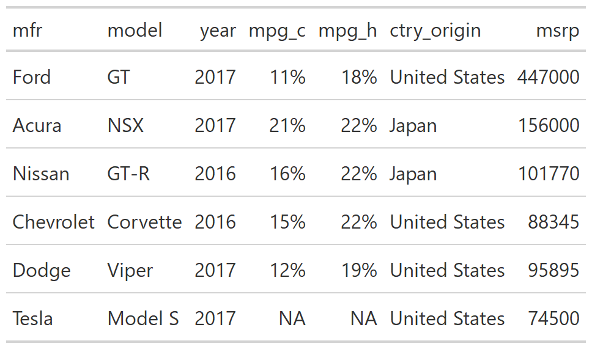
]

---

### Missing values formatting

By default missing values are shown in tables as `NA`. This can be controlled using `fmt_missing()`.

.pull-left[
```{r gt18, eval = FALSE}
gtcars_small %>%
    gt() %>%
    fmt_missing( #<<
        columns = contains("mpg") #<<
    ) #<<
```
***Code notes:***  
-Note use of `contains()` select helper function  
-By default the new missing text is `---`
]

.pull-right[
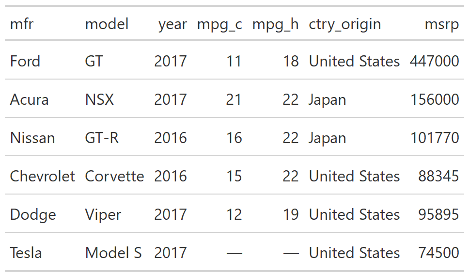
]

---

### Missing values formatting

Change the missing text to `none` with `missing_text`.

.pull-left[
```{r gt19, eval = FALSE}
gtcars_small %>%
    gt() %>%
    fmt_missing(
        columns = contains("mpg"),
        missing_text = "none" #<<
    )
```
]

.pull-right[

]

---

### Formatting specific cells

All the `fmt_*()` functions work on entire columns by default. We can focus on specific rows using the `rows` argument. In [Jonathan Schwabish's "Ten Guidelines for Better Tables"](https://www.cambridge.org/core/journals/journal-of-benefit-cost-analysis/article/abs/ten-guidelines-for-better-tables/74C6FD9FEB12038A52A95B9FBCA05A12), he recommends adding symbols only the first row in each column.

.pull-left[
```{r gt20, eval = FALSE}
gtcars_small %>%
    gt() %>%
    fmt_percent(
        columns = 4:5, #<<
        rows = 1, #<<
        decimals = 0,
        scale_values = FALSE
    )
```
***Code notes:***  
-Choose the `rows` by index  
-I chose the columns by position  
-Note [alignment issue](https://themockup.blog/posts/2020-09-04-10-table-rules-in-r/#rule-7-remove-unit-repetition)
]

.pull-right[

]

???

You'll note this changes the alignment of the column, which is not ideal. There is an open issue to fix this in **gt**. In the meantime, check out Thomas Mock's work-arounds in his [blog post](https://themockup.blog/posts/2020-09-04-10-table-rules-in-r/#rule-7-remove-unit-repetition).

---

### Date-time formatting

While we aren't going to explore them today, if you are working with dates, times, or date-times you'll find the respective `fmt_*()` functions for those to be useful. 

Here's a link to some examples in the **gt** Cookbook: <https://themockup.blog/static/gt-cookbook.html#Date_formatting>.

---

### Your turn

Write code in the empty code chunk that is provided. 

You will be using `mtcars_small` for this exercise.  
-   Convert `carb` to a percent with 1 decimal place, where `4` = `4.0%`.
-   Replace the missing value in `disp` with `---`.
-   Replace the missing value in `qsec` with "missing".
-   Add the `yen` currency symbol to `hp` with 0 decimal places.

```{r, echo = FALSE}
countdown(minutes = 7, 
          bottom = 0)
```

---

### Your turn solution

.pull-left[
```{r yt2, eval = FALSE}
mtcars_small %>%
    gt() %>%
    fmt_percent(
        columns = vars(carb),
        decimals = 1,
        scale_values = FALSE
    ) %>%
    fmt_missing(
        columns = vars(disp)
    ) %>%
    fmt_missing(
        columns = vars(qsec),
        missing_text = "missing"
    ) %>%
    fmt_currency(
        columns = vars(hp),
        currency = "yen",
        decimals = 0
    )
```
]

.pull-right[
.center[
```{r, echo = FALSE, out.width = "70%"}
knitr::include_graphics("figs/week04_files/yt2.png")
```

<!--  -->
]
]

---

## Row names, row groups, and summary rows

Let's switch to thinking about the rows.

The rows are what **gt** refers to as the *stub*. The stub is often a column of row labels that doesn't have (or need) a column label. We can also add in grouping here.

---

### Row names

The variable that represents the rows  is an argument within the `gt()` function. Let's start by using `"ctry_origin"` as row labels. 

.pull-left[
```{r gt21, eval = FALSE}
gtcars_small %>%
    gt(rowname_col = "ctry_origin") #<<
```
***Code notes:***  
-Put quotes around the variable in `rowname_col`  
-Add a column name using `tab_stubhead()`
]

.pull-right[
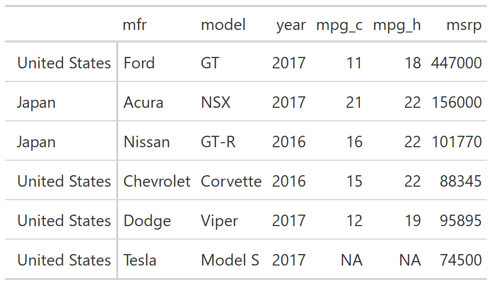
]

???

You can see the column is moved to the beginning of the table and, by default, does not have a column name. Add a column name using `tab_stubhead()`.

---

### Row groups

Adding row groups helps organize a table. This can be done by assigning a grouping variable with `groupname_col` in `gt()`. You can also pass a grouped dataset from **dplyr** to set the groups.

Let's group by `ctry_origin` to organize by country.

.pull-left[
```{r gt22, eval = FALSE}
gtcars_small %>%
    gt(groupname_col = "ctry_origin") #<<
```
***Code notes:***  
Put quotes around the variable in `groupname_col`  
]

.pull-right[
.center[
```{r, echo = FALSE, out.width = "70%"}
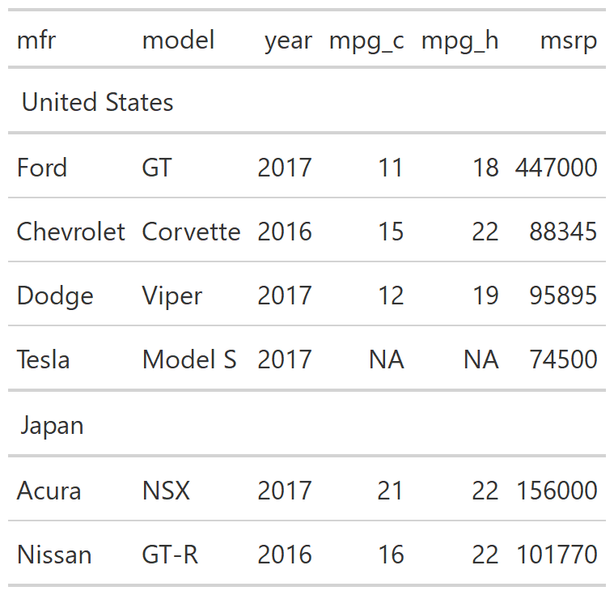
```
]
]

---

### Row names and groups

In many cases we'll want to have a row names column when we have groups. This helps our table organization.

Let's group by `ctry_origin` and put `year` as the row names.

.pull-left[
```{r gt23, eval = FALSE}
gtcars_small %>%
    gt( #<<
        rowname_col = "year",#<<
        groupname_col = "ctry_origin"#<<
    )#<<
```
***Code notes:***  
In some cases you may want blank row names. See an example from the **gt** Cookbook [here](https://themockup.blog/static/gt-cookbook.html#create-blank-rownames) for one approach.  
]

.pull-right[
.center[
```{r, echo = FALSE, out.width = "70%"}
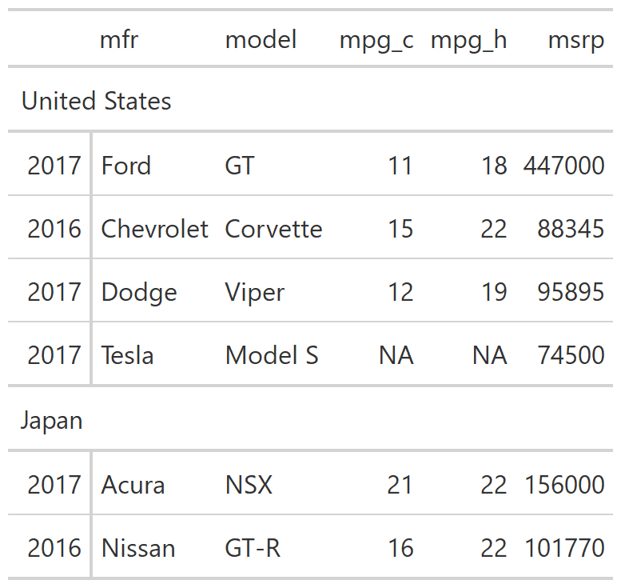
```
]
]

---

### Manual groups

You can manually define groups using the function `tab_row_group()`. This involves using some sort of logical statement. 

.pull-left[
```{r gt24, eval = FALSE}
gtcars_small %>%
    gt() %>%
    tab_row_group(#<<
        group = "Low city mpg",#<<
        rows = mpg_c < 21#<<
    ) %>%#<<
    tab_row_group(#<<
        group = "High city mpg",#<<
        rows = mpg_c >= 21#<<
    ) #<<
```
***Code notes:***  
-This makes two groups so uses `tab_row_group()` twice  
-The rows to group are defined in `rows`  
-The group name is defined in `group`  
]

.pull-right[
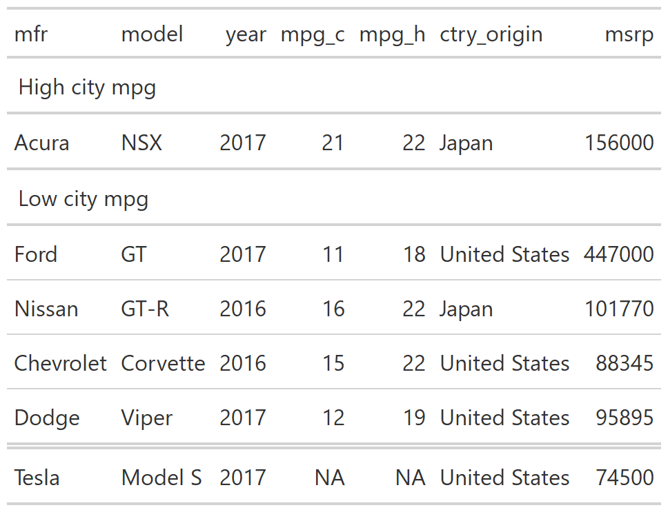
]

???

Let's make two groups, one for "low" city `mpg_c` (\<21) and one for "high". This involves two calls to `tab_row_group()`. If you have many groups, you may consider making a grouping column prior to creating the **gt** table rather than doing it here.

---

### Summary rows

Once we have groups, we may want to add summaries for each group.

.pull-left[
```{r gt25, eval = FALSE}
gtcars_small %>%
    gt(
        rowname_col = "year",
        groupname_col = "ctry_origin"
    ) %>%
    summary_rows( #<<
        groups = TRUE,#<<
        columns = vars(msrp),#<<
        fns = list(Average = ~mean(.))#<<
        )#<<
```
***Code notes:***  
-Use `groups = TRUE` for group summaries   
-Choose columns to work on in `columns`    
-Functions are in a list. Note naming and tilde coding (`~`)  
]

.pull-right[
.center[
```{r, echo = FALSE, out.width = "70%"}
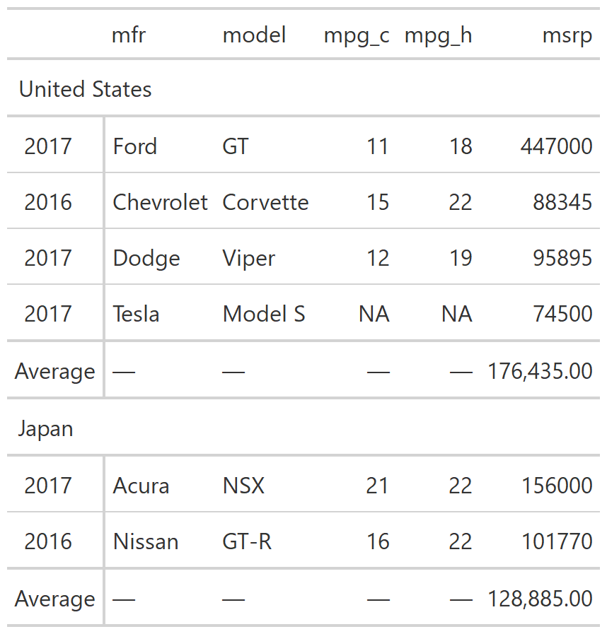
```
]
]

---

### Summary rows

Use the `formatter` argument to pass `fmt_*()` functions to control the output format. 

.pull-left[
.smaller[
```{r g26, eval = FALSE}
gtcars_small %>%
    gt(
        rowname_col = "year",
        groupname_col = "ctry_origin"
    ) %>%
    summary_rows(
        groups = TRUE,
        columns = vars(msrp),
        fns = list(Average = ~mean(.),#<<
                   SD = ~sd(.)),#<<
        formatter = fmt_number,#<<
        decimals = 0#<<
        )
```
]

***Code notes:***  
Add more functions to the list to get more summaries  
Add in `fmt_*()` arguments such as `decimals`      
]

.pull-right[
.center[
```{r, echo = FALSE, out.width = "70%"}
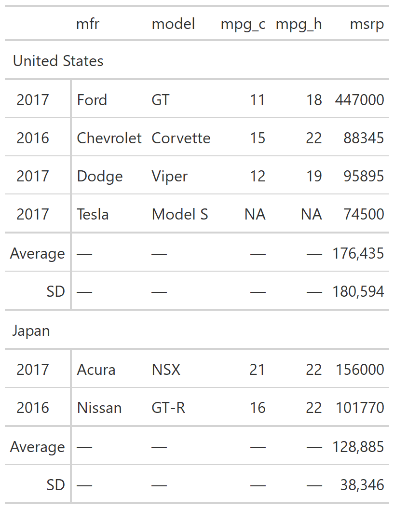
```
]
]

---

### Summary rows

Watch out for missing values when summarizing. You've likely noted non-summarized columns are given `---`. Change this with `missing_text`. 

.pull-left[
.smaller[
```{r gt27, eval = FALSE}
gtcars_small %>%
    gt(
        rowname_col = "year",
        groupname_col = "ctry_origin"
    ) %>%
    summary_rows(
        groups = TRUE,
        columns = contains("mpg"),
        fns = list(Average = ~mean(., na.rm = TRUE)), #<<
        missing_text = "" #<<
        )
```
]

***Code notes:***  
Add in `na.rm = TRUE` to the `mean()` function    
`""` returns a blank for `missing_text` 
]

.pull-right[
.center[
```{r, echo = FALSE, out.width = "70%"}
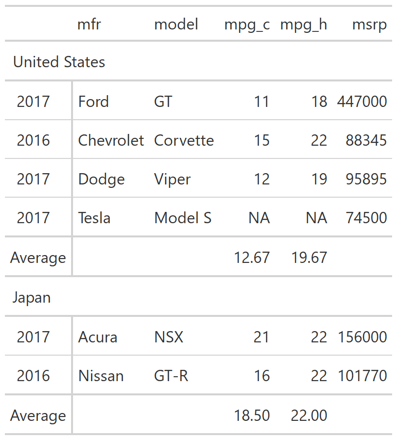
```
]
]

---

### Summary rows

If you have all numeric columns, leave the `columns` argument out of the function to summarize all at once. Switch to `mtcars_small` to see this.

.pull-left[
.smaller[
```{r gt28, eval = FALSE}
mtcars_small %>%
    gt(
        groupname_col = "carb"
    ) %>%
    summary_rows( #<<
        fns = list(Average = ~mean(., na.rm = TRUE)) #<<
    ) #<<
```
]
]

.pull-right[
.center[
```{r, echo = FALSE, out.width = "50%"}
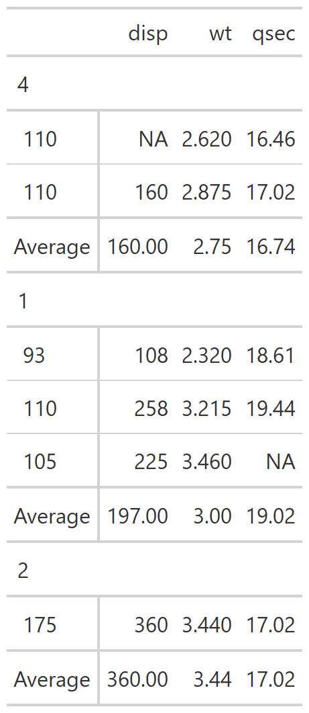
```
]
]

---

### Grand summary

Add an overall summary along with group summaries with `grand_summary_rows()`.

.pull-left[
```{r gt29, eval = FALSE}
gtcars_small %>%
    gt(
        rowname_col = "year",
        groupname_col = "ctry_origin"
    ) %>%
    grand_summary_rows( #<<
        columns = vars(msrp), #<<
        fns = list(Average = ~mean(.)) #<<
    ) #<<
```
]

.pull-right[
.center[
```{r, echo = FALSE, out.width = "90%"}
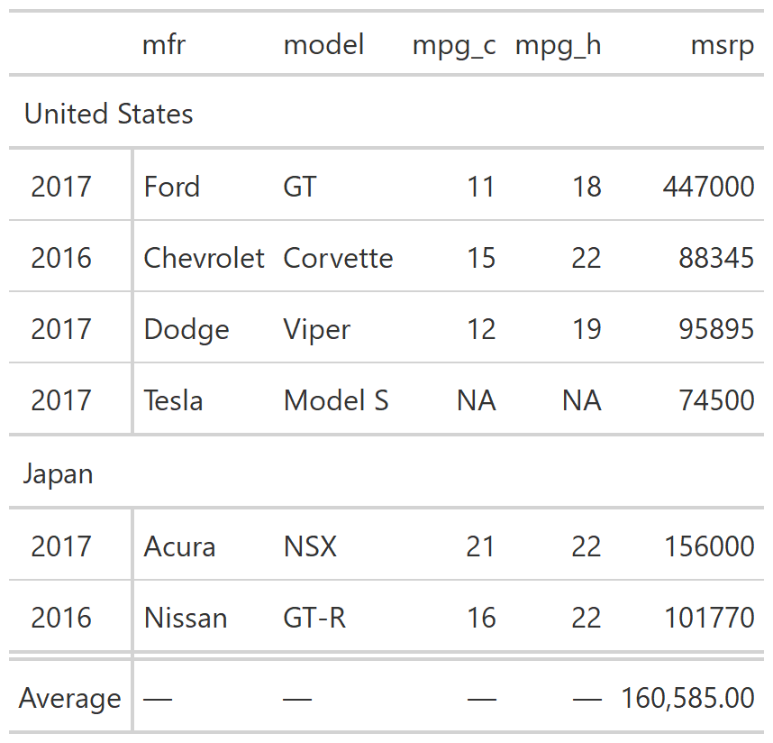
```
<!--  -->
]
]

---

### Your turn

Write code in the empty code chunk that is provided. 

Take `gtcars_small` and do the following:  
-   Group rows by `year`
-   Use `ctry_origin` as row names
-   Add the total `msrp` per group with the row name "Total"
-   Finally, add the overall total `msrp` across groups with the row name "Overall"

```{r, echo = FALSE}
countdown(minutes = 5, 
          bottom = 0)
```

---

### Your turn solution

.pull-left[
```{r yt3, eval = FALSE}
gtcars_small %>%
    gt(
        rowname_col = "ctry_origin",
        groupname_col = "year"
    ) %>%
    summary_rows(
        groups = TRUE,
        columns = vars(msrp),
        fns = list(Total = ~sum(.))
    ) %>%
    grand_summary_rows(
        columns = vars(msrp),
        fns = list(Overall = ~sum(.))
    )
```
]

.pull-right[
.center[
```{r, echo = FALSE, out.width = "80%"}
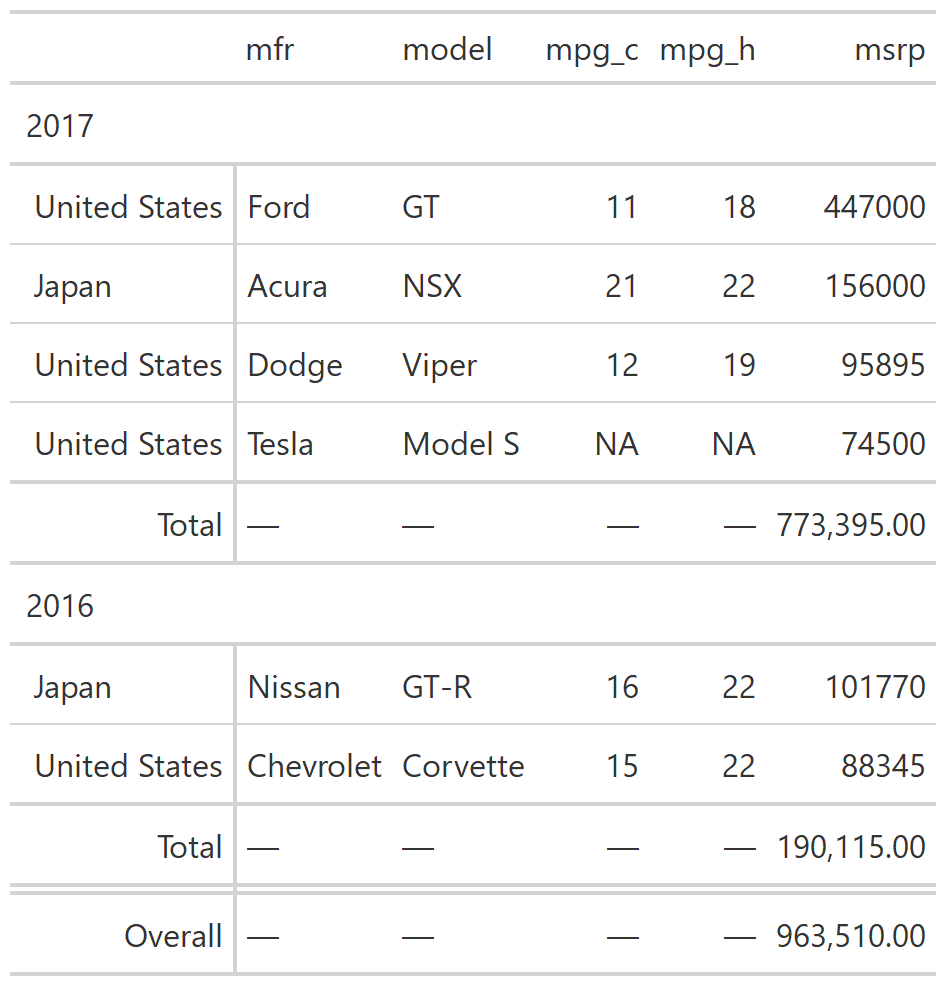
```
<!--  -->
]
]

---

## Headers, column spanners, and notes

We can add information to our table using a series of [`tab_*()` functions](https://gt.rstudio.com/reference/index.html#section-create-or-modify-parts). 

Per the **gt** documentation, these functions are for *creating or modifying parts* of your display table.

---

### Headers

Add a title and/or subtitle as a header using `tab_header()`.

.pull-left[
.smaller[
```{r gt30, eval = FALSE}
gtcars_small %>%
    gt() %>%
    tab_header(#<<
        title = "Deluxe automobiles from the 2014-2017 period",#<<
        subtitle = "Data from the United States and Japan"#<<
    )#<<
```
]
]

.pull-right[
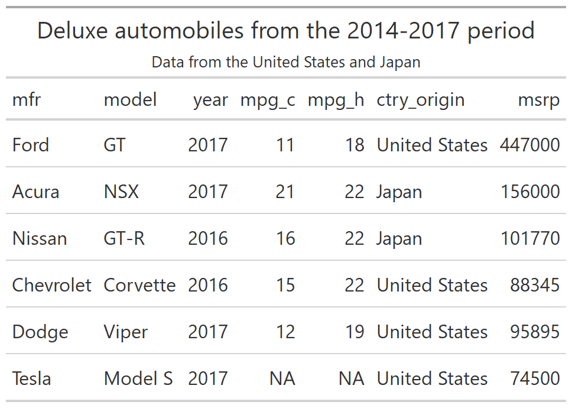
]

---

### Headers

As we saw with column labels, we can control formatting with `md()` or `html()` syntax.

.pull-left[
.smaller[
```{r gt31, eval = FALSE}
gtcars_small %>%
    gt() %>%
    tab_header(
        title = "Deluxe automobiles from the 2014-2017 period",
        subtitle = md("Data from the **United States** and **Japan**") #<<
    )
```
]
]

.pull-right[
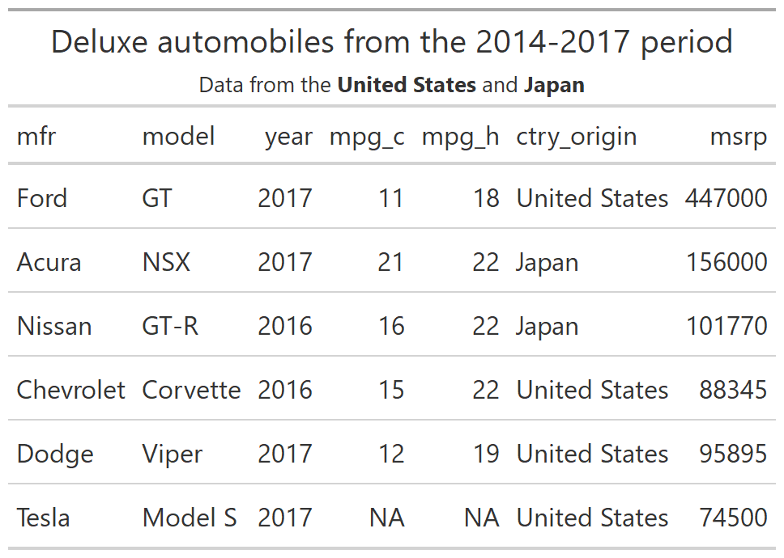
]

---

### Spanner column labels

Spanning columns is way of grouping similar columns instead of rows. This can be done with `tab_spanner()`. 

.pull-left[
```{r gt32, eval = FALSE}
gtcars_small %>%
    gt() %>%
    tab_spanner( #<<
        label = "Miles per gallon", #<<
        columns = vars(mpg_c, mpg_h) #<<
    ) #<<
```
***Code notes:***  
Use `label` to name the spanning column      
Choose columns to group with `columns` 
]

.pull-right[
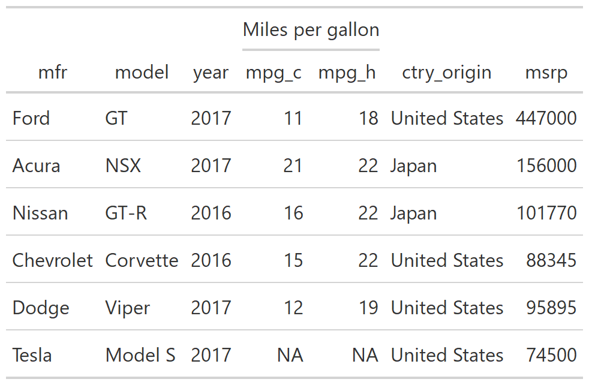
]

---

### Spanner column labels

Tables can have multiple spanners encompassing different groups of columns.

.pull-left[
```{r gt33, eval = FALSE}
gtcars_small %>%
    gt() %>%
    tab_spanner(
        label = "Miles per gallon",
        columns = vars(mpg_c, mpg_h)
    ) %>%
    tab_spanner( #<<
        label = "Car type", #<<
        columns = 1:2 #<<
    ) #<<
```
***Code notes:***  
Multiple spanners means multiple `tab_spanner()` layers        
]

.pull-right[
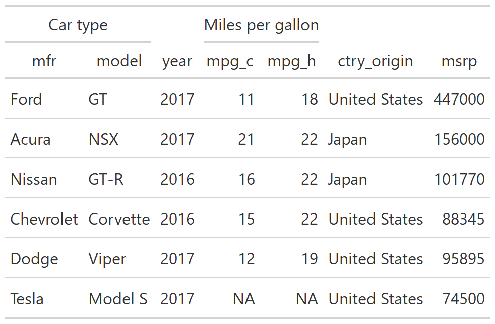

.foonote[*Columns do not have to be side-by-side to be spanned*]
]

---

### Source notes

Source notes are generally notes about where the data in the table came from. Use `tab_source_note()` to add a source note. 

.pull-left[
.smaller[
```{r gt34, eval = FALSE}
gtcars_small %>%
    gt() %>%
    tab_source_note( #<<
        source_note = md("*Data from [package **gt**](https://gt.rstudio.com/reference/gtcars.html)*") #<<
    )#<<
```
]

***Code notes:***  
Notes default to bottom but can be moved (*not shown*)        
You can use `md()` and `html()` with notes  
]

.pull-right[
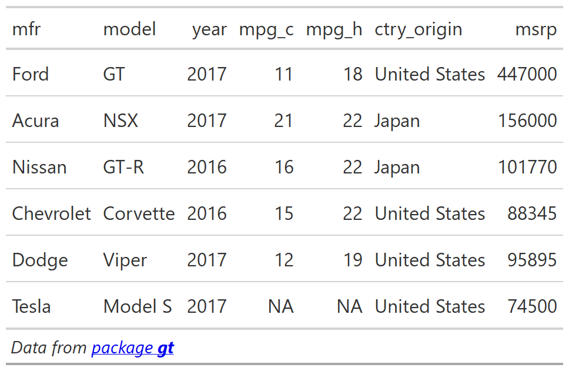
]

---

### Footnotes

We can add footnotes to add information on important components of the table that may not be clear. This is done with `tab_footnote()`.

.pull-left[
.smaller[
```{r gt35, eval = FALSE}
gtcars_small %>%
    gt() %>%
    tab_source_note(
        source_note = md("*Data from [package **gt**](https://gt.rstudio.com/reference/gtcars.html)*")
    ) %>%
    tab_footnote( #<<
        footnote = "In USD", #<<
        location = cells_column_labels( #<<
            columns = vars(msrp) #<<
        ) #<<
    ) #<<
```
]

***Code notes:***  
Pass footnote text to `footnote`           
Use `locations` for placement using [`cells_*()` helper functions](https://gt.rstudio.com/reference/index.html#section-helper-functions)  
]

.pull-right[

]

???

The `locations` argument is how we set the placement of the footnote. This involves a series of [`cells_*()` helper functions](https://gt.rstudio.com/reference/index.html#section-helper-functions) that we have not covered yet. We'll use a couple of these but will not go through them in detail. `cells_column_labels()` indicates column label placement

---

### Footnotes

**gt** keeps track of our footnote numbering for us. The one that is first in the table is given an earlier number even if we list them out of order in our code.

.pull-left[
.smaller[
```{r gt36, eval = FALSE}
gtcars_small %>%
    gt() %>%
    tab_source_note(
        source_note = md("*Data from [package **gt**](https://gt.rstudio.com/reference/gtcars.html)*")
    ) %>%
    tab_footnote(
        footnote = "In USD",
        location = cells_column_labels(
            columns = vars(msrp)
        )
    ) %>%
    tab_footnote( #<<
        footnote = "City miles per gallon", #<<
        location = cells_column_labels( #<<
            columns = vars(mpg_c) #<<
        ) #<<
    ) #<<
```
]

*Note numbering in order of appearance in table, not from `tab_footnote()`*          
]

.pull-right[
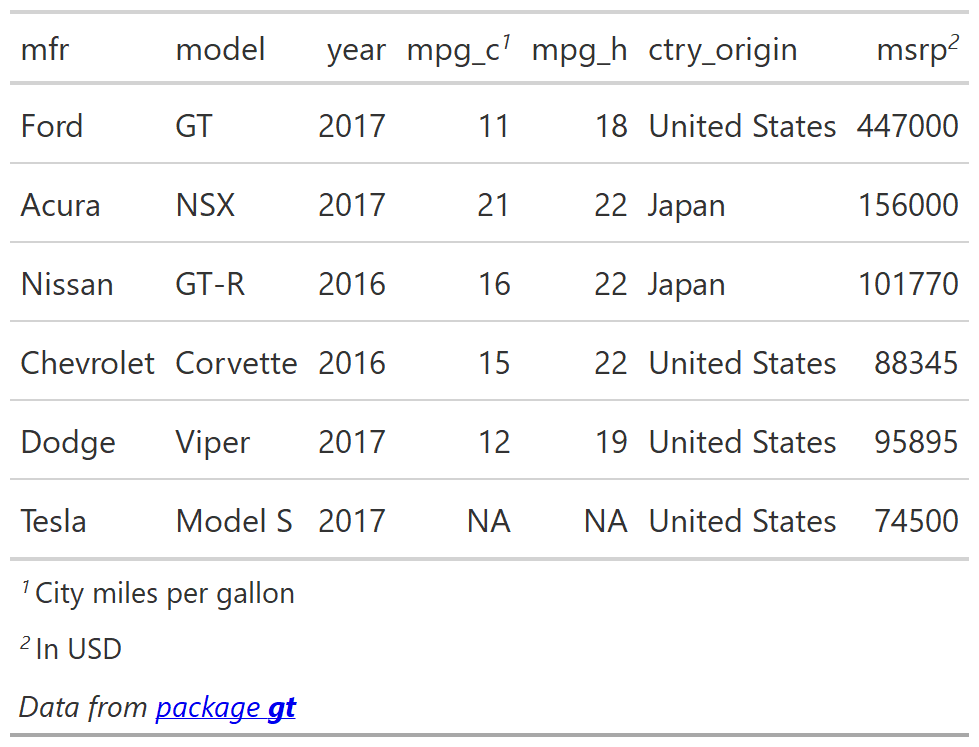
]

???

You can put footnotes wherever you want, including in individual cells, on row groups, etc. It all depends on what `cells*()` helper function you use.

---

### Your turn

Write code in the empty code chunk that is provided. 

Using the `mtcars_small` dataset  
-   Add a header title and subtitle to describe the table however you'd like
-   Group columns `disp`, `hp`, `qsec`, and `carb` with spanner label "Engine"
-   Add a source note to indicate the data are from a 1974 issue of Motor Trend magazine
-   Add a footnote to describe `disp` (which is engine displacement in cubic inches)

```{r, echo = FALSE}
countdown(minutes = 7, 
          bottom = 0)
```

---

### Your turn solution

.pull-left[
.smaller[
```{r yt4, eval = FALSE}
mtcars_small %>%
    gt() %>%
    tab_header(
        title = "Here is my header",
        subtitle = "It is filled with information"
    ) %>%
    tab_spanner(
        label = "Engine",
        columns = vars(disp, hp, qsec, carb)
    ) %>%
    tab_source_note(
        source_note = md("*Data from 1974 issue of Motor Trend magazine*")
    ) %>%
    tab_footnote(
        footnote = "Displacement in cubic inches",
        location = cells_column_labels( 
            columns = vars(disp) 
        ) 
    )
```
]
]

.pull-right[
.center[
```{r, echo = FALSE, out.width = "70%"}
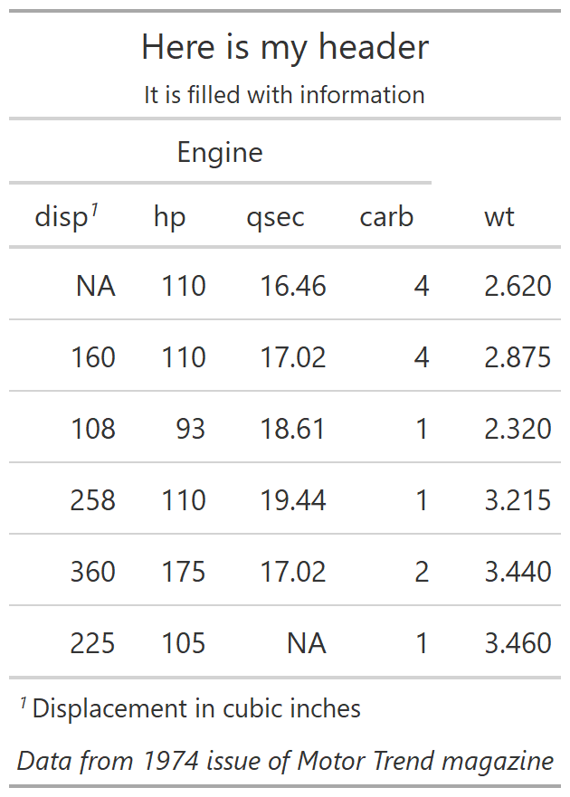
```
]
]

---

## Table styling

The **gt** package allows for an enormous amount of customization, allowing you to build a *theme* for what your tables should look like.

What you'll want really depends on your audience, and a table for a manuscript will likely look a lot different than one you build for an HTML document you are sharing.

We'll take a cursory look at some options today and then look at some overall themes next week.

---

### Table option functions

The family of `opt_*_*()` functions are for setting some commonly used table options.  add row stripes with `opt_row_striping()`.

.pull-left[
```{r gt37, eval = FALSE}
gtcars_small %>%
    gt() %>%
    opt_row_striping() #<<
```
]

.pull-right[
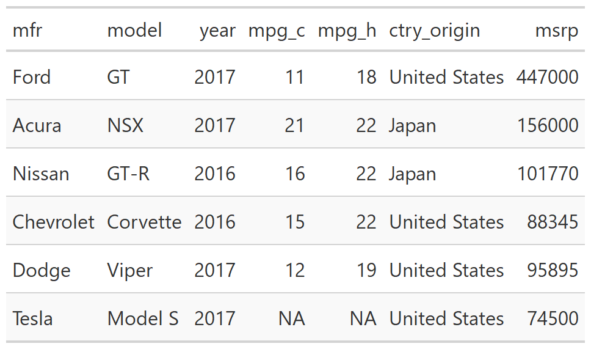
]

---

### Table option functions

Set overall fonts using fonts you have locally or use Google fonts via `google_font()` in `opt_table_font()`. 

.pull-left[
```{r gt38, eval = FALSE}
gtcars_small %>%
    gt() %>% 
    opt_table_font(font = google_font("Fira Mono")) #<<
```
]

.pull-right[
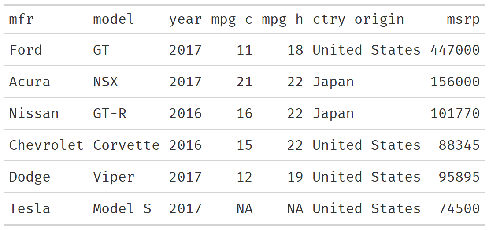
]

---

### Table output options

Much of the work styling the table overall is done in the `tab_options()` function. Much like `themes()` from **ggplot2**, there are an enormous number of options.

.pull-left[
.smaller[
```{r gt39, eval = FALSE}
gtcars_small %>%
    gt() %>%
    tab_options( #<<
        column_labels.border.top.color = "black", #<<
        column_labels.border.bottom.color = "black", #<<
        table_body.border.bottom.color = "black", #<<
        table_body.hlines.color = "white" #<<
    ) #<<
```
]

***Code notes:***  
Make black top and bottom lines  
Remove other horizontal lines  
]

.pull-right[
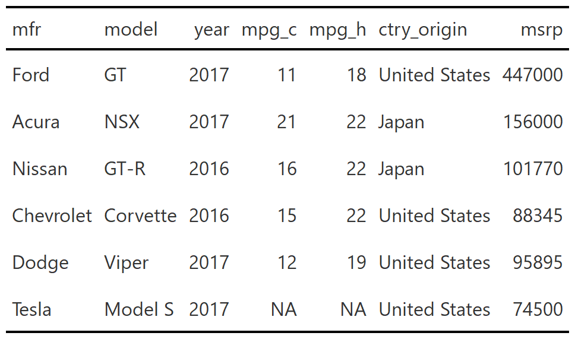
]

---

To get rid of the line above and below the header, set the top and bottom border colors to white and the line below the header to black.

.pull-left[
.smaller[
```{r gt40, eval = FALSE}
gtcars_small %>%
    gt() %>%
    tab_header(
        title = "Here is a header"
    ) %>%
    tab_source_note(
        source_note = "Give the source here"
    ) %>%
    tab_options(
        table.border.top.color = "white", #<<
        heading.border.bottom.color = "black", #<<
        table.border.bottom.color = "white", #<<
        column_labels.border.top.color = "black",
        column_labels.border.bottom.color = "black",
        table_body.border.bottom.color = "black",
        table_body.hlines.color = "white"
    ) %>%
    opt_align_table_header(align = "left") # left align header
```
]

***Code notes:***  
Note `opt_align_table_header()` to left align header    
]

.pull-right[
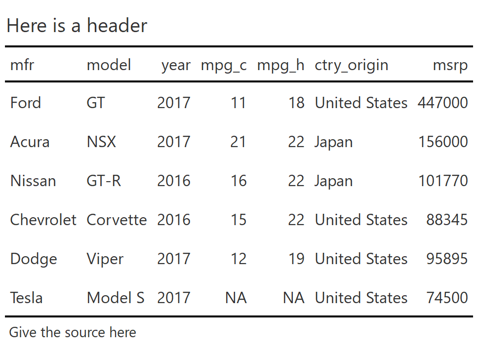
.footnote[*See the `tab_style()` function for controlling the style of individual parts of the table.*]
]

---

## Saving tables

The workhorse of saving tables is `gtsave()`.

From the documentation

> The gtsave() function makes it easy to save a gt table to a file. The function guesses the file type by the extension provided in the output filename, producing either an HTML, PDF, PNG, LaTeX, or RTF file.

--

You pass in a **gt** object to the `data()` argument and then set the file name in `filename`. If you want to save them somewhere outside your working directory set the path with `path`.

---

## Saving tables

We can practice by naming one of our tables. So far we've only been printing them.

```{r, eval = FALSE}
gt_output = gtcars_small %>%
    gt() %>%
    tab_header(
        title = "Here is a header"
    ) %>%
    tab_source_note(
        source_note = "Give the source here"
    ) %>%
    tab_options(
        table.border.top.color = "white",
        heading.border.bottom.color = "black",
        table.border.bottom.color = "white",
        column_labels.border.top.color = "black",
        column_labels.border.bottom.color = "black",
        table_body.border.bottom.color = "black",
        table_body.hlines.color = "white"
    ) %>%
    opt_align_table_header(align = "left")
```

---

## Saving tables

*You may need to install PhantomJS prior to being able to saving image files.*

```{r, eval = FALSE}
webshot::install_phantomjs(version = "2.1.1",
                           baseURL = "https://github.com/wch/webshot/releases/download/v0.3.1/",
                           force = FALSE)
```

--

Save the `gt_output` table as a PNG image file into the same directory as this document.

```{r, eval = FALSE}
gtsave(
    data = gt_output,
    filename = "test1.png"
)
```

---

## Saving tables

If you want to use a table in Word you'll need the RTF format. 

You may still need to modify some formats (like column widths) manually after you open in Word.

```{r, eval = FALSE}
gtsave(
    data = gt_output,
    filename = "test1.rtf"
)
```

---

## Final exercise

For the final practice exercise you will clean up the small table of results named `results` and save it.

Here's what you should do:  
-   Use `contrast` as the row group
-   Use `litterspp` as the row names
-   Increase the column width of `litterspp` to 100 px
-   Round the numeric columns to a single decimal place
-   Change the label of `ratio` to "Ratio"
-   Merge the two CL columns with a comma between the numbers and name the result "95% CI"
-   Add a header that says "Comparisons"
-   Add a source note in italics that says "Data from Siuslaw study"
-   Add row striping
-   Save this as a PNG file called "final_exercise.png"

***If you have time:***
Use the same `tab_options()` as above but add `row_group.border.top.color = "black"`, `row_group.border.bottom.color = "white"`, and `stub.border.color = "transparent"`

???

You may want to do these changes one or a few at a time to help troubleshoot any problems that arise.

---

## Final exercise solution

.pull-left[
.tiny[
```{r, eval = FALSE}
results %>%
    gt(
        rowname_col = "litterspp",
        groupname_col = "contrast"
    ) %>%
    cols_width(
        vars(litterspp) ~ px(100)
    ) %>%
    fmt_number(
        columns = 3:5,
        decimals = 1
    ) %>%
    cols_label(
        ratio = "Ratio"
    ) %>%
    cols_merge(
        columns = 4:5,
        pattern = "{1},{2}"
    ) %>%
    cols_label(
        lower.CL = "95% CI"
    ) %>%
    tab_header(title = "Comparisons") %>%
    tab_source_note(source_note =  md("*Data from Siuslaw study*")) %>%
    tab_options(
        table.border.top.color = "white",
        heading.border.bottom.color = "black",
        row_group.border.top.color = "black",
        row_group.border.bottom.color = "white",
        stub.border.color = "transparent",
        table.border.bottom.color = "white",
        column_labels.border.top.color = "black",
        column_labels.border.bottom.color = "black",
        table_body.border.bottom.color = "black",
        table_body.hlines.color = "white"
    )
```
]
]


.pull-right[
.center[
```{r, echo = FALSE, out.width = "50%"}
knitr::include_graphics("figs/week04_files/yt5.png")
```
]
]

---

class: hide-logo

## Next week

- We'll explore using images and adding colors in **gt** tables  
- Discuss creating overall themes for tables   

.center[
```{r gt, echo = FALSE, out.width = "15%", fig.cap = "Logo for package gt"}

```
]

.footnote[
[Code for slides](https://github.com/aosmith16/spring-r-topics/tree/main/docs/slides)  
Slides created via the R packages:  
[**xaringan**](https://github.com/yihui/xaringan), 
[gadenbuie/xaringanthemer](https://github.com/gadenbuie/xaringanthemer), 
[gadenbuie/xaringanExtra](https://github.com/gadenbuie/xaringanExtra) 
.center[*This work is licensed under the Creative Commons Attribution-NonCommercial 4.0 International License. 
To view a copy of this license, visit http://creativecommons.org/licenses/by-nc/4.0/.*]
]