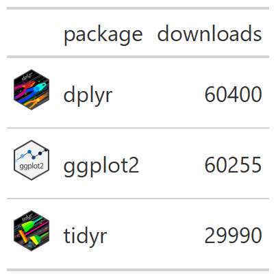
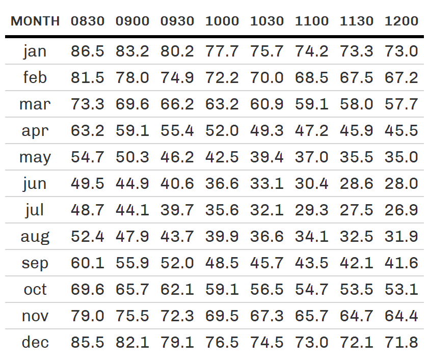

```{r setup, include = FALSE}
options(htmltools.dir.version = FALSE)
knitr::opts_chunk$set(
  fig.width=9, fig.height=3.5, fig.retina=3,
  out.width = "100%",
  cache = FALSE,
  echo = TRUE,
  message = FALSE, 
  warning = FALSE,
  fig.show = TRUE,
  hiline = TRUE
)
library(formatR)
```

```{r xaringan-themer, include = FALSE, warning = FALSE}
library(xaringanthemer)
style_duo_accent(
  primary_color = "#1c5253",
  secondary_color = "#F4790B",
  inverse_header_color = "#FFFFFF",
  title_slide_text_color = "#FFFFFF",
  base_font_size = "22px",
  link_color = "#F4790B",
  code_highlight_color = "rgba(244, 121, 11, 0.5)"
)
```

```{r metathis, echo=FALSE}
library(metathis)
meta() %>%
    meta_name("github-repo" = "aosmith16/spring-r-topics") %>% 
    meta_social(
        title = "Display tables with package gt",
        description = "Colors, images, and custom themes",
        url = "https://aosmith16.github.io/spring-r-topics/slides/week05_more_gt.html",
        image = "https://raw.githubusercontent.com/aosmith16/spring-r-topics/main/slides/week05-share-card.png",
        image_alt = paste(
            "More options in package gt", 
            "Working sessions class spring 2021"
        ),
        og_type = "website",
        og_author = "Ariel Muldoon",
        twitter_card_type = "summary_large_image",
        twitter_creator = "@aosmith16"
    )
```

```{r xaringan-scribble, echo = FALSE}
xaringanExtra::use_scribble()
```

```{r xaringanExtra-clipboard, echo=FALSE}
xaringanExtra::use_clipboard()
```

```{r xaringan-tile-view, echo=FALSE}
xaringanExtra::use_tile_view()
```

```{r broadcast, echo=FALSE}
xaringanExtra::use_broadcast()
```

class: center, middle, title-slide

# Display tables with package gt
## Part 2: Adding flair `r emo::ji("boom")`

```{r distill, echo = FALSE, out.width = "15%", fig.cap = "Logo for package gt"}
knitr::include_graphics("figs/gtlogo.svg")
```

### Ariel Muldoon
### April 27, 2021

---

## Today's Goal

Overall  
-     Add some flair `r emo::ji("boom")` to **gt** tables   

We will  

-     Color cells and cell text based on data     
-     Highlight specific values in columns based on location    
-     Add a column of images to HTML tables      
-     Explore custom themes to apply to tables        

--

*Before we begin:*

Make sure you saved `week05_more_gt.Rmd` from the class website onto your computer. We will be running code from this file.

---

class: hide-logo

## Resources

- The **gt** Cookbook has a section on [colors](https://themockup.blog/static/gt-cookbook.html#Conditional_formatting)  
- Liam Bailey walks through a more complex **gt** [table-making example](https://www.liamdbailey.com/post/making-beautiful-tables-with-gt/) with colors and images    
- Thomas Mock's [Advanced Cookbook](https://themockup.blog/static/gt-cookbook-advanced.html) has examples of creating themes and adding elements like bar charts    
- See Anthony Schmidt's post on a **gt** APA theme [here](https://www.anthonyschmidt.co/post/2020-06-03-making-apa-tables-with-gt/)    

.center[
```{r distillery, echo = FALSE, out.width = "25%", fig.cap = "Logo for package gt"}
knitr::include_graphics("figs/gtlogo.svg")
```
]

---

class: center, middle, inverse, hide-logo

# <font style="font-family: cursive; font-style:italic">Let's get started!</font>

---

## Running code

- Open the copy of  [`week05_gt_flair.Rmd`](files/week05_more_gt.Rmd) that you saved   
- I recommend switching to using the visual editor using the   button  

<br/><br/>
**Set up**  

We'll practice a additional features of package **gt** together, running example code I've already written.   

At the end of each section you'll have a chance to practice what we just covered.

???

This class should be a little shorter than the last one

---

## R packages 

We are using **gt 0.2.2**, **dplyr 1.0.5**, and **tidyr 1.1.3** today. Load these before we start. 

```{r, message = FALSE, warning = FALSE}
library(gt) # v. 0.2.2
library(dplyr) # v. 1.0.5
library(tidyr) # v 1.1.3
```

---

## Datasets

We need a few small datasets to practice on. We will do all data manipulation steps now.

--

.pull-left[
**The `countrypops` dataset**

This dataset contains yearly populations of countries, with data from 1960 thru 2017.  See the documentation at `?countrypops` for more info.

We'll pare things down to two countries and 5 years.

.smaller[
```{r gtcars, eval = FALSE}
pops_small = countrypops %>%
    filter(country_name %in% c("Vietnam", "Egypt") &
               year > 2012) %>% 
    select(country_name, year, population)
pops_small
```
]
]


.pull-right[
```{r, echo = FALSE}
pops_small = countrypops %>%
    filter(country_name %in% c("Vietnam", "Egypt") &
               year > 2012) %>% 
    select(country_name, year, population)
```

```{r gtcars-out, echo = FALSE}
knitr::kable(pops_small)
```
]

???

Data manipulation is key to making display tables and you'll often see data manipulation code along with the tables.

---

## Datasets

We need a few small datasets to practice on. We will do all data manipulation steps now.

.pull-left[
We'll take `pops_small` and widen it so the years are the columns.

```{r wide, eval = FALSE}
pops_wide = pivot_wider(
    data = pops_small,
    names_from = year,
    values_from = population
)
pops_wide
```
]

.pull-right[
<br/><br/><br/>
```{r, echo = FALSE}
pops_wide = pivot_wider(
    data = pops_small,
    names_from = year,
    values_from = population
)
```
]

```{r wide-out, echo = FALSE}
rmarkdown::paged_table(pops_wide)
```


---

## Datasets

We need a few small datasets to practice on. We will do all data manipulation steps now.

.pull-left[
**The `sza` dataset**

This dataset contains the solar zenith angles every half hour for different latitudes of the northern hemisphere. See `?sza` for more info.

We take values for the 50th latitude in wide format for 0830-1200.

.smaller[
```{r sza, eval = FALSE}
sza50 = sza %>%
    filter(latitude == 50 & !is.na(sza)) %>%
    select(-latitude) %>%
    pivot_wider(names_from = tst,
                values_from = sza) %>%
    select(1:9)
sza50
```
]
]

.pull-right[
```{r, echo = FALSE}
sza50 = sza %>%
    filter(latitude == 50 & !is.na(sza)) %>%
    select(-latitude) %>%
    pivot_wider(names_from = tst,
                values_from = sza) %>%
    select(1:9)
```

```{r sza-out, echo = FALSE}
rmarkdown::paged_table(sza50)
```

]

---

## Datasets

We need a few small datasets to practice on. We will do all data manipulation steps now.

Here is a small dataset so we can practice adding images into tables. It contains made-up CRAN download info for March 30 for **dplyr**, **ggplot2**, and **tidyr**, along with links to their hex sticker images.

.tiny[
```{r pack_down, eval = FALSE}
pack_down = data.frame(
    hex = c("https://github.com/tidyverse/dplyr/raw/master/man/figures/logo.png",
            "https://github.com/tidyverse/ggplot2/raw/master/man/figures/logo.png",
            "https://github.com/tidyverse/tidyr/raw/master/man/figures/logo.png"),
    package = c("dplyr", "ggplot2", "tidyr"),
    downloads = c(60400, 60255, 29990)
)
pack_down
```
]

.pull-right[
```{r, echo = FALSE}
pack_down = data.frame(
    hex = c("https://github.com/tidyverse/dplyr/raw/master/man/figures/logo.png",
            "https://github.com/tidyverse/ggplot2/raw/master/man/figures/logo.png",
            "https://github.com/tidyverse/tidyr/raw/master/man/figures/logo.png"),
    package = c("dplyr", "ggplot2", "tidyr"),
    downloads = c(60400, 60255, 29990)
)
```
]

```{r pack_down-out, echo = FALSE}
rmarkdown::paged_table(pack_down)
```

---

## Add color to table cells

We can use colors to add information to a table or help tell the story of what is in the table.

This is done using the [`data_color()` function](https://gt.rstudio.com/reference/data_color.html) along with the `col_*()` functions from package **scales**. The `col_*()` functions will map data values to colors based on a palette.

--

We can set or choose the `palette` in the `scales::col_*()` functions. The palette can be:

> 1.  A character vector of RGB or named colours. Examples: palette(), c("#000000", "#0000FF", "#FFFFFF"), topo.colors(10)
>
> 2.  The name of an RColorBrewer palette, e.g. "BuPu" or "Greens".
>
> 3.  The full name of a viridis palette: "viridis", "magma", "inferno", or "plasma".
>
> 4.  A function that receives a single value between 0 and 1 and returns a colour. Examples: colorRamp(c("#000000", "#FFFFFF"), interpolate="spline").

---

### Fill color, numeric column

Start be setting the fill color of the `population` column of `pops_small`. 

Choose the `columns` of interest and map `colors` using `scales::col_numeric()`. 

.pull-left[
```{r gt01, eval = FALSE, message = FALSE}
pops_small %>%
    gt() %>%
    data_color( #<<
        columns = vars(population), #<<
        colors = scales::col_numeric( #<<
            palette = "Greens", #<<
            domain = NULL #<<
        ) #<<
    ) #<<
```
***Code notes:***  
-"Greens" palette from **RColorBrewer**  
-Use `domain = NULL` so range of values is taken from the table  
]

.pull-right[
.center[
```{r, echo = FALSE, out.width = "45%", fig.alt = "Table with population cell fill colored in different shades of green going from light to dark as values go up"}

```
]
]

---

### Fill color, numeric column

You can use different fill colors on different columns by using multiple `data_color()` layers.

.pull-left[
.smaller[
```{r gt02, eval = FALSE}
pops_small %>%
    gt() %>%
    data_color(
        columns = vars(population),
        colors = scales::col_numeric(
            palette = "Greens",
            domain = NULL
        )
    ) %>%
    data_color(
        columns = vars(year),
        colors = scales::col_numeric(
            palette = c("white", "orange", "red"), #<<
            domain = NULL
        ),
        alpha = .5 #<<
    )
```
***Code notes:***  
-Note character vector of colors    
-`alpha` changes transparency 
]
]

.pull-right[
.center[
```{r, echo = FALSE, out.width = "45%", fig.alt = "Table with population cell fill colored in different shades of green going from light to dark as values go up. The year column fill is colored by white-orange-red in a similar way."}

```
]
]

---

### Fill color, many columns

You can create a *heat map* vibe in a table with many columns of similar values, applying the same color scale across all columns together. This is done by choosing more `columns`.

Here we'll choose all columns in `sza50` except the first one using `contains()`. We cannot currently use code like `col1:col3`, although this has been [added in the development version of **gt**](https://github.com/rstudio/gt/issues/611).

.pull-left[
```{r, eval = FALSE}
sza50 %>%
    gt() %>%
    data_color(
        columns = contains("0"), #<<
        colors = scales::col_numeric(
            palette = "magma",
            domain = range(select(sza50, where(is.numeric)))
            )
    )
```
]

---

### Fill color, many columns

To use a color scheme across values from all columns set the `domain` accordingly. I used helper functions from **dplyr** to get only the numeric columns when calculating the overall range.

.pull-left[
.smaller[
```{r gt03, eval = FALSE}
sza50 %>%
    gt() %>%
    data_color(
        columns = contains("0"),
        colors = scales::col_numeric(
            palette = "magma", #<<
            domain = range(select(sza50, where(is.numeric))) #<<
            )
    )
```
]

***Code notes:***  
-Here the palette is "magma" from viridis  
-If needed, change palette order with `reverse` in `scales::col_numeric()`
]

.pull-right[
.center[
```{r, echo = FALSE, out.width = "75%", fig.alt = "Table showing heatmap style where all the numeric columns are filled using the magma color palette"}

```
]
]

---

### Fill color, categorical column

We can use colors in categorical columns, as well. 

We need to provide one color for every category. Colors are used in the order they appear in the vector.

.pull-left[
```{r gt04, eval = FALSE}
pops_small %>%
    gt() %>%
    data_color(
        columns = vars(country_name),
        colors = c("red","blue"), #<<
        alpha = .5
    )
```

***Code notes:***  We can use a vector of values for `colors` without a `scales::col_*` function
]

.pull-right[
.center[
```{r, echo = FALSE, out.width = "45%", fig.alt = "Table with two category country_name column cells filled red and blue, with Egypt in red since that was first group in table and red is the first color given"}

```
]
]

---

### Fill color, categorical column

At the moment you cannot provide a named vector of colors in **gt** to map each category to each color like you can when making **ggplot2** plots. 

Using `scales::col_factor()` and manually setting the `domain` in the desired order along with `ordered = TRUE` allows us to assign colors to the correct factor levels.

---

### Fill color, categorical column

In this example we have a named vector of colors, `my_colors`. 

We can pass this vector to `palette`, the *names* of the vector to `domain`, and then use `ordered = TRUE`.

.pull-left[
```{r gt05, eval = FALSE}
my_colors = c(Vietnam = "red", #<<
              Egypt = "blue") #<<
pops_small %>%
    gt() %>%
    data_color(
        columns = vars(country_name),
        colors = scales::col_factor(
            palette = my_colors, #<<
            domain = names(my_colors), #<<
            ordered = TRUE #<<
        ),
        alpha = .5
    )
```


]

.pull-right[
.center[
```{r, echo = FALSE, out.width = "45%", fig.alt = "Table with two category country_name column cells filled red and blue, with Egypt in blue since used ordered colors and a domain"}

```
]
]

???
We might have a vector like this for our graphs, and we can still use it in **gt** tables with these extra steps.

---

### Text color, categorical column

By default `data_color()` is applied to the cell fill. If you want do change the text color instead use `apply_to = "text"`. 

.pull-left[
```{r gt06, eval = FALSE}
pops_small %>%
    gt() %>%
    data_color(
        columns = vars(country_name),
        colors = scales::col_factor(
            palette = "viridis", 
            domain = NULL
        ),
        apply_to = "text" #<<
    )
```
***Code notes:*** Here the palette is "viridis" from viridis  
]

.pull-right[
.center[
```{r, echo = FALSE, out.width = "45%", fig.alt = "Table with two category country_name column text colored using the viridis color palette"}

```
]
]

???
Note this is an argument to `data_color()`, not `scales::col_factor()`.

This would be a way to consistently apply colors to factor levels every time you used them without filling the entire cell.

---

### Text color, binning numeric column

Binning numeric variables into groups is an option via the `scales::col_bin()` function.

Working with `sza50`, we'll color text of cells below 45 as orange and 45 or higher as medium gray.

.pull-left[
.smaller[
```{r gt07, eval = FALSE}
sza50 %>%
    gt() %>%
    data_color(
        columns = contains("0"),
        colors = scales::col_bin(
            palette = c("orange", "grey54"), #<<
            bins = c(0, 45, 90) #<<
        ),
        apply_to = "text"
    )
```
]

***Code notes:***  
-Two groups so two colors  
-`bins` argument defines *cut points* for groups   
]

.pull-right[
.center[
```{r, echo = FALSE, out.width = "75%", fig.alt = "Table that colors text across all numeric columns, where cell text for values < 45 degrees is orange and values >= 45 degrees are grey54"}

```
]
]

???
The `bins` argument is key here, where we cut the values up into values between 0 and 45 and then between 45 and 90. If we had a value that was exactly equal to 45 it would be placed in the second group.

If you want equally sized bins, set `bins` to the number of groups you want.

---

### Your turn

Write code in the empty code chunk that is provided. 

Using the `pops_wide` dataset:  
-   Fill all the numeric columns with color, using the `"YlOrRd"` palette from **RColorBrewer**. Make sure to base the domain on the range of the values from the entire dataset.  
-   Color the text of `country_name`, using "#1c5253" for Egypt and "#F4790B" for Vietnam.  


```{r, echo = FALSE}
library(countdown)
countdown(minutes = 5, 
          bottom = 0,
          color_border = "#F4790B",
          color_text = "#1c5253",
          color_running_background = "#1c5253",
          color_running_text = "#F4790B",
          color_finished_background = "red",
          color_finished_text = "#1c5253")
```

---

### Your turn solution

.pull-left[
.smaller[
```{r yt1, eval = FALSE}
pops_wide %>%
    gt() %>%
    data_color(
        columns = contains("2"),
        colors = scales::col_numeric(
            palette = "YlOrRd",
            domain = range(select(pops_wide, where(is.numeric)))        
        )
    ) %>%
    data_color(
        columns = vars(country_name),
        colors = c("#1c5253", "#F4790B"),
        apply_to = "text"
    )
```
]
]

.pull-right[
.center[
```{r, echo = FALSE, fig.alt = "Your turn solution table with all numeric cell fill colored using YlOrRd from RColorBrewer and the country name text colored using 2 different hex colors"}

```
]
]

---

## Highlight cell text

You can bring attention to certain table cells by changing their *text style* (color, size, etc.) or making the whole cell a different color. 

This is a type of *table styling*, and this (and many other things!) can be done using the `tab_style()` function.

Helper functions like `cell_text()` for changing the cell text and `cell_fill()` for controlling the cell fill are used to define the cell style.

---

### Highlighting a single value

Let's highlight the 2017 Egypt population value in `pops_small`.

Our first step is to choose the `style` in `tab_style()`. Here we'll use `cell_text()` to make the text red and bold.

.pull-left[
```{r, eval = FALSE}
# Don't run this code
pops_small %>%
    gt() %>%
    tab_style(
        style = cell_text( #<<
            color = "red", #<<
            weight = "bold" #<<
        ), #<<
        ...
    )
```
]

???

Let's say we wanted to highlight a single value in a table. This could be something we wanted to point out in a discussion section. 

---

### Highlighting a single value

Define where to change the style using `locations`.  For highlighting cells this will be the `cells_body()`.

.pull-left[
```{r gt08, eval = FALSE}
pops_small %>%
    gt() %>%
    tab_style(
        style = cell_text(
            color = "red",
            weight = "bold"
        ),
        locations = cells_body( #<<
            columns = vars(population), #<<
            rows = 5 #<<
        ) #<<
    )
```
***Code notes:***  
-Choose columns of focus in `cells_body()`  
-I chose rows of interest with an index   
]

.pull-right[
.center[
```{r, echo = FALSE, out.width = "45%", fig.alt = "Table with a single row of the population column text colored red and in bold"}
knitr::include_graphics("figs/week05_files/gt08.png")
```
]
]

???
In `cells_body()` we'll define the columns we want to focus on in the standard way. We also need to choose the rows of interest. This can be done using the row index.

---

### Highlighting a single value

Focus on the cell fill using `cell_fill()` for the `style` function. 

.pull-left[
.smaller[
```{r gt09, eval = FALSE}
pops_small %>%
    gt() %>%
    tab_style(
        style = cell_fill( #<<
            color = "red", #<<
            alpha = .5 #<<
        ), #<<
        locations = cells_body(
            columns = vars(population),
            rows = population == max(population) #<<
        )
    )
```
]

***Code notes:***  
-Can see logical statement to choose `rows` based on max value   
-Also see `cell_borders()` to control borders     
]

.pull-right[
.center[
```{r, echo = FALSE, out.width = "45%", fig.alt = "Table with the max population value in the population column fill is red with an alpha of .5"}

```
]
]

???
Here we'll choose the `rows` of interest using a logical statement. The cell we want is the maximum value in the `population` column, which we use to pick that cell.

---

### Highlighting sets of values

Highlighting sets of values in a column is done much the same way.

Let's highlight the population values before 2015 as red and italic and after 2015 as blue.

.pull-left[
.smaller[
```{r gt10, eval = FALSE}
pops_small %>%
    gt() %>%
    tab_style(
        style = cell_text(
            color = "red",
            style = "italic"
        ),
        locations = cells_body(
            columns = vars(population),
            rows = year < 2015 #<<
        )
    ) %>%
    tab_style(
        style = cell_text(color = "blue"),
        locations = cells_body(
            columns = vars(population),
            rows = year >= 2015 #<<
        )
    )
```
]
]

.pull-right[
.center[
```{r, echo = FALSE, out.width = "45%", fig.alt = "Table with the population value text red and italic for years < 2015 and blue for years >= 2015"}

```
]
]

???

This takes two `tab_styles()` and two logical statements

---

### Highlighting rows across many columns

The process works the same way if we want to highlight rows across many columns. However, note that every column chosen is affected the same way. Here we work across all columns.

.pull-left[
```{r gt11, eval = FALSE}
sza50 %>%
    gt() %>%
    tab_style(
        style = cell_text(
            color = "blue",
            size = px(20) #<<
        ),
        locations = cells_body(
            rows = month == "jan" #<<
        )
    )
```

***Code notes:***  
-`size` in pixels; can use keywords like `"large"`      
-Highlight the January row for all columns   
]

.pull-right[
.center[
```{r, echo = FALSE, out.width = "75%", fig.alt = "Table with all columns of the first row of sza50 text in blue and made slightly larger (20 pixels)"}

```
]
]

---

### Your turn

Write code in the empty code chunk that is provided. 

Working with `pops_wide`:
-   Make the text of all population values for Vietnam purple and bold.
-   Make the cell fill for the 2017 population value for Egypt black with an alpha of 0.5.

**Note**: If you are using column names that are not syntactically valid, such as numeric column names, you must wrap the name in back-ticks: ` `2015` `

```{r, echo = FALSE}
countdown(minutes = 5, 
          bottom = 0)
```

---

### Your turn solution

.pull-left[
.smaller[
```{r yt2, eval = FALSE}
pops_wide %>%
    gt() %>%
    tab_style(
        style = cell_text(
            color = "purple",
            weight = "bold"
        ),
        locations = cells_body(
            columns = contains("2"),
            rows = country_name == "Vietnam"
        )
    ) %>%
    tab_style(
        style = cell_fill(
            color = "black",
            alpha = 0.5
        ),
        locations = cells_body(
            columns = vars(`2017`),
            rows = 1
        )
    )
```
]
]

.pull-right[
.center[
```{r, echo = FALSE, fig.alt = "Your turn solution table showing the Vietnam row with all numeric cell text in bold purple and 2017 Egypt population with a black cell with alpha of 0.5"}

```
]
]

---

## Include images

You can include images in a table, most often to represent the categories on rows. 

For example, you'll see tables of country-level information that add in a column with each country's flag (example from Liam D. Bailey [here](https://www.liamdbailey.com/post/making-beautiful-tables-with-gt/)) or sports teams with a column of their logos (example from the Mockup blog [here](https://themockup.blog/posts/2020-09-26-functions-and-themes-for-gt-tables/#pff)).

This process is specifically for making HTML tables. You can also save the table as an image file if you want to insert it into other types of documents.

---

## Include images

The `text_transform()` function does the heavy lifting `r emo::ji("weight_lifting_woman")`in combination with `web_image()` if you have URLs or `local_image()` if you have local copies of the images.

The first thing to do in `text_transform()` is to define the `locations` we want to work on. We're working in the cells of the table so will use `cells_body()`. 

Here's what just that part of the code looks like, choosing the `hex` column to transform.

.pull-left[
```{r, eval = FALSE}
# Don't run this code
pack_down %>%
    gt() %>%
    text_transform(
        locations = cells_body( #<<
            columns = vars(hex) #<<
        ), #<<
        ...
    )
```
]

---

## Include images

We need to provide a function to do the text transformation in the `fn` argument. We make an anonymous function to pass the image URL from each cell in the `hex` column to the `web_image()` function to create the an HTML image tag.

.pull-left[
```{r gt12, eval = FALSE}
pack_down %>%
    gt() %>%
    text_transform(
        locations = cells_body(
            columns = vars(hex)
        ),
        fn = web_image, #<<
    ) %>%
    cols_label(
        hex = ""
    )
```

***Code notes:***  We also removed the `hex` column label in `cols_label()`.    
]

.pull-right[
.center[
```{r, echo = FALSE, out.width = "50%", fig.alt = "Table with a column of package hex logo pictures included in the first column"}

```
]
]

---

## Include images

The default height of the image in `web_image()` is 30 pixels. If we want to change the height we create a function to pass the URLs to the `url` argument in `web_image()`.

.pull-left[
```{r gt12.5, eval = FALSE}
pack_down %>%
    gt() %>%
    text_transform(
        locations = cells_body(
            columns = vars(hex)
        ),
        fn = function(url) { #<<
            web_image(url = url,  #<<
                      height = 50)  #<<
        } #<<
    ) 
```

***Code notes:***  Set `height` of image in pixels 
]

.pull-right[
.center[
```{r, echo = FALSE, out.width = "50%", fig.alt = "Table with a column of package hex logo pictures included in the first column that are physically larger than in the previous table"}

```
<br/><br/>
See example of adding *icons* from package **fontawesome** [here](https://themockup.blog/static/gt-cookbook-advanced.html#Add_icons).
]
]

???
30 pixels works well with most tables

---

### Note on local images

A *local image* is an image that you have stored on your computer and have a path and file name for.

You will need to provide a path to the image. This could be as simple as providing the name of the image (`"myimage.png"`) or writing out a longer directory path (`"path/to/image/myimage.png"`).

--

With `local_image()` we must use a loop in `fn`. Here's some pseudo-code using `lapply()` for looping through a column of image paths:

.pull-left[
.smaller[
```{r, eval = FALSE}
# Don't run this code
data_with_local_image %>%
    gt() %>%
    text_transform(
        locations = cells_body(
            columns = vars(image) # Column w/paths
        ),
        fn = function(path) {
            lapply(path, #<< 
                   local_image, #<< 
                   height = 50) #<< 
        }
    )
```
]
]

???

If you want to include a local image in a **gt** table you have to use slightly more complex code compared to the example above. The `local_image()` function works on one image path at a time rather than a vector of images like `web_image()` does.

What does this mean for the coding? You'll need to add a loop in the `fn` to loop through each image.

---

## Creating table themes

We explored just a few of the table output options last week to change the overall look of the table. Now we'll talk about taking those options and turning them into a *theme*. 

A table theme is a function that sets the table options and overall table styling that you can apply to any table.  The function takes a **gt** table, applies styling elements to that table, and returns the new table. 

---

### A basic theme

Let's start by making a theme called `mytheme` that uses the table options from last week.

.pull-left[
.smaller[
```{r}
mytheme = function(table, ...) {
    table %>%
        tab_options(
            table.border.top.color = "white",
            heading.border.bottom.color = "black",
            row_group.border.top.color = "black",
            row_group.border.bottom.color = "white",
            stub.border.color = "transparent",
            table.border.bottom.color = "white",
            column_labels.border.top.color = "black",
            column_labels.border.bottom.color = "black",
            table_body.border.bottom.color = "black",
            table_body.hlines.color = "white",
            ...
    )
}
```
]
]

.pull-right[
***Code notes:*** Adding `…` to both the table arguments and in `tab_options()` allows the user to add in additional elements, as needed.
]

---

### A basic theme

This function can be added as a layer onto any **gt** table.

.pull-left[
```{r gt13, eval = FALSE}
sza50 %>%
    gt() %>%
    mytheme() #<<
```
]

.pull-right[
.center[
```{r, echo = FALSE, out.width = "75%", fig.alt = "Table with mytheme() applied to it"}

```
]
]

---

### A basic theme

Using  `…` allows us to pass additional elements to `tab_options()`.  Let's change the font color to blue. 

.pull-left[
```{r gt14, eval = FALSE}
sza50 %>%
    gt() %>%
    mytheme(table.font.color = "blue") #<<
```

<br/><br/>
Remember that there are many, many elements we can control in `tab_options()`.
]

.pull-right[
.center[
```{r, echo = FALSE, out.width = "75%", fig.alt = "Table with mytheme() applied to it but changing all text color to blue"}
knitr::include_graphics("figs/week05_files/gt14.png")
```
]
]

---

### More complex themes

If you are styling your table to match specific manuscript criteria or want to mimic a style online your theme will get more complex. 

Luckily `r emo::ji("four_leaf_clover")` other people have made themes for **gt** tables already. I'm guessing there will be more and more of these as the package matures and more people start to use it.

--

<br/><br/>
Let's look at a couple examples of themes other people have built.

---

### APA theme

First up is a APA theme by [Anthony Schmidt](https://www.anthonyschmidt.co/post/2020-06-03-making-apa-tables-with-gt/). 

.tiny[
```{r}
theme_apa = function(table) {
    table %>%
        tab_options(
            table.border.top.color = "white",
            heading.title.font.size = px(16),
            column_labels.border.top.width = 3,
            column_labels.border.top.color = "black",
            column_labels.border.bottom.width = 3,
            column_labels.border.bottom.color = "black",
            table_body.border.bottom.color = "black",
            table.border.bottom.color = "white",
            table.width = pct(100),
            table.background.color = "white"
        ) %>%
        cols_align(align="center") %>%
        tab_style(
            style = list(
                cell_borders(
                    sides = c("top", "bottom"),
                    color = "white",
                    weight = px(1)
                ),
                cell_text(
                    align="center"
                ),
                cell_fill(color = "white", alpha = NULL)
            ),
            locations = cells_body(
                columns = everything(),
                rows = everything()
            )
        ) %>%
        opt_align_table_header(align = "left")
}
```
]

???

The `...` is not included so no user additions to `tab_options()` are possible. But note the use of additional layers that affect the table style.

Aligning the header to the left, centering all columns, changing cell borders, etc.

---

### APA theme 

And here's what that looks like in use.

.pull-left[
```{r gt15, eval = FALSE}
sza50 %>%
    gt() %>%
    theme_apa() #<<
```
]

.pull-right[
.center[
```{r, echo = FALSE, fig.alt = "Table with theme_apa() applied to it"}

```
]
]

???

This is biggest will print. Fonts appear to be fairly small in this theme.

---

### FiveThirtyEight theme

The [Advanced cookbook](https://themockup.blog/static/gt-cookbook-advanced.html#Create_a_theme) for **gt** on the Mockup blog demonstrates some additional theme examples.

.tiny[
```{r}
gt_theme_538 = function(data,...) {
    data %>%
        opt_all_caps()  %>%
        opt_table_font(
            font = list(
                google_font("Chivo"),
                default_fonts()
            )
        ) %>%
        tab_style(
            style = cell_borders(
                sides = "bottom", color = "transparent", weight = px(2)
            ),
            locations = cells_body(
                columns = TRUE,
                rows = nrow(data$`_data`)
            )
        )  %>% 
        tab_options(
            column_labels.background.color = "white",
            table.border.top.width = px(3),
            table.border.top.color = "transparent",
            table.border.bottom.color = "transparent",
            table.border.bottom.width = px(3),
            column_labels.border.top.width = px(3),
            column_labels.border.top.color = "transparent",
            column_labels.border.bottom.width = px(3),
            column_labels.border.bottom.color = "black",
            data_row.padding = px(3),
            source_notes.font.size = 12,
            table.font.size = 16,
            heading.align = "left",
            ...
        ) 
}
```
]

???

Like this one based on the tables at FiveThirtyEight

---

### FiveThirtyEight theme

And here's using the FiveThirtyEight theme.

.pull-left[
```{r gt16, eval = FALSE}
sza50 %>%
    gt() %>%
    gt_theme_538() #<<
```

]

.pull-right[
.center[
```{r, echo = FALSE, out.width = "90%", fig.alt = "Table with gt_theme_538() applied to it"}

```
]
]

---

### Your turn

Write code in the empty code chunk that is provided or make more chunks as needed. 

Take a few minutes and explore the themes above on different tables we made today or last week. If you're feeling ambitious, try writing a theme of your own!

```{r, echo = FALSE}
countdown(minutes = 5, 
          bottom = 0)
```

---

class: hide-logo

## Next week

- Come ready to learn about writing functions in R `r emo::ji("tada")` 


.footnote[
[Code for slides](https://github.com/aosmith16/spring-r-topics/tree/main/docs/slides)  
Slides created via the R packages:  
[**xaringan**](https://github.com/yihui/xaringan), 
[gadenbuie/xaringanthemer](https://github.com/gadenbuie/xaringanthemer), 
[gadenbuie/xaringanExtra](https://github.com/gadenbuie/xaringanExtra) 
.center[*This work is licensed under the Creative Commons Attribution-NonCommercial 4.0 International License. 
To view a copy of this license, visit http://creativecommons.org/licenses/by-nc/4.0/.*]
]
