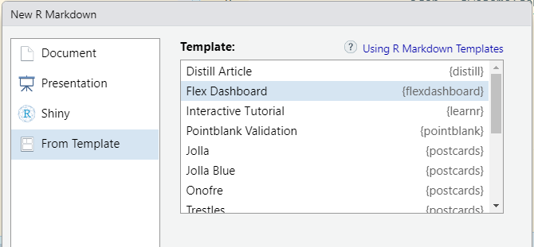
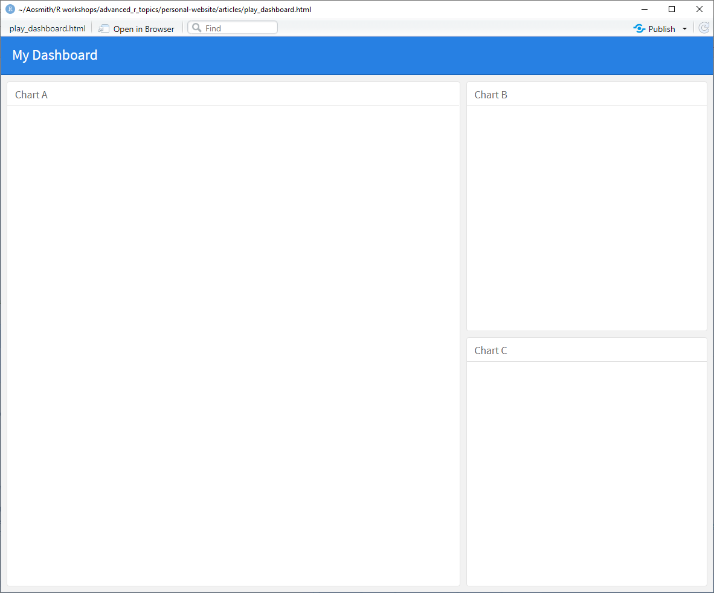
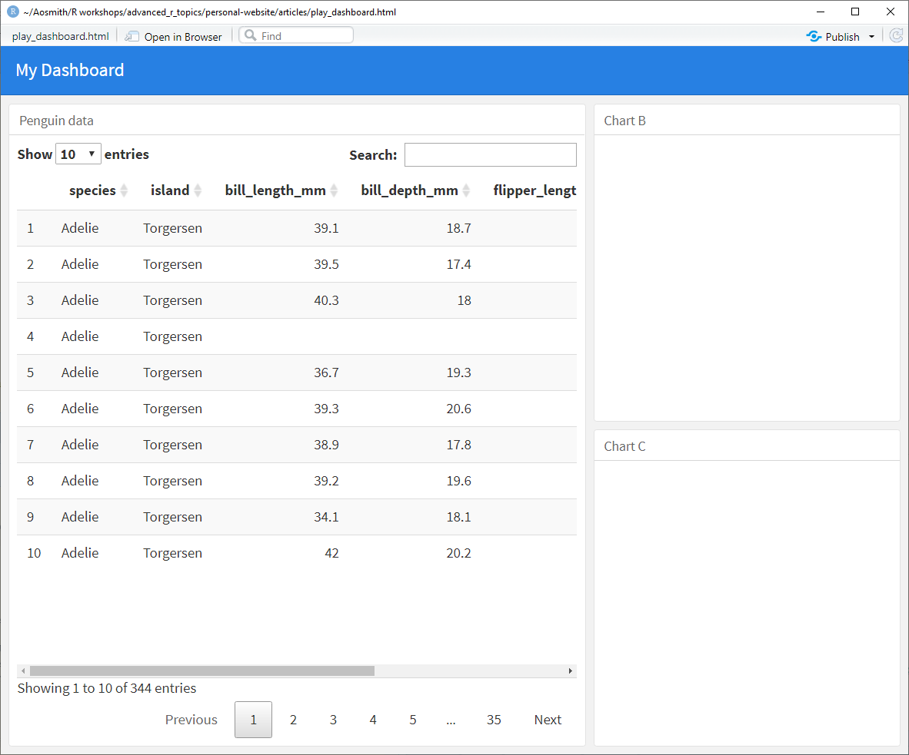
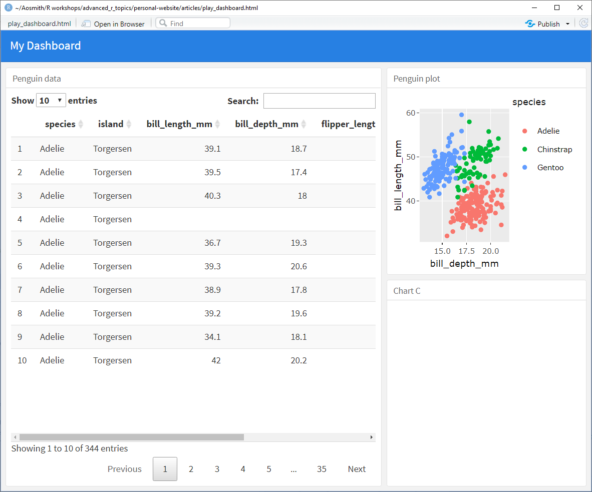
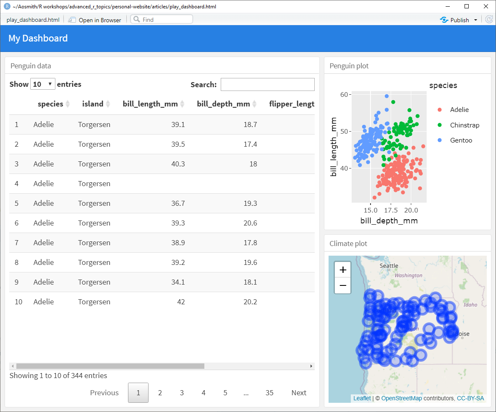

```{r setup, include = FALSE}
options(htmltools.dir.version = FALSE)
knitr::opts_chunk$set(
  fig.width=9, fig.height=3.5, fig.retina=3,
  out.width = "100%",
  cache = FALSE,
  echo = TRUE,
  message = FALSE, 
  warning = FALSE,
  fig.show = TRUE,
  hiline = TRUE
)
library(formatR)
library(widgetframe)
```

```{r xaringan-themer, include = FALSE, warning = FALSE}
library(xaringanthemer)
style_duo_accent(
  primary_color = "#1c5253",
  secondary_color = "#F4790B",
  inverse_header_color = "#FFFFFF",
  title_slide_text_color = "#FFFFFF",
  base_font_size = "22px",
  link_color = "#F4790B",
  code_highlight_color = "rgba(244, 121, 11, 0.5)"
)
```

```{r metathis, echo=FALSE}
library(metathis)
meta() %>%
    meta_name("github-repo" = "aosmith16/spring-r-topics") %>% 
    meta_social(
        title = "Interactive elements in HTML documents",
        description = "Adding interactive plots and R objects",
        url = "https://aosmith16.github.io/spring-r-topics/slides/week08_interactive_elements.html",
        image = "https://raw.githubusercontent.com/aosmith16/spring-r-topics/main/slides/week08-share-card.png",
        image_alt = paste(
            "Slides discussing a few packages for adding interactive elements to static HTML documents", 
            "Working sessions class spring 2021"
        ),
        og_type = "website",
        og_author = "Ariel Muldoon",
        twitter_card_type = "summary",
        twitter_creator = "@aosmith16"
    )
```

```{r xaringan-scribble, echo = FALSE}
xaringanExtra::use_scribble()
```

```{r xaringanExtra-clipboard, echo=FALSE}
xaringanExtra::use_clipboard()
```

```{r xaringan-tile-view, echo=FALSE}
xaringanExtra::use_tile_view()
```

```{r broadcast, echo=FALSE}
xaringanExtra::use_broadcast()
```

## Today's Goal

**Practice adding interactive elements to static HTML documents**

Today is like a tasting menu of tools. We will briefly explore  

- **plotly** to add interactivity to plots made with **ggplot2**  
- **DT** to allow for users to interact with a dataset  
- **leaflet** for interactive maps  
- **dygraph** to make interactive plots of time series data  
- Adding interactive elements from packages above to a dashboard made with **flexdashboard**  

--

<br/>
*Before we begin:*

Make sure you saved `week08_interaction.Rmd` from the class website onto your computer. We will be adding code and knitting to HTML within this file.

???

There is so much more you can do with each of these tools that this session will barely scratch the surface

---


## Resources

- [Intro to **htmlwidgets**](https://www.htmlwidgets.org/)   
- [Using **plotly** for interactive plots](https://plotly.com/r/)  
- [Interactive R data objects with **DT**](https://rstudio.github.io/DT/)    
- [Interactive maps with **leaflet**](https://rstudio.github.io/leaflet/)    
- [Charting time series data in R with **dygraphs**](https://rstudio.github.io/dygraphs/)  
- [Interactive dashboards in R with **flexdashboard**](https://rmarkdown.rstudio.com/flexdashboard/)  

.center[
```{r, echo = FALSE, out.width = "25%", fig.alt = "usethis hex logo"}

```
]

---

class: center, middle, inverse, hide-logo

# <font style="font-family: cursive; font-style:italic">Let's get started!</font>

---

## Running code

- Open the copy of [`week08_interaction.Rmd`](files/week08_interaction.Rmd) that you saved and knit it to explore the HTML output document.  

- We'll be looking at the code from different packages that I used to add interactive elements to the output.   

- Since we're just looking at a variety of packages tasting-menu style you won't be practicing writing your own code.

---

## R packages 

Load **palmerpenguins 0.2.2** and **ggplot2 1.0.5** now.

We'll be loading additional packages as we go so we are clear on which package we are using in each section.  

```{r, message = FALSE, warning = FALSE}
library(palmerpenguins) # v. 0.1.0
library(ggplot2) # v. 3.3.3
```

---

class: with-logo logo-penguins

## Penguin dataset

We will work with the Palmer penguin data while exploring the first two packages.

This dataset includes various size measurements for three penguin species on the Palmer Archipelago, as well as `sex` and measurement `year`. See `?penguins` for more information.

Here are the first 5 lines.

```{r peng, eval = FALSE}
head(penguins, n = 5)
```

```{r peng-out, echo = FALSE}
knitr::kable(head(penguins, n = 5))
```

---

class: with-logo logo-plotly

## plotly for interactive ggplot2

[Plotly](https://plotly.com/graphing-libraries/) can be used to make a wide variety of interactive charts and maps in Python, R, and JavaScript.  

In R, the **plotly** package is for building stand-alone interactive graphics or for making our static plots interactive. `r emo::ji("open_mouth")`  

--

We will use `ggplotly()` to add interactive elements to plots we made with **ggplot2**.

First, load the **plotly** package.

```{r, message = FALSE, warning = FALSE}
library(plotly) # v. 4.9.3
```

---

class: with-logo logo-plotly

## plotly for interactive ggplot2

The first step is to make a standard **ggplot2** plot. Here we make a scatterplot of `bill_length_mm` vs `bill_depth_mm` for each `species` of penguin. The plot is named `g1`.


```{r}
g1 = ggplot(data = penguins, 
            aes(x = bill_depth_mm, 
                y = bill_length_mm,
                color = species)) +
  geom_point()
```


<br/><br/><br/>
You are welcome to add code to the RMD file to print this plot if you'd like but we won't do it here. Instead let's jump to adding interactivity.


---

class: with-logo logo-plotly

## plotly for interactive ggplot2

.pull-left[
We can use `ggplotly()` to convert a plot made with **ggplot2** into an interactive **plotly** object.  

```{r plotly1, eval = FALSE}
ggplotly(g1)
```
]

--

.pull-right[
Go to the knitted HTML output from `week08_interaction.Rmd` to see what this looks. 

The table of contents on the left should help you navigate, as needed.
]

---

class: with-logo logo-plotly

## plotly for interactive ggplot2

.pull-left[
Take a few minutes to explore the interactive features, such as zooming, panning, and hovering. 

<br/>
Click on legend items to focus on one group. 

<br/>
Double click the plot or click on the "Reset axes" button to reset.
]

.pull-right[
```{r, echo = FALSE}
gp1 = ggplotly(g1)
frameWidget(gp1)
```
]

???

The selection tool seems to be most useful when you want to make interactive output (like in a shiny app) but you can link two plots together using `highlight_key()`.


---

class: with-logo logo-plotly

### Changing the hover text

A **tooltip** is generic term for the text that pops up when hovering over an interactive element. By default, `ggplotly()` includes all plotted data in the tooltip.

.pull-left[
We can change this with the `tooltip` argument in `ggplotly()`. 

<br/>
Let's get just the `y` and `x` values (in that order), leaving the `color` values out of the tooltip.
]

.pull-right[
<br/>
```{r, eval = FALSE}
ggplotly(g1, tooltip = c("y", "x"))
```
]

---

class: with-logo logo-plotly

### Changing the hover text

.pull-left[
The next plot in the HTML output doc shows the new tooltip info. 
]

.pull-right[
```{r, echo = FALSE}
gp2 = ggplotly(g1, tooltip = c("y", "x"))
frameWidget(gp2)
```
]

---

class: with-logo logo-plotly

### Linking two plots

You may have noted that you could select or *highlight* points in the scatterplot but then couldn't do anything with them.  

The select tool becomes most useful if including the plot in a larger app, but there are also some built-in tools in **plotly** where selection is useful. This makes use of package **crosstalk** under the hood.

--

<br/><br/>
We start by using `highlight_key()` on the dataset we are plotting.

```{r}
peng2 = highlight_key(penguins)
```

---

class: with-logo logo-plotly

### Linking two plots

.pull-left[
Then we'll make two **ggplot2** plots based on this highlighted dataset `peng2`. 

<br/>
The first is the same scatterplot we used before without the species info and the second is `flipper_length_mm` vs `body_mass_g`.
]

.pull-right[
```{r}
g2 = ggplot(data = peng2, 
            aes(x = bill_depth_mm, 
                y = bill_length_mm)) +
  geom_point()
```

```{r}
g3 = ggplot(data = peng2,
            aes(x = body_mass_g, 
                y = flipper_length_mm)) +
  geom_point()
```
]

---

class: with-logo logo-plotly

### Linking two plots

.pull-left[
Now we link the plots together using the `subplot()` function and use the `highlight()` function to allow selection across the two now-linked plots. 
]

.pull-left[
```{r, eval = FALSE}
g2 %>%
  subplot(g3) %>%
  highlight(on = "plotly_selected",
            off = "plotly_deselect")
```
]

---

class: with-logo logo-plotly

### Linking two plots

.pull-left[
When we select points in the first, the same points are selected in the second. This allows the user to explore more variables at one time.

<br/>
I found things were a little more awkward for plots with legends. It helps to remove the legend is removed from one of the plots using `plotly::style()`.
]

.pull-right[
```{r, echo = FALSE}
gp3 = g2 %>%
  subplot(g3) %>%
  highlight(on = "plotly_selected",
            off = "plotly_deselect")
frameWidget(gp3)
```
]

---

## DT for interactive data

The [**DT** package](https://rstudio.github.io/DT/) allows us to display R data objects such as data.frames as interactive tables of data in HTML outputs.

For example, it provides the user the ability to filter and sort the data in the output table.  

--

Start by loading package **DT**.

```{r, message = FALSE, warning = FALSE}
library(DT) # v. 0.18
```

---

## DT for interactive data

.pull-left[
The `datatable()` function creates the interactive output.

Much of the time using `datatable()` directly will be sufficient for the interactivity we want.
]

.pull-right[
The simple code below is a good start for exploring the default output from `datatable()`.

```{r, eval = FALSE}
datatable(penguins)
```
]

---
## DT for interactive data

.pull-left[
Take a few minutes and explore the interactive output table in the HTML document.

<br/>
The results are *paginated*, defaulting to showing 10 rows per page. Click on a page to move through more rows. Change the number of rows showing with the drop-down menu.

<br/>
You can sort by columns and filter to values using the overall search box.
]

.pull-right[
<br/>
```{r, echo = FALSE}
dt1 = datatable(penguins,
                extensions = list('FixedColumns',
                                  'Scroller'),
                options = list(
                  deferRender = TRUE,
                  scrollY = 200,
                  scroller = TRUE,
                  fixedColumns = TRUE))
frameWidget(dt1)
```
]

---

### Change table options

There are so many options you can change via the `options` argument that they have their own [own article on the **DT** website](https://rstudio.github.io/DT/options.html).

.pull-left[
<br/>
Here we change the default page length to 5 and the numbers in the drop down menu of page lengths to 5, 7, or 10.
]

.pull-right[
<br/>
.smaller[
```{r, eval = FALSE}
datatable(penguins,
          options = list(pageLength = 5, #<<
                         lengthMenu = c(5, 7, 10))) #<<
```
]
]

---

### Change table options

.pull-left[
The table now shows fewer rows on each page by default.

We also now have only the three options for how many rows to show at one time under `Show`.
]

.pull-right[
```{r, echo = FALSE}
dt3 = datatable(penguins,
                extensions = list('FixedColumns',
                                  'Scroller'),
                options = list(
                  deferRender = TRUE,
                  scrollY = 200,
                  scroller = TRUE,
                  fixedColumns = TRUE,
                  pageLength = 5,
                  lengthMenu = c(5, 7, 10)))
frameWidget(dt3)
```
]

---

### Add column filters


We can generate filters for each column in addition to the overall `Search` by adding the `filter` argument. We'll place these at the `top` of the table.

```{r}
datatable(penguins,
          filter = "top", #<<
          options = list(autoWidth = TRUE,
                         columnDefs = list(list(width = '80px', targets = "_all"))))
```

In some cases columns are too narrow for the categorical variable filter boxes. Here I widen them in `options` following [this Stack Overflow post](https://stackoverflow.com/a/31814197/2461552).


???

Other options are none (default) and bottom

---

### Add column filters

.pull-left[
Now you can filter by specific columns. 

Numeric columns get range sliders and character columns get select drop-down menus.
]

.pull-right[
```{r, echo = FALSE}
dt2 = datatable(penguins,
                filter = "top",
                extensions = list('Scroller'),
                options = list(
                  # deferRender = TRUE,
                  # scrollY = 200,
                  scroller = TRUE,
                  autoWidth = TRUE,
                  columnDefs = list(list(width = '200px', targets = "_all"))) )
frameWidget(dt2)
```
]

---

class: with-logo logo-leaflet

## leaflet for interactive maps

The [**leaflet** package](https://rstudio.github.io/leaflet/) is popular for making interactive maps.

The package can render spatial objects created from **sf** or **sp** but also works with data.frames that contain latitude/longitude columns or by centering on a specific latitude/longitude.  

--

Start by loading package **leaflet**.

```{r}
library(leaflet) # v. 2.0.4.1
```

---

class: with-logo logo-leaflet

### Center map with `setView()` 

We'll start with a map centered on Corvallis.  Note the pipe code; this is the common coding style for **leaflet**.


.pull-left[
We center the output  map by providing a latitude and longitude, setting the amount of space around the center with the `zoom` argument in `setView()`.

<br/>
The `addTiles()` layer is key here. This function is how we add maps. By default `OpenStreetMap` tiles are used but others can be used via `addProviderTiles()`.

]

.pull-right[
```{r, eval = FALSE}
leaflet() %>% 
    setView(lng = -123.2620, #<<
            lat = 44.5646, #<<
            zoom = 12) %>% #<<
    addTiles() #<<
```
]

---

class: with-logo logo-leaflet

### Center map with `setView()` 

.pull-left[
Take a a minute and explore the output map in the HTML document.

You can pan and zoom around the resulting map.
]

.pull-right[
<br/>
```{r, echo = FALSE}
lf1 = leaflet() %>% 
    setView(lng = -123.2620, lat = 44.5646, zoom = 12) %>%
    addTiles()
frameWidget(lf1)
```
]

---

class: with-logo logo-leaflet

### Add a single marker

**Markers** are added to maps to note places of interest. In interactive maps these markers are often associated with hover or click information.

.pull-left[
Let's add a marker to indicate where OSU is in Corvallis.

<br/>
Here we use `addAwesomeMarkers()` to add an icon as the marker. We must provide the latitude/longitude for marker placement. 

<br/>
The `popup` argument allows information that will pop up when the marker is clicked on, in this case identifying what is at that location.
]

.pull-right[
.smaller[
```{r, eval = FALSE}
leaflet() %>% 
    setView(lng = -123.2620, 
            lat = 44.5646, 
            zoom = 12) %>%
    addTiles() %>%
    addAwesomeMarkers(lng = -123.2794, lat = 44.5638, #<<
                      icon = awesomeIcons(), #<<
                      popup = "Oregon State University") #<<
```
]
]

---

class: with-logo logo-leaflet

### Add a single marker

.pull-left[
Explore the new map output.

Click on the icon to see the pop up information.
]

.pull-right[
```{r, echo = FALSE}
lf2 = leaflet() %>% 
    setView(lng = -123.2620, lat = 44.5646, zoom = 12) %>%
    addTiles() %>%
    addAwesomeMarkers(lng = -123.2794, lat = 44.5638, 
                      icon = awesomeIcons(), 
                      popup = "Oregon State University")
frameWidget(lf2)
```
]

---

class: with-logo logo-leaflet

### Mapping spatial data

Now let's switch to plotting some spatial data from a data.frame.

We'll work with annual temperature and precipitation data from climate stations throughout the state of Oregon taken from the [UO GEOG 4/595 website](https://pjbartlein.github.io/GeogDataAnalysis/datasets.html).

Note the `lat` and `lon` columns, which are key for mapping with **leaflet**.

```{r, eval = FALSE}
orstationc = read.csv("https://pjbartlein.github.io/GeogDataAnalysis/data/csv/orstationc.csv")
head(orstationc)
```

.center[
```{r, echo = FALSE}
orstationc = read.csv("https://pjbartlein.github.io/GeogDataAnalysis/data/csv/orstationc.csv")
knitr::kable(head(orstationc))
```
]

???

Have jan and july temps and precip. We'll look at july temperature.

---

class: with-logo logo-leaflet

### Mapping spatial data

.pull-left[
Note the `data` argument added in `leaflet()`. **leaflet** automatically finds lat/long columns if named something recognizable (e.g., `lng`, `long`, `lat`, `latitude`).

<br/>
Although we `addTiles()` first, the map extent is not set until we add the markers, based on lat/long.

<br/>
We add the climate station locations as circles with `addCircleMarkers()`. The `label` argument adds tooltip info from variables in the dataset; here, average July temperature.
]

.pull-right[
<br/>
```{r, eval = FALSE}
leaflet(data = orstationc) %>% #<<
    addTiles() %>%
    addCircleMarkers(label = ~tjul) #<<
```

<br/>
**Note:** There are `lng` and `lat` arguments in `addCircleMarkers()`. There are needed if the column names of the lat/long columns aren't recognizable to `leaflet()` in the dataset.
]

???

Not showing writing out lat and lng arguments because it seems fairly standard to leave them out and let leaflet guess when lat/long named appropriately (which is likely usual for spatial data)

---

class: with-logo logo-leaflet

### Mapping spatial data

.pull-left[
Explore the map output.

The map extent is based on the climate station locations, shown as circles.

The average July temperature of each station pops up when you hover over each point.
]

.pull-right[
<br/>
```{r, echo = FALSE}
lf3 = leaflet(data = orstationc) %>% #<<
    addTiles() %>%
    addCircleMarkers(label = ~tjul)
frameWidget(lf3)
```
]

---

class: with-logo logo-leaflet

### Adding color scale to markers

We can color markers based on the dataset as long as we define a palette.

.pull-left[
We'll color the markers based on the July temperature. We use the Yellow-Orange-Red `RColorBrewer` palette in `colorQuantile()`.

<br/>
The `color` argument is mapped in `addCircleMarkers()`, wrapped in the `pal()` we made. 

We also add a second tooltip to show the name of the climate station when a marker is clicked using `popup`.
]

.pull-right[
```{r, eval = FALSE}
pal = colorQuantile(palette = "YlOrRd", #<<
                    domain = NULL, #<<
                    n = 8) #<<
```

<br/>
```{r, eval = FALSE}
leaflet(data = orstationc) %>% 
    addTiles() %>%
    addCircleMarkers(color = ~pal(tjul), #<<
                     label = ~tjul,
                     popup = ~Name) #<<
```
]

???

I'm not getting into the colorQuantile() code too much here. This is mostly a quick demonstration

---

class: with-logo logo-leaflet

### Adding color scale to markers

.pull-left[
Explore the new map output.

Now the circles are colored based on the average July temperature.

You can hover to get to see the temperature or click to see the climate station name.
]

.pull-right[
<br/>
```{r, echo = FALSE}
pal = colorQuantile(palette = "YlOrRd", domain = NULL, n = 8) #<<
lf4 = leaflet(data = orstationc) %>% 
    addTiles() %>%
    addCircleMarkers(color = ~pal(tjul), #<<
                     label = ~tjul,
                     popup = ~Name) #<<
frameWidget(lf4)
```
]

---

## dygraphs for interactive time series

The [**dygraphs** package](https://rstudio.github.io/dygraphs/index.html) is for plotting interactive time series data.

It is specifically for **xts** time series objects or any object that is convertible to an **xts** object.

--

Start by loading package **dygraphs**.

```{r, message = FALSE, warning = FALSE}
library(dygraphs) # v. 1.1.1.6
```

---

### Basic time series

We'll use the time series that come with **dygraphs** to look at a few plots.

.pull-left[
The `dygraph()` function is the primary function for making the plots.

First up is a plot of New Haven temperatures through time, using `nhtemp`.

Add a title with `main`.
]

.pull-right[
```{r, eval = FALSE}
dygraph(data = nhtemp, 
         main = "Temperatures in New Haven")
```
]

---

### Basic time series

.pull-left[
Explore the output plot in the HTML document.

Hovering over the plot shows the time as well as the data in the line.

You can zoom into part of the time series by selecting an area.

Double-click the plot to zoom back out.
]

.pull-right[
```{r, echo = FALSE}
dy1 = dygraph(data = nhtemp, 
         main = "Temperatures New Haven")
frameWidget(dy1)
```
]

---

### Add range selector

.pull-left[
Add a range selector to the bottom of the plot for panning and zooming via `dyRangeSelector()`.

Note the use of the pipe.
]

.pull-right[
```{r, eval = FALSE}
dygraph(data = nhtemp, 
        main = "Temperatures New Haven") %>%
    dyRangeSelector()
```

While we won't explore it here, you can change, e.g., the size, color, and date window within `dyRangeSelector()`.
]

---
### Add range selector

.pull-left[
Explore the range selector in the next plot in the HTML document.
]

.pull-right[
```{r, echo = FALSE}
dy2 = dygraph(data = nhtemp, 
         main = "Temperatures in New Haven") %>%
    dyRangeSelector()
frameWidget(dy2)
```
]

---

### Multiple time series

You can plot multiple time series in a single plot if you have multiple column of time series data in a single time series object.

.pull-left[
We'll see male and female deaths from lung disease in the UK from 1974-1979 from **dygraphs** for this example.

The first step is to bind the two separate time series together into one with `cbind()`.

Then the two time series can be plot together with `dygraphs()`.  Change the names of the series to something more useful using `dySeries()`.
]

.pull-right[
```{r}
lungDeaths = cbind(mdeaths, fdeaths)
```

```{r, eval = FALSE}
dygraph(data = lungDeaths) %>%
    dySeries(name = "mdeaths", 
             label = "Male",
             color = "purple") %>%
    dySeries(name = "fdeaths", 
             label = "Female",
             color = "orange")
```

**Note:** Colors can also be changed to an overall color palette by adding a `dyOptions()` layer (*not shown*)
]

---

### Multiple time series

.pull-left[
The tooltip shows data from both time series at once.

The labels we created are shown in the tooltip.
]

.pull-right[

```{r, echo = FALSE}
dy3 = dygraph(data = lungDeaths) %>%
    dySeries(name = "mdeaths", 
             label = "Male",
             color = "purple") %>%
    dySeries(name = "fdeaths", 
             label = "Female",
             color = "orange")
frameWidget(dy3)
```
]

---

class: with-logo logo-flex

## Build an interactive dashboard

We'll end the day by making a dashboard with interactive elements using [package **flexdashboard**](https://rmarkdown.rstudio.com/flexdashboard/).

A **flexdashboard** is a specialized R Markdown template that allows for basic dashboard layouts. The output is an HTML document.

--

Create a new **flexdashboard** document.

Go to `File > New File > R Markdown...`

Click `From Template` and then choose `Flex Dashboard`. Click `OK` to create.

.center[
```{r, echo = FALSE, out.width = "65%", fig.alt = "Image that shows choosing the flex dashboard from the template windown when making a new R Markdown document"}

```
]

???

HTML output is the key here

---

class: with-logo logo-flex

## Build an interactive dashboard

There are a variety of dashboard layouts. The default is called a `fill` layout, and has room for three charts. One large left is on the left and two smaller charts are on the left. We'll proceed with this layout, adding code to make the dashboard.

--

Give your dashboard a title in the YAML header and then save it as a `.Rmd` document somewhere on your computer.  I called mine `My Dashboard`.

```{r, eval = FALSE}
---
title: "My Dashboard"
output: 
  flexdashboard::flex_dashboard:
    orientation: columns
    vertical_layout: fill
---
```

---

class: with-logo logo-flex

## Build an interactive dashboard

Knit the dashboard to see the basic layout, before adding any content.

.pull-right[
```{r, echo = FALSE, fig.alt = "Image of the initial dashboard, after naming it 'My Dashboard' but before adding any content"}

```
]

---

class: with-logo logo-flex

## Build an interactive dashboard

Add the packages you are using in the document into the setup chunk. It currently loads only **flexdashboard**.  We'll add **ggplot2**, **palmerpenguins**, **plotly**, **DT**, and **leaflet**.

This is what your chunk will look like after adding these.

    `r ''````{r setup, include=FALSE}
    library(flexdashboard)
    library(ggplot2)
    library(palmerpenguins)
    library(plotly)
    library(DT)
    library(leaflet)
    `r ''````

---

class: with-logo logo-flex

## Build an interactive dashboard

.pull-left[
Rename  
`### Chart A`  
as  
`### Penguin data`.

Then put a `datatable()` of the penguins dataset in the code chunk in the first section.

```{r, eval = FALSE}
datatable(penguins)
```

<br/>
Knit to see dashboard. Note code is suppressed in the dashboard by default.
]

--

.pull-right[
```{r, echo = FALSE, fig.alt = "Image of the dashboard with interactive data in the first window"}

```
]

---

class: with-logo logo-flex

## Build an interactive dashboard

.pull-left[
Now rename  
`### Chart B`  
as  
`### Penguin plot`.

Then add the following **ggplot2** and **plotly** code, which we used earlier.

```{r, eval = FALSE}
g1 = ggplot(data = penguins, 
            aes(x = bill_depth_mm, 
                y = bill_length_mm,
                color = species)) +
  geom_point()
ggplotly(g1)
```

Knit to see dashboard.
]

--

.pull-right[
```{r, echo = FALSE, fig.alt = "Image of the dashboard with interactive plot in the second window"}

```
]

???

You may need to maximize the dashboard to see the plot well.

---

class: with-logo logo-flex

## Build an interactive dashboard

.pull-left[
Finally rename  
`### Chart C`  
as  
`### Climate plot`.

Then add the following **leaflet** code, which we used earlier.

```{r, eval = FALSE}
orstationc = read.csv("https://pjbartlein.github.io/GeogDataAnalysis/data/csv/orstationc.csv")
leaflet(data = orstationc) %>% 
    addTiles() %>%
    addCircleMarkers(label = ~tjul)
```

Knit to see dashboard.
]

--

.pull-right[
```{r, echo = FALSE, fig.alt = "Image of the dashboard with interactive plot in the third window"}

```
]

---

class: with-logo logo-flex

## Sharing your dashboard

.pull-left[
Since the dashboard is a simple HTML document, anyone will be able to view it in the browser. 

<br/>
While you could send it out individually, you could also host it as a page on your website.

<br/>
Alternatively you can send people to a version on GitHub after making a small change to the default link to get a rendered document.
]

.pull-right[
<blockquote class="twitter-tweet" data-lang="en"><p lang="en" dir="ltr">Host HTML on GitHub</p>&mdash; Grant McDermott (@grant_mcdermott) <a href="https://twitter.com/grant_mcdermott/status/1366597702339891202">Tweet March 01, 2021</a></blockquote>
<script async src="//platform.twitter.com/widgets.js" charset="utf-8"></script>
]

---

## Next week

- We'll make animated graphics with package **gganimate**

.center[
```{r gt, echo = FALSE, out.width = "15%", fig.alt = "Logo for package gganimate"}
knitr::include_graphics("figs/gganimate.png")
```
]

.footnote[
[Code for slides](https://github.com/aosmith16/spring-r-topics/tree/main/docs/slides)  
Slides created via the R packages:  
[**xaringan**](https://github.com/yihui/xaringan), 
[gadenbuie/xaringanthemer](https://github.com/gadenbuie/xaringanthemer), 
[gadenbuie/xaringanExtra](https://github.com/gadenbuie/xaringanExtra) 
.center[*This work is licensed under the Creative Commons Attribution-NonCommercial 4.0 International License. 
To view a copy of this license, visit http://creativecommons.org/licenses/by-nc/4.0/.*]
]