```{r setup, include = FALSE}
options(htmltools.dir.version = FALSE)
knitr::opts_chunk$set(
  fig.width=9, fig.height=3.5, fig.retina=3,
  out.width = "100%",
  cache = FALSE,
  echo = TRUE,
  message = FALSE, 
  warning = FALSE,
  fig.show = TRUE,
  hiline = TRUE
)
library(formatR)
```

```{r xaringan-themer, include = FALSE, warning = FALSE}
library(xaringanthemer)
style_duo_accent(
  primary_color = "#1c5253",
  secondary_color = "#F4790B",
  inverse_header_color = "#FFFFFF",
  title_slide_text_color = "#FFFFFF",
  base_font_size = "22px",
  link_color = "#F4790B",
  code_highlight_color = "rgba(244, 121, 11, 0.5)"
)
```

```{r metathis, echo=FALSE}
library(metathis)
meta() %>%
    meta_name("github-repo" = "aosmith16/spring-r-topics") %>% 
    meta_social(
        title = "GitHub issues guide",
        description = "Overview of etiquette for reporting a GitHub issue",
        url = "https://aosmith16.github.io/spring-r-topics/slides/week10_issues.html",
        image = "https://raw.githubusercontent.com/aosmith16/spring-r-topics/main/slides/week10-share-card.png",
        image_alt = paste(
            "Slides on the topic of GitHub issues", 
            "Working sessions class spring 2021"
        ),
        og_type = "website",
        og_author = "Ariel Muldoon",
        twitter_card_type = "summary",
        twitter_creator = "@aosmith16"
    )
```

```{r xaringan-scribble, echo = FALSE}
xaringanExtra::use_scribble()
```

```{r xaringanExtra-clipboard, echo=FALSE}
xaringanExtra::use_clipboard()
```

```{r xaringan-tile-view, echo=FALSE}
xaringanExtra::use_tile_view()
```

```{r broadcast, echo=FALSE}
xaringanExtra::use_broadcast()
```

class: center, middle, title-slide

# GitHub issues guide

```{r, echo = FALSE, out.width = "25%", fig.alt = "GitHub octocat logo"}
knitr::include_graphics("https://github.githubassets.com/images/modules/logos_page/Octocat.png
")
```

### Ariel Muldoon

### June 01, 2021

---

## Today's Goal

**Learn the process and etiquette for reporting issues on GitHub `r fontawesome::fa("github")` repositories **   

Using **reprex** skills learned last week, we will go through the process of making a GitHub issue.

.center[
<br/>
```{r, echo = FALSE, out.width = "25%", fig.alt = "Logo for package reprex"}
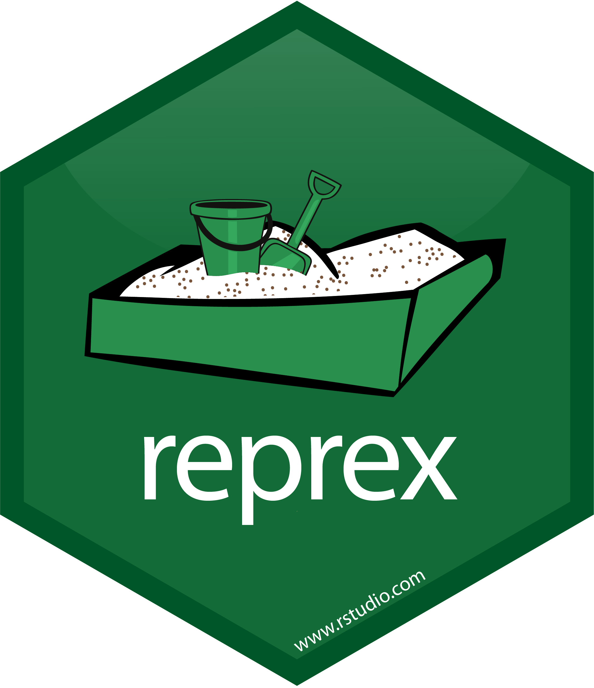
```
]

---

## Resources

- See Yihui Xie's [GitHub issue guide](https://yihui.org/issue/). This guide is specific to repositories he maintains but contains good general advice for approaching the GitHub issue process.   

---

## GitHub `r icons::fontawesome("github")` issues

The **Issues** section on GitHub is where you can report possible bugs or make feature requests to a repository. An active issues section is common for R package repos but can also be used for, e.g., keeping track of tasks you want to finish in an analysis repo.

You can find all past issues in a repository under **Issues**, the second menu on the top navigation bar on GitHub.

.center[
```{r, echo = FALSE, fig.alt = "Screen capture showing the issues menu on the top menu bar in aosmith16/practice-repo GitHub repository"}
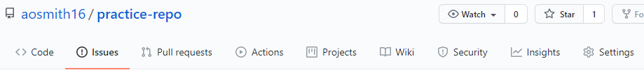
```
]

---

## GitHub `r icons::fontawesome("github")` issues

Take a few minutes to explore the issues section on the **ggplot2** repository:
https://github.com/tidyverse/ggplot2/issues

.center[
<br/>
```{r, echo = FALSE, fig.alt = "Screen capture of the issues section for the ggplot2 GitHub repository, taken in late April 2021. It shows just the top of the issues section to demonstarte the open and closed issues panes and the search bar at the top"}
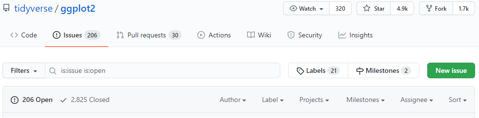
```
]

???

The screenshot is from late April 2021

---

## GitHub `r icons::fontawesome("github")` issues

Things to note:
- There is a search bar just below the navigation menus. This allows you to search within reported issues to, e.g., check if someone already reported an issue you are having
- There are separate pages for open and closed issues
- You can sort issues using the `Sort` drop-down menu on the far right of the **Issues** page header. I sometimes look at recently updated issues rather than newest
- You can create an issue by clicking on the green "New issue" button on the upper right

.center[
```{r, echo = FALSE, fig.alt = "Screen capture of the issues section for the ggplot2 GitHub repository, taken in late April 2021. It shows just the top of the issues section to demonstarte the open and closed issues panes and the search bar at the top"}

```
]

---

## GitHub `r icons::fontawesome("github")` issues 

**I think I found a bug `r emo::ji("beetle")` in an R package; should I report it?**

--

<br/>
Absolutely!

Reporting bugs is a way to help a package maintainer improve the package, which ultimately helps everyone who uses the package. `r emo::ji("raised_hands")` This is one way to participate in and give back to an open source programming language like R.

???

I hear this sort of question from students and others, who aren't sure if they should report a bug since it feels like you are being critical of the package

--

<br/>
It can feel scary to report an issue `r emo::ji("fearful")`, I think particularly for those of us who feel like non-R experts. 

To ease the process, we'll spend much of today's session going over some of the etiquette to follow when reporting an issue. 

???

I have occasionally reported bugs for students who found issues in packages. I hope this ultimately leads them to see the process so they will feel empowered to report issues in the future.

---

## GitHub `r icons::fontawesome("github")` issues etiquette

**Report bugs and request features**

The issues section on GitHub is for reporting potential bugs `r emo::ji("beetle")` and requesting features. It is not for asking general questions about how the package works.

--

<br/>
If you have a question, ask on help forums such as [Stack Overflow](https://stackoverflow.com/questions/tagged/r) and the [RStudio Community](https://community.rstudio.com/).  

It may turn out that your question was due to a bug. In that case, go to the relevant GitHub repo and report it. `r emo::ji("smile")`

???

Already mentioned Yihui Xie's guide to etiquette on his repositories is a good place to start: https://yihui.org/issue/.

---

## GitHub `r icons::fontawesome("github")` issues etiquette

**Do your research**

- Make sure you are using the most current released version of the package 

???

I'm thinking CRAN here, although the development version is also fair game.

---

## GitHub `r icons::fontawesome("github")` issues etiquette

**Do your research**

- Make sure you are using the most current released version of the package 
- Before opening a new issue, check that no one else has reported it by searching both open and closed issues using the search tool in the **Issues** menu

.center[
```{r, echo = FALSE, fig.alt = "Screen capture of the issues section for the ggplot2 GitHub repository"}

```
]

---

## GitHub `r icons::fontawesome("github")` issues etiquette

**Do your research**

- Make sure you are using the most current released version of the package 
- Before opening a new issue, check that no one else has reported it by searching both open and closed issues using the search tool in the **Issues** menu
- Go through the `NEWS` to check for any recent changes. This is usually on the first page of the repo and may be called `NEWS.md`.  
    <br/>You may also want to install the *development version* of the package directly from GitHub to see if the issue persists in the most up-to-date version  of the package

.center[
```{r, echo = FALSE, fig.alt = "Screen capture showing where to check for changes in NEWS.md on the ggplot2 GitHub repository"}
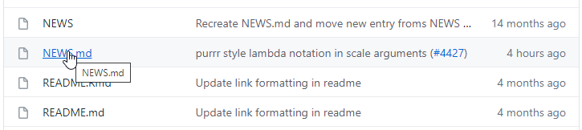
```
]

???

I'm showing the NEW.md file from the ggplot2 repo

Some changes could have changed the way a package works, so checking the NEWS is useful for that and to check what has changed in the development version of the package

---

## GitHub `r icons::fontawesome("github")` issues etiquette

**Do your research**

- Make sure you are using the most current released version of the package 
- Before opening a new issue, check that no one else has reported it by searching both open and closed issues using the search tool in the **Issues** menu
- Go through the `NEWS` to check for any recent changes. This is usually on the first page of the repo and may be called `NEWS.md`.  
    <br/>You may also want to install the *development version* of the package directly from GitHub to see if the issue persists in the most up-to-date version  of the package
- If you feel unsure that what you found is really a bug, ask someone else to review your minimal reproducible example. This may be on one of the aforementioned forums

---

## GitHub `r icons::fontawesome("github")` issues etiquette

**Follow all repository instructions**

Some repositories will give specific instructions on what you need to provide when opening an issue. 

.pull-left[
For example, if you open a **ggplot2** issue you will see a set of instructions. Make sure you read them and then do as they instruct.
]

.pull-right[
```{r, echo = FALSE, fig.alt = "Screen capture showing where to check for changes in NEWS.md on the ggplot2 GitHub repository"}
knitr::include_graphics("figs/week10_files/ggplot2_instr.png")
```
]

???

Notice that this repo asks for session info only if requested or you can hide it using **reprex** collapsible session info with `session_info = TRUE`.

Similarly, make sure you read Yihiu Xie's issue guide if opening issue on a repo he maintains. Most of his also have instructions included when opening the issue.

---

## GitHub `r icons::fontawesome("github")` issues etiquette

**Be kind and respectful**

It seems like this would go without saying, but I've seen issues with an accusatory tone when something that used to work no longer does.

You may decide to offer up appreciation (if instructions allow for it `r emo::ji("grin")`) but at the very least use a respectful tone while you efficiently outline the potential problem. 

<blockquote class="twitter-tweet tw-align-center" data-lang="en"><p lang="en" dir="ltr">Issues can feel oppressive to maintainers since they are mainly negative feedback</p>&mdash; Jim Hester (@jimhester_) <a href='https://twitter.com/jimhester%5F/status/1357680037470875649'>Tweet February 5, 2021</a></blockquote>
<script async src="//platform.twitter.com/widgets.js" charset="utf-8"></script>

???

Discussion of tweet: Issues are usually bug reports, which can feel really negative when that's the main feedback you get. Think about how the maintainer might feel when they see your report and try to set the tone accordingly.

---

class: with-logo logo-reprex

## GitHub `r icons::fontawesome("github")` issues etiquette

**Provide a minimal reproducible example**

The simpler the example you can give, the easier it is for the maintainer to understand the problem. 

When relevant you should provide very basic example code with output that demonstrates the problem. The maintainer should be able to copy, paste, and run the code with no other steps needed.

Ideally the maintainer may not even need to run the code to understand the issue.

This is great use-case for package **reprex**.  

???

There are times when an issue doesn't need code, but those are rare

---

## GitHub `r icons::fontawesome("github")` issues etiquette

**Be patient**

You likely will not get an immediate response. Package maintainers are busy people and getting to issues takes time.

If you have a potential fix for an issue, you might consider making a pull request. 

---

## GitHub `r icons::fontawesome("github")` issues etiquette

**Be responsive if more information requested**

The repo maintainer may ask you for more background on the issue or feature request. Be sure to be paying enough attention that you can get back to them.

I've seen issues closed because the original poster never returned with follow up information.

---

## GitHub `r icons::fontawesome("github")` issues etiquette

Let's put these guidelines all in one slide.

- **Report bugs and request features**
- **Do your research**
- **Follow all repository instructions**
- **Be kind and respectful**
- **Provide a minimal reproducible example**
- **Be patient**
- **Be responsive if more information requested**

---

## GitHub `r icons::fontawesome("github")` issues etiquette

Before we finish up this section, there are just a couple of other things I want to mention.

First, if relevant, include an example of the result you expected vs the result you got. Showing the expected output is clearer than trying to describe the expected output.

--

Second, you may have found out important information in the **Do your research** stage that you should report to the repo maintainer.  

For example, if you found out when the change occurred, where in the source code the issue may be coming from, what used to happen, etc., you can include that information in your report.

???

Showing what you expected is easier than trying to describe what you expected

---

## Issue examples

I went and found a couple of old issues I put in for package **tidyr** for us to look at.

The first one was a [feature request](https://github.com/tidyverse/tidyr/issues/387) 

Navigate to this now-closed issue and take a look at it.

???

Students should navigate to the issue

--

A few things to note:
- I initially didn't give enough background and so had to come back with more information
- There was a delay before the maintainer was able to think about this 
- You can "react" to posts within GitHub issues. Adding positive emoji reactions is one way to show appreciation. You can see such reactions on the very last post in the thread

.center[
<br/>
```{r, echo = FALSE, out.width = "30%", fig.alt = "Screen capture showing how one can add reactions to posts in github issues. Here there are two `tada` reactions on the last post in the issue we are exploring"}
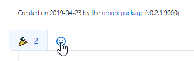
```
]

---

## Issue examples

The second was a [bug report](https://github.com/tidyverse/tidyr/issues/324) `r emo::ji("beetle")`

Navigate to this now-closed issue and take a look at it.

--

<br/>
Here:
- I did a better job of showing a really minimal example to demonstrate the problem
- I included the kind of output I was expecting to get
- The maintainer already had an idea of what was going on so could quickly close the issue

---

## Practice issue

Let's finish today by taking with we learned about using package **reprex** last week and practice creating a GitHub issue.

--

<br/>
You will practice opening an issue on my `practice-repo` repository: https://github.com/aosmith16/practice-repo

Go to that repo, navigate to the **Issues** section, and click on the green "New Issue" button.

---

## Practice issue

Fill in a title for your issue. In a real issue this title should be succinct but descriptive.

.center[
<br/>
```{r, echo = FALSE, out.width = "70%", fig.alt = "Screen capture adding the title `Reporting a problem with something in this repo' to the practice issue on the aosmith16/practice-repo repo"}
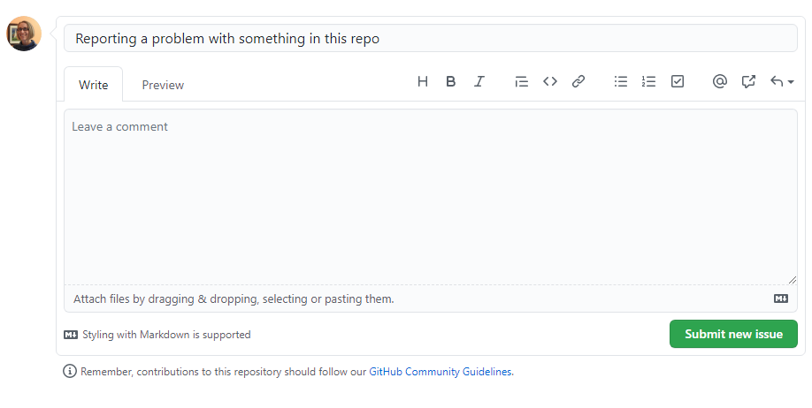
```
]

???

Sometimes titles get a little long because it's hard to figure out how to describe things

---

## Practice issue

Then describe the issue in the `Write` tab, which shows by default. Text in GitHub issues is written using Markdown syntax.

.center[
<br/>
```{r, echo = FALSE, , out.width = "70%", fig.alt = "Screen capture adding a written description of the problem into the main text box of the issue. This text is simple filler since this is a practice issue."}
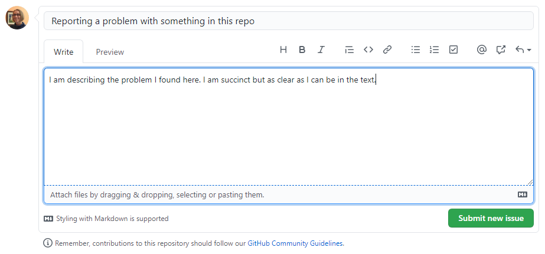
```
]

---

## Practice issue

Add some code and output via **reprex**. 

The two code examples from last week's session are below for you to run in R and the paste the output that **reprex** places on your clipboard into your issue. Feel free to write and run your own **reprex** code, as well. `r emo::ji("slightly_smiling_face")`

.pull-left[
.smaller[
```{r, eval = FALSE}
reprex::reprex({
    library(ggplot2)
    
ggplot(data = mtcars[2:3,], aes(x = factor(gear), y = mpg)) +
    geom_point(aes(color = factor(vs)), 
               position = position_dodge(width = .5),
               size = 2) +
    geom_errorbar(aes(ymin = mpg - 1, ymax = mpg + 1),
                  position = position_dodge(width = .5),
                  width = .2)
})
```
]
]

.pull-right[
```{r, eval = FALSE}
reprex::reprex(session_info = TRUE, {
    #+ message = FALSE, warning = FALSE
    library(dplyr)
    library(plyr)
    
    mtcars %>%
        group_by(cyl) %>%
        summarise(mpg = mean(mpg))
})
```
]

???

Students may need some reminder instruction that **reprex** will automatically put code and output on clipboard for pasting

---

## Practice issue

.pull-left[
Here's what the text in the `Write` tab looks like after pasting the output of my **reprex**.
]

.pull-right[
```{r, echo = FALSE, fig.alt = "Screen capture showing what the main text box in the 'Write` tab of an issue looks like after pasting in output from package reprex. The main text box is not rendered, so everything is in plain text using Markdown syntax."}
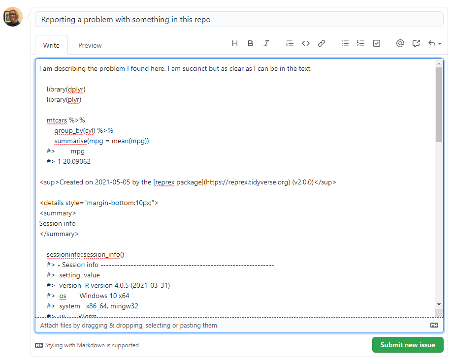
```
]

---

## Practice issue

.pull-left[
Click on the `Preview` tab to see the rendered text, code and output. 

You will always want to check that the rendered version of text and code looks right.

<br/>
Code and output should be correctly formatted. If writing code directly instead of pasting from **reprex** you can wrap the code in sets of 3 backticks to format: 

````
```
library(dplyr)
```
````
]

.pull-right[
```{r, echo = FALSE, fig.alt = "Screen capture showing the Preview tab of the code and output pasted from package reprex. The preview pane shows the rendered version of all text and code."}
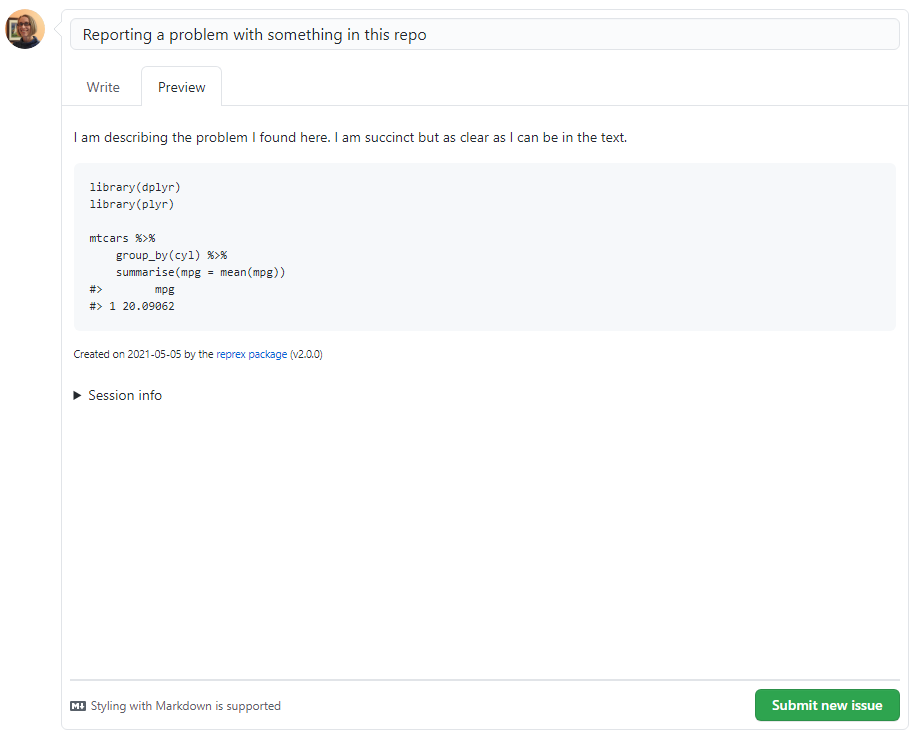
```
]

???

We want code to "look" like code, with syntax highlighting, so either use reprex or backticks but don't write code as plain text

---

## Practice issue

Once you have written out the problem, included the example code and output, and made sure everything was formatted correctly in the `Preview` tab, you're ready to submit! `r emo::ji("tada")`

Submit your issue via the `Submit new issue` button at the bottom of your issue.

--

<br/>
You can edit your issue if you find a mistake in your post or want to add additional context before you get a response.

Go to the three dots in the upper right-hand corner of the issue, click on `Edit`, and commence editing.

```{r, echo = FALSE, out.width = "25%", fig.alt = "Screenshot showing the three dots in the upper right-hand corner of an issue, which opens a drop-down screen with three options ('Copy link', 'Quote reply', and 'Edit'). The last option, 'Edit', is highlighted to be chosen"}
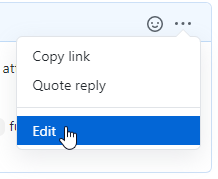
```


---

## Practice issue


If you get a response on your issue you will be notified on GitHub and via email. 

.center[
<br/>
```{r, echo = FALSE, out.width = "15%", fig.alt = "Screenshot showing the blue dot on the bell in GitHub that indicates you have a notification"}
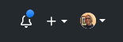
```
]

<br/>
If more info or clarification is requested you can provide it by adding a new post to the thread. `r emo::ji("thread")`


???

We saw the notification blue dot in an earlier session, but can point out again.

Try to monitor for notifications at least a little so you can respond, if needed.

---

## Fin

And with that, we are done for the quarter. Enjoy your summer! `r emo::ji("sun_with_face")`

.footnote[
[Code for slides](https://github.com/aosmith16/spring-r-topics/tree/main/docs/slides)  
Slides created via the R packages:  
[**xaringan**](https://github.com/yihui/xaringan), 
[gadenbuie/xaringanthemer](https://github.com/gadenbuie/xaringanthemer), 
[gadenbuie/xaringanExtra](https://github.com/gadenbuie/xaringanExtra) 
.center[*This work is licensed under the Creative Commons Attribution-NonCommercial 4.0 International License. 
To view a copy of this license, visit http://creativecommons.org/licenses/by-nc/4.0/.*]
]