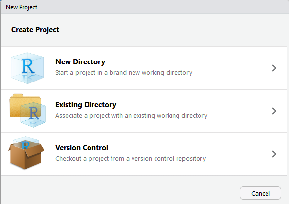

```{r setup, include = FALSE}
options(htmltools.dir.version = FALSE)
knitr::opts_chunk$set(
  fig.width=9, fig.height=3.5, fig.retina=3,
  out.width = "100%",
  cache = FALSE,
  echo = TRUE,
  message = FALSE, 
  warning = FALSE,
  fig.show = TRUE,
  hiline = TRUE
)
```

```{r xaringan-themer, include = FALSE, warning = FALSE}
library(xaringanthemer)
style_duo_accent(
  primary_color = "#1c5253",
  secondary_color = "#F4790B",
  inverse_header_color = "#FFFFFF",
  title_slide_text_color = "#FFFFFF",
  base_font_size = "22px",
  link_color = "#F4790B"
)
```

```{r xaringan-scribble, echo = FALSE}
xaringanExtra::use_scribble()
```

```{r xaringanExtra-clipboard, echo=FALSE}
xaringanExtra::use_clipboard()
```

```{r xaringan-tile-view, echo=FALSE}
xaringanExtra::use_tile_view()
```

```{r broadcast, echo=FALSE}
xaringanExtra::use_broadcast()
```

## Today's Goal

Overall

- **Create version-controlled directory for your website**

--

Plus 
-     Start using Git and GitHub
-     Create local version of initial repository from GitHub  
-     Stage, commit, push local work to GitHub  

---

## Resources

Today's material is based on **Happy Git and GitHub for the useR**  
Read at https://happygitwithr.com/

<center></center>

---

## What is Git? `r icons::fontawesome("git-square")`

--

- Program for version control

--

*But also*

-    Collaboration
-    Sharing your work
-    Contributing to open source code

--
<br/><br/><br/>
```{r githurts, echo = FALSE, out.width = "25%", out.extra='style="background-color: #1c5253; padding:6px; display: block;margin-left: auto;margin-right: auto;vertical-align: middle;"'}

```
.center[*From Happy Git with R*]

---

## And GitHub? `r icons::fontawesome("github")`

GitHub provides an internet home for Git projects, referred to as *repositories*.

Git is the engine that does the work but GitHub helps us drive around.

**Websites can be hosted directly from a GitHub repo!** `r emo::ji("tada")`

*Alternatives: GitLab, BitBucket*

<center></center>

---

class: center, middle, inverse

# <font style="font-family: cursive; font-style:italic">Let's get started!</font>

---

## Create GitHub account `r icons::fontawesome("github")`

Sign up at https://github.com/ 

```{r githubstart, echo = FALSE, out.width = "70%", out.extra='style="display: block;margin-left: auto;margin-right: auto;vertical-align: middle;"'}
knitr::include_graphics("figs/week01_files/github_start_window.PNG")
```

---

## Create GitHub account `r icons::fontawesome("github")`

.right-column[
**User name**: Pick one that will work long term and that you're happy to share with people. 

**Email**: Consider using a personal email instead of a temporary school email.  (You can change this later if needed, but it is simplest to pick a long-term email from the start.)

***For later***: Personalize your account
]

.left-column[
```{r githubao, echo = FALSE, out.width = "100%", out.extra='style="background-color: #1c5253; padding:6px;"'}
knitr::include_graphics("figs/week01_files/github_aosmith.PNG")
```
]

---

## Install `r icons::fontawesome("git-square")` on Windows

Install from https://gitforwindows.org/

Keep default options during installation. Make sure “Git from the command line and also from 3rd-party software” is selected in "Adjusting your PATH environment". 

```{r gitcommand, echo = FALSE, out.width = "40%", out.extra='style="display: block;margin-left: auto;margin-right: auto;vertical-align: middle;"'}

```

---

## Install `r icons::fontawesome("git-square")` on Windows

.pull-left[
After installation, launch Git Bash. No need to review the release notes.

.center[]

]

.pull-right[
On Windows, RStudio expects to find Git at `C:/Program Files/Git/bin/git.exe`. Go check that this is true!
]

---

## Install `r icons::fontawesome("git-square")` on MacOS

Two options: 

1. Install via Xcode.  
This can be done using command line tools in the shell using 
```
xcode-select --install
```  

2. Install from https://git-scm.com/downloads.

(I don't have a Mac so have never tried either option `r emo::ji("stuck_out_tongue_winking_eye")`, but these are the top two recommendations in Happy Git.)

---

## Download a `r icons::fontawesome("git-square")` client (optional)

RStudio now has a basic Git client, which works well most of the time.  

If you are comfortable, you can use the command line for working with Git.  

I also use a program called [GitKraken](https://www.gitkraken.com/). It has been great when I've need a more advanced Git client, such as when dealing with dreaded merge conflicts. `r emo::ji("scream")`

```{r gitkraken, echo = FALSE, out.width = "20%", out.extra='style="display: block;margin-left: auto;margin-right: auto;vertical-align: middle;"'}
knitr::include_graphics("figs/week01_files/gitkraken.png")
```

---

## Introduce yourself to `r icons::fontawesome("git-square")` in the shell

Open up a shell terminal.  

In Windows the most straightforward thing to do is to use Git Bash.

```{r gitbash, echo = FALSE, out.width = "40%", out.extra='style="display: block;margin-left: auto;margin-right: auto;vertical-align: middle;"'}

```

You will type commands next to the dollar sign symbol.

---

## Introduce yourself to `r icons::fontawesome("git-square")` in the shell


Introduce yourself by adding a user name and an email address that will be associated with Git. 

--

First set your user name. 

The command in the shell is:

```
git config --global user.name "User Name"
``` 

Put your name in place of `"User Name"` and press enter.

---

## Introduce yourself to `r icons::fontawesome("git-square")` in the shell

Introduce yourself by adding a user name and an email address that will be associated with Git. 

Now set your user email address.

The user email *must be* the email address you are using for your GitHub account.

```
git config --global user.email "youremail@gmail.com"
```

--

<br/>

Check that these changes took.

```
git config --global --list
```

Your user name and email address should be listed in the output.

<br/><br/>
*For more background on the shell and working on the command line, see [Appendix A](http://happygitwithr.com/shell.html) in Happy Git.*

---

## Make a new repository on GitHub `r icons::fontawesome("github")`

Go to your GitHub account.  

Go to the `+` drop down menu in the upper righthand corner and choose `New Repository`.


---

## Make a new repository on GitHub `r icons::fontawesome("github")`

1. Choose a repository name for your website.  Keep it simple.  You cannot have spaces in names but can include dashes (hyphens).  I will use `personal-website` today.

2. Optional: Put in a basic description. Like "My personal website".

3. Choose `Public`.  (This is the default.).  All the material in the repository will be in the public domain.

4. Select `Add a README file`.

5. Select `Add .gitignore` and then use `R` as the template.

6. Click the `Create Repository` button.

And, voila, you have created your first repository. `r emo::ji("clinking_glasses")`

---

## Clone the repository

Once the repository has been created, click the `Code` button and copy the URL to the clipboard with the clipboard button.

.center[]

---

## Connect to GitHub `r icons::fontawesome("github")` via RStudio

Let's switch to using RStudio instead of the shell.  You can always go back to using the command line from the shell if that's what you are comfortable with.

**Important**: If RStudio was open throughout any of the Git installation process, close it and reopen. No, seriously. Do it.

---

## Start new RStudio Project with version control

.pull-left[
In RStudio, go to `File > New Project...`

Select `Version Control`

.center[]
]

.pull-right[
.footnote[If you run into trouble throughout this section, jump to the [troubleshooting slide](#trouble)]
]

---

## Start new RStudio Project with version control

.pull-left[
And then choose `Git`.

.center[]
]

.pull-right[
.footnote[If you run into trouble throughout this section, jump to the [troubleshooting slide](#trouble)]
]

---

## Start new RStudio Project with version control

.pull-left[
Paste the cloned URL from the remote repository into the `Repository URL` box. 

.center[]
]

.pull-right[
RStudio will fill in the `Project directory name` box to match the repository name. Change the local Project name if you'd like (and will remember the two different names `r emo::ji("smile")`).

You can `Browse` to choose a specific directory to save your local repository to.

.footnote[If you run into trouble throughout this section, jump to the [troubleshooting slide](#trouble)]
]

---

## Start new RStudio Project with version control

.pull-left[
The remote files will be downloaded into the new folder and the new Project will open.  

If this all worked, you will have a `Git` tab in RStudio. I believe it will be near your `Environment` Pane by default.


]

.pull-right[
.footnote[If you run into trouble throughout this section, jump to the [troubleshooting slide](#trouble)]
]

--

.pull-left[
<br/>
Does everyone have a local repository? `r emo::ji("crossed_fingers")`
]

---

name:trouble

## Troubleshooting

***If you cannot make a "version control" project***

If your RStudio version is up-to-date then you have some sort of problem with Git and RStudio.  This is more likely to happen on Windows.

The best-case scenario is that you need to manually tell RStudio where to find Git, shown on the next slide.

.footnote[See [Chapter 14](http://happygitwithr.com/rstudio-see-git.html) of Happy Git for more detailed information and ideas.]

---

## Troubleshooting

.pull-left[
Go to `Tools > Global Options...` and then choose `Git/SVN`.

.center[]
]

.pull-right[
Make sure the path to the Git Executable is `C:/Program Files/Git/bin/git.exe`.  Notice it must be in `bin` and not `cmd`.  

If the path is wrong, change the path to the correct one, push `OK`, restart RStudio, and try again.

.footnote[See [Chapter 14](http://happygitwithr.com/rstudio-see-git.html) of Happy Git for more detailed information and ideas.]
]

---

## Update GitHub `r icons::fontawesome("github")` with local changes

Once the project is open and you can see the files in the `Files` pane, open the `README.md` and add some text. 

Save the file.

.center[]

---

## Update GitHub `r icons::fontawesome("github")` with local changes

In the `Git` tab in RStudio you will now see this file as well as the `.Rproj` file. 


*Stage* these files by clicking on the boxes next to each file. 

.center[]

Staging tells Git you are getting ready to make the changed file part of the repository.

---

## Update GitHub `r icons::fontawesome("github")` with local changes

Now select `Commit` in the `Git` tab.

Write a message in the "Commit message" box in the pop-up window that opens. This message should be short but useful. Commit messages help you find previous versions of your work.

.center[]

--

Then hit the `Commit` button under the `Commit message` box. You are *committing* to make the edited files part of the repository.

---

## Update GitHub `r icons::fontawesome("github")` with local changes

.pull-left[
Finally, `Push` the edited files to the remote repository. The button is in the right-hand corner of the `Commit` pop-up window.


You will be asked for your username and password.
]

--

.pull-right[
If you've pushed successfully you will see a message like the one below.  

.center[]

Go to your GitHub repository to see the changes. You may need to refresh.
]

---

## More troubleshooting

Did it work?  Yay! `r emo::ji("tada")`

Did something fail?  Bummer. `r emo::ji("cry")` Something is wrong.  Go to Chapter 15 of Happy Git, [RStudio, Git, and GitHub hell](http://happygitwithr.com/troubleshooting.html) to work on solving the problem. 

We can also work on it more together after we finish up the next section.

---

## Adding SSH key for authentication

Once you start working with Git regularly, entering your GitHub credentials every time you want to push becomes a pain.  I think the easiest thing to do is to add a SSH key.

--

### Set up SSH key pair in RStudio

RStudio makes this pretty easy to do this.  You can (add likely should) add a passphrase for this, but I am skipping that step here.

In RStudio, go to `Tools > Global Options... > Git/SVN`.

Click on `Create RSA key`.  RStudio will generate and store the keys for you.

---

## Add key to ssh-agent via shell

### Windows

Open `Git Bash` to tell the `ssh-agent` about the key RStudio made.

First return the agent info.

```
eval $(ssh-agent -s)
```

Then add the key via `ssh-add`.  

```
ssh-add ~/.ssh/id_rsa
```

In the past I have had to write out the whole directory path in Windows. RStudio stores the key pair in your `Users` folder so the path I had to write out was `c:/Users/Owner/.ssh/id_rsa` (my Users folder is named `Owner` in this example). 

---

## Add key to ssh-agent via shell

### MacOS

Open a shell to tell the `ssh-agent` about the key RStudio made.

First return the agent info.

```
eval "$(ssh-agent -s)"
```

Then add the key via `ssh-add`.  

```
ssh-add ~/.ssh/id_rsa
```

---

## Copy public key to clipboard

Now go back to RStudio `Tools > Global Options... > Git/SVN`.

Click on the blue `View public key` and then copy the entire key from the pop-up window.


---

## Paste the key to GitHub `r icons::fontawesome("github")`

.pull-left[
Go to your GitHub repository.  

1. Choose `Settings` under the drop-down menu in the upper right-hand corner.  
]

.pull-right[
.center[]
]

---

## Paste the key to GitHub `r icons::fontawesome("github")`

.pull-left[
Go to your GitHub repository.  

1. Choose `Settings` under the drop-down menu in the upper righthand corner.  
2. Choose `SSH & GPG keys` from the menu on the left and then click `New SSH key`.
]

.pull-right[
.center[]
]

---

## Paste the key to GitHub `r icons::fontawesome("github")`

.pull-left[
Go to your GitHub repository.  

1. Choose `Settings` under the drop-down menu in the upper righthand corner.  
2. Choose `SSH & GPG keys` from the menu on the left and then click `New SSH key`.
3. Give the key whatever name you want and paste the key you copied from RStudio. Click on `Add SSH key` to add the key. 

You should now be able to push and pull from GitHub without having to authenticate each time.
]

---
## For next week

- Install packages **distill** and **postcards**
- Find an image you want to represent you on your website

.footnote[
Slides created via the R packages:  
[**xaringan**](https://github.com/yihui/xaringan)<br>
[gadenbuie/xaringanthemer](https://github.com/gadenbuie/xaringanthemer)<br>
[gadenbuie/xaringanExtra](https://github.com/gadenbuie/xaringanExtra)
]

