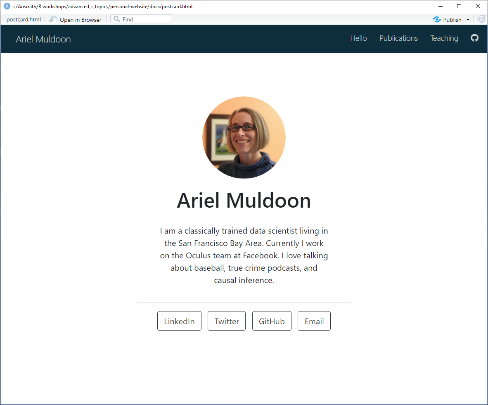

```{r setup, include = FALSE}
options(htmltools.dir.version = FALSE)
knitr::opts_chunk$set(
  fig.width=9, fig.height=3.5, fig.retina=3,
  out.width = "100%",
  cache = FALSE,
  echo = TRUE,
  message = FALSE, 
  warning = FALSE,
  fig.show = TRUE,
  hiline = TRUE
)
```

```{r xaringan-themer, include = FALSE, warning = FALSE}
library(xaringanthemer)
style_duo_accent(
  primary_color = "#1c5253",
  secondary_color = "#F4790B",
  inverse_header_color = "#FFFFFF",
  title_slide_text_color = "#FFFFFF",
  base_font_size = "22px",
  link_color = "#F4790B",
  code_highlight_color = "rgba(244, 121, 11, 0.5)"
)
```

```{r metathis, echo=FALSE}
library(metathis)
meta() %>%
    meta_name("github-repo" = "aosmith16/spring-r-topics") %>% 
    meta_social(
        title = "Using distill for personal websites",
        description = paste(
            "Using distill to build personal website",
            "Spring 2021"
        ),
        url = "https://aosmith16.github.io/spring-r-topics/slides/week02_distill_websites.html",
        image = "https://aosmith16.github.io/spring-r-topics/slides/week02_distill_websites.html/week02-share-card.png",
        image_alt = paste(
            "Using distill for personal websites", 
            "Working sessions class spring 2021"
        ),
        og_type = "website",
        og_author = "Ariel Muldoon",
        twitter_card_type = "summary_large_image",
        twitter_creator = "@aosmith16"
    )
```

```{r xaringan-scribble, echo = FALSE}
xaringanExtra::use_scribble()
```

```{r xaringanExtra-clipboard, echo=FALSE}
xaringanExtra::use_clipboard()
```

```{r xaringan-tile-view, echo=FALSE}
xaringanExtra::use_tile_view()
```

```{r broadcast, echo=FALSE}
xaringanExtra::use_broadcast()
```

class: center, middle, title-slide

# Build a personal website with distill
## Part 1: Basic website with intro postcard

```{r distill, echo = FALSE, out.width = "15%"}
knitr::include_graphics("figs/distill.png")
```

### Ariel Muldoon

### April 5, 2021

---

## Today's Goal

Overall

- **Create a personal website to showcase your work**

--

We will 
-     Start a **distill** website in a version-controlled directory  
-     Build an intro page with package **postcards**  
-     Edit `_site.yml` to control website design
-     Change website *theme* (colors and fonts)

--

*Before we begin:*

Make sure you have packages **distill**, **postcards**, and **fontawesome** installed.

---

## Resources

- The **distill** website has great material for getting started: https://rstudio.github.io/distill/  
- Thomas Mock has a nice intro to **distill** [here](https://themockup.blog/posts/2020-08-01-building-a-blog-with-distill/)  
- Alison Hill's post on **postcards**
[here](https://alison.rbind.io/post/2020-12-22-postcards-distill/) is super helpful  
- The [distillery showcase](https://jhelvy.github.io/distillery/showcase.html) is awesome for inspiration and ideas on website design. Check out the GitHub repositories of pages you want to emulate!

.center[
```{r distillery, echo = FALSE, out.width = "30%"}
knitr::include_graphics("figs/week02_files/distillery.png")
```
]

---

class: hide-logo

## Why distill?

.pull-left[
- Based on Rmarkdown
- Comparatively simple and easy to maintain  
- Templates for building interactive academic articles    
- **Con**: Not particularly flexible for customizing site layout or style 

*Alternatives: blogdown, hugodown*
]

--

.pull-right[
<blockquote class="twitter-tweet" data-lang="en"><p lang="en" dir="ltr">Blogdown vs distill comparison</p>&mdash; Shannon Pileggi (@PipingHotData) <a href="https://twitter.com/WeAreRLadies/status/1363144545677017089">Tweet February 20, 2021</a></blockquote>
<script async src="//platform.twitter.com/widgets.js" charset="utf-8"></script>
]

???

The tweet does a more specific overview of simplicity with little flexibility (distill) vs complexity but lots of flexibility

---

## Where are we going?

The focus today is on making personal websites to showcase ourselves.

.pull-left[
- The home page will have a picture, a description of your background, and contact info. 
- Additional pages, such as publications and presentations, will be available through the navigation bar menus.
- We'll change the look of the website using a new *theme*.
]

.pull-right[
.center[

]
]

---
## Examples for inspiration

.pull-left[
A lot of my own approach to building a website involves looking at other websites to see what I like and what I can do. I'll show two examples here. 
]

---

## Examples for inspiration

.pull-left[
A lot of my own approach to building a website involves looking at other websites to see what I like and what I can do. I'll show two examples here.  

The first is a fairly complex **distill** website by [John Paul Helveston](https://jhelvy.github.io/). You'll notice he uses separate pages to showcase, e.g., publications and teaching.

]

.pull-right[
.center[]
[Link to site](https://jhelvy.github.io/)  
[Link to source code](https://github.com/jhelvy/jhelvy.github.io)
]

---

## Examples for inspiration

.pull-left[
A lot of my own approach to building a website involves looking at other websites to see what I like and what I can do. I'll show two examples here.

The second is a somewhat simpler **distill** website from [Harry Fisher](https://www.hfshr.xyz/).  Notice is the use of icons instead of labels for social and navigation links.
]

.pull-right[
.center[]
[Link to site](https://www.hfshr.xyz/)  
[Link to source code](https://github.com/hfshr/distill_blog)
]

---

## Examples for inspiration

.pull-left[
A lot of my own approach to building a website involves looking at other websites to see what I like and what I can do. I'll show two examples here.


Take a few minutes to explore the two website examples more closely and/or go to the [distillery showcase](https://jhelvy.github.io/distillery/showcase.html) to scroll through some examples there to start thinking about what you like.
]

.pull-right[
[John Helveston site](https://jhelvy.github.io/)   
[John Helveston source](https://github.com/jhelvy/jhelvy.github.io)  

[Harry Fisher site](https://www.hfshr.xyz/)  
[Harry Fisher source](https://github.com/hfshr/distill_blog)  

Other example websites you might want to check out:  
[Ijeamaka Anyene](https://ijeamaka-anyene.netlify.app/)  
[Jeff Leek's](http://jtleek.com/) super simple, one-page website  
[Jannik M. Buhr](https://jmbuhr.de/)  
[Ted Laderas](https://laderast.github.io/)
]

---

class: center, middle, inverse, hide-logo

# <font style="font-family: cursive; font-style:italic">Let's get started!</font>

---

## Create distill website

Open the version-controlled RStudio Project you created last week. 

We'll make a website within this directory using `distill::create_website()`.  
--

<br/>
Copy and paste the following code example into R. Change the `title` to your name before running:

```{r, eval = FALSE}
distill::create_website(dir = ".", 
                        title = "Ariel Muldoon", 
                        gh_pages = TRUE)
```

***Code explainer:***
- We use `dir = "."` to place files in our current (Project) directory. 
- You'll need to name the website with `title`. For a personal website this is usually your name.
- Finally, since we will be deploying the website via GitHub Pages, we set `gh_pages` to `TRUE`.

---

## Basic website files

After running the code from the last slide you will have a bunch of new files that contains the basic skeleton of a **distill** website. Here's what is now in my `Files` pane.

.center[
```{r basic, echo = FALSE, out.width = "55%"}
knitr::include_graphics("figs/week02_files/distill_basic.png")
```
]

We'll be editing the created files to personalize our websites.

???

In particular note _site.yml, index.Rmd, about.Rmd and the new "docs" folder.

---

## Build basic website

.pull-left[
**Important**: Before we proceed any further, close RStudio and then reopen your website Project.  

Once you reopen you should see a `Build` tab near your `Environment` pane. 

.center[]
]

--

.pull-right[
Go to the `Build` tab and click `Build website`. The basic website will build and then open in a new window.

.center[]
Click around on the navigation bar to see what is on each page. This will set us up to talk about how the files relate to the website.
]

---

## File overview

- `index.Rmd`: Your home page. Every **distill** website *must* have an `index.Rmd` file and it needs to be in the root directory. Don't move it.  
In addition, you must have a `title` and `site: distill::distill_website` in the YAML header at the top of the file.

--

- `docs` folder: This is where the files that make up your website are stored. Publish your website based on this folder.

--

- `_site.yml`: This file controls many aspects of your website, including what is on the navigation bar.

--

- `about.Rmd`: The content of this file is currently associated with the `About` navigation bar button. Change content of this file to change that webpage. (*Editing `about.Rmd` not covered today.*)


???

This is a very basic overview. You may want to know more about each of these, in which case I recommend the distill "Creating a website" page.

---

## Edit `index.Rmd`

**You control your home page content by making changes to `index.Rmd`.**

--

.pull-left[
To start, delete the two lines of `description` in the YAML header. (You can always add this back if you want. `r emo::ji("wink")`)

My header now looks like

```{r, eval = FALSE}
---
title: "Ariel Muldoon"
site: distill::distill_website
---
```
]

--

.pull-right[
Add text, code, and images to the body of `index.Rmd` using standard R markdown syntax. 

For practice, add a line or two of text after the set-up chunk.

I added

```
Welcome to my *new* website.

See my CV for more info:  
[CV](https://ariel.rbind.io/files/acm_resume.html)
```
]

---

## Knitting and Building

.pull-left[
If you change a single document you can use the `Knit` button at the top of your Source pane `Rmd` file to preview the changes you made. 

Knit `index.Rmd` to see how the output file has changed.
]

--

.pull-right[
Here's my new home page:
.center[]
]

--

<br/><br/>
After making changes to multiple files you'll want to build the entire website again like we did with the initial skeleton website.

---

## More on the `docs` folder

.pull-left[
Every time we knit a file in the root directory or build the entire website, all output files and folders are added to the `docs` folder.


<br/><br/>

Take a look at the contents of this folder.  

]

--

.pull-right[
In particular note the two HTML output files created by `index.Rmd` and `about.Rmd` (same names but end in `html`). These are literally the files that make the pages of the website. 
.center[]
]

--

.center[
**Important**: Generally speaking you will not be doing any work in `docs` directly.
]

???

Distill is a static site generator, so is based on HTML documents we create. Since we are using GitHub pages to publish/deploy we have a "docs" folder by default and all HTML output from our Rmd files in the root directory are saved there. Distill is set up to create the files we need in "docs", so no need to fool around in there manually.

---

## Edit the navigation bar

.pull-left[
The `_site.yml` file is key in controlling many aspects of your website. 

Today we will keep most of the defaults and focus on changes to the website navigation bar.

The navigation bar settings are controlled with options passed to `navbar` in `_site.yml`.
]

--

.pull-right[

```{r, eval = FALSE}
name: "."
title: "Ariel Muldoon"
description: |
  Ariel Muldoon
output_dir: "docs"
*navbar:  
*  right:  
*    - text: "Home"  
*      href: index.html  
*    - text: "About"  
*      href: about.html  
output: distill::distill_article
```

At the moment our navigation menu is on the right and we're using menu names `Home` and `About`.

]

---

## Edit the navigation bar

You can move the navigation menus to the right or left. I'm leaving them all on the right but if you want menus on the left use `left:`.

Change the `text` to change the menu names. I'm using `"Hello"` and `"Publications"`.

```{r, eval = FALSE}
navbar:
  right:
*   - text: "Hello"
      href: index.html
*   - text: "Publications"
      href: about.html
```

Build the website or knit `index.Rmd` to see the new menu names.

.center[]

---

## Edit the navigation bar

We use `href` to define which HTML page from the `docs` folder should be opened by each navigation menu. 

For now we'll keep these as is, with `index.html` as our home page and `about.html` as the page opened by the "Publications" menu.

```{r, eval = FALSE}
navbar:
  right:
   - text: "Hello"
*    href: index.html
   - text: "Publications"
*    href: about.html
```

---

## Edit the navigation bar

You can use *icons* instead of text by defining Font Awesome identifiers. I'll add a link to my website GitHub repo using the `r fontawesome::fa("github")` icon as an example. 

--

`href` must refer to a link, and can link either to an HTML file in the `docs` folder as in the first two menus or to some other URL.

```{r, eval = FALSE}
navbar:
  right:
    - text: "Hello"
      href: index.html
    - text: "Publications"
      href: about.html
*   - icon: fab fa-github
*     href: https://github.com/aosmith16/personal-website
```
.center[]

???
I don't have a great explanation for the "fab fa-github" code, other than that is CSS and is how to refer to font awesome icons. Put the name of the icon after "fa-". An envelope would be "fa-envelope".

---

## Add a navigation menu

If we want a local HTML file associated with a new menu we'll need a new `Rmd` file to create it.

We can create a new **distill** article, which has HTML as the output, using RStudio's drop-down menus.

--

Go to `File > New File > R Markdown...`

Click `From Template` and then choose `Distill Article`.

.center[]

???

Remember that a website is all about HTML, so we want documents that create HTML outputs. That's a reason distill articles are so useful here.

---

## Add a navigation menu

Save the file into the root directory.  I named mine `teaching.Rmd`, so it will create an HTML file called `teaching.html`.

--

Add a new `navbar` menu in `_site.yml` that is associated with the new HTML file and then build.  Note the order menus are defined in `_site.yml` dictates the order in the website.

```{r, eval = FALSE}
navbar:
  right:
    - text: "Hello"
      href: index.html
    - text: "Publications"
      href: about.html
*   - text: "Teaching"
*     href: teaching.html
    - icon: fab fa-github
      href: https://github.com/aosmith16/personal-website
```

.center[]

???

Students might be interested in looking at this new file since it has some distill article defaults built into it that we will talk about next week.

---

## Add a postcard to your website

The [**postcards** package](https://github.com/seankross/postcards) is a convenient way to create a nice home page for your website.

Before we proceed, save whatever image you'd like to represent you on your home page in a folder called `images` in the root directory of your current Project. My image is named `ao_small.png`.

--

We'll create a postcard using `distill::create_article()`. 

```{r, eval = FALSE}
distill::create_article(file = "postcard",  
                        template = "jolla",    
                        package = "postcards")
```

***Code explainer:***
- Create the name of the new `Rmd` file with `file`. 
- Chose a [template](https://github.com/seankross/postcards/blob/main/README.md#the-templates) from package **postcards** with `template`. Other options are `trestles`, `jolla_blue`, and `onofre`.
- In `package` we list the name of the package that has the template. In this case, **postcards**.

???

There are currently 4 templates to choose from. See link for examples of each.

May need to give direction on creating a new "images" folder and putting picture in it. Seems easiest to do outside RStudio, which means students must understand where their directory is.

---

## Add a postcard to your website

Let's change the YAML header filler info to our own before we knit. Delete `label`/`url` for links you don't have and add any others you want.

.pull-left[
Here's what we start with:
```{r, eval = FALSE}
title: "Tobi Burns"
image: "tobi.jpg"
links:
  - label: LinkedIn
    url: "https://linkedin.com/"
  - label: Twitter
    url: "https://twitter.com/"
  - label: GitHub
    url: "https://github.com/"
  - label: Email
    url: "mailto:email@email.com"
output:
  postcards::jolla
```
]

--

.pull-right[
And here are my edits:
```{r, eval = FALSE}
title: "Ariel Muldoon"
image: "images/ao_small.png"
links:
  - label: LinkedIn
    url: "https://www.linkedin.com/in/arielmuldoon/"
  - label: Twitter
    url: "https://twitter.com/aosmith16"
  - label: GitHub
    url: "https://github.com/aosmith16"
  - label: Email
    url: "mailto:ariel.muldoon@gmail.com"
output:
  postcards::jolla
```
]

???

Note my picture is in my "images" folder, so I had to write out the path. Delete the `label` and `url` lines for any social links you don't have or add others.

---

## Add a postcard to your website

Knit `postcard.Rmd` to see the first draft.

.center[
```{r postcard1, echo = FALSE, out.width = "60%"}

```
]

---

## Using icons in your postcard

I like using icons instead of words for my social links. I'll do this using R code and package **fontawesome**.


```{r, eval = FALSE}
---
title: "Ariel Muldoon"
image: "images/ao_small.png"
links:
  - label: '`r fontawesome::fa("linkedin", height = 25)`'
    url: "https://www.linkedin.com/in/arielmuldoon/"
  - label: '`r fontawesome::fa("twitter", height = 25)`'
    url: "https://twitter.com/aosmith16"
  - label: '`r fontawesome::fa("github", height = 25)`'
    url: "https://github.com/aosmith16"
  - label: '`r fontawesome::fa("envelope", height = 25)`'
    url: "mailto:ariel.muldoon@gmail.com"
output:
  postcards::jolla
---
```

---

## Using icons in your postcard

Here's what my postcard looks like now.

.center[
```{r postcard2, echo = FALSE, out.width = "60%"}

```
]

---

## Make postcard your home page

My new postcard isn't part of my website yet! Rather than adding it in as a separate `navbar` menu we'll make it the home page. 

To achieve this, copy and paste the `postcard.Rmd` header info into `index.Rmd`.

<br/><br/>
**Reminder**: Do not delete the `site: distill::distill_website` line from `index.Rmd`. 

.footnote[*New YAML header from `index.Rmd` is on next slide*]

---

## Make postcard your home page

```{r, eval = FALSE}
---
title: "Ariel Muldoon"
image: "images/ao_small.png"
links:
  - label: '`r fontawesome::fa("linkedin", height = 25)`'
    url: "https://www.linkedin.com/in/arielmuldoon/"
  - label: '`r fontawesome::fa("twitter", height = 25)`'
    url: "https://twitter.com/aosmith16"
  - label: '`r fontawesome::fa("github", height = 25)`'
    url: "https://github.com/aosmith16"
  - label: '`r fontawesome::fa("envelope", height = 25)`'
    url: "mailto:ariel.muldoon@gmail.com"
output:
  postcards::jolla
site: distill::distill_website
---
```

Build your website to see your new home page! `r emo::ji("tada")` Delete `postcard.Rmd` entirely.

---

## Change website theme

While **distill** doesn't allow for major changes to the overall website structure, we can change the *theme* by choosing colors and fonts to personalize the website.

Themes in **distill** are based on the CSS language.  

--

  
Process:  

- Create a file that contains all the CSS code for the current website using `distill::create_theme()`.   
- Edit this file to change individual elements of your website.
- Alternatively, find a theme you like that someone else developed and use that code to replace your entire current theme. We'll proceed with this last approach.

--

Run the following code in R to create a file called `theme.css`.  It will open up in your `Source` pane once it has been created.

```{r, eval = FALSE}
distill::create_theme()
```

???

If you already know CSS you can go ahead and create your own .css file

---

## Change website theme

In order to apply a theme your entire website you'll need to point to the `theme.css` file within `_site.yml`.

This is done via `theme: theme.css`. Here I added it to the end of my current `_site.yml` file. Excerpt:

```{r, eval = FALSE}
navbar:
  right:
    - text: "Hello"
      href: index.html
    - text: "Publications"
      href: about.html
    - text: "Teaching"
      href: teaching.html
    - icon: fab fa-github
      href: https://github.com/aosmith16/personal-website
output: distill::distill_article
*theme: theme.css
```

Take care with your spacing. `theme` should have no spaces in front of it.

---

## Change website theme

The **distill** website has three [example themes](https://rstudio.github.io/distill/website.html#example-themes) to choose from when getting started. 

When I made the [class website](https://aosmith16.github.io/spring-r-topics/) I copied the `theme.css` example from Piping Hot Data, pasted it over everything in my current theme, and then manually changed the navigation bar color to [Beaver Orange](https://communications.oregonstate.edu/brand-guide/visual-identity/colors) (`rgb(215, 63, 9)`).

--

Take a few minutes to choose from one of the example themes and then copy and paste the code over what is currently in `theme.css`.  

[Piping Hot Data](https://rstudio.github.io/distill/website.html?panelset1=screenshot#piping-hot-data)  
[Before I Sleep](https://rstudio.github.io/distill/website.html?panelset1=screenshot&panelset2=screenshot2#before-i-sleep)  
[Tidymodels](https://rstudio.github.io/distill/website.html?panelset3=screenshot3#tidymodels)

Save the result and build the website to see the changes. If you'd prefer something else, take time over the next week to find a theme you really like from the [distillery examples](https://jhelvy.github.io/distillery/showcase.html).

---

## New website theme

I used the [Tidymodels](https://rstudio.github.io/distill/website.html?panelset3=screenshot3#tidymodels) theme. After copying the `theme.css` code, pasting it over the code in my original `theme.css` file, and building the site this is what my website home page looks like now.

.center[
```{r theme, echo = FALSE, out.width = "60%"}

```
]

---

class: hide-logo

## Push to GitHub `r fontawesome::fa("github")`

We've been going along, editing and adding files to the website locally but haven't pushed anything to GitHub.  

Take a moment to `Stage`, `Commit`, and `Push` all new and edited files.

We usually want to do this fairly often so changes are recorded. That way if you ever really make a mess of things you can revert back to a previous version of your website. (In other words, the reason to use version control. `r emo::ji("smile")`)

<center></center>

???

That's it for today. Remind everyone to push to GitHub and talk about why we might do this fairly often (especially when making big changes). If we don't commit changes then we can't revert to that previous version.

---

class: hide-logo

## For next week

- If you already work with bibTex files (`.bib`), have one available to use in a **distill** article. I will provide you an example file, as well.
- We'll be deploying the website, so you may want to flesh out your home page information.

.footnote[
[Code for slides](https://github.com/aosmith16/spring-r-topics/tree/main/docs/slides)  
Slides created via the R packages:  
[**xaringan**](https://github.com/yihui/xaringan), 
[gadenbuie/xaringanthemer](https://github.com/gadenbuie/xaringanthemer), 
[gadenbuie/xaringanExtra](https://github.com/gadenbuie/xaringanExtra) 
.center[*This work is licensed under the Creative Commons Attribution-NonCommercial 4.0 International License. 
To view a copy of this license, visit http://creativecommons.org/licenses/by-nc/4.0/.*]
]