```{r setup, include = FALSE}
options(htmltools.dir.version = FALSE)
knitr::opts_chunk$set(
  fig.width=9, fig.height=3.5, fig.retina=3,
  out.width = "100%",
  cache = FALSE,
  echo = TRUE,
  message = FALSE, 
  warning = FALSE,
  fig.show = TRUE,
  hiline = TRUE
)
library(formatR)
```

```{r xaringan-themer, include = FALSE, warning = FALSE}
library(xaringanthemer)
style_duo_accent(
  primary_color = "#1c5253",
  secondary_color = "#F4790B",
  inverse_header_color = "#FFFFFF",
  title_slide_text_color = "#FFFFFF",
  base_font_size = "22px",
  link_color = "#F4790B",
  code_highlight_color = "rgba(244, 121, 11, 0.5)"
)
```

```{r metathis, echo=FALSE}
library(metathis)
meta() %>%
    meta_name("github-repo" = "aosmith16/spring-r-topics") %>% 
    meta_social(
        title = "Display tables with package gt",
        description = "Building basic tables",
        url = "https://aosmith16.github.io/spring-r-topics/slides/week04_gt_tables.html",
        image = "https://raw.githubusercontent.com/aosmith16/spring-r-topics/main/slides/week04-share-card.png",
        image_alt = paste(
            "Getting started with package gt", 
            "Working sessions class spring 2021"
        ),
        og_type = "website",
        og_author = "Ariel Muldoon",
        twitter_card_type = "summary",
        twitter_creator = "@aosmith16"
    )
```

```{r xaringan-scribble, echo = FALSE}
xaringanExtra::use_scribble()
```

```{r xaringanExtra-clipboard, echo=FALSE}
xaringanExtra::use_clipboard()
```

```{r xaringan-tile-view, echo=FALSE}
xaringanExtra::use_tile_view()
```

```{r broadcast, echo=FALSE}
xaringanExtra::use_broadcast()
```

class: center, middle, title-slide

# Display tables with package gt
## Part 1: Building basic tables

```{r distill, echo = FALSE, out.width = "15%", fig.cap = "Logo for package gt"}
knitr::include_graphics("figs/gtlogo.svg")
```

### Ariel Muldoon

### April 20, 2021

---

## Today's Goal

Overall  
-     **Build *display* tables in R with package gt**  

--

We will  

-     Modify and format table columns    
-     Add row information with names and groups  
-     Add extra information with headers, spanners, and footers    
-     Change overall table style    

--

*Before we begin:*

Make sure you saved `week04_gt_basics.Rmd` from the class website onto your computer. We will be running code from this file.

???

Display tables are tables of output, not tables for entire datasets

---

class: hide-logo

## Resources

- Thomas Mock's [**gt** Cookbook](https://themockup.blog/static/gt-cookbook.html#Introduction)  
- The **gt** package website has a nice [intro](https://gt.rstudio.com/articles/intro-creating-gt-tables.html)    

.center[
```{r distillery, echo = FALSE, out.width = "30%", fig.alt = "Logo for package gt"}
knitr::include_graphics("figs/gtlogo.svg")
```
]

---

## Why focus on **gt**?

It is just one package that allows us to build tables programmatically in R.

.pull-left[
**Pros:**
- "Grammar of tables" like **ggplot2** grammar of graphics  
- Supports HTML, LaTeX, RTF outputs  
- Follows **tidyverse** conventions  

<blockquote class="twitter-tweet" data-lang="en"><p lang="en" dir="ltr">ggplot2 for tables</p>&mdash; Charles T. Gray (@cantabile) <a href="https://twitter.com/cantabile/status/1372136281518477318">Tweet March 17, 2021</a></blockquote>
<script async src="//platform.twitter.com/widgets.js" charset="utf-8"></script>
]

.pull-right[
**Cons:**  
- Very new so syntax could still change  
- Code gets long/complex fast (*this shared by most table-making packages in R*)
]

???

Reminder these are display tables of output

---

## Other packages for tables

There are many great packages for making display tables in R.

These include:
- `knitr::kable()` and **kableExtra**, which are relatively mature  
- **flextable**, a great option for making Word tables
- **reactable** for making *interactive* tables
- And so many more!   

--

There is a nice overview of packages for tables in R at [R for the Rest of Us](https://rfortherestofus.com/2019/11/how-to-make-beautiful-tables-in-r/) and a list of them on the [**gt** website](https://gt.rstudio.com/#how-gt-fits-in-with-other-packages-that-generate-display-tables).

Also see [package **gtsummary**](https://education.rstudio.com/blog/2020/07/gtsummary/) for making summary tables like ones commonly seen in medical journals.

---

class: center, middle, inverse, hide-logo

# <font style="font-family: cursive; font-style:italic">Let's get started!</font>

---

## Running code

- Open the copy of [`week04_gt_basics.Rmd`](files/week04_gt_basics.Rmd) that you saved  

- I recommend switching to using the visual editor using the   button in the upper right of the `Source` pane  

--

<br/><br/>
**Set up**  

- We'll practice different features of package **gt** together, running example code I've already written.   

- The code shown in the slides are in code chunks in `week04_gt_basics.Rmd`, which you will run through starting with loading packages.

- At the end of each topic we go over you'll have a chance to practice writing your own code in a **Your turn** section.

---

## R packages 

We are using **gt 0.2.2** and **dplyr 1.0.5** today. Load these now. 

```{r, message = FALSE, warning = FALSE}
library(gt) # v. 0.2.2
library(dplyr) # v. 1.0.5
```

Also make sure you have package **webshot** installed. 

---

## Datasets

We need a few small datasets to practice making tables. We will do all data manipulation steps now.

--

.pull-left[
**The `gtcars` dataset**

This dataset is data on deluxe automobiles from 2014-2017. See `?gtcars` for more information.

We'll pull out 6 rows from two countries and keep 7 of the variables.

```{r gtcars, eval = FALSE}
gtcars_small = gtcars %>%
    filter(ctry_origin %in% c("United States", "Japan")) %>%
    select(mfr:year, mpg_c, mpg_h, ctry_origin, msrp)
gtcars_small
```
]

.pull-right[
<br/><br/>
```{r, echo = FALSE}
gtcars_small = gtcars %>%
    filter(ctry_origin %in% c("United States", "Japan")) %>%
    select(mfr:year, mpg_c, mpg_h, ctry_origin, msrp)
```

```{r gtcars-out, echo = FALSE}
rmarkdown::paged_table(gtcars_small)
```
]

???

Data manipulation is key to making display tables and you'll often see data manipulation code along with the tables.

gtcars is included as part of the **gt** package

---

## Datasets

We need a few small datasets to practice making tables. We will do all data manipulation steps now.

.pull-left[
**The `mtcars` dataset**

The `mtcars` dataset is data from 1974 Motor Trend road tests. We'll use the first 6 rows of 5 variables and add in some missing values.

```{r mtcars, eval = FALSE}
mtcars_small = mtcars %>%
    head() %>%
    mutate(
        disp = c(NA, disp[2:6]),
        qsec = c(qsec[1:5], NA)
        ) %>%
    select(disp, hp, wt, qsec, carb)
mtcars_small
```
]

.pull-right[
<br/><br/>
```{r, echo = FALSE}
mtcars_small = mtcars %>%
    head() %>%
    mutate(
        disp = c(NA, disp[2:6]),
        qsec = c(qsec[1:5], NA)
        ) %>%
    select(disp, hp, wt, qsec, carb)
```

```{r mtcars-out, echo = FALSE}
knitr::kable(mtcars_small)
```

]

???

mtcars comes with base R so you have access without loading any packages

---

## Datasets

We need a few small datasets to practice making tables. We will do all data manipulation steps now.

.pull-left[
**Table of results**

Here is a small table of results from an analysis, which reports estimated ratios of medians between two groups for 4 species.

.smaller[
```{r results, eval = FALSE}
results = structure(list(contrast = structure(c(1L, 1L, 1L, 1L), .Label = "DF / RA", class = "factor"), 
    litterspp = structure(1:4, .Label = c("ACMA", "ALRU", "PSME", 
    "TSHE"), class = "factor"), ratio = c(2.92534041512422, 3.98726047426825, 
    1.1303275363783, 1.69285339886012), lower.CL = c(1.35187771051096, 
    1.84261924981326, 0.522354456290416, 0.782312637958251), 
    upper.CL = c(6.33017060479877, 8.62806903340073, 2.44592598782139, 
    3.66318079369337)), row.names = c(NA, 4L), class = "data.frame")
results
```
]
]

.pull-left[
<br/><br/><br/>
```{r, echo = FALSE}
results = structure(list(contrast = structure(c(1L, 1L, 1L, 1L), .Label = "DF / RA", class = "factor"), 
    litterspp = structure(1:4, .Label = c("ACMA", "ALRU", "PSME", 
    "TSHE"), class = "factor"), ratio = c(2.92534041512422, 3.98726047426825, 
    1.1303275363783, 1.69285339886012), lower.CL = c(1.35187771051096, 
    1.84261924981326, 0.522354456290416, 0.782312637958251), 
    upper.CL = c(6.33017060479877, 8.62806903340073, 2.44592598782139, 
    3.66318079369337)), row.names = c(NA, 4L), class = "data.frame")
```

```{r results-out, echo = FALSE}
knitr::kable(results)
```

]

???

I created this dataset; it is not part of R

---

## Basic **gt** usage

We start with the `gt()` function to create a basic **gt** table object. This is the first step in a typical workflow.

.pull-left[
```{r gt01, eval = FALSE}
gtcars_small %>%
    gt() #<<
```

<br/><br/>
The table on the right shows the default output style for **gt** tables.

I'll use pipe syntax throughout but you can use nested syntax like, e.g., `gt(gtcars_small)`.
]

.pull-right[
```{r table01, echo = FALSE, fig.alt = "Table of gtcars_small showing default gt table"}
knitr::include_graphics("figs/week04_files/gt01.png")
```
]

???

The dataset is the first argument to `gt()`. You can put your dataset within `gt()` (i.e., `gt(data = gtcars_small)`), but it is standard to use a pipe syntax when building **gt** tables so we'll be using them throughout this session.

---

## Modify columns

Our first topic will be cleaning up the table body and columns. 

The [`cols_*()` functions](https://gt.rstudio.com/reference/index.html#section-modify-columns) allow for modifications of entire columns.

We can control the column labels, cell alignment, column width and placement plus can combine multiple columns with `cols_*()` functions.

---

### Column labels

Relabel one or more column *labels* using `cols_label()`.

.pull-left[
```{r gt02, eval = FALSE}
gtcars_small %>%
    gt() %>%
    cols_label( #<<
        mfr = "Manufacturer", #<<
        ctry_origin = "Country" #<<
    ) #<<
```

<br/>
This change the *labels* of the columns in the table output but not the underlying column names. This will become clearer with more examples. `r emo::ji("wink")`
]

.pull-right[
```{r table02, echo = FALSE, fig.alt = "Table showing output after changing columns labels for mfr and ctry_origin"}
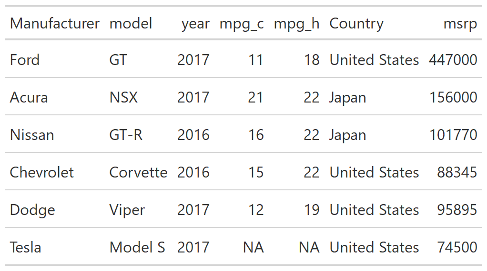
```
]

---

### Column labels

You can control text formatting of labels with Markdown or HTML syntax. This can be used on any text in a **gt** table.

.pull-left[
```{r gt03, eval = FALSE}
gtcars_small %>%
    gt() %>%
    cols_label( #<<
        mfr = md("**Manufacturer**"), #<<
        ctry_origin = html("<em>Country</em>") #<<
    ) #<<
```

<br/>
***Code notes:***  Use `md()` for markdown syntax and `html()` for HTML syntax.

]

.pull-right[
```{r table03, echo = FALSE, fig.alt = "Table using markdown and html syntax to make column labels bold and italic"}
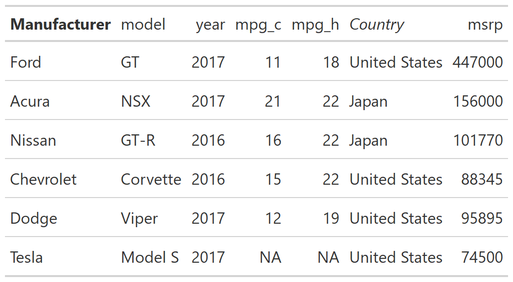
```
]

???

Of course this means you need to know markdown or HTML syntax. If you don't you can often find simple syntax with web searches

---

### Column alignment

Align all text within a column using `cols_align()`. Most commonly we left-align text with varying length and right-align numbers.

.pull-left[
```{r gt04, eval = FALSE}
gtcars_small %>%
    gt() %>%
    cols_label(
        mfr = "Manufacturer",
        ctry_origin = "Country"
    ) %>%
    cols_align( #<<
        align = "center", #<<
        columns = vars(mfr, model) #<<
    ) #<<
```

***Code notes:***  
-Choose `columns` to align with `vars()`  
-Changing *labels* doesn't change variable name
]

.pull-right[
```{r table04, echo = FALSE, fig.alt = "Table center aligning mfr and model"}
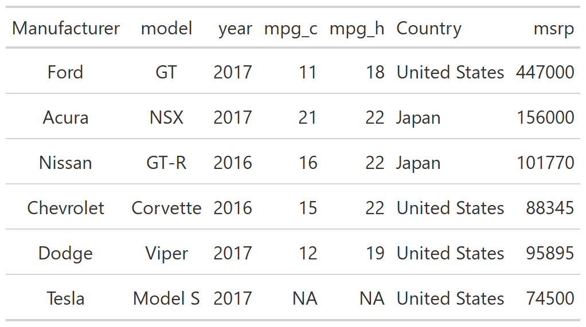
```
]

???

The defaults in gt already have things aligned to the standard so we will change alignment away from standard to show how this works

Call attention to use of vars() and bare variable names

---

### Code alignment

Align different columns different ways by adding multiple `cols_align()` layers.

.pull-left[
.smaller[
```{r gt05, eval = FALSE}
gtcars_small %>%
    gt() %>%
    cols_label(
        mfr = "Manufacturer",
        ctry_origin = "Country"
    ) %>%
    cols_align(
        align = "center",
        columns = vars(mfr, model)
    ) %>%
    cols_align( #<<
        align = "left", #<<
        columns = vars(mpg_c, mpg_h, msrp) #<<
    ) #<<
```
]
]

.pull-right[
```{r table05, echo = FALSE, fig.alt = "Table aligning values in sets of columns in different ways"}
knitr::include_graphics("figs/week04_files/gt05.png")
```
]

---

### Column order

Move columns to the start or end or wherever you'd like with the `cols_move_*()` functions.

.pull-left[
```{r gt06, eval = FALSE}
gtcars_small %>%
    gt() %>%
    cols_label(
        mfr = "Manufacturer",
        ctry_origin = "Country"
    ) %>%
    cols_move_to_start( #<<
        columns = vars(ctry_origin) #<<
    ) #<<
```
***Code notes:***
`cols_move_to_start()` to move to start, `*_end()` to end
]

.pull-right[
```{r table06, echo = FALSE, fig.alt = "Table moving ctry_origin to first column"}
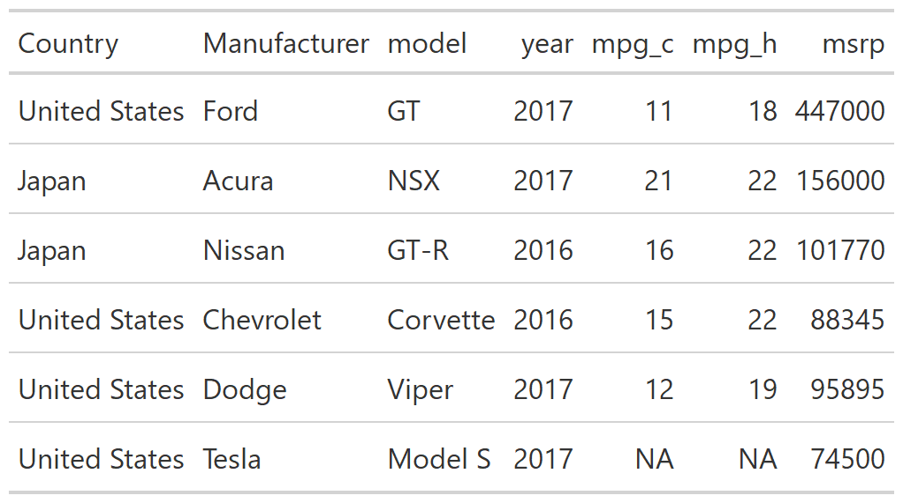
```

]

---

### Column order

Use `cols_move()` to move a column *after* another column.

.pull-left[
```{r gt07, eval = FALSE}
gtcars_small %>%
    gt() %>%
    cols_label(
        mfr = "Manufacturer",
        ctry_origin = "Country"
    ) %>%
    cols_move_to_start(
        columns = vars(ctry_origin)
    ) %>%
    cols_move( #<<
        columns = vars(mpg_c, mpg_h),#<<
        after = vars(msrp)#<<
    )#<<
```
***Code notes:***
Move the two `mpg` columns *after* `msrp`
]

.pull-right[
```{r table07, echo = FALSE, fig.alt = "Table after moving multiple columns after another"}
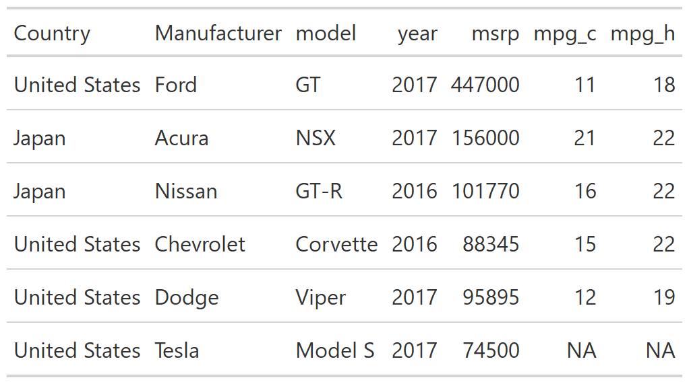
```
]

???

Point out the "after" argument plus more use of vars()

---

### Column widths

Control with widths of columns in pixels (`px()`) or percentage of the current size (`pct()`) with `cols_width()`.

.pull-left[
```{r gt08, eval = FALSE}
gtcars_small %>%
    gt() %>%
    cols_label(
        mfr = "Manufacturer",
        ctry_origin = "Country"
    ) %>%
    cols_move_to_start(
        columns = vars(ctry_origin)
    ) %>%
    cols_width(#<<
        vars(ctry_origin) ~ px(150)#<<
    )#<<
```
]

.pull-right[
```{r table08, echo = FALSE, fig.alt = "Table after making ctry_origin column wider, up to 150 px"}
knitr::include_graphics("figs/week04_files/gt08.png")
```
]

???

This widens the ctry_origin column from the defaults

---

### Column widths

If you want many columns to be the same width, use `everything()` after defining the widths of other columns.

.pull-left[
.smaller[
```{r gt09, eval = FALSE}
gtcars_small %>%
    gt() %>%
    cols_label(
        mfr = "Manufacturer",
        ctry_origin = "Country"
    ) %>%
    cols_move_to_start(
        columns = vars(ctry_origin)
    ) %>%
    cols_width( #<<
        vars(ctry_origin, mfr, model) ~ px(120), #<<
        everything() ~ px(50) #<<
    ) #<<
```
]
]

.pull-right[
```{r table09, echo = FALSE, fig.alt = "Table with 3 columns at 120 px and everything else set to 50 px"}
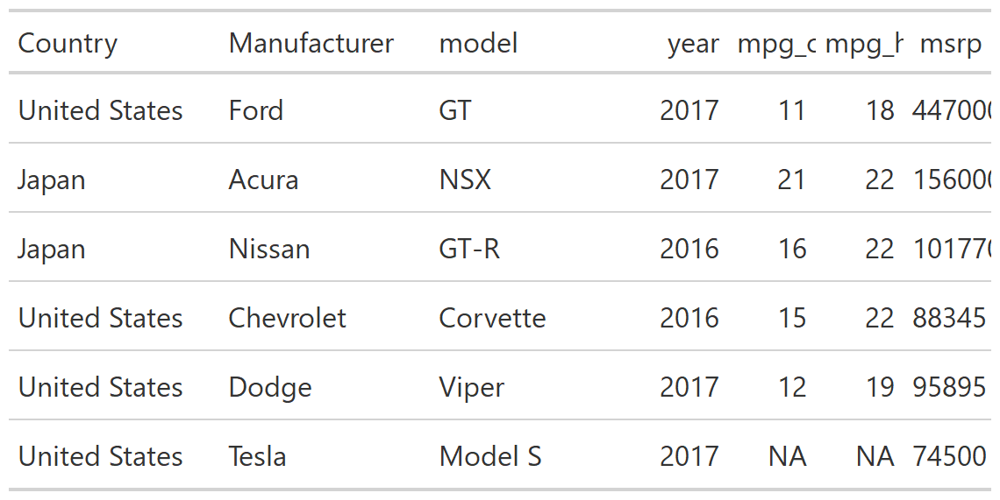
```
]

---

### Merging columns

You can combine multiple columns into one using `cols_merge()`.

.pull-left[
```{r gt10, eval = FALSE}
gtcars_small %>%
    gt() %>%
    cols_merge( #<<
        columns = vars(mpg_c, mpg_h) #<<
    ) #<<
```

<br/>
***Code notes:***  
-Combine the two `mpg` columns to show range of mileage in one column  
-Combined values have space between them by default   
-By default the name of new column based on first column listed  
]

.pull-right[
```{r table10, echo = FALSE, fig.alt = "Table combining mpg_c and mpg_h. The combined column is labeled mpg_c by default and the combined numbers have a space between them"}
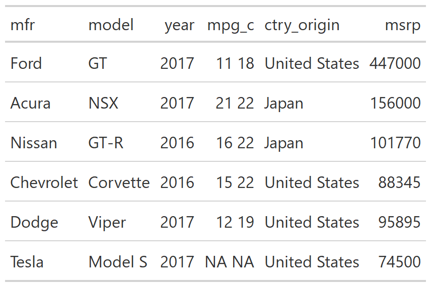
```
]

???

Columns to merge chosen again with vars()

---

### Merging columns

You can change the way values are combined with `pattern`. 

.pull-left[
```{r gt11, eval = FALSE}
gtcars_small %>%
    gt() %>%
    cols_merge( #<<
        columns = vars(mpg_c, mpg_h),#<<
        pattern = "{1}-{2}"#<<
    )#<<
```
***Code notes:***  
-`pattern` argument controls how columns combined, where `1` is first column and `2` is second  
-This code puts a hyphen between values  
]

.pull-right[
```{r table11, echo = FALSE, fig.alt = "Table combining mpg_c and mpg_h, using pattern to combine the values with a hyphen between them."}

```
]

---

### Your turn

Write code in the empty code chunk that is provided. 

Starting with the code above where we used `cols_merge()` on the `gtcars_small` dataset :  
-   We just made a new *merged* column called `mpg_c`. Change the name of this column to `Range`.
-   Change the name of `ctry_origin` to `Origin`.
-   Move `year` to be the first column, followed by `ctry_origin`.


```{r, echo = FALSE}
library(countdown)
countdown(minutes = 5, 
          bottom = 0,
          color_border = "#F4790B",
          color_text = "#1c5253",
          color_running_background = "#1c5253",
          color_running_text = "#F4790B",
          color_finished_background = "red",
          color_finished_text = "#1c5253")
```

---

### Your turn solution

.pull-left[
```{r yt1, eval = FALSE}
gtcars_small %>%
    gt() %>%
    cols_merge( 
        columns = vars(mpg_c, mpg_h),
        pattern = "{1}-{2}"
    ) %>%
    cols_label(
        mpg_c = "Range",
        ctry_origin = "Origin"
    ) %>%
    cols_move_to_start(
        columns = vars(year)
    ) %>%
    cols_move(
        columns = vars(ctry_origin),
        after = vars(year)
    )
```
]

.pull-right[
```{r yourturn1, echo = FALSE, fig.alt = "Table from the your turn solution"}
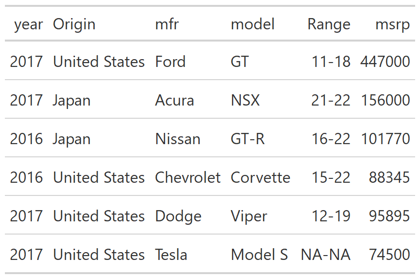
```
]

---

## Format columns

The **gt** package provides a series of [`fmt_*()` functions](https://gt.rstudio.com/reference/index.html#section-format-data) for formatting the values within columns. 

This can be done on entire rows or on individual cells (i.e., rows within columns).

---

### Number formatting

The function `fmt_number()` is for formatting numeric columns. We'll set the decimal place for `mpg_c` and add a suffix to `msrp`.

.pull-left[
```{r gt12, eval = FALSE}
gtcars_small %>%
    gt() %>%
    fmt_number( #<<
        columns = vars(mpg_c), #<<
        decimals = 1#<<
    ) %>%#<<
    fmt_number(#<<
        columns = vars(msrp),#<<
        decimals = 0,#<<
        suffixing = TRUE#<<
    ) #<<
```
***Code notes:***  
-`decimals` defaults to 2   
-`suffixing` is for adding large number suffixes like `K` for thousands
]

.pull-right[
```{r table12, echo = FALSE, fig.alt = "Table output showing mpg_c with a single decimal place and msrp as thousands so ends with K suffix like 447000 is 447K"}
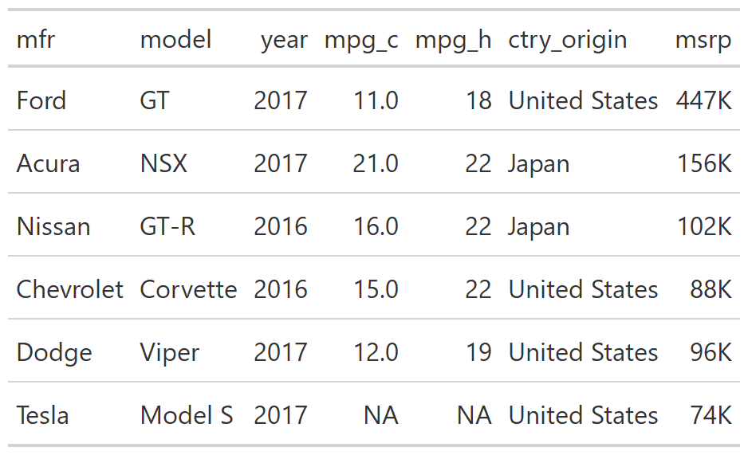
```
]

???

Includes, e.g., choosing the number of decimal places, setting the decimal separator (defaults to "."), and large-number suffixes such as `K` for thousands.

Note still choose columns with `vars()`


---

### Currency formatting

Add a currency symbol using `fmt_currency()`. We'll add a dollar sign to `msrp`. 

.pull-left[
```{r gt13, eval = FALSE}
gtcars_small %>%
    gt() %>%
    fmt_currency( #<<
        columns = vars(msrp), #<<
        currency = "USD",#<<
        decimals = 0,#<<
        suffixing = TRUE#<<
    )#<<
```

<br/>
***Code notes:***  `USD` is the default currency symbol, although it is written out explicitly here  
]

.pull-right[
```{r table13, echo = FALSE, fig.alt = "Table output adds a dollar sign to msrp plus K for thousands, so $447000 is $447K"}

```
]

???

This function has many options we won't see today, including options for how to display negative values.

---

### Currency formatting

We can change the currency symbol, using either 3-letter currency codes or common currency names. 

.pull-left[
```{r gt14, eval = FALSE}
gtcars_small %>%
    gt() %>%
    fmt_currency(
        columns = vars(msrp), 
        currency = "EUR", #<<
        decimals = 0,
        suffixing = TRUE
    )
```

<br/>
***Code notes:***  `EUR` stands for euros  
]

.pull-right[
```{r table14, echo = FALSE, fig.alt = "Table output now uses euro symbol instead of USD on msrp"}
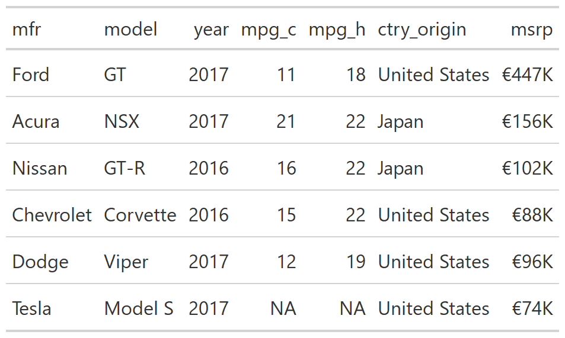
```
]

---

### Currency formatting

Change the currency symbol to pounds.

.pull-left[
```{r gt15, eval = FALSE}
gtcars_small %>%
    gt() %>%
    fmt_currency(
        columns = vars(msrp), 
        currency = "pound", #<<
        decimals = 0,
        suffixing = TRUE
    )
```
]

.pull-right[
```{r table15, echo = FALSE, fig.alt = "Table output uses UK pound symbol instead of USD on msrp"}
knitr::include_graphics("figs/week04_files/gt15.png")
```
]

---

### Percent formatting

Use `fmt_percent()` for percent formatting. We'll pretend the `mpg` columns are percents.

.pull-left[
```{r gt16, eval = FALSE}
gtcars_small %>%
    gt() %>% 
    fmt_percent( #<<
        columns = vars(mpg_c, mpg_h),#<<
        decimals = 0#<<
    )#<<
```
]

.pull-right[
```{r table16, echo = FALSE, fig.alt = "Table output converted mpg_c and mpg_h to percents using value*100%"}
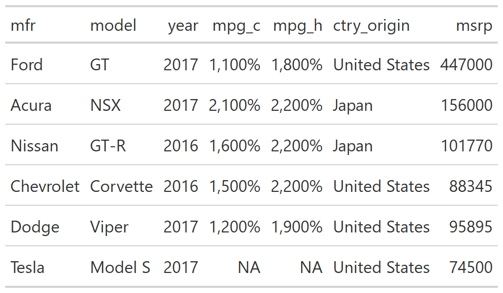
```
]

???

Point out that values are multiplied by 100 before being turned to %

---

### Percent formatting

By default, the values were multiplied by 100 prior to adding the `%` symbol. Use `scale_value = FALSE` to change this if you are not working with proportions.

.pull-left[
```{r gt17, eval = FALSE}
gtcars_small %>%
    gt() %>% 
    fmt_percent(
        columns = vars(mpg_c, mpg_h),
        decimals = 0,
        scale_value = FALSE #<<
    )
```
]

.pull-right[
```{r table17, echo = FALSE, fig.alt = "Table converting mpg_c and mpg_h to percents using value%"}
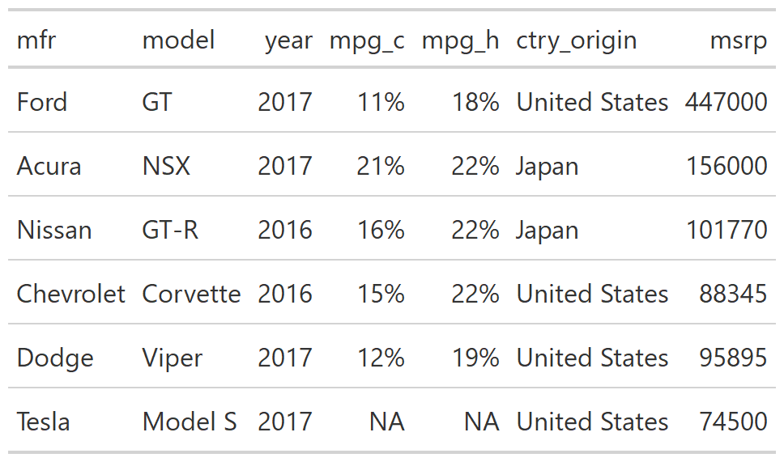
```
]

---

### Missing values formatting

By default missing values in R are `NA`. We can change that using `fmt_missing()`.

.pull-left[
```{r gt18, eval = FALSE}
gtcars_small %>%
    gt() %>%
    fmt_missing( #<<
        columns = contains("mpg") #<<
    ) #<<
```

<br/>
***Code notes:***  
-Note use of `contains()` select helper function for picking columns instead of `vars()`  
-By default the new missing text is `---`
]

.pull-right[
```{r table18, echo = FALSE, fig.alt = "Table with missing values in mpg_c and mpg_h as 3 dashes, ---, which looks like a long solid dash in the output table"}
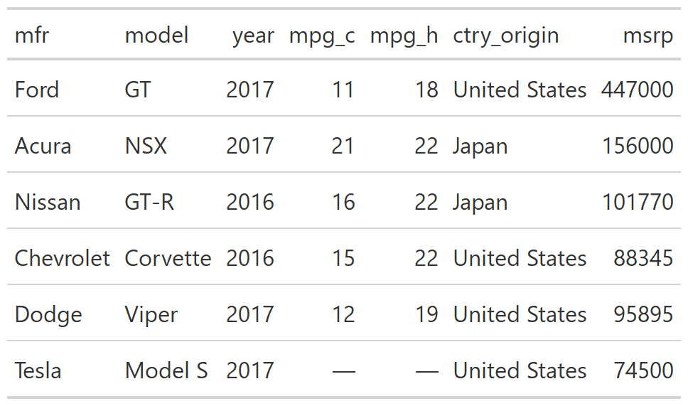
```
]

???

We can use select helper functions like contains() to more efficiently choose columns instead of writing each one out

---

### Missing values formatting

We can control what we set missing values to with the `missing_text`. Let's change missing values to `none`.

.pull-left[
```{r gt19, eval = FALSE}
gtcars_small %>%
    gt() %>%
    fmt_missing(
        columns = contains("mpg"),
        missing_text = "none" #<<
    )
```
]

.pull-right[
```{r table19, echo = FALSE, fig.alt = "Table output has 'none' as missing text in mpg_c and mpg_h"}
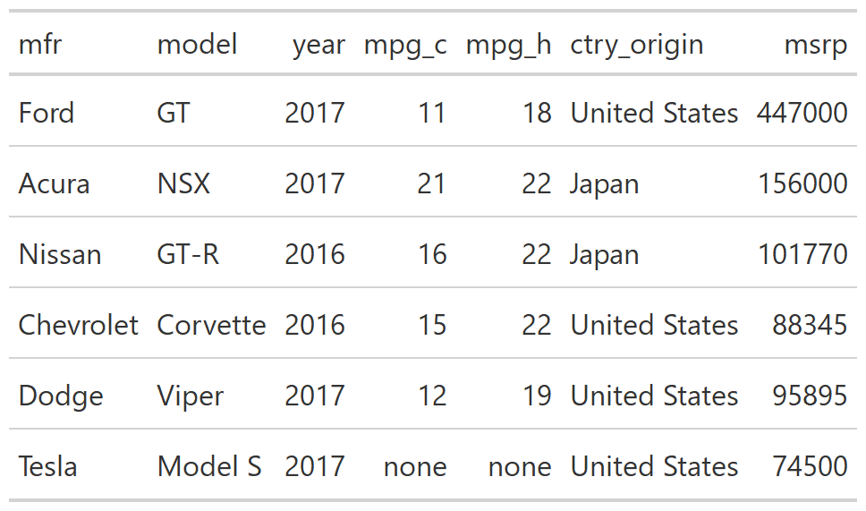
```
]

---

### Formatting specific cells

All the `fmt_*()` functions work on entire columns by default. We can focus on specific rows using the `rows` argument. [Jonathan Schwabish's "Ten Guidelines for Better Tables"](https://www.cambridge.org/core/journals/journal-of-benefit-cost-analysis/article/abs/ten-guidelines-for-better-tables/74C6FD9FEB12038A52A95B9FBCA05A12) recommends adding symbols only to the first row in each column.

.pull-left[
```{r gt20, eval = FALSE}
gtcars_small %>%
    gt() %>%
    fmt_percent(
        columns = 4:5, #<<
        rows = 1, #<<
        decimals = 0,
        scale_values = FALSE
    )
```
***Code notes:***  
-Here I chose the columns by *position*  
-Choose the `rows` by index  
-Note alignment issue and [potential fix](https://themockup.blog/posts/2020-09-04-10-table-rules-in-r/#rule-7-remove-unit-repetition)
]

.pull-right[
```{r table20, echo = FALSE, fig.alt = "Table output has added a percent symbol only to values in the first row of mpg_c and mpg_h. These are no longer aligned perfectly with the rest of the column"}
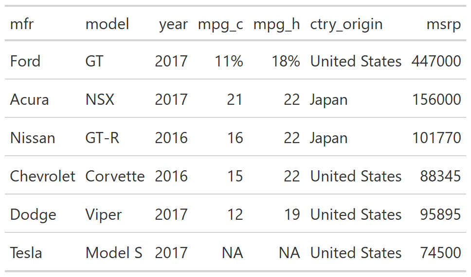
```
]

???

You'll note this changes the alignment of the column, which is not ideal. There is an open issue to fix this in **gt**. In the meantime, check out Thomas Mock's work-arounds in his [blog post](https://themockup.blog/posts/2020-09-04-10-table-rules-in-r/#rule-7-remove-unit-repetition).

You can choose the columns by index (position) in addition to using vars() and select helper functions

---

### Date-time formatting

While we aren't going to explore them today, if you are working with dates, times, or date-times you'll find the respective `fmt_*()` functions for those to be useful. 

Here's a link to some examples of formatting dates and times in the **gt** Cookbook: <https://themockup.blog/static/gt-cookbook.html#Date_formatting>.

---

### Your turn

Write code in the empty code chunk that is provided. 

You will be using `mtcars_small` for this exercise.  
-   Convert `carb` to a percent with 1 decimal place, where `4` = `4.0%`.
-   Replace the missing value in `disp` with `---`.
-   Replace the missing value in `qsec` with "missing".
-   Add the `yen` currency symbol to `hp` with 0 decimal places.

```{r, echo = FALSE}
countdown(minutes = 5, 
          bottom = 0)
```

---

### Your turn solution

.pull-left[
```{r yt2, eval = FALSE}
mtcars_small %>%
    gt() %>%
    fmt_percent(
        columns = vars(carb),
        decimals = 1,
        scale_values = FALSE
    ) %>%
    fmt_missing(
        columns = vars(disp)
    ) %>%
    fmt_missing(
        columns = vars(qsec),
        missing_text = "missing"
    ) %>%
    fmt_currency(
        columns = vars(hp),
        currency = "yen",
        decimals = 0
    )
```
]

.pull-right[
.center[
```{r yourturn2, echo = FALSE, out.width = "70%", fig.alt = "Your turn solution table"}
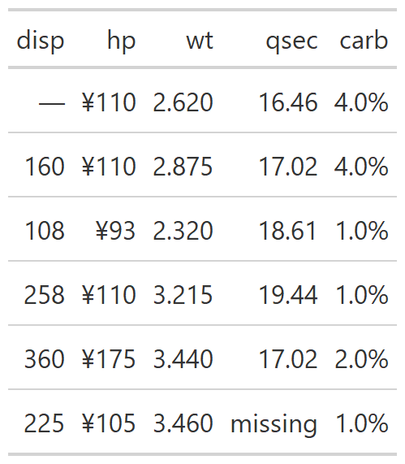
```
]
]

---

## Row names, row groups, and summary rows

Let's switch to thinking about the table rows.

The rows are what **gt** refers to as the *stub*. The stub is often a column of row labels that doesn't have (or need) a column label. We can also add grouping to separate rows in distinct groups.

---

### Row names

The variable that represents the rows  is an argument within the `gt()` function. Let's start by using `"ctry_origin"` as row labels. 

.pull-left[
```{r gt21, eval = FALSE}
gtcars_small %>%
    gt(rowname_col = "ctry_origin") #<<
```

<br/>
***Code notes:***  
-Put quotes around the variable in `rowname_col`  
-Use `tab_stubhead()` to add a column name if desired  
]

.pull-right[
```{r table21, echo = FALSE, fig.alt = "Table output has ctry_origin has row variable, which is moved to first column and the column label removed"}
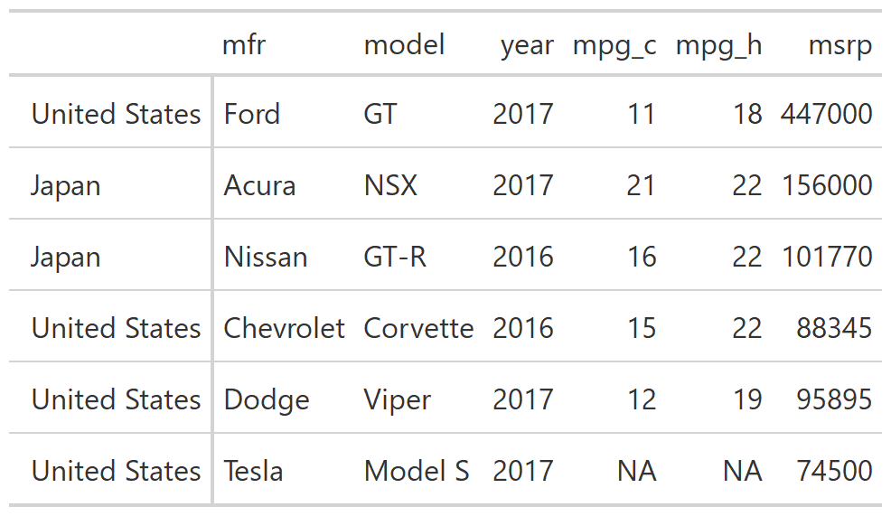
```
]

???

You can see the column is moved to the beginning of the table and, by default, does not have a column name. Add a column name using `tab_stubhead()`.

---

### Row groups

Adding row groups helps organize a table. This can be done by assigning a grouping variable with `groupname_col` in `gt()`. You can also pass a grouped dataset from **dplyr** to set the groups.

Let's group by `"ctry_origin"` to organize the output table rows in groups by country.

.pull-left[
```{r gt22, eval = FALSE}
gtcars_small %>%
    gt(groupname_col = "ctry_origin") #<<
```

<br/>
***Code notes:***  
-Put quotes around the variable in `groupname_col`  
-Default group order from order in table  
-Change order of groups using `row_group_order()`  
]

.pull-right[
.center[
```{r table22, echo = FALSE, out.width = "70%", fig.alt = "Table output has ctry_origin has row grouping so USA rows are all grouped together and then Japan rows are all grouped together. ctry_origin no longer has a separate column"}
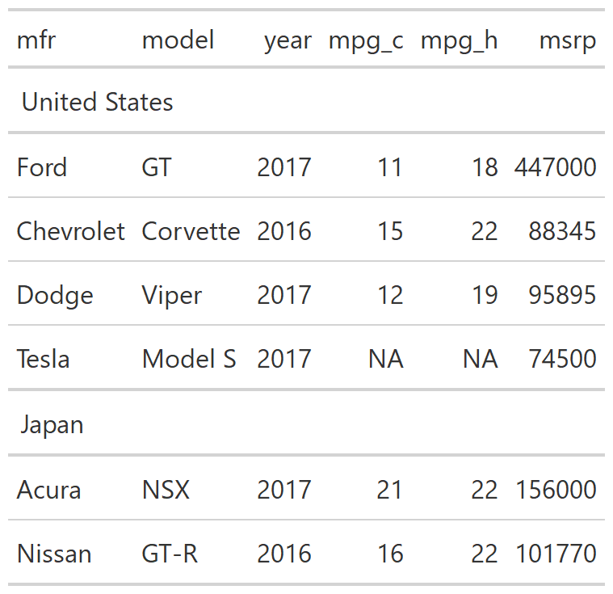
```
]
]

???

Default order of groups is from order of variable in table. Change with row_group_order()

---

### Row names and groups

In many cases we'll want to have a row names column when we have groups to help organize the table even more.

Let's group by `"ctry_origin"` and put `"year"` as the row names.

.pull-left[
```{r gt23, eval = FALSE}
gtcars_small %>%
    gt( #<<
        rowname_col = "year",#<<
        groupname_col = "ctry_origin"#<<
    )#<<
```

<br/>
***Code notes:***  In some cases you may want blank row names. See an example from the **gt** Cookbook [here](https://themockup.blog/static/gt-cookbook.html#create-blank-rownames) for one approach.  
]

.pull-right[
.center[
```{r table23, echo = FALSE, out.width = "70%", fig.alt = "Table output has row column years in order within each ctry_origin group at the beginning of the table (in the 'stub')"}
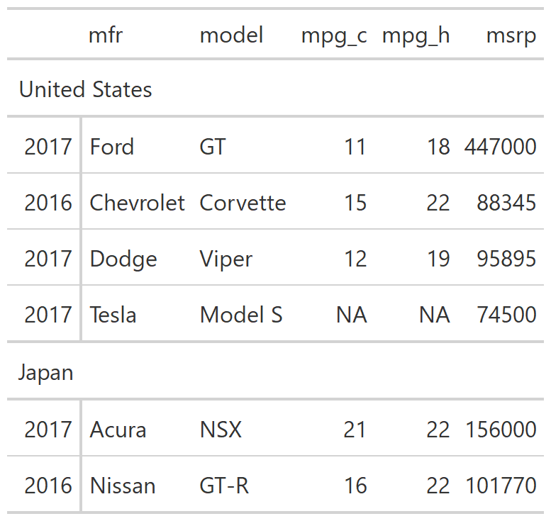
```
]
]

---

### Manual groups

You can manually define groups using the function `tab_row_group()` along with a logical statement. 

.pull-left[
```{r gt24, eval = FALSE}
gtcars_small %>%
    gt() %>%
    tab_row_group(#<<
        group = "Low city mpg",#<<
        rows = mpg_c < 21#<<
    ) %>%#<<
    tab_row_group(#<<
        group = "High city mpg",#<<
        rows = mpg_c >= 21#<<
    ) #<<
```
***Code notes:***  
-This makes two groups so uses `tab_row_group()` twice  
-The rows to group are defined in `rows`  
-The group name is defined in `group`  
]

.pull-right[
```{r table24, echo = FALSE, out.width = "70%", fig.alt = "Table output has two groups based on low vs high city mpg. Tesla falls in own group because mpg_c is NA"}
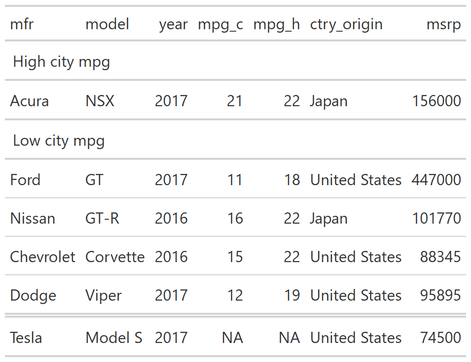
```
]

???

Let's make two groups, one for "low" city `mpg_c` (\<21) and one for "high". This involves two calls to `tab_row_group()`. If you have many groups, you may consider making a grouping column prior to creating the **gt** table rather than doing it here.

Note how Tesla doesn't fall in a group because it has NA for mpg_c. By default this is put by itself at the bottom of the table.

---

### Summary rows

Once we have groups, we may want to add summaries for each group with `summary_rows()`.

.pull-left[
```{r gt25, eval = FALSE}
gtcars_small %>%
    gt(
        rowname_col = "year",
        groupname_col = "ctry_origin"
    ) %>%
    summary_rows( #<<
        groups = TRUE,#<<
        columns = vars(msrp),#<<
        fns = list(Average = ~mean(.))#<<
        )#<<
```
***Code notes:***  
-Use `groups = TRUE` for group summaries  
-Must have a [rowname column](https://github.com/rstudio/gt/issues/602)  
-Choose columns to work on in `columns`    
-`fns` are in a list. Note naming and tilde (`~`) coding   
]

.pull-right[
.center[
```{r table25, echo = FALSE, out.width = "70%", fig.alt = "Table output has a row showing the average msrp per group named 'Average'"}
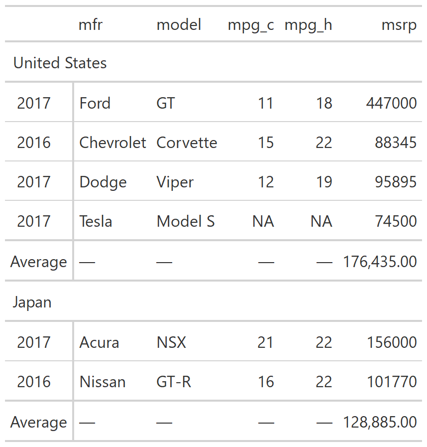
```
]
]

???

The issue of the rowname column is a bug, reported here: https://github.com/rstudio/gt/issues/602

---

### Summary rows

Use the `formatter` argument to pass `fmt_*()` functions to control the output format. 

.pull-left[
.smaller[
```{r g26, eval = FALSE}
gtcars_small %>%
    gt(
        rowname_col = "year",
        groupname_col = "ctry_origin"
    ) %>%
    summary_rows(
        groups = TRUE,
        columns = vars(msrp),
        fns = list(Average = ~mean(.),#<<
                   SD = ~sd(.)),#<<
        formatter = fmt_number,#<<
        decimals = 0#<<
        )
```
]

***Code notes:***  
-Add more functions to the list to get more summaries  
-Add in `fmt_*()` arguments such as `decimals`      
]

.pull-right[
.center[
```{r table26, echo = FALSE, out.width = "70%", fig.alt = "Table output now has both average and SD summary rows for msrp in each group, rounding to 0 decimal places"}
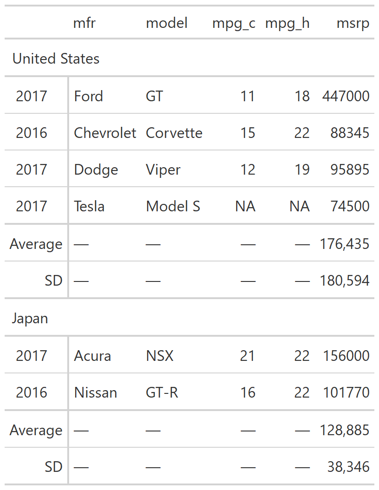
```
]
]

---

### Summary rows

Watch out for missing values when summarizing. 

You likely noted non-summarized columns are given `---`. Change this with `missing_text` argument. 

.pull-left[
.smaller[
```{r gt27, eval = FALSE}
gtcars_small %>%
    gt(
        rowname_col = "year",
        groupname_col = "ctry_origin"
    ) %>%
    summary_rows(
        groups = TRUE,
        columns = contains("mpg"),
        fns = list(Average = ~mean(., na.rm = TRUE)), #<<
        missing_text = "" #<<
        )
```
]

***Code notes:***  
-Add in `na.rm = TRUE` to the `mean()` function    
-Using `""` returns a blank for `missing_text` 
]

.pull-right[
.center[
```{r table27, echo = FALSE, out.width = "70%", fig.alt = "Table adds an 'Average' summary row for mpg_c and mpg_h, ignoring the missing value when taking the mean. Other columns that didn't average are left blank in the summary row"}
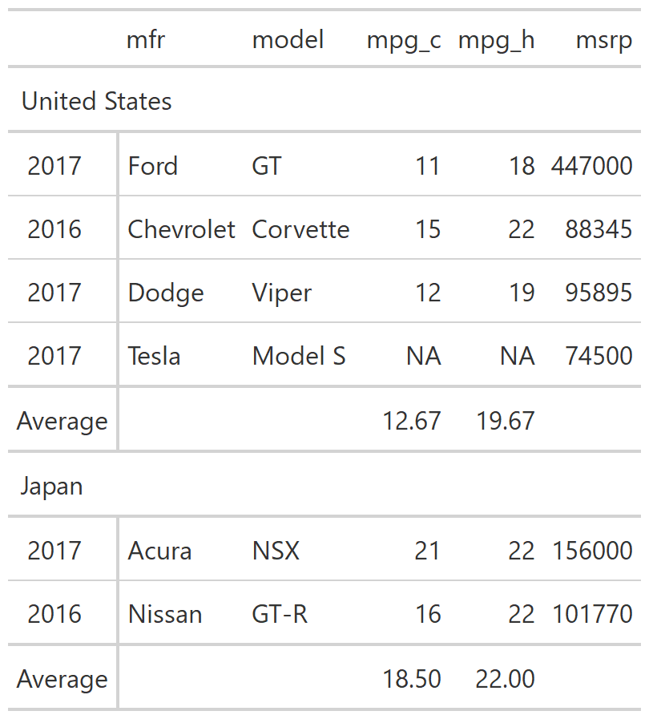
```
]
]

---

### Summary rows

If you have all numeric columns, leave the `columns` argument out of the function to summarize all columns at once. Switch to `mtcars_small` to see this.

.pull-left[
.smaller[
```{r gt28, eval = FALSE}
mtcars_small %>%
    gt(
        rowname_col = "hp",
        groupname_col = "carb"
    ) %>%
    summary_rows( #<<
        groups = TRUE, #<<
        fns = list(Average = ~mean(., na.rm = TRUE)) #<<
    ) #<<
```
]

<br/>
***Code notes:***  This doesn't average per group without a rowname column, which is a [bug](https://github.com/rstudio/gt/issues/602)    
]

.pull-right[
.center[
```{r table28, echo = FALSE, out.width = "35%", fig.alt = "Table output has summary row for  average of all non-row variables for each carb group based on mtcars_small"}
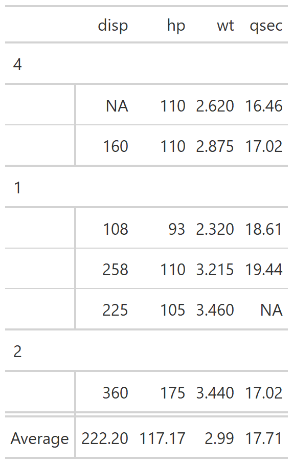
```
]
]

---

### Grand summary

Add an overall summary along with group summaries with `grand_summary_rows()` or leave out `groups = TRUE` from `summary_rows()`.

.pull-left[
```{r gt29, eval = FALSE}
gtcars_small %>%
    gt(
        rowname_col = "year",
        groupname_col = "ctry_origin"
    ) %>%
    grand_summary_rows( #<<
        columns = vars(msrp), #<<
        fns = list(Average = ~mean(.)) #<<
    ) #<<
```
]

.pull-right[
.center[
```{r table29, echo = FALSE, out.width = "90%", fig.alt = "Table output now has an overall summary row across all groups for the average of msrp instead of for each group."}
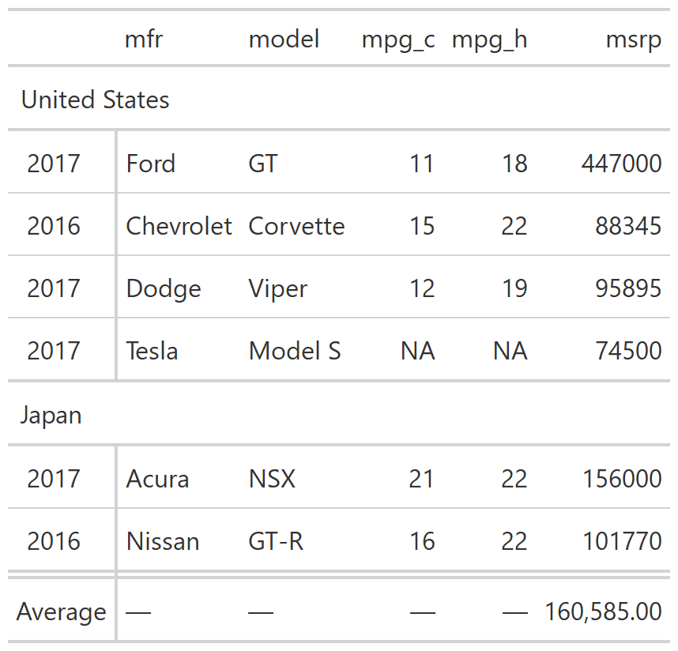
```
]
]

---

### Your turn

Write code in the empty code chunk that is provided. 

Take `gtcars_small` and do the following:  
-   Group rows by `year`
-   Use `ctry_origin` as row names
-   Add the total `msrp` per group with the row name "Total"
-   Finally, add the overall total `msrp` across groups with the row name "Overall"

```{r, echo = FALSE}
countdown(minutes = 5, 
          bottom = 0)
```

---

### Your turn solution

.pull-left[
```{r yt3, eval = FALSE}
gtcars_small %>%
    gt(
        rowname_col = "ctry_origin",
        groupname_col = "year"
    ) %>%
    summary_rows(
        groups = TRUE,
        columns = vars(msrp),
        fns = list(Total = ~sum(.))
    ) %>%
    grand_summary_rows(
        columns = vars(msrp),
        fns = list(Overall = ~sum(.))
    )
```
]

.pull-right[
.center[
```{r yourturn3, echo = FALSE, out.width = "80%", fig.alt = "Your turn solution table"}
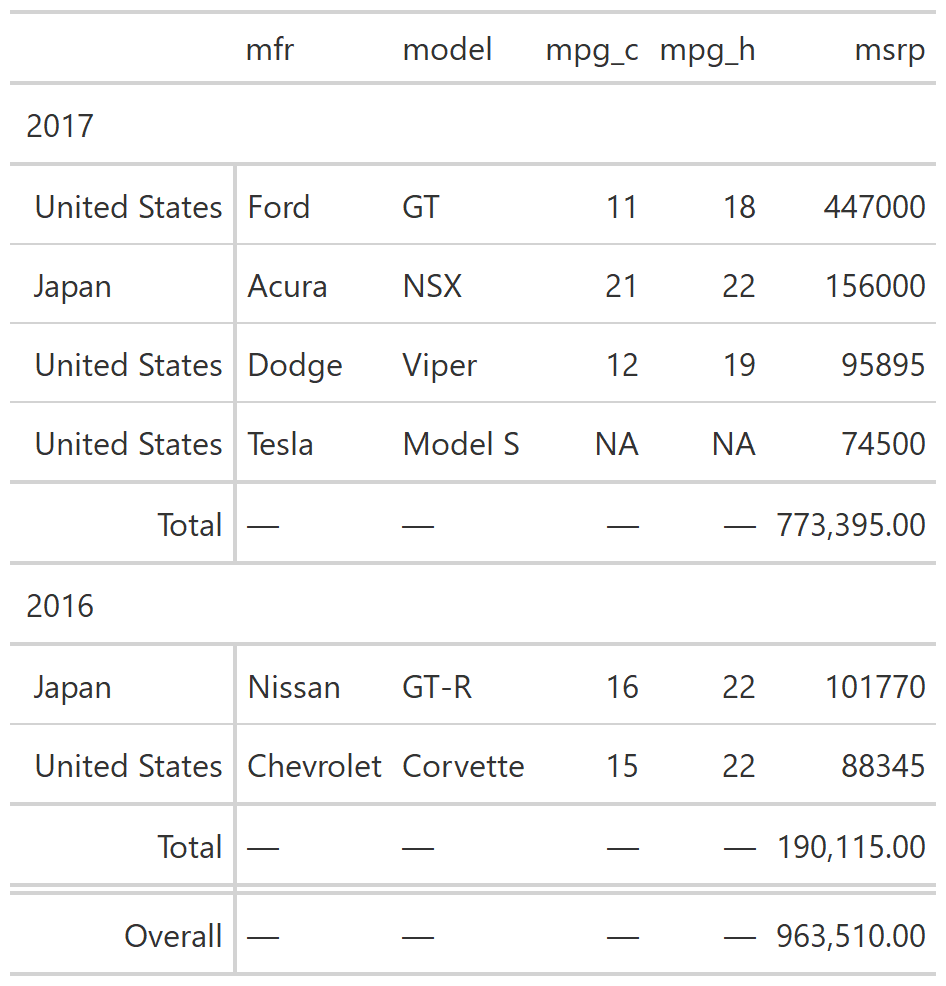
```
]
]

---

## Headers, column spanners, and notes

We can add information to our table using a series of [`tab_*()` functions](https://gt.rstudio.com/reference/index.html#section-create-or-modify-parts). 

Per the **gt** documentation, these functions are for *creating or modifying parts* of your display table.

---

### Headers

Add a title and/or subtitle as a header using `tab_header()`.

.pull-left[
.smaller[
```{r gt30, eval = FALSE}
gtcars_small %>%
    gt() %>%
    tab_header(#<<
        title = "Deluxe automobiles from the 2014-2017 period",#<<
        subtitle = "Data from the United States and Japan"#<<
    )#<<
```
]
]

.pull-right[
```{r table30, echo = FALSE, fig.alt = "Table output with title and subtitle added to the top. These are centered by default."}
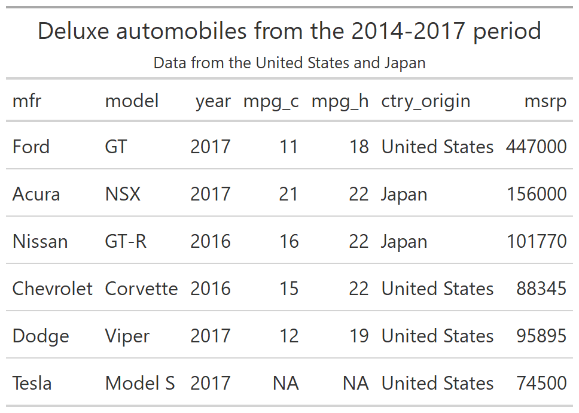
```
]

???

Centered by default

---

### Headers

As we saw with column labels, we can control formatting with `md()` or `html()` syntax.

.pull-left[
.smaller[
```{r gt31, eval = FALSE}
gtcars_small %>%
    gt() %>%
    tab_header(
        title = "Deluxe automobiles from the 2014-2017 period",
        subtitle = md("Data from the **United States** and **Japan**") #<<
    )
```
]
]

.pull-right[
```{r table31, echo = FALSE, fig.alt = "Table output subtitle has bold country names"}
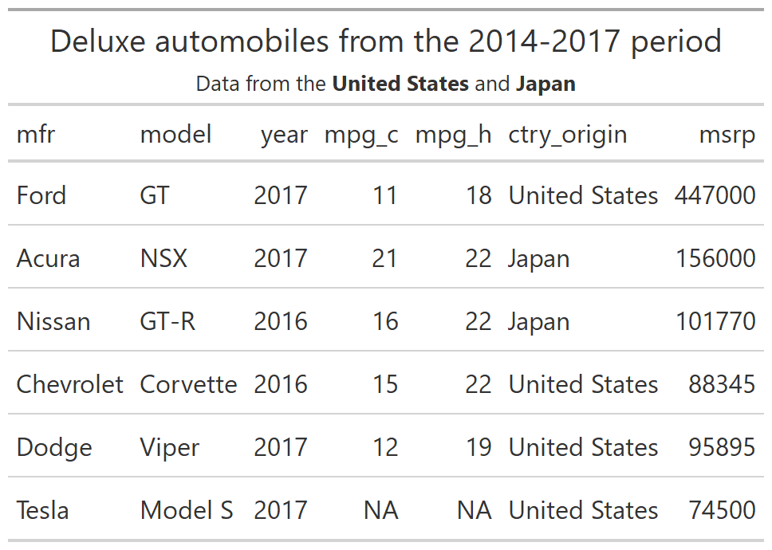
```
]

---

### Spanner column labels

Spanning columns is way of grouping similar columns instead of rows. This can be done with `tab_spanner()`. 

.pull-left[
```{r gt32, eval = FALSE}
gtcars_small %>%
    gt() %>%
    tab_spanner( #<<
        label = "Miles per gallon", #<<
        columns = vars(mpg_c, mpg_h) #<<
    ) #<<
```

<br/>
***Code notes:***  
-Use `label` to name the spanning column      
-Choose columns to group together with `columns` 
]

.pull-right[
```{r table32, echo = FALSE, fig.alt = "Table output has a spanner column over mpg_c and mpg_h titled 'Miles per gallon'"}
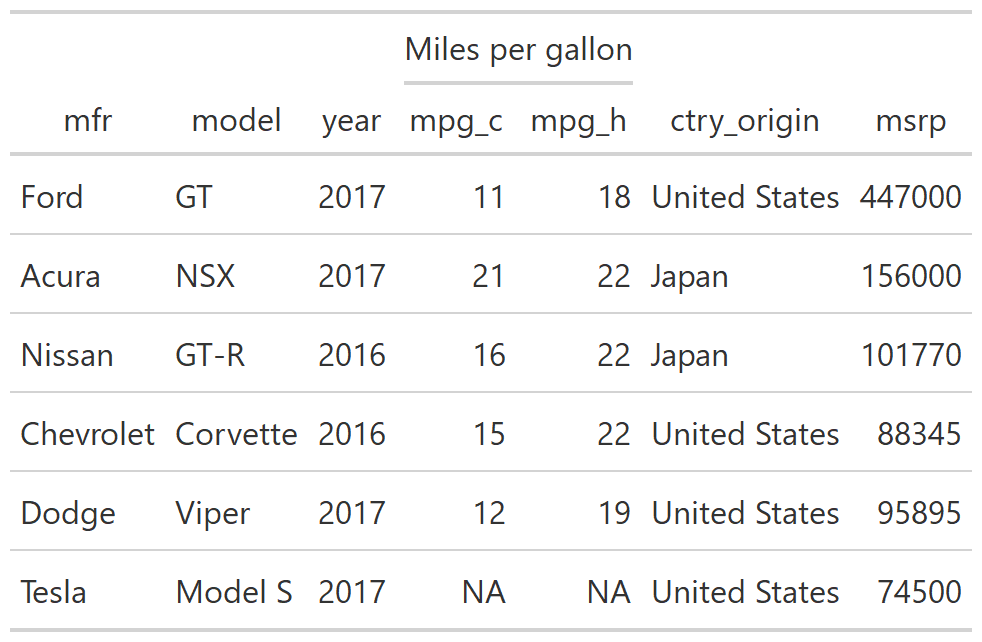
```
]

---

### Spanner column labels

Tables can have multiple spanners encompassing different groups of columns.

.pull-left[
```{r gt33, eval = FALSE}
gtcars_small %>%
    gt() %>%
    tab_spanner(
        label = "Miles per gallon",
        columns = vars(mpg_c, mpg_h)
    ) %>%
    tab_spanner( #<<
        label = "Car type", #<<
        columns = 1:2 #<<
    ) #<<
```
***Code notes:***  
-Multiple spanners means multiple `tab_spanner()` layers  
-Columns do not need to by side-by-side in original table
]

.pull-right[
```{r table33, echo = FALSE, fig.alt = "Table output has two spanner columns, one for mfr and model called 'Car type' and one for mpg_c and mpg_h called 'Miles per gallon'"}
knitr::include_graphics("figs/week04_files/gt33.png")
```
]

???

Columns do not have to be side-by-side to be grouped and then spanned, although they will be lumped together in the output table

---

### Source notes

Source notes are generally notes about where the data in the table came from. Use `tab_source_note()` to add a source note. 

.pull-left[
.smaller[
```{r gt34, eval = FALSE}
gtcars_small %>%
    gt() %>%
    tab_source_note( #<<
        source_note = md("*Data from [package **gt**](https://gt.rstudio.com/reference/gtcars.html)*") #<<
    )#<<
```
]

<br/>
***Code notes:***  
-Notes default to bottom but can be moved (*not shown*)        
-You can use `md()` and `html()` with notes  
]

.pull-right[
```{r table34, echo = FALSE, fig.alt = "Table output has a source note at the bottom to indicate the dtaa is from package gt"}
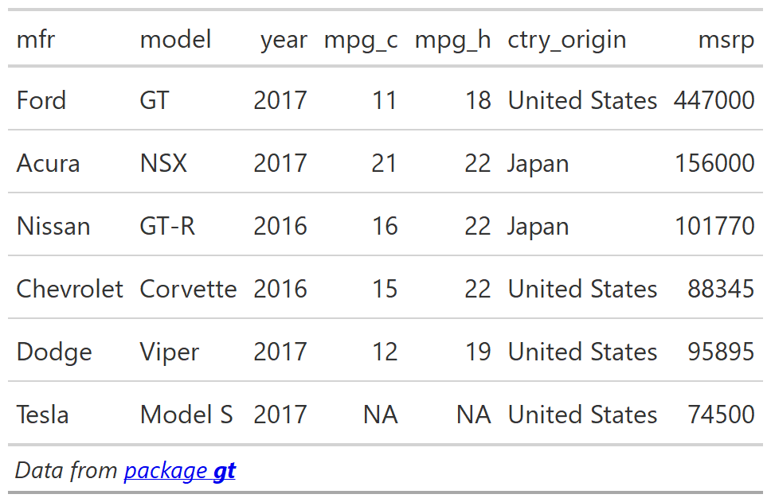
```
]

---

### Footnotes

We can add footnotes to add information on important components of the table that may not be clear. This is done with `tab_footnote()`.

.pull-left[
.smaller[
```{r gt35, eval = FALSE}
gtcars_small %>%
    gt() %>%
    tab_source_note(
        source_note = md("*Data from [package **gt**](https://gt.rstudio.com/reference/gtcars.html)*")
    ) %>%
    tab_footnote( #<<
        footnote = "In USD", #<<
        location = cells_column_labels( #<<
            columns = vars(msrp) #<<
        ) #<<
    ) #<<
```
]

***Code notes:***  
-Pass footnote text to `footnote`           
-Use `locations` for footnote placement using [`cells_*()` helper functions](https://gt.rstudio.com/reference/index.html#section-helper-functions)  
]

.pull-right[
```{r table35, echo = FALSE, fig.alt = "Table output has a footnote added to msrp column label and shows footnote saying this is in USD"}
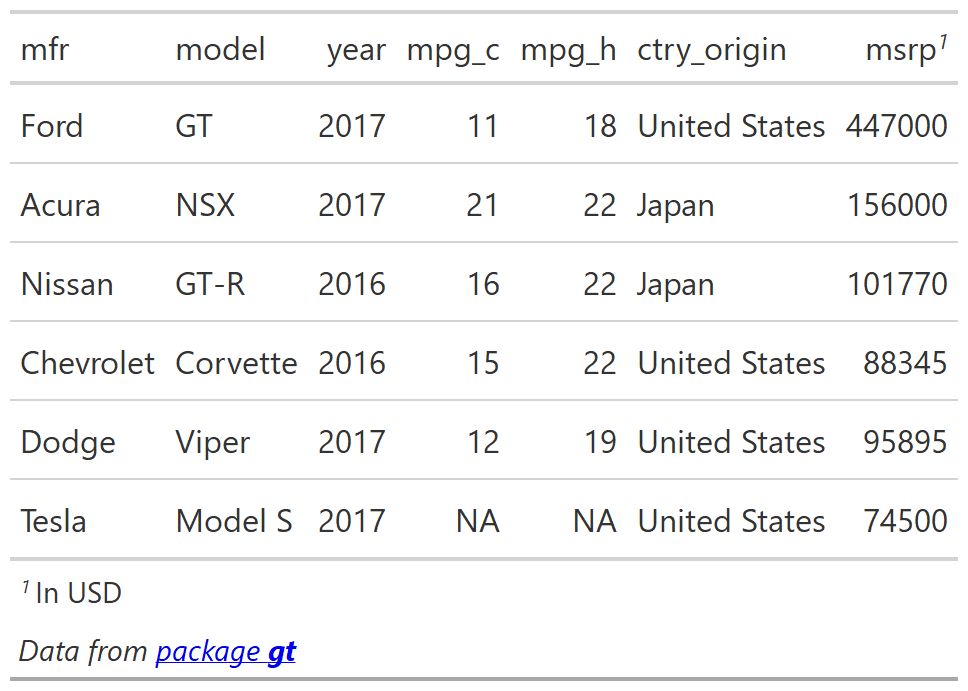
```
]

???

The `locations` argument is how we set the placement of the footnote. This involves a series of [`cells_*()` helper functions](https://gt.rstudio.com/reference/index.html#section-helper-functions) that we have not covered yet. We'll use a couple of these but will not go through them in detail. `cells_column_labels()` indicates column label placement

---

### Footnotes

**gt** keeps track of our footnote numbering for us. The one that is first in the table is given an earlier number even if we list them out of order in our code.

.pull-left[
.smaller[
```{r gt36, eval = FALSE}
gtcars_small %>%
    gt() %>%
    tab_source_note(
        source_note = md("*Data from [package **gt**](https://gt.rstudio.com/reference/gtcars.html)*")
    ) %>%
    tab_footnote(
        footnote = "In USD",
        location = cells_column_labels(
            columns = vars(msrp)
        )
    ) %>%
    tab_footnote( #<<
        footnote = "City miles per gallon", #<<
        location = cells_column_labels( #<<
            columns = vars(mpg_c) #<<
        ) #<<
    ) #<<
```
]
]

.pull-right[
```{r table36, echo = FALSE, fig.alt = "Table output has two footnotes, one on column label for mpg_c, described as city miles per gallon, and one on column lable msrp, described as in USD"}
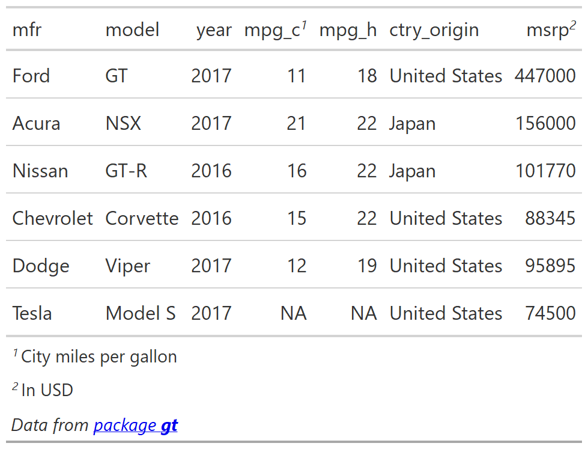
```
]

???

You can put footnotes wherever you want, including in individual cells, on row groups, etc. It all depends on what `cells*()` helper function you use.

---

### Your turn

Write code in the empty code chunk that is provided. 

Using the `mtcars_small` dataset  
-   Add a header title and subtitle to describe the table however you'd like
-   Group columns `disp`, `hp`, `qsec`, and `carb` with spanner label "Engine"
-   Add a source note to indicate the data are from a 1974 issue of Motor Trend magazine
-   Add a footnote to describe `disp` (engine displacement in cubic inches)

```{r, echo = FALSE}
countdown(minutes = 5, 
          bottom = 0)
```

---

### Your turn solution

.pull-left[
.smaller[
```{r yt4, eval = FALSE}
mtcars_small %>%
    gt() %>%
    tab_header(
        title = "Here is my header",
        subtitle = "It is filled with information"
    ) %>%
    tab_spanner(
        label = "Engine",
        columns = vars(disp, hp, qsec, carb)
    ) %>%
    tab_source_note(
        source_note = md("*Data from 1974 issue of Motor Trend magazine*")
    ) %>%
    tab_footnote(
        footnote = "Displacement in cubic inches",
        location = cells_column_labels( 
            columns = vars(disp) 
        ) 
    )
```
]
]

.pull-right[
.center[
```{r yourturn4, echo = FALSE, out.width = "70%", fig.alt = "Your turn solution table"}
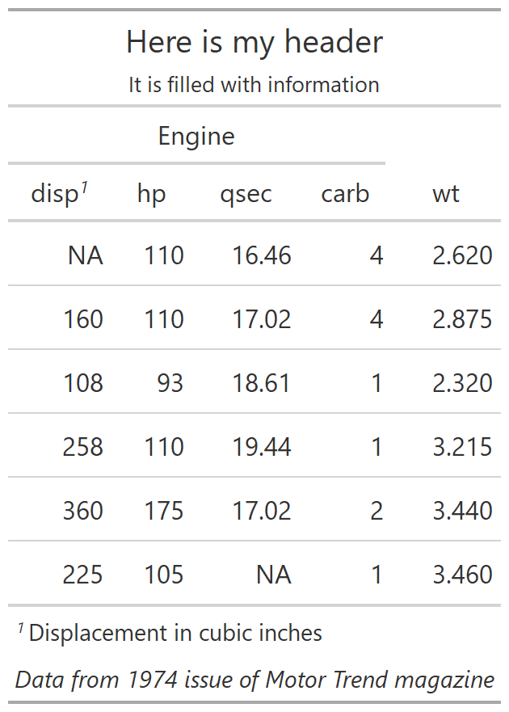
```
]
]

---

## Table styling

The **gt** package allows for an enormous amount of customization, allowing you to build a *theme* for what your tables should look like.

Your table appearance will depend on your audience, and a table for a manuscript will likely look a lot different than one you build for an HTML document you are sharing.

We'll take a cursory look at some options today and then look at some overall themes next week.

---

### Table option functions

The family of `opt_*_*()` functions are for setting some commonly used table options.  Add row stripes with `opt_row_striping()`.

.pull-left[
```{r gt37, eval = FALSE}
gtcars_small %>%
    gt() %>%
    opt_row_striping() #<<
```
]

.pull-right[
```{r table37, echo = FALSE, fig.alt = "Table output with row striping added."}
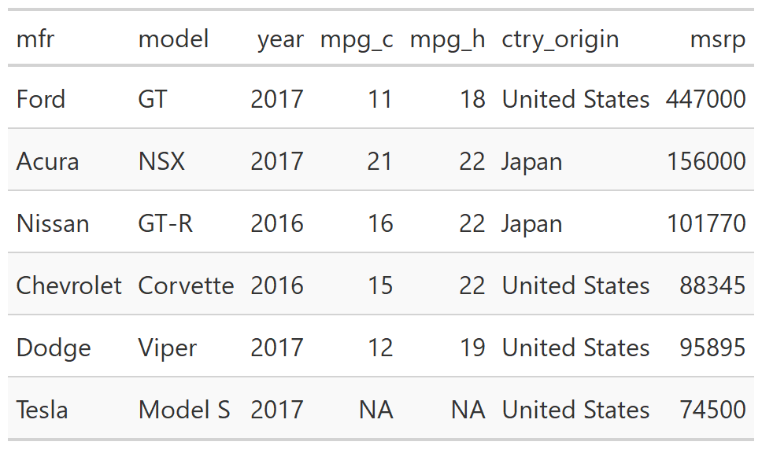
```
]

---

### Table option functions

Set overall fonts using fonts you have locally or use Google fonts via `google_font()` in `opt_table_font()`. 

.pull-left[
```{r gt38, eval = FALSE}
gtcars_small %>%
    gt() %>% 
    opt_table_font(font = google_font("Fira Mono")) #<<
```

<br/>
**Code notes:** You likely need to install the font on your computer if you are saving the table
]

.pull-right[
```{r table38, echo = FALSE, fig.alt = "Entire output table uses Fira Mono font"}
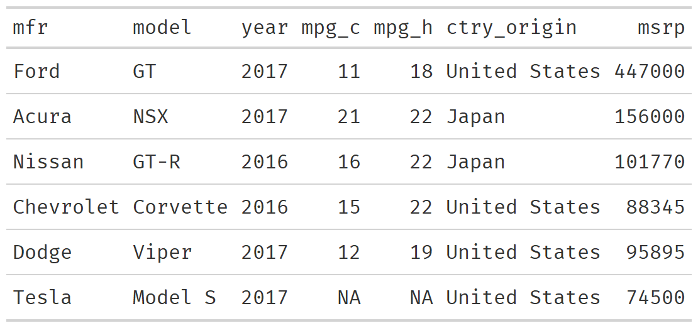
```
]

???

I found that the font displayed in-line in my R Markdown document but the font didn't show when saving the table since I didn't have the font installed

---

### Table output options

Much of the work styling the table overall is done in the `tab_options()` function. Much like `theme()` from **ggplot2**, there are an enormous number of options.

.pull-left[
.smaller[
```{r gt39, eval = FALSE}
gtcars_small %>%
    gt() %>%
    tab_options( #<<
        column_labels.border.top.color = "black", #<<
        column_labels.border.bottom.color = "black", #<<
        table_body.border.bottom.color = "black", #<<
        table_body.hlines.color = "white" #<<
    ) #<<
```
]

<br/>
***Code notes:***  
-Make black top and bottom lines  
-Set other horizontal lines to white but transparent another option
]

.pull-right[
```{r table39, echo = FALSE, fig.alt = "Table output has black lines around the column labels and at the bottom of the table but no other lines"}
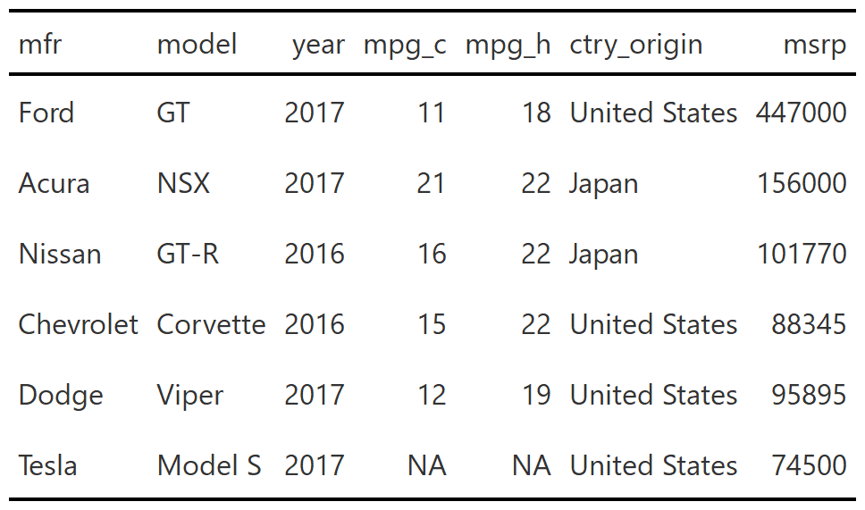
```
]

---

### Table output options

Get rid of the line above header and below header/note on white background as follows.

.pull-left[
.smaller[
```{r gt40, eval = FALSE}
gtcars_small %>%
    gt() %>%
    tab_header(
        title = "Here is a header"
    ) %>%
    tab_source_note(
        source_note = "Give the source here"
    ) %>%
    tab_options(
        table.border.top.color = "white", #<<
        heading.border.bottom.color = "black", #<<
        table.border.bottom.color = "white", #<<
        column_labels.border.top.color = "black",
        column_labels.border.bottom.color = "black",
        table_body.border.bottom.color = "black",
        table_body.hlines.color = "white"
    ) %>%
    opt_align_table_header(align = "left") # left align header
```
]

**Code notes:** Use `opt_align_table_header()` to left-align header   
]

.pull-right[
```{r table40, echo = FALSE, fig.alt = "Table output has black lines around the column labels and at the bottom of the table but no other lines. This table has header and source note outside of black lines."}
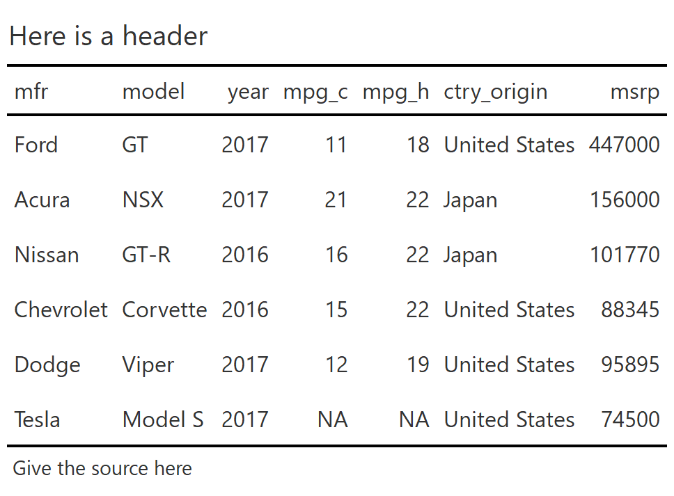
```

*See the `tab_style()` function for controlling the style of individual parts of the table.*
]

---

## Saving tables

The workhorse `r emo::ji("horse")` for saving tables is `gtsave()`.

From the documentation

> The gtsave() function makes it easy to save a gt table to a file. The function guesses the file type by the extension provided in the output filename, producing either an HTML, PDF, PNG, LaTeX, or RTF file.

--

You pass in a **gt** object to the `data` argument and then set the file name with extension in `filename`. 

If you want to save a table somewhere outside your working directory set the path with `path`.

---

## Saving tables

We can practice saving after naming one of our tables. So far we've only been printing the output.

```{r, eval = FALSE}
gt_output = gtcars_small %>%
    gt() %>%
    tab_header(
        title = "Here is a header"
    ) %>%
    tab_source_note(
        source_note = "Give the source here"
    ) %>%
    tab_options(
        table.border.top.color = "white",
        heading.border.bottom.color = "black",
        table.border.bottom.color = "white",
        column_labels.border.top.color = "black",
        column_labels.border.bottom.color = "black",
        table_body.border.bottom.color = "black",
        table_body.hlines.color = "white"
    ) %>%
    opt_align_table_header(align = "left")
```

???

Remade last table and named it "gt_output"

---

## Saving tables

**You may need to install PhantomJS prior to being able to saving image files.**

This is most likely true for Windows machines. Run this code in R to install PhantomJS.

```{r, eval = FALSE}
webshot::install_phantomjs(version = "2.1.1",
                           baseURL = "https://github.com/wch/webshot/releases/download/v0.3.1/",
                           force = FALSE)
```

--

Save the `gt_output` table as a PNG image file into the same directory as the Rmd document you are working on.

```{r, eval = FALSE}
gtsave(
    data = gt_output,
    filename = "test1.png"
)
```

---

## Saving tables

If you want to use a table in Word that you can modify (i.e., not an image) you'll need the RTF format. 

You may still need to fix some formatting manually (such as column widths) after you open in Word.

```{r, eval = FALSE}
gtsave(
    data = gt_output,
    filename = "test1.rtf"
)
```

Open the saved tables to get a sense of what they look like.

---

## Final exercise

For the final practice exercise you will clean up the small table of results named `results` and save it.

Here's what you should do:  
-   Use `litterspp` as the row names
-   Use `contrast` as the row group
-   Increase the column width of `litterspp` to 100 px
-   Round the numeric columns to a single decimal place
-   Change the label of `ratio` to "Ratio"
-   Merge the two CL columns with a comma between the numbers and name the result "95% CI"
-   Add a header that says "Comparisons"
-   Add a source note in italics that says "Data from Siuslaw study"
-   Save this as a PNG file called "final_exercise.png"

***If you have time:***
Use the same `tab_options()` as above but add `row_group.border.top.color = "black"`, `row_group.border.bottom.color = "white"`, and `stub.border.color = "transparent"`

???

You may want to do these changes one or a few at a time to help troubleshoot any problems that arise.

---

## Final exercise solution

.pull-left[
.tiny[
```{r, eval = FALSE}
results %>%
    gt(
        rowname_col = "litterspp",
        groupname_col = "contrast"
    ) %>%
    cols_width(
        vars(litterspp) ~ px(100)
    ) %>%
    fmt_number(
        columns = 3:5,
        decimals = 1
    ) %>%
    cols_label(
        ratio = "Ratio"
    ) %>%
    cols_merge(
        columns = 4:5,
        pattern = "{1},{2}"
    ) %>%
    cols_label(
        lower.CL = "95% CI"
    ) %>%
    tab_header(title = "Comparisons") %>%
    tab_source_note(source_note =  md("*Data from Siuslaw study*")) %>%
    tab_options(
        table.border.top.color = "white",
        heading.border.bottom.color = "black",
        row_group.border.top.color = "black",
        row_group.border.bottom.color = "white",
        stub.border.color = "transparent",
        table.border.bottom.color = "white",
        column_labels.border.top.color = "black",
        column_labels.border.bottom.color = "black",
        table_body.border.bottom.color = "black",
        table_body.hlines.color = "white"
    )
```
]
]


.pull-right[
.center[
```{r yourturn5, echo = FALSE, out.width = "50%", fig.alt = "Output table from final exercise solution"}
knitr::include_graphics("figs/week04_files/yt5.png")
```
]
]

---

class: hide-logo

## Next week

- We'll explore adding flair `r emo::ji("boom")`, using colors and images in **gt** tables  
- We'll briefly discuss creating overall themes for tables   
- Make sure you have a current version of package **tidyr** installed

.center[
```{r gt, echo = FALSE, out.width = "15%", fig.alt = "Logo for package gt"}
knitr::include_graphics("figs/gtlogo.svg")
```
]

.footnote[
[Code for slides](https://github.com/aosmith16/spring-r-topics/tree/main/docs/slides)  
Slides created via the R packages:  
[**xaringan**](https://github.com/yihui/xaringan), 
[gadenbuie/xaringanthemer](https://github.com/gadenbuie/xaringanthemer), 
[gadenbuie/xaringanExtra](https://github.com/gadenbuie/xaringanExtra) 
.center[*This work is licensed under the Creative Commons Attribution-NonCommercial 4.0 International License. 
To view a copy of this license, visit http://creativecommons.org/licenses/by-nc/4.0/.*]
]