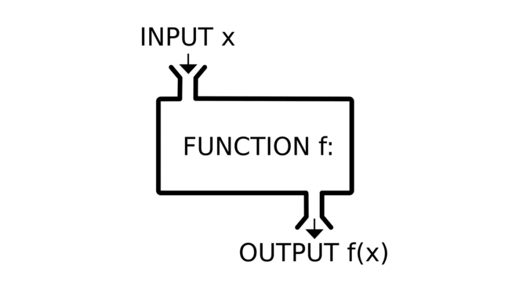

```{r setup, include = FALSE}
options(htmltools.dir.version = FALSE)
knitr::opts_chunk$set(
  fig.width=9, fig.height=3.5, fig.retina=3,
  out.width = "100%",
  cache = FALSE,
  echo = TRUE,
  message = FALSE, 
  warning = FALSE,
  fig.show = TRUE,
  hiline = TRUE
)
library(formatR)
```

```{r xaringan-themer, include = FALSE, warning = FALSE}
library(xaringanthemer)
style_duo_accent(
  primary_color = "#1c5253",
  secondary_color = "#F4790B",
  inverse_header_color = "#FFFFFF",
  title_slide_text_color = "#FFFFFF",
  base_font_size = "22px",
  link_color = "#F4790B",
  code_highlight_color = "rgba(244, 121, 11, 0.5)"
)
```

```{r metathis, echo=FALSE}
library(metathis)
meta() %>%
    meta_name("github-repo" = "aosmith16/spring-r-topics") %>% 
    meta_social(
        title = "Functions in R",
        description = "Basic intro on writing, reading, using functions",
        url = "https://aosmith16.github.io/spring-r-topics/slides/week06_writing_functions.html",
        image = "https://raw.githubusercontent.com/aosmith16/spring-r-topics/main/slides/week06-share-card.png",
        image_alt = paste(
            "Slides on writing functions in R", 
            "Working sessions class spring 2021"
        ),
        og_type = "website",
        og_author = "Ariel Muldoon",
        twitter_card_type = "summary_large_image",
        twitter_creator = "@aosmith16"
    )
```

```{r xaringan-scribble, echo = FALSE}
xaringanExtra::use_scribble()
```

```{r xaringanExtra-clipboard, echo=FALSE}
xaringanExtra::use_clipboard()
```

```{r xaringan-tile-view, echo=FALSE}
xaringanExtra::use_tile_view()
```

```{r broadcast, echo=FALSE}
xaringanExtra::use_broadcast()
```

## Today's Goal

Overall  
-     **Gain understanding of and learn how to write basic functions in R**   

We will  

-     Learn to control input and output of functions in R    
-     Read through existing functions      
-     Use conditions to return different outputs based in the inputs  

--

<br/>
*Before we begin:*

Make sure you saved `week06_functions.Rmd` from the class website onto your computer. We will be running code from this file.

---

## Resources

- For more on all aspects of functions, see the [Functions chapter](https://r4ds.had.co.nz/functions.html) in Wickham and Grolemund's *R for Data Science*  
- [Rice and Lumley's presentation](http://faculty.washington.edu/kenrice/rintro/intro17sess09v2.pdf) on writing functions is a nice overview  
- If you are ready to go further with functions see [Stephanie Kirmer's presentation](https://skirmer.github.io/presentations/functions_with_r.html#1) 


---

## What is a function?

.center[
```{r, echo = FALSE, out.width = "75%", fig.cap = "From Stephanie Kirmer's Functions in R presentation", fig.alt = "A schematic showing inputs going into a 'function' that produces output based on those inputs."}

```
]

???

Functions take inputs, do some set of tasks, and make the output we want
R is built on functions, and people have already been using ones others have created in their everyday R work

---

## When to write your own function?

- When doing repetitive tasks


<blockquote class="twitter-tweet tw-align-center" data-lang="en"><p lang="en" dir="ltr">Write same code three times, write a function</p>&mdash; David Robinson (@cantabile) <a href="https://twitter.com/drob/status/928447584712253440">Tweet November 8, 2017</a></blockquote>
<script async src="//platform.twitter.com/widgets.js" charset="utf-8"></script>

<br/>
- To do a specific task or get a specific kind of output  

???

Mainly about copying and pasting code over and over again  
Also can get exactly what you want if other functions don't do it

---

## Naming your functions

When you start making functions you'll need to *name* them.

Some general style rules:
- Make function names human readable and descriptive
- Try to be concise, but meaningful names that indicate what the function does is more important  
-  Be consistent in your naming style. For example, don't name one plotting function `make_scatterplot()` and another `barplotFunction()`.

---

## Naming your functions


.pull-left[
Common naming styles in R
```{r, echo = FALSE, fig.cap = "Artwork by @allison_horst", fig.alt = "Artwork by Allison Horst to show the different naming conventions in R, including snake case, camel case, kebab case, etc ."}
knitr::include_graphics("figs/week06_files/coding_cases.png")
```
]

.pull-right[
.footnote[
Read more about function naming conventions and styles in [*R for Data Science*](https://r4ds.had.co.nz/functions.html#functions-are-for-humans-and-computers)
]
]


???

We'll be using snake_case today, but you may decide to use something else in your own work.

---


class: center, middle, inverse, hide-logo

# <font style="font-family: cursive; font-style:italic">Let's get started!</font>

---

## Running code

- Open the copy of [`week06_functions.Rmd`](files/week06_funcitons.Rmd) that you saved  
- I recommend switching to using the visual editor using the   button  

--

<br/><br/>
**Set up**  

We'll learning to write functions by first running example code I've already written.   

At the end of each section you'll have a chance to practice what we just covered.

---

## Structure of a function

We create functions with `function()`. This involves:

.pull-left[
1.  Assigning a name for the new function. Use your preferred assignment operator.
]


.pull-right[
```{r myfun, eval = FALSE}
my_function = #<<
    function(argument1, etc.) {
    <Write code here>
    return(output)
}
```
]

---

## Structure of a function

We create functions with `function()`. This involves:

.pull-left[
1.  Assigning a name for the new function. Use your preferred assignment operator.

2.  Allowing for inputs to the function as *arguments* within `function()`. The inputs are values or objects we will use within the function.
]


.pull-right[
```{r, eval = FALSE}
my_function = function(argument1, etc.) { #<<
    <Write code here>
    return(output)
}
```
]

---

## Structure of a function

We create functions with `function()`. This involves:

.pull-left[
1.  Assigning a name for the new function. Use your preferred assignment operator.

2.  Allowing for inputs to the function as *arguments* within `function()`. The inputs are values or objects we will use within the function.

3.  Writing code to create the function output. This code goes between the curly braces (`{`) and used the provided inputs to return a single output.
]


.pull-right[
```{r, eval = FALSE}
my_function = function(argument1, etc.) {
    <Write code here> #<<
    return(output) #<<
}
```
]

---

## Structure of a function

.pull-left[
Once we have run the code to create a function, we use it like other functions in R, passing inputs to each argument.
]

.pull-right[
```{r, eval = FALSE}
my_function(argument1 = input1, etc.)
```
]

---

## Basic function

Let's start with a very basic function.

.pull-left[
This function, named `return_input`, will have a single argument, `input`. 

This function simply returns what we give as input.
]

.pull-right[
```{r}
return_input = function(input) {
    return(input)
}
```
]

---

## Basic function

The goal here is for you to see how we give input to the `input` argument and the function returns an output based on that input.

--

.pull-left[
For example, we could give a single, numeric value to `input`.
]

.pull-right[
```{r}
return_input(input = 1)
```
]

---

### Your turn

Write code in the empty code chunk that is provided. 

Spend a few minutes passing different values and objects to the `input` argument of `return_input()` and looking at the output.

Pass the following to the `input` argument:
- The letter `"a"`  
- A series of letters using `letters[1:5]`  
- A vector of numbers like `c(1, 5, 9, 10)`  
- The data.frame `mtcars`

```{r, echo = FALSE}
library(countdown)
countdown(minutes = 2, 
          bottom = 0,
          color_border = "#F4790B",
          color_text = "#1c5253",
          color_running_background = "#1c5253",
          color_running_text = "#F4790B",
          color_finished_background = "red",
          color_finished_text = "#1c5253")
```

---

## A function with two arguments

A function can have as many arguments as we want. We  keep adding them in `function()` when we define the function.

Like with naming functions, keeping your argument names descriptive is useful.

--

.pull-left[
Our next function, named `sum_two`, has two arguments and outputs the sum of the two inputs.
]

.pull-right[
```{r}
sum_two = function(num1, num2) {
    sum = num1 + num2
    return(sum)
}
```
]

---

## A function with two arguments

.pull-left[
This is what it looks like if we pass single numeric values to the two arguments in `sum_two`.
]

.pull-right[
```{r}
sum_two(num1 = 1, 
        num2 = 2)
```
]

---

### Your turn 1

Write code in the empty code chunk that is provided. 

First I want you to see what happens with a couple of different types of input to the two arguments in `sum_two`.

Pass the following inputs to `num1` and `num2`: 
- Vectors of numbers, `c(1, 5, 9, 10)` and `c(2, 3, 4, 5)` 
- Letters, `"a"` and `"b"`

```{r, echo = FALSE}
countdown(minutes = 2, 
          bottom = 0)
```

--

<br/><br/><br/>
What happened when you put letters in?


---

### Your turn 2

Write code in the empty code chunk that is provided. 

Practice writing your own function, named `norm_by_y`.

The function should take two numbers as input and return the difference between the numbers divided by the second number. 

The equation for what I'm describing looks like: (x - y)/y


```{r, echo = FALSE}
countdown(minutes = 5, 
          bottom = 0)
```

---

### Your turn 2 solution

```{r}
norm_by_y = function(num1, num2) {
    result = (num1 + num2)/num2
    return(result)
}
```

---

## Remove explicit `return()`

I wanted to start out using `return()` in the function because I think it makes what is returned explicit. 

In R it is not standard to use this coding style. Simply printing the output object will *return* the output.

--

.pull-left[
Here are the same two functions we had previouslyemade without the explicit use of `return()`.

```{r}
return_input = function(input) {
    input
}
return_input(input = 1)
```
]

.pull-right[
<br/><br/>
```{r}
sum_two = function(num1, num2) {
    sum = num1 + num2
    sum
}
sum_two(num1 = 1, 
        num2 = 2)
```
]

???

Using explicit returns are useful when you are getting started thinking about inputs and outputs.

---

## Explore existing function

Learning how to write functions helps you understand existing functions. 

Taking a look at the underlying code can help us figure out what a function is doing and, potentially, help us figure out where any problems we are having may arise from.

--

.pull-left[
You can see the code within a function by running the function name without parentheses in R. 
]

.pull-right[
```{r}
union
```
]

???

The last two lines (bytecode and environment) aren't relevant at this time

---

## Explore existing function

.pull-left[
In RStudio you can use `View()` to open the function in a new window in your `Source` pane. 

This can be easier to look through, especially for long functions.
]

.pull-right[
```{r, eval = FALSE}
View(union)
```

.center[
```{r, echo = FALSE, out.width = "75%", fig.alt = "A screenshot showing the new pane that opens when viewing a function. This uses the union() function as the example."}

```
]
]

<br/><br/>
**Note:** Many base R functions are written in C++ and so do not return code.

???

May want to discuss the issue of functions not returning anything that is recognizable. Some is due to C++ but some is for functions that work on different types of objects like, e.g., plot.lm

---

### Your turn

Write code in the code chunk that is provided. 

Take a few minutes and explore the code in the `union()` function.

First, use the vectors `x` and `y` provided in the chunk as inputs to `union()`.

Then go through the `union()` function code one step at a time. 
1. Use `as.vector()` on each object.  
2. Concatenate the two objects with `c()`.  
3. Use `unique()` on the vector from step 2.  

```{r, echo = FALSE}
countdown(minutes = 5, 
          bottom = 0)
```

---

### Your turn solution

Here's an example of how I would step through the `union()` code, breaking down each piece of the code.

```{r, eval = FALSE}
x = c(1, 2, 3)
y = c(2, 3, 4)

# Using union()
union(x = x, y = y)

# Using code within union()
as.vector(x)
as.vector(y)

c(as.vector(x), as.vector(y))

unique(c(as.vector(x), as.vector(y)))
```

---

## Returning multiple outputs

A function in R can only return a single output, even if we try to return more.

--

.pull-left[
To demonstrate this, here's an attempt to return the sum of two numbers as well as the two original numbers using the function `return_all()`.
]

.pull-right[
```{r}
return_all = function(num1, num2) {
    sum = num1 + num2
    sum
    num1
    num2
}
```
]

---

## Returning multiple outputs

What happens when we use this function?

.pull-left[
It returns the very last thing we asked for. In this case, the last thing we asked for is the input to `num1`.
]

.pull-right[
```{r}
return_all(num1 = 1, 
           num2 = 2)
```
]

---

## Returning multiple outputs


.pull-left[
If we want multiple outputs we'll need to combine outputs into one. 

A list is one option for this. 

The example code shows a *named* list.
]

.pull-right[
```{r}
return_all2 = function(num1, num2) {
    sum = num1 + num2
    list(sum = sum, #<<
         num1 = num1, #<<
         num2 = num2) #<<
}

return_all2(num1 = 1, 
            num2 = 2)
```
]

---

## Returning multiple outputs

.pull-left[
A data.frame as output is useful in some cases.
]

.pull-right[
```{r}
return_all3 = function(num1, num2) {
    sum = num1 + num2
    data.frame(sum = sum, #<<
               num1 = num1, #<<
               num2 = num2) #<<
}

return_all3(num1 = 1, 
            num2 = 2)
```
]

---

### Your turn

Write code in the empty code chunk that is provided. 

Go back to the function you made earlier called `norm_by_y()`. 
- Add a 2 to the end of the function name.  
- Edit the function so it returns both (x - y)/y and (x - y) in a list.

```{r, echo = FALSE}
countdown(minutes = 5, 
          bottom = 0)
```

---

### Your turn solution

```{r}
norm_by_y2 = function(num1, num2) {
    result1 = (num1 - num2)/num2
    result2 = num1 - num2
    list(result1, result2)
}
```

---

## Default arguments

We can assign default values to arguments. If we use the default we don't have to write that argument out.

--

.pull-left[
For example, `na.rm = FALSE` is the default in `mean()`. 

Let's make a function built around `mean()` where the default is `TRUE`.  That way, `NA` values are automatically stripped.
]

.pull-right[
```{r}
mean_nona = function(vector, 
                     remove.na = TRUE) {
  mean(vector, na.rm = remove.na)
}
```

<br/>
Note `remove.na` defaults to `TRUE`. This input is passed to the `na.rm` argument within `mean()` inside our function.
]

---

## Default arguments

.pull-left[
Here's how this works if the vector contains `NA`. We don't need to write out the `remove.na` argument.
]

.pull-right[
```{r}
mean_nona(vector = c(1, 2, NA))
```
]

---

## Default arguments

.pull-left[
To change the default, pass `FALSE` to the `remove.na` argument.
]

.pull-right[
```{r}
mean_nona(vector = c(1, 2, NA),
          remove.na = FALSE) #<<
```
]

---

## Arguments names vs positions

This feels like a good juncture to talk about writing out argument *names* vs using argument *positions*. Both are allowed and can work fine.

.pull-left[
Using argument positions tends to lead to unclear code. 

What argument does the second input pass to?
]

.pull-right[
```{r}
mean(c(1:10, 50), 0.1)
```
]

---

## Argument names vs positions

.pull-left[
Writing out argument names in this case makes the code a little more understandable.
]

.pull-right[
```{r}
mean(x = c(1:10, 50), 
     trim = 0.1)
```
]

---

## Argument names vs positions

I most often recommend writing out argument names for clear code. However, there are cases that we may not need to do this, especially for generally well-known functions.

--

.pull-left[
For example, for model fitting functions like `lm()`, the first argument is always the model formula. 

This is so well known and it is fairly standard to leave the `formula` argument name off.
]

.pull-right[
```{r}
lm(mpg ~ disp, data = mtcars)
```
]

--

Packages like **dplyr** use the dataset as the first argument as a standard, and you will rarely see the first argument name written out.

---

## Argument names vs positions

You'll sometimes see code from advanced users where they've cut corners and stop writing out argument names. This can lead to mistakes if you don't know what you're doing.

--

.pull-left[
For example, if I wanted to fit a weighted regression, I would leave off `formula` but then use other argument names to define the dataset in `data` and weights in `weights`.
]

.pull-right[
```{r}
lm(mpg ~ disp, 
   data = mtcars, 
   weights = cyl)
```
]

---

## Argument names vs positions

.pull-left[
What happens if I leave these argument names off?

```{r}
lm(mpg ~ disp, mtcars, cyl)
```
]

--

.pull-right[
<br/><br/>
The third argument to `lm()` is `subset`, not `weights`. 

Luckily the `call` in the output shows the mistake, but that can be easy to miss.

I've seen people make this sort of mistake and not catch it in a real analysis.
]

---

## Dot-dot-dot to pass additional arguments

Including `...` within `function()` is a way to pass additional arguments that can be used within the function. This is most common for passing arguments to existing functions inside the one you are making.

--

.pull-left[
For example, let's say we were again using `mean()` inside our function to calculate a mean.
]

.pull-right[
```{r}
new_mean = function(vector) {
  mean(vector)
}
```

If we use a vector that contains `NA` this returns `NA` by default.

```{r}
new_mean(vector = c(1, 2, NA))
```
]

---

## Dot-dot-dot to pass additional arguments

We want to be able to pass in `na.rm = TRUE` to the function. Since that already is an argument available in `mean()`, we can use `...` for this.

.pull-left[
We literally add `...` into the arguments of the function and then use it again where we want to use the additional arguments.
]

.pull-right[
```{r}
use_mean2 = function(vector, ...) {
  mean(vector, ...)
}
```

]

---

## Dot-dot-dot to pass additional arguments

Now we can give arguments from `mean()` while using our function.

.pull-left[
Anything we put in after the `vector` argument is passed into `mean()`.
]

.pull-right[
```{r}
use_mean2(vector = c(1, 2, NA),
         na.rm = TRUE) #<<
```
]

---

## Dot-dot-dot to pass additional arguments

**Important note:** When using `...`, any misspelled arguments will not raise an error and so you may miss typos you've made.

.pull-left[
Look what happens when I misspell `na.rm` as `na.rn`.
]

.pull-right[
```{r}
use_mean2(vector = c(1, 2, NA),
         na.rn = TRUE) #<<
```
]

---

## Conditional returns

Back when we made `sum_two()`, I had you look at the error you got when you passed in characters when the function used numbers.

```{r, error = TRUE}
sum_two(num1 = "a", 
        num2 = "b")
```

--


That error message isn't particularly clear. 

Adding *conditions* in this function to return a useful message if the values aren't numeric is an example of what I've seen called conditional returns or *conditional execution*.

---

## Conditional returns

We add *conditions* via logical statements, usually involving `if()` and `else()` statements.

In the documentation for `if()` the **Usage** is: 
> if(cond) expr  
  
--

<br/><br/>
More commonly in functions we'll use `if()` and `else()` together: 
> if(cond) cons.expr else alt.expr  
  
The if-else condition can be interpreted as:
> Test some condition.  If the condition is met, return one thing. If it's not met, return something else.  

---

## Conditional returns

Here's a skeleton example of an if-else statement. Note the logical "condition" in the parentheses and the two sets of curly braces (`{`).

```{r, eval = FALSE}
if(condition) {
    Do something
} else {
    Alternative something
}
```

???

You will see people skip writing out the curly braces (`{`) in some simple cases but I recommend sticking with them for the clearest code. You can read one opinion on coding style in [R for Data Science](https://r4ds.had.co.nz/functions.html#code-style).

---

## Conditional returns

OK, we're ready to see an example. We'll add conditional returns to our `sum_two()` function.

.pull-left[
This uses `is.character` to test if the input to `num1` is a character. 

If it is, it returns the message. If it is not, it returns the sum.
]

.pull-right[
```{r}
sum_two_if = function(num1, num2) {
    if(is.character(num1)) { #<<
        "You must enter a number or vector of numbers for num1."
    } else {
        num1 + num2
    }
}
```
]

---

## Conditional returns

.pull-left[
Now let's look at the output when we use a letter for `num1`.


```{r}
sum_two_if(num1 = "a", 
           num2 = "b")
```
]

--

.pull-right[
And here's the output if we pass a number to each argument.

```{r}
sum_two_if(num1 = 1, 
           num2 = 2)
```
]

---

## Conditional returns


.pull-left[
We can expand the condition with an *or* statement via `|`. 

In this case it makes sense to test if the input to *either* argument is a character.
]

.pull-right[
```{r}
sum_two_if2 = function(num1, num2) {
    if(is.character(num1) | #<<
       is.character(num2)) { #<<
        "You must enter a number or vector of numbers for both num1 and num2."
    } else {
        num1 + num2
    }
}

sum_two_if2(num1 = 1, 
            num2 = "b")
```
]

---

### Your turn 1

Write code in the code chunk that is provided. 

Starting with `use_mean2()` function, included in the chunk: 
1. Add in a condition to test if the `vector` argument is numeric using `is.numeric`  
2. If it is, return the mean of the vector  
3. Otherwise return a message explaining what is wrong  

```{r, echo = FALSE}
countdown(minutes = 5, 
          bottom = 0)
```

---

### Your turn 1 solution

```{r}
use_mean2 = function(vector, ...) {
    if(is.numeric(vector)) {
          mean(vector, ...)
    } else {
        "Your input is not numeric."
    }
}
```

---

### Your turn 2

Take a look at the code for the `as.factor()` function, which takes a vector of values for its `x` argument.

This function contains multiple conditions use if-elseif-else. Try to summarize what each condition is and generally what is done at each step.

I've gotten you started for each of the three return conditions.

1.  First the function checks if...
2.  Ignore the `!is.object(x)` part of the condition. Second the function checks...
3.  Finally, if the other two conditions aren't true the function...

```{r, echo = FALSE}
countdown(minutes = 5, 
          bottom = 0)
```

---

### Your turn 2 solution

1.  First the function checks if the input already is a factor. If so, it returns the input.  

2.  Ignore the `!is.object(x)` part of the condition. Second the function checks if the input is an integer. If so, it creates the levels by sorting the unique values, matches the levels to the values in the input, and makes the result a factor.  

3.  Finally, if the other two conditions aren't true the function using function `factor()` on the input.

---

## Doing more in a function

So far we've written very basic, one-step functions. Of course you can do many, many steps in a function to achieve the desired output.

--

.pull-left[
Let's make one slightly longer function. 

The `get_rsq()` functions takes a dataset as input. It fits a model to that dataset, gets the model summary, and then pulls out and rounds the $R^2$ value, and returns the rounded $R^2$.
]

.pull-right[
```{r}
get_rsq = function(data) {
    mod = lm(mpg ~ disp, data = data)
    summ = summary(mod)
    rsq = round(summ$r.squared, 
                digits = 2)
    rsq
}
```

<br/>
Note the `formula` variables in `lm()` are fixed, which is a common set up if you are going to analyze many datasets with the same variables in them.

]

---

## Doing more in a function

.pull-left[
The `get_rsq()` function is set up to use with the variables in the `mtcars` dataset.

```{r}
get_rsq(data = mtcars)
```
]

--

.pull-right[
This means we can pass a subset of the data as input to this function.

```{r}
get_rsq(data = subset(mtcars, cyl == 4) )
```
]

<br/><br/>
You'd use this sort of set-up to get ready to *iterate* through many similar datasets, which is one important use of functions.

---

## More on functions

You may reach a point where you need to know more about function environments or testing. `r emo::ji("woman_mechanic")`

Or you may find yourself with have a series of functions that you use a lot and want to make into a local R package. `r emo::ji("sparkling_heart")`

If that's ever the case for you, [Stephanie Kirmer's talk](https://skirmer.github.io/presentations/functions_with_r.html#1) and exercises is a good place to start. `r emo::ji("slightly_smiling_face")`

---

## Next week

- We'll return to Git `r icons::fontawesome("git-square")` and GitHub `r icons::fontawesome("github")`, learning to write issues and make pull requests    
- Make sure you have a current version of package **usethis** installed


.footnote[
[Code for slides](https://github.com/aosmith16/spring-r-topics/tree/main/docs/slides)  
Slides created via the R packages:  
[**xaringan**](https://github.com/yihui/xaringan), 
[gadenbuie/xaringanthemer](https://github.com/gadenbuie/xaringanthemer), 
[gadenbuie/xaringanExtra](https://github.com/gadenbuie/xaringanExtra) 
.center[*This work is licensed under the Creative Commons Attribution-NonCommercial 4.0 International License. 
To view a copy of this license, visit http://creativecommons.org/licenses/by-nc/4.0/.*]
]

