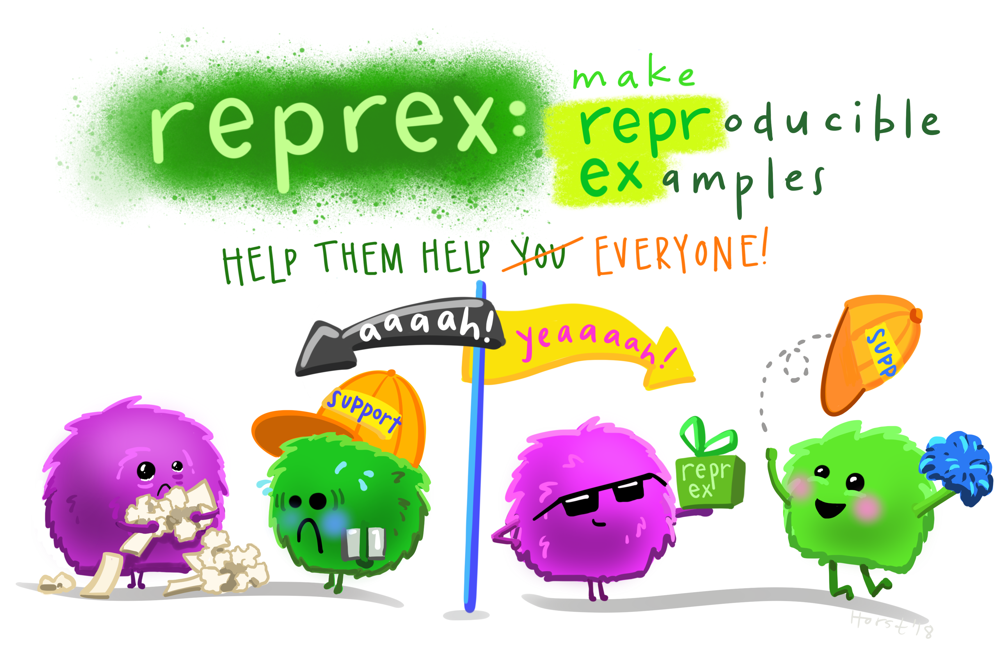
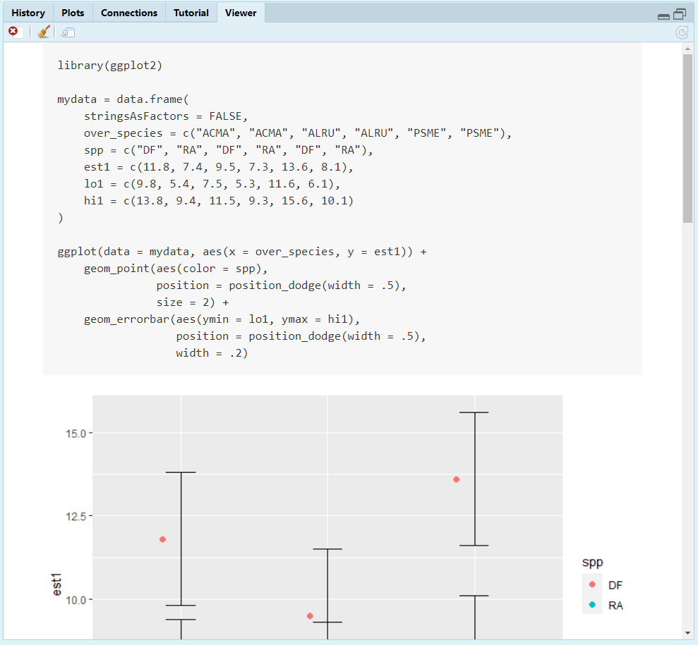
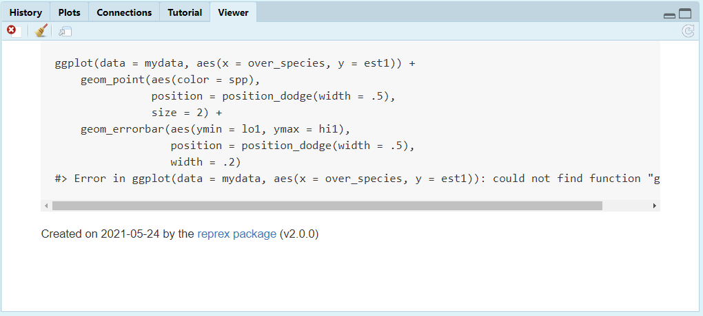
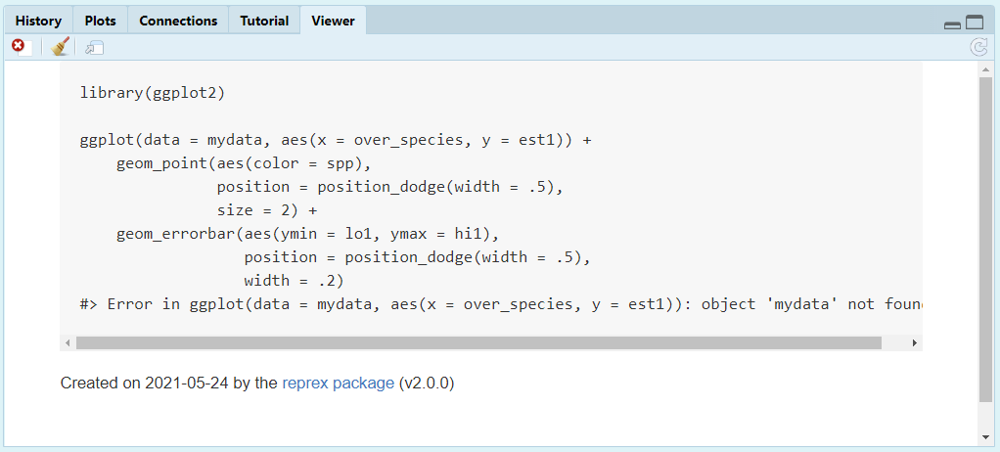
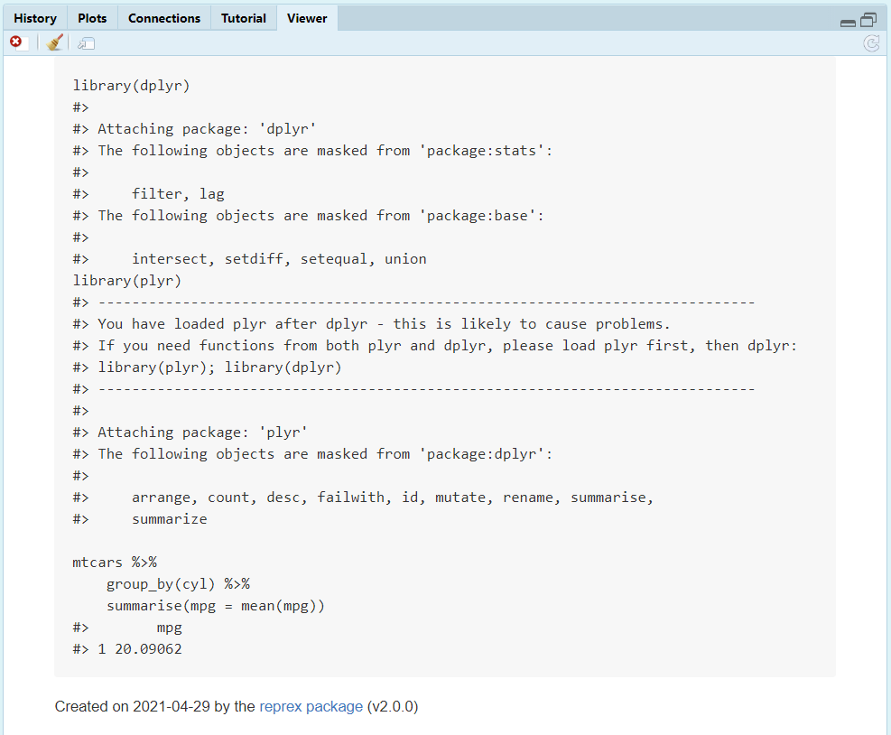
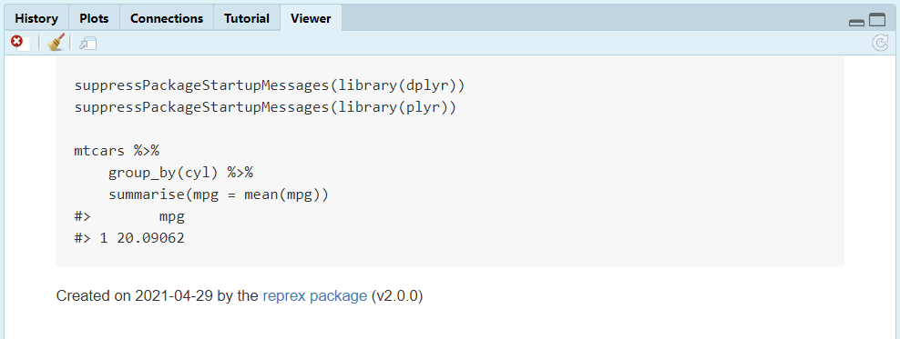
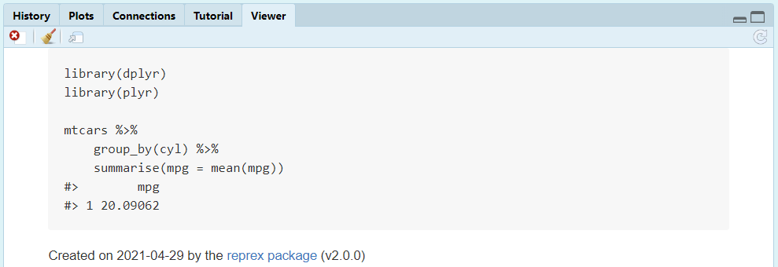
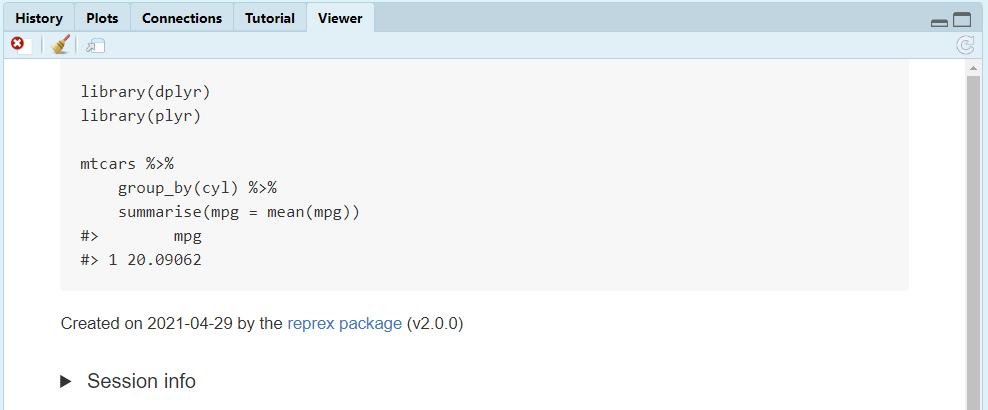
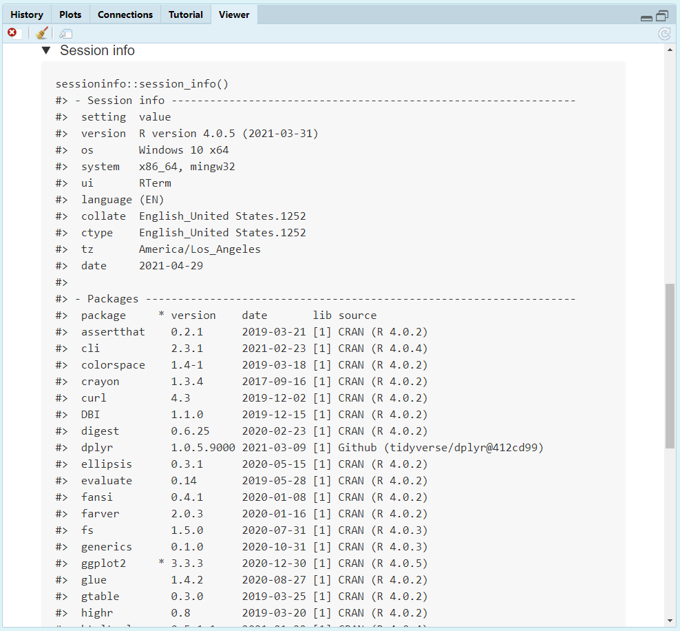

```{r setup, include = FALSE}
options(htmltools.dir.version = FALSE)
knitr::opts_chunk$set(
  fig.width=9, fig.height=3.5, fig.retina=3,
  out.width = "100%",
  cache = FALSE,
  echo = TRUE,
  message = FALSE, 
  warning = FALSE,
  fig.show = TRUE,
  hiline = TRUE
)
library(formatR)
```

```{r xaringan-themer, include = FALSE, warning = FALSE}
library(xaringanthemer)
style_duo_accent(
  primary_color = "#1c5253",
  secondary_color = "#F4790B",
  inverse_header_color = "#FFFFFF",
  title_slide_text_color = "#FFFFFF",
  base_font_size = "22px",
  link_color = "#F4790B",
  code_highlight_color = "rgba(244, 121, 11, 0.5)"
)
```

```{r metathis, echo=FALSE}
library(metathis)
meta() %>%
    meta_name("github-repo" = "aosmith16/spring-r-topics") %>% 
    meta_social(
        title = "How to reprex",
        description = "Reproducible examples in R",
        url = "https://aosmith16.github.io/spring-r-topics/slides/week09_reprex.html",
        image = "https://raw.githubusercontent.com/aosmith16/spring-r-topics/main/slides/week09-share-card.png",
        image_alt = paste(
            "Slides for how to reprex", 
            "Working sessions class spring 2021"
        ),
        og_type = "website",
        og_author = "Ariel Muldoon",
        twitter_card_type = "summary",
        twitter_creator = "@aosmith16"
    )
```

```{r xaringan-scribble, echo = FALSE}
xaringanExtra::use_scribble()
```

```{r xaringanExtra-clipboard, echo=FALSE}
xaringanExtra::use_clipboard()
```

```{r xaringan-tile-view, echo=FALSE}
xaringanExtra::use_tile_view()
```

```{r broadcast, echo=FALSE}
xaringanExtra::use_broadcast()
```

class: center, middle, title-slide

# How to reprex

```{r, echo = FALSE, out.width = "20%", fig.alt = "Logo for package reprex"}
knitr::include_graphics("figs/reprex.png")
```

### Ariel Muldoon
### May 25, 2021

---

## Before we begin

I wanted to quickly show you a couple of packages that are relevant to topics that came up in the interactive plots/data session.

1. You can *animate* plots in R and save the output as GIF's or videos with package **gganimate**. This works well to show patterns among groups, like through time.  

    ```{r, echo = FALSE, out.width = "5%", out.extra='style="float:left;     padding:10px"', fig.alt = "Logo for package gganimate", fig.link = "https://gganimate.com/"}
    knitr::include_graphics("figs/gganimate.png")
    ```
    <br/>
    [**gganimate** website link](https://gganimate.com/)
    <br/>    
    <br/>
    
2. If you are working with data collected across geographic units like states in the USA or provinces in Canada, etc., you can use package **geofacet** to make faceted plots across geographical space.

    ```{r, echo = FALSE, out.width = "5%", out.extra='style="float:left; padding:10px"', fig.alt = "Logo for package geofacet", fig.link = "https://hafen.github.io/geofacet/"}
    
    ```

<br/>
    [**geofacet** website link](https://hafen.github.io/geofacet/)

???

Folks discussed graphing by state as well as adding animations in week 8

---

class: with-logo logo-reprex

## Today's Goal

Overall  
- **Learn how to make minimal reproducible examples in R**   

???

This is needed for asking for help on R code

--

We will  

-     Discuss the components of a minimal reproducible example 
-     Explore options to provide example data to make code runnable
-     Learn how to use package **datapasta** to provide a snippet of your own data    
-     Use package **reprex** to create pasteable code and output        

---

## Resources

- [Intro article](https://reprex.tidyverse.org/) and [Reprex do's and don'ts](https://reprex.tidyverse.org/articles/reprex-dos-and-donts.html) from the **reprex** website  
- Sharla Gelfand's "make a reprex... please" [slides](https://make-a-reprex-please.netlify.app/#1) and [recording](https://t.co/860RTqMvjy)   
- [How to Datapasta](https://milesmcbain.github.io/datapasta/articles/how-to-datapasta.html)  

.center[
```{r, echo = FALSE, out.width = "30%", fig.alt = "Logo for package datapasta"}

```
]

---

## What is a reprex?

The term *reprex* stands for **repr**oducible **ex**ample.

If you ever ask for R help on a forum or want to report an issue on a GitHub repository you will be asked for example code that reproduces the problem; a *reprex*.

--

<br/><br/>
Here are several nice overviews on how to make a reproducible example that are worth reviewing:

[RStudio Community guide](https://community.rstudio.com/t/faq-how-to-do-a-minimal-reproducible-example-reprex-for-beginners/23061)  
[Stack Overflow canonical thread](https://stackoverflow.com/questions/5963269/how-to-make-a-great-r-reproducible-example)  
[Tidyverse help guide](https://www.tidyverse.org/help/)

---

## What is in a reprex?

<br/>
A reprex should include:    
    
> - A minimal dataset, necessary to reproduce the issue  

> - The minimal runnable code necessary to reproduce the issue, which can be run
on the given dataset, and including the necessary information on the used packages  

*From the RStudio Community guide*

---

## What is in a reprex?

<br/>
A reprex should include:    
    
> - a minimal dataset, necessary to demonstrate the problem   

> - the minimal runnable code necessary to reproduce the error, which can be run on the given dataset  
> - all necessary information on the used packages, the R version, and the OS it is run on  

> - in the case of random processes, a seed (set by set.seed()) for reproducibility  

*From the Stack Overflow thread on reproducible examples*

--

<br/>
Note the consistent use of the word ***minimal***.

???

We'll be talking about minimal later.

---

## Why should I reprex?

Making a minimal, reproducible example can take time. It can be easy to convince yourself to skip the process and "just get the help I need".

But the time is ultimately worth spending. `r emo::ji("dollar")`

--


> - 80% of the time creating an excellent reprex reveals the source of your problem. It’s amazing how often the process of writing up a self-contained and minimal example allows you to answer your own question.  

> - The other 20% of time you will have captured the essence of your problem in a way that is easy for others to play with. This substantially improves your chances of getting help!

*From the tidyverse help guide*

???

A lot of times you can solve your own problem while working towards a minimal, reproducible example.

---

## Why should I reprex?

.center[
```{r, echo = FALSE, out.width = "70%", fig.alt = "Artwork by Allison Horst showing a cartoon monster first struggling to work with a support monster on a problem on the left and then the same monster enjoying success after providing a reproducible example on the right, helping others help them solve their problem"}

```
Artwork by @allison_horst
]

???

It helps people help you!  It also makes make it much more likely you will get a positive response.

---

## Why should I reprex?

<blockquote class="twitter-tweet tw-align-center" data-lang="en"><p lang="en" dir="ltr">Slide showing the many ways you may be asked for a reproducible examples</p>&mdash; Sharla Gelfand (@sharlagelfand) <a href="https://twitter.com/sharlagelfand/status/1365665149063987201">Tweet February 27, 2021</a></blockquote>
<script async src="//platform.twitter.com/widgets.js" charset="utf-8"></script>

???

And you will be asked for one! I included this tweet to focus on the picture of the shared slide.

---

## The plan for today

- I will introduce an R coding scenario that I need your help solving
- We'll go through my attempts to provide a reproducible example, with you copying code I provide in the slides broadcast and running it in a clean R session
- We'll discuss how I can improve things so my code meets the definition of a minimal reproducible example
- Finally, we'll practice using package **reprex** to get code and output ready to paste into a forum and then discuss a few additional features of the package  

--

<br/>
This gets us ready for next week when we'll:
- Talk about GitHub issues and issue etiquette  
- Practice making an issue, writing text and pasting code and output via package **reprex** 

???

GitHub issues was originally in this same slide deck but I decided it'd be better to use the time in a separate working session.

---

class: center, middle, inverse

# <font style="font-family: cursive; font-style:italic">Let's get started!</font>

---

## "I need help" take 1 `r emo::ji("clapper_board")`

**Me:** "I'm having a problem with my **ggplot2** code. My points dodge but my error bars don't. Help! Here is my code."

**You:** Copy and paste the code below into your R Console and run.  What happens?

.smaller[
```{r, eval = FALSE}
ggplot(data = mydata, aes(x = over_species, y = est1)) +
    geom_point(aes(color = spp), 
               position = position_dodge(width = .5),
               size = 2) +
    geom_errorbar(aes(ymin = lo1, ymax = hi1),
                  position = position_dodge(width = .5),
                  width = .2) +
    scale_color_manual(values = c("#1c5253", "#F4790B"),
                       labels = c("Douglas-fir", "Red alder")) +
    labs(color = "Species",
         x = "Overstory",
         y = "Estimate") +
    theme_minimal() +
    theme(panel.grid.major.x = element_blank(),
          panel.grid.minor.y = element_blank(),
          legend.direction = "horizontal",
          legend.position = "bottom",
          legend.box.spacing = unit(0, "pt"),
          plot.margin = margin(b = 0))
```
]

---

## "I need help" take 1 `r emo::ji("clapper_board")`


```{r, echo = FALSE}
cat('Error in ggplot(data = mydata, aes(x = over_species, y = est1)) : 
  could not find function "ggplot"')
```

When the error message indicates a function can't be found, most often the package hasn't been loaded. 

That's the case here. I didn't provide the packages I'm using in my example code.

--

<br/><br/>
You might now be thinking, "Well, geez, people can easily guess what package I'm using based on my code."

Help people help you! `r emo::ji("hugs")` To maximize the chance of getting help you should make it as easy as possible for people to provide that help.  Include your packages code, even if you think what you used is obvious.

???

This is the classic "help me help you" slide

---

## "I need help" take 1 `r emo::ji("clapper_board")`

Going back to the info in the guides for reproducible examples, I should provide:

> ...runnable code necessary to reproduce the issue, which can be run
on the given dataset, and including the necessary information on the used packages.

<br/>
OK, I didn't give code for the data or packages in my first attempt. Let me try again.

---

## "I need help" take 2 `r emo::ji("clapper_board")`

**Me:** "Oh, you need my packages and dataset? No problem. Here you go."

.tiny[
```{r, eval = FALSE}
library(covr)
library(car)
library(nlme)
library(ggbiplot)
library(devtools)
library(ggplot2)
library(dplyr)
library(emmeans)

setwd("C:/Users/USER/Documents/MyProject")

data = read.csv("all_project_data.csv")
mydata = read.csv("all_results.csv")

table = data %>%
    group_by(over_species, spp) %>%
    summarize(mean = mean(variable),
              sd = sd(variable))

mod = lm(variable ~ over_species*spp, data = data)
summary(mod) # Save these results!

ggplot(data = mydata, aes(x = over_species, y = est1)) +
    geom_point(aes(color = spp), 
               position = position_dodge(width = .5),
               size = 2) +
    geom_errorbar(aes(ymin = lo1, ymax = hi1),
                  position = position_dodge(width = .5),
                  width = .2) +
    scale_color_manual(values = c("#1c5253", "#F4790B"),
                       labels = c("Douglas-fir", "Red alder")) +
    labs(color = "Species",
         x = "Overstory",
         y = "Estimate") +
    theme_minimal() +
    theme(panel.grid.major.x = element_blank(),
          panel.grid.minor.y = element_blank(),
          legend.direction = "horizontal",
          legend.position = "bottom",
          legend.box.spacing = unit(0, "pt"),
          plot.margin = margin(b = 0))
```
]

---

## "I need help" take 2 `r emo::ji("clapper_board")`

**You:** Are likely feeling overwhelmed right now because I just gave you a ton of code. `r emo::ji("laughing")`

--

<br/>
I asked you earlier to note the word ***minimal*** used over and over in the reproducible example descriptions we reviewed.

We'll discuss that in more detail now.

---

## *Minimal* code

When asked to provide the package and dataset I made a reasonable attempt to do so. However, I went too far and provided code that wasn't relevant to the problem.

--

<br/>
When providing an example, give the absolute minimum amount of code that can reproduce the problem. No extra packages, no extra data manipulation steps, etc. 

<br/>
If possible, provide the final version of a dataset. The person helping you should not have to run a bunch of code to create the dataset your are using. (*More on datasets coming up.*)

???

Don't make your potential helpers run all the code to create a dataset in a bunch of data manipulation steps. Provide them the final dataset.

---

## *Minimal* code

Even when I get rid of the extraneous packages and data manipulation steps my code isn't minimal.

All tweaks to the plot appearance, such as those highlighted below, are not related to the problem I am having. This code should be removed from the reprex.

.tiny[
```{r, eval = FALSE}
library(ggplot2)

setwd("C:/Users/USER/Documents/MyProject")

mydata = read.csv("all_results.csv")

ggplot(data = mydata, aes(x = over_species, y = est1)) +
    geom_point(aes(color = spp), 
               position = position_dodge(width = .5),
               size = 2) +
    geom_errorbar(aes(ymin = lo1, ymax = hi1),
                  position = position_dodge(width = .5),
                  width = .2) +
    scale_color_manual(values = c("#1c5253", "#F4790B"), #<<
                       labels = c("Douglas-fir", "Red alder")) + #<<
    labs(color = "Species", #<<
         x = "Overstory", #<<
         y = "Estimate") + #<<
    theme_minimal() + #<<
    theme(panel.grid.major.x = element_blank(), #<<
          panel.grid.minor.y = element_blank(), #<<
          legend.direction = "horizontal", #<<
          legend.position = "bottom", #<<
          legend.box.spacing = unit(0, "pt"), #<<
          plot.margin = margin(b = 0)) #<<
```
]

---

## "I need help" take 3 `r emo::ji("clapper_board")`

Me: "OK, I got things down to just the code that produces the problem. Here you go!"

You: Copy and paste the code into your R Console and run.  What happens now?

```{r, eval = FALSE}
library(ggplot2)

setwd("C:/Users/USER/Documents/MyProject")

mydata = read.csv("all_results.csv")

ggplot(data = mydata, aes(x = over_species, y = est1)) +
    geom_point(aes(color = spp), 
               position = position_dodge(width = .5),
               size = 2) +
    geom_errorbar(aes(ymin = lo1, ymax = hi1),
                  position = position_dodge(width = .5),
                  width = .2)
```

---

## "I need help" take 3 `r emo::ji("clapper_board")`

```{r, echo = FALSE}
cat('Error in setwd("C:/Users/USER/Documents/MyProject") : 
  cannot change working directory')
cat(paste0('Error in file(file, "rt") : cannot open the connection
In addition: Warning message:
In file(file, "rt") :
  cannot open file),', "'all_project_data.csv': No such file or directory"))
```

<br/>
These errors are related to the dataset. 

I provided code for loading the dataset but you don't have access to data stored on my computer.

---

## The problem of setwd()

We're going to talk more about how to provide datasets. Before we do that, though, let's talk about my use of `setwd()` when asking someone who doesn't have access to my computer to run my code.

--

An excerpt from ["Reprex do's and don'ts"](https://reprex.tidyverse.org/articles/reprex-dos-and-donts.html) succinctly captures the problem: 

> **Pack it in, pack it out, and don’t take liberties with other people’s computers.** You are asking people to run this code!

> - Don’t start with `rm(list = ls())`. It is anti-social to clobber other people’s workspaces.

> - Don’t start with `setwd("C:\Users\jenny\path\that\only\I\have")`, because it won’t work on anyone else’s computer.

--

<br/>
Your goal is to make it easy for someone else to run your code and `setwd()` doesn't do that.

If you regularly use `setwd()` in your work, consider switching to [Project-oriented workflows](https://www.tidyverse.org/blog/2017/12/workflow-vs-script/). 

???

Can add asides here about issues of `setwd()` for your future self or your self using a different computer.

---

## Providing a dataset

The thing I've seen people struggle with the most when making a reprex is in providing a dataset.

This is a place where making a reproducible example can get a time-consuming.

--

<br/>
The three most common ways to provide a dataset in a reproducible example:
1. Use a built-in dataset like `mtcars` `r emo::ji("car")`.
2. Create a fake dataset.
3. Provide some portion of your real dataset.

---

### Use a built-in dataset

Our reprex focus is on making it as easy as possible for someone else to run our code.

Editing your code to work with one of the datasets built in to R is a good way to achieve this. These datasets are available to all R users with no effort on their part. 

--

<br/>
Commonly used datasets include `mtcars` `r emo::ji("car")` and `iris` `r emo::ji("blossom")`, but there are a bunch more.  Run `data()` in your R Console to see all available datasets that come with R.

You can also opt to use datasets that come with add-on packages. However, that requires your potential helpers to have that package installed.

---

### Use a built-in dataset

Using a built-in dataset means I have to edit my code to work with a different dataset. This can be time-consuming `r emo::ji("hourglass_flowing_sand")`, but gets easier with practice. 

I took `mtcars` `r emo::ji("car")` and rewrote my code using the new variables to reproduce the problem. I chose just two rows of the dateset with the same value of `gear` but different values of `vs`.

Copy the code and run it in your R Console to see the result.

```{r, eval = FALSE}
library(ggplot2)

ggplot(data = mtcars[2:3,], aes(x = factor(gear), y = mpg)) +
    geom_point(aes(color = factor(vs)), 
               position = position_dodge(width = .5),
               size = 2) +
    geom_errorbar(aes(ymin = mpg - 1, ymax = mpg + 1),
                  position = position_dodge(width = .5),
                  width = .2)
```

???

Also note how I didn't need actual values in the dataset for making error bars.

The take home here is that the problem doesn't have to do with my real data

---

### Create fake data

Another way to provide data is to make a fake dataset. This can be a good option if your data are proprietary, for example. 

Fake data can be a straightforward way to provide a *minimal* dataset to reproduce the problem, especially if you aren't familiar with any of the built-in datasets. 

--

<br/>
I will show an example of making fake data on the next slide. Creating fake data takes practice, and may feel difficult when you first try it. Stick with it, it gets easier! `r emo::ji("slightly_smiling_face")`

???

Many problems can be reproduced without working with your entire real dataset

---

### Create fake data

.pull-left[
Here is an example of making a small dataset via `data.frame()` that matches the features and variables in my real dataset but with simplified values. 

<br/>
Since my problem is with dodging I only need a single `x` variable group to reproduce the problem. My fake dataset ends up having two rows.
]

.pull-right[
.smaller[
```{r}
mydata = data.frame(over_species = c("ACMA", "ACMA"),
                    spp = c("DF", "RA"),
                    est1 = c(1, 2),
                    lo1 = c(1, 2) - 2,
                    hi1 = c(1, 2) + 2)
mydata
```
]
]

.footnote[See other ways to make fake data, such as with functions from package **tibble**, in this [RStudio Community thread](https://community.rstudio.com/t/best-practices-how-to-prepare-your-own-data-for-use-in-a-reprex-if-you-can-t-or-don-t-know-how-to-reproduce-a-problem-with-a-built-in-dataset/5346).]

---

### Create fake data

You can include the code for creating the fake dataset along with the rest of your code.

Copy the code and run it in your R Console to see the result:

.smaller[
```{r, eval = FALSE}
library(ggplot2)

mydata = data.frame(over_species = rep("ACMA", times = 2),
                        spp = c("DF", "RA"),
                        est1 = c(1, 2),
                        lo1 = c(1, 2) - 2,
                        hi1 = c(1, 2) + 2)

ggplot(data = mydata, aes(x = over_species, y = est1)) +
    geom_point(aes(color = spp), 
               position = position_dodge(width = .5),
               size = 2) +
    geom_errorbar(aes(ymin = lo1, ymax = hi1),
                  position = position_dodge(width = .5),
                  width = .2)
```
]

**Note:** If your example contains randomly generated numbers, be sure to provide the seed with `set.seed()`.

---

class: with-logo logo-pasta

### Provide your own data

If you want to provide some portion of your actual dataset you can use helper functions from package **datapasta**. 

There are other options for doing this, such as function `dput()`, but **datapasta** puts the resulting dataset in a nice, readable format.

--

<br/>
We'll briefly use `datapasta::dpasta()` to explore how this works.

There is much more you can do with **datapasta** then what we'll do here. Check out [How to Datapasta](https://milesmcbain.github.io/datapasta/articles/how-to-datapasta.html) for neat examples on copying and pasting data into R from online sources, etc.

---

class: with-logo logo-pasta

### Provide your own data

Run the **datapasta** code below in your R Console to see how `dpasta()` turns the first few rows and columns of `mtcars` into an easily copy-and-pasteable format. 

```{r, eval = FALSE}
datapasta::dpasta(mtcars[1:6, 1:3])
```

--

Output:
```{r, eval = FALSE}
data.frame(
   row.names = c("Mazda RX4","Mazda RX4 Wag","Datsun 710",
                 "Hornet 4 Drive","Hornet Sportabout","Valiant"),
         mpg = c(21, 21, 22.8, 21.4, 18.7, 18.1),
         cyl = c(6, 6, 4, 6, 8, 6),
        disp = c(160, 160, 108, 258, 360, 225)
)
```

<br/>
**Note:** I found slight alignment issue with the output format from `dpasta()`, as shown above. Highlighting and using `Ctrl + I` (MacOS `Cmd + I`) will fix that right up. `r emo::ji("+1")`

---

class: with-logo logo-pasta

### Provide your own data

This is the approach I wanted to use in order to include my actual dataset with my code.

Here's what my actual dataset looks like:

```{r, echo = FALSE}
set.seed(16)

mydata = tibble::tibble(over_species = rep(c("ACMA", "ALRU", "PSME"), each = 2),
                    spp = rep(c("DF", "RA"), times = 3),
                    est1 = round(runif(n = 6, min = 5, max = 15), digits = 1),
                    lo1 = est1 - 2,
                    hi1 = est1 + 2,
                    est2 = round(runif(n = 6, min = 10, max = 30), digits = 1),
                    lo2 = est2 - 5,
                    hi2 = est2 + 5,
                    var1 = round(rnorm(n = 6), digits = 1),
                    var2 = round(rnorm(n = 6), digits = 1)
           )

knitr::kable(mydata)
```

Take note of all the extra columns. In keeping with making things minimal, I'll remove all columns not directly relevant to the problem prior to using `dpasta()`.

???

This works because my dataset is so small. Otherwise providing a portion of dataset with head() or something may be better

---

## "I need help" take 4 `r emo::ji("clapper_board")`

**Me:** "I'm having a problem with my **ggplot2** code. My points dodge but my error bars don't. Help! Here is a minimal reproducible example."

**You:** Can now copy and paste the code into your R Console and immediately get it to run. `r emo::ji("tada")`

.smaller[
```{r, eval = FALSE}
library(ggplot2)

mydata = data.frame(
    stringsAsFactors = FALSE,
    over_species = c("ACMA", "ACMA", "ALRU", "ALRU", "PSME", "PSME"),
    spp = c("DF", "RA", "DF", "RA", "DF", "RA"),
    est1 = c(11.8, 7.4, 9.5, 7.3, 13.6, 8.1),
    lo1 = c(9.8, 5.4, 7.5, 5.3, 11.6, 6.1),
    hi1 = c(13.8, 9.4, 11.5, 9.3, 15.6, 10.1)
)

ggplot(data = mydata, aes(x = over_species, y = est1)) +
    geom_point(aes(color = spp), 
               position = position_dodge(width = .5),
               size = 2) +
    geom_errorbar(aes(ymin = lo1, ymax = hi1),
                  position = position_dodge(width = .5),
                  width = .2)
```
]

???

I did re-format the output from dpasta() with Ctrl + I

You can now immediately start helping me instead of figuring out what I meant :)

---

class: with-logo logo-reprex

## The reprex package

The goal of this package is to 
>Render bits of R code for sharing, e.g., on GitHub or StackOverflow

--

<br/>
The package runs a chunk of code you provide, returning both the code and the code output on your clipboard. Paste the result into your question on Stack Overflow or when reporting a potential issue on GitHub.

This allows someone to copy your code and run it. Importantly, they can also see what the output looks like *without having to run any code at all*. 

---

class: with-logo logo-reprex

## The reprex package

One simple way to use the **reprex** package is to copy the code from your minimal reproducible example onto your clipboard.

Here's my working example to copy again:

.smaller[
```{r, eval = FALSE}
library(ggplot2)

mydata = data.frame(
    stringsAsFactors = FALSE,
    over_species = c("ACMA", "ACMA", "ALRU", "ALRU", "PSME", "PSME"),
    spp = c("DF", "RA", "DF", "RA", "DF", "RA"),
    est1 = c(11.8, 7.4, 9.5, 7.3, 13.6, 8.1),
    lo1 = c(9.8, 5.4, 7.5, 5.3, 11.6, 6.1),
    hi1 = c(13.8, 9.4, 11.5, 9.3, 15.6, 10.1)
)

ggplot(data = mydata, aes(x = over_species, y = est1)) +
    geom_point(aes(color = spp), 
               position = position_dodge(width = .5),
               size = 2) +
    geom_errorbar(aes(ymin = lo1, ymax = hi1),
                  position = position_dodge(width = .5),
                  width = .2)
```
]

---

class: with-logo logo-reprex

## The reprex package

.pull-left[
Once you have code copied to your clipboard, run `reprex::reprex()` in your R Console.

<br/>
All code and output will be copied to your clipboard and a rendered HTML preview will show in your `Viewer` Pane. 

<br/>
The result is automatically put on your clipboard, ready to be pasted and render correctly on GitHub or Stack Overflow. (*We will practice this next week.*)
]

.pull-right[
```{r, echo = FALSE, fig.alt = "Screen shot showing the Viewer Pane after copying my reproducible example code and then running reprex::reprex() in my R Console"}

```
]

???

See the example Viewer pane on the right throughout this section

Students can paste **reprex** output into an empty R script or something if they want to see how things look today but we will look at an actual example next week

---

class: with-logo logo-reprex

## The reprex package

An alternative to the copying + `reprex()` technique is to wrap your reproducible example code within curly braces inside `reprex::reprex()`. Copy and run the following to see this in action:

.smaller[
```{r, eval = FALSE}
reprex::reprex({
    library(ggplot2)
    
    mydata = data.frame(
        stringsAsFactors = FALSE,
        over_species = c("ACMA", "ACMA", "ALRU", "ALRU", "PSME", "PSME"),
        spp = c("DF", "RA", "DF", "RA", "DF", "RA"),
        est1 = c(11.8, 7.4, 9.5, 7.3, 13.6, 8.1),
        lo1 = c(9.8, 5.4, 7.5, 5.3, 11.6, 6.1),
        hi1 = c(13.8, 9.4, 11.5, 9.3, 15.6, 10.1)
    )
    
    ggplot(data = mydata, aes(x = over_species, y = est1)) +
        geom_point(aes(color = spp), 
                   position = position_dodge(width = .5),
                   size = 2) +
        geom_errorbar(aes(ymin = lo1, ymax = hi1),
                      position = position_dodge(width = .5),
                      width = .2)
})
```
]

---

class: with-logo logo-reprex

## The reprex package

The **reprex** package helps you check if your code is reproducible or not. It returns errors if the code within `reprex()` can't be run as-is. `r emo::ji("+1")`

???

This can be really useful because it draws your attention to things you may have loaded in your workspace but have forgotten to include in your example code.

--

.pull-left[
Copy and run my original code within `reprex()`:

.smaller[
```{r, eval = FALSE}
reprex::reprex({
    ggplot(data = mydata, aes(x = over_species, y = est1)) +
        geom_point(aes(color = spp), 
                   position = position_dodge(width = .5),
                   size = 2) +
        geom_errorbar(aes(ymin = lo1, ymax = hi1),
                      position = position_dodge(width = .5),
                      width = .2)
})
```
]
]

--

.pull-right[
You'll see the reprex is created in your `Viewer` pane but outputs an error because the package wasn't loaded.

```{r, echo = FALSE, fig.alt = "Screen shot showing the Viewer Pane with code and output after running the original ggplot2 code I provided that didn't have the package or dataset. The output has an error message about not being able to find function ggplot"}

```
]

---

class: with-logo logo-reprex

## The reprex package

.pull-left[
Next, copy and run the **ggplot2** reprex without including the dataset:

.smaller[
```{r, eval = FALSE}
reprex::reprex({
    library(ggplot2)
    
    ggplot(data = mydata, aes(x = over_species, y = est1)) +
        geom_point(aes(color = spp), 
                   position = position_dodge(width = .5),
                   size = 2) +
        geom_errorbar(aes(ymin = lo1, ymax = hi1),
                      position = position_dodge(width = .5),
                      width = .2)
})
```
]
]

--

.pull-right[
Now the error is about the dataset not being found, indicating you need to add one to make your example code reproducible.

```{r, echo = FALSE, fig.alt = "Screen shot showing the Viewer Pane with code and output after running the ggplot2 code I provided without providing the dataset. The output has an error message about not being able to find the dataset."}

```
]

<br/>
**Note:** There is a `wd` argument in `reprex()` if you absolutely must use a local file in the reprex.

---

class: with-logo logo-reprex

## The reprex package

Let's practice making a reprex with different code in order to explore a couple more options.

.pull-left[
Here's the classic **dplyr** before **plyr** problem with `summarise()`. Copy and run:

```{r, eval = FALSE}
reprex::reprex({
    library(dplyr)
    library(plyr)
    
    mtcars %>%
        group_by(cyl) %>%
        summarise(mpg = mean(mpg))
})
```

Note the many, many messages from the packages.
]

.pull-right[
```{r, echo = FALSE, fig.alt = "Screen shot showing the Viewer Pane with code and output after using the provided dplyr-plyr code in reprex::reprex(). It contains many messages from the packages about masking, and includes a message about the issue with loading plyr after dplyr"}

```
]

---

class: with-logo logo-reprex

### Suppress startup messages

In this case one of the start-up messages is directly relevant to the problem.  However, often when asking for help it is not useful to include the start-up messages and you'd want to suppress them.

.pull-left[
One option is to use `suppressPackageStartupMessages()` on chatty packages like **dplyr**.

.smaller[
```{r, eval = FALSE}
reprex::reprex({
    suppressPackageStartupMessages(library(dplyr))
    suppressPackageStartupMessages(library(plyr))
    
    mtcars %>%
        group_by(cyl) %>%
        summarise(mpg = mean(mpg))
})
```
]
]

.pull-right[
```{r, echo = FALSE, fig.alt = "Screen shot showing the Viewer Pane after using the dplyr-plyr code in reprex::reprex() while suppressing messages"}

```

<br/>
Note the output from the code is commented out. This allows someone else to copy the entire chunk of example code, including any output, and run it as-is in R.
]

???

If output isn't commented out, the helper may have to carefully avoid or skip output in between chunks of code

---

class: with-logo logo-reprex

### Suppress startup messages

Another option is to use a special comment that work like Rmd chunks, `#+`, to add **knitr** chunk options to suppress messages and warnings.

.pull-left[
```{r, eval = FALSE}
reprex::reprex({
    #+ message = FALSE, warning = FALSE
    library(dplyr)
    library(plyr)
    
    mtcars %>%
        group_by(cyl) %>%
        summarise(mpg = mean(mpg))
})
```
]

.pull-right[
```{r, echo = FALSE, fig.alt = "Screen shot showing the Viewer Pane after using the dplyr-plyr code in reprex::reprex() while suppressing messages with #+ chunks"}

```
]

.footnote[
Read about these options and more in the [Suppress package startup messages article](https://reprex.tidyverse.org/articles/articles/suppress-startup-messages.html)
]

---

class: with-logo logo-reprex

### Adding your session info

Your *session info* includes information on your operating system, R version, and package versions. It can be relevant to some problems in R.

Unfortunately the session info can get very long.  This can distract from the question, and sometimes you will be explicitly asked *not* to provide it unless requested.

--

<br/><br/>
**reprex** allows you to add your session info in a collapsible format on GitHub using the `session_info` argument. 

**Note:** Stack Overflow does not allow for collapsible sections at this time so the entirety of your session info will show there if using this option.

???

This is useful, as it allows you to provide your session info but it doesn't take up a ton of space.

---

class: with-logo logo-reprex

### Adding your session info

Add session info by using `session_info = TRUE` in `reprex()` (outside the curly braces).

.pull-left[
```{r, eval = FALSE}
reprex::reprex(session_info = TRUE, {
    #+ message = FALSE, warning = FALSE
    library(dplyr)
    library(plyr)
    
    mtcars %>%
        group_by(cyl) %>%
        summarise(mpg = mean(mpg))
})
```

<br/>
You can see a section with your session info is included but collapsed in the rendered view. 
]

.pull-right[
```{r, echo = FALSE, fig.alt = "Screen shot showing the Viewer Pane after using the dplyr-plyr code in reprex::reprex() with collapsed session info"}

```
]

???

This is an argument to `reprex()` so goes outside the curly braces

---

class: with-logo logo-reprex

### Adding your session info

Here's what the session info looks like if we expand the arrow:

.pull-left[
```{r, echo = FALSE, fig.alt = "Screen shot showing the Viewer Pane after using the dplyr-plyr code in reprex::reprex() with session info uncollapsed"}

```
]

--

.pull-right[
There's more you can do with **reprex** that we won't cover.

Refer to the package website at https://reprex.tidyverse.org/index.html for more info!
]

---

## Next week

- We'll discuss the process and etiquette for reporting issues on GitHub `r fontawesome::fa("github")` repositories 
- We will take the time to make a practice GitHub issue, using package **reprex** to add code and output 


.footnote[
[Code for slides](https://github.com/aosmith16/spring-r-topics/tree/main/docs/slides)  
Slides created via the R packages:  
[**xaringan**](https://github.com/yihui/xaringan), 
[gadenbuie/xaringanthemer](https://github.com/gadenbuie/xaringanthemer), 
[gadenbuie/xaringanExtra](https://github.com/gadenbuie/xaringanExtra) 
.center[*This work is licensed under the Creative Commons Attribution-NonCommercial 4.0 International License. 
To view a copy of this license, visit http://creativecommons.org/licenses/by-nc/4.0/.*]
]