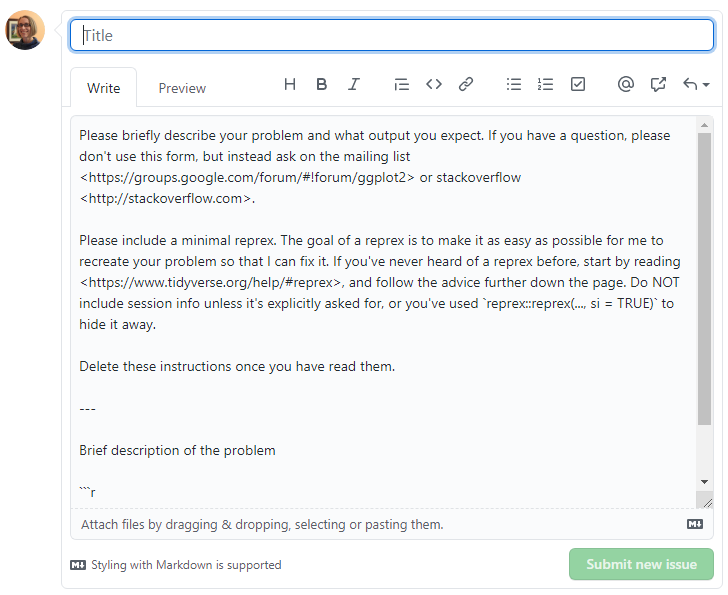

```{r setup, include = FALSE}
options(htmltools.dir.version = FALSE)
knitr::opts_chunk$set(
  fig.width=9, fig.height=3.5, fig.retina=3,
  out.width = "100%",
  cache = FALSE,
  echo = TRUE,
  message = FALSE, 
  warning = FALSE,
  fig.show = TRUE,
  hiline = TRUE
)
library(formatR)
```

```{r xaringan-themer, include = FALSE, warning = FALSE}
library(xaringanthemer)
style_duo_accent(
  primary_color = "#1c5253",
  secondary_color = "#F4790B",
  inverse_header_color = "#FFFFFF",
  title_slide_text_color = "#FFFFFF",
  base_font_size = "22px",
  link_color = "#F4790B",
  code_highlight_color = "rgba(244, 121, 11, 0.5)"
)
```

```{r metathis, echo=FALSE}
library(metathis)
meta() %>%
    meta_name("github-repo" = "aosmith16/spring-r-topics") %>% 
    meta_social(
        title = "How to reprex",
        description = "Reproducible examples in R + GitHub issue etiquette",
        url = "https://aosmith16.github.io/spring-r-topics/slides/week09_reprex.html",
        image = "https://raw.githubusercontent.com/aosmith16/spring-r-topics/main/slides/week09-share-card.png",
        image_alt = paste(
            "Slides for how to reprex", 
            "Working sessions class spring 2021"
        ),
        og_type = "website",
        og_author = "Ariel Muldoon",
        twitter_card_type = "summary",
        twitter_creator = "@aosmith16"
    )
```

```{r xaringan-scribble, echo = FALSE}
xaringanExtra::use_scribble()
```

```{r xaringanExtra-clipboard, echo=FALSE}
xaringanExtra::use_clipboard()
```

```{r xaringan-tile-view, echo=FALSE}
xaringanExtra::use_tile_view()
```

```{r broadcast, echo=FALSE}
xaringanExtra::use_broadcast()
```

class: center, middle, title-slide

# How to reprex
## Making reproducible examples in R

```{r distill, echo = FALSE, out.width = "25%", fig.cap = "Logo for package reprex"}
knitr::include_graphics("figs/reprex.png")
```

### Ariel Muldoon
### May 25, 2021

---

## Today's Goal

Overall  
- **Learn how to make reproducible examples in R**   

--

We will  

-     Use package **reprex** for creating examples with code and output     
-     Add data to a reprex with package **datapasta**    
-     Discuss etiquette for GitHub issues      
-     Add a **reprex** to a GitHub issue

---

class: hide-logo

## Resources

- [Reprex do's and don'ts](https://reprex.tidyverse.org/articles/reprex-dos-and-donts.html) from the **reprex** website  
- Sharla Gelfand's "make a reprex... please" [slides](https://make-a-reprex-please.netlify.app/#1) and [recording](https://t.co/860RTqMvjy)   
- [How to Datapasta](https://milesmcbain.github.io/datapasta/articles/how-to-datapasta.html)  
- See Yihui Xie's [GitHub issue guide](https://yihui.org/issue/). This guide is specific to repositories he maintains but contains good general advice.   

.center[
```{r, echo = FALSE, out.width = "25%", fig.cap = "Logo for package datapasta"}

```
]

---

## What is a reprex?

The term *reprex* stands for **repr**oducible **ex**ample.

If you ever ask for help in R on a help forum or want to report an issue on a GitHub repository you will be asked for minimal example code that others can run to reproduce whatever problem you are having.

--

There are several nice overviews of how to make a reproducible example.

[RStudio Community guide](https://community.rstudio.com/t/faq-how-to-do-a-minimal-reproducible-example-reprex-for-beginners/23061)  
[Stack Overflow canonical thread](https://stackoverflow.com/questions/5963269/how-to-make-a-great-r-reproducible-example)
[Tidyverse help guide](https://www.tidyverse.org/help/)

---

## What is in a reprex?

This is what we'll be practicing today.

A reprex should include:    
>
> - A minimal dataset, necessary to reproduce the issue
- The minimal runnable code necessary to reproduce the issue, which can be run
on the given dataset, and including the necessary information on the used packages.  

*From RStudio Community guide*

---

## What is in a reprex?

A reprex should include:
>
> - a minimal dataset, necessary to demonstrate the problem  
> - the minimal runnable code necessary to reproduce the error, which can be run on the given dataset  
> - all necessary information on the used packages, the R version, and the OS it is run on.  
> - in the case of random processes, a seed (set by set.seed()) for reproducibility  

*From Stack Overflow thread*

--

Note the consistent use of the word *minimal*.

---

## Why should I reprex?

Making a minimal, reproducible example can take time. It can be easy to convince yourself to skip the process and "just get the help I need".

But the time is ultimately worth spending. `r emo::ji("dollar")`

--

>
- 80% of the time creating an excellent reprex reveals the source of your problem. It’s amazing how often the process of writing up a self-contained and minimal example allows you to answer your own question.
>
- The other 20% of time you will have captured the essence of your problem in a way that is easy for others to play with. This substantially improves your chances of getting help!

*From tidyverse guide*

???

A lot of times you can solve your own problem while working towards a minimal, reproducible example.

---

## Why should I reprex?

.center[
```{r, echo = FALSE, out.width = "70%", fig.alt = "Artwork by Allison Horst showing cartoon monsters enjoying success when they provided  a reproducible example, helping others help them solve their problem"}

```
Artwork by @allisonhorst  
]

???

It helps people help you!  It also makes make it much more likely you will get a positive response.

---

## Why should I reprex?

<blockquote class="twitter-tweet tw-align-center" data-lang="en"><p lang="en" dir="ltr">Reproducible examples</p>&mdash; Sharla Gelfand (@sharlagelfand) <a href="https://twitter.com/sharlagelfand/status/1365665149063987201">Tweet February 27, 2021</a></blockquote>
<script async src="//platform.twitter.com/widgets.js" charset="utf-8"></script>

???

And you will be asked for one!

---

## The plan

We will

- Take an example coding problem and build a minimal, reproducible example
- Use **reprex** to get code and output ready to paste  
- Talk about GitHub issues and issue etiquette  
- Practice making an issue, writing text and pasting **reprex** code

---

class: with-logo logo-reprex

## The reprex package

The goal of this package is to 
>Render bits of R code for sharing, e.g., on GitHub or StackOverflow

--

The package takes a chunk of your code and runs it, returning both the code and the code output on your clipboard. Paste the result into your question on Stack Overflow or when reporting a potential issue on GitHub.

Now someone can not only copy your code and run it, they can see what the output looks like. 

---

## GitHub issues

The **Issues** section on GitHub is where you can report possible bugs or make feature requests.

This is part of a GitHub repository. See **Issues** in the second menu on the top navigation bar.

.center[
```{r, echo = FALSE, fig.alt = "Screen capture showing the issues menu on the top menu bar in aosmith16/practice-repo GitHub repository"}
knitr::include_graphics("figs/week09_files/issue_menu.png")
```
]

---

## GitHub issues

Take a moment to explore the issues section on the **ggplot2** repository at https://github.com/tidyverse/ggplot2/issues.

.center[
```{r, echo = FALSE, fig.alt = "Screen capture of the issues section for the ggplot2 GitHub repository"}
knitr::include_graphics("figs/week09_files/ggplot2_issues.png")
```
]

---

## GitHub issues

Things to note:
- There are separate pages for open and closed issues.
- Note the search bar at the top so you can search within issues.
- You can sort issues using the drop-down menu on the far right I sometimes look at "Recently updated" rather the newest.
- You can create an issue by clicking on the "New issue" button on the right

---

## GitHub issues 

I think I found a bug; should I report it?

--

Absolutely!

Reporting bugs is ultimately a way to help the package maintainer improve the package. It is a way for non-programmers like me to participate in and give back to an open source programming language like R.

--

It can feel scary `r emo::ji("fearful")`to report an issue, I think particularly for those of us who feel like non-R experts. 

To ease the process, let's go over some of the basic etiquette to follow when reporting an issue. 

???

I have occasionally reported bugs for students who found issues in packages. I hope this ultimately leads them to see the process so they will feel empowered to report issues in the future.

---

## GitHub issues etiquette

Yihui Xie's guide to etiquette on his repositories is a good place to start: https://yihui.org/issue/.

--

**Report bugs and request features**

The issues section on GitHub is for reporting potential bugs `r emo::ji("beetle")` and requesting features. It is not for asking general questions about how the package works.

If you have a question, ask on help forums such as [Stack Overflow](https://stackoverflow.com/questions/tagged/r) and the [RStudio Community](https://community.rstudio.com/).  

It may turn out that your question was due to a bug. In that case, go to the relevant GitHub repo and report it. `r emo::ji("smile")`

---

## GitHub issues etiquette

**Do your research.**

- Before opening a new issue, check that no one else as reported it by searching both open and closed issues using the search tool.

.center[
```{r, echo = FALSE, fig.alt = "Screen capture of the issues section for the ggplot2 GitHub repository"}
knitr::include_graphics("figs/week09_files/ggplot2_issues.png")
```
]

---

## GitHub issues etiquette

**Do your research.**

- Before opening a new issue, check that no one else as reported it by searching both open and closed issues using the search tool.
- Go through the `NEWS` to check for any recent changes. This is usually on the first page of the repo and may be called `NEWS.md`.

.center[
```{r, echo = FALSE, fig.alt = "Screen capture showing where to check for changes in NEWS.md on the ggplot2 GitHub repository"}
knitr::include_graphics("figs/week09_files/news.png")
```
]

---

## GitHub issues etiquette

**Do your research.**

- Before opening a new issue, check that no one else as reported it by searching both open and closed issues using the search tool.
- Go through the `NEWS` to check for any recent changes. This is usually on the first page of the repo and may be called `NEWS.md`.
- If you feel unsure that what you found is really a bug, ask someone else to review your minimal reproducible example. This may be on one of the aforementioned forums.

---

## GitHub issues etiquette

**Follow all repository instructions.**

Every repository is different, but some will give specific instructions on what you need to provide when opening an issue. 

For example, if you open a **ggplot2** issue you will see the following set of instructions. Make sure you read them and then do what they say.

.center[
```{r, echo = FALSE, fig.alt = "Screen capture showing where to check for changes in NEWS.md on the ggplot2 GitHub repository"}

```
]

???

Notice that this repo asks for session info only if requested or you can hide it using **reprex** collapsible session info with `session_info = TRUE`.

Similarly, make sure you read Yihiu Xie's issue guide if opening issue on a repo he maintains. Most of his also have instructions included when opening the issue.

---

## GitHub issues etiquette

**Be kind and respectful.**

This seems like it should go without saying, but I've seen issues that have an accusatory tone when something that used to work no longer does.

You may decide to offer up appreciation (if instructions allow for it `r emo::ji("grin")`) but at the very least be civil and to the point.

<blockquote class="twitter-tweet tw-align-center" data-lang="en"><p lang="en" dir="ltr">Issues can feel oppressive to maintainers</p>&mdash; Jim Hester (@jimhester_) <a href="https://twitter.com/jimhester_/status/1357680037470875649">Tweet February 5, 2021</a></blockquote>
<script async src="//platform.twitter.com/widgets.js" charset="utf-8"></script>

???

Issues are usually bug reports, which can feel really negative. Think about how the maintainer might feel when they see your report and try to set the tone accordingly.

---

## GitHub issues etiquette

**Provide a minimal reproducible example.**

The simpler the example you can give, the easier it is for the maintainer to understand the problem. Our goal is to help, and reducing the burden of figuring out what we mean is a good start.

Ideally you will provide very basic example code with output. This is a reason to use package **reprex**.  

```{r distill, echo = FALSE, out.width = "25%", fig.cap = "Logo for package reprex"}
knitr::include_graphics("figs/reprex.png")
```

---

## GitHub issues etiquette

**Be patient.**

You likely will not get an immediate response. Package maintainers are busy people and getting to issues takes time.

If you have a potential fix for an issue, you might consider making a pull request. 

---

## GitHub issues etiquette

**Be responsive if more information requested.**

The repo maintainer may ask you for more background on the issue or feature request. Be sure to be paying attention so you can get back to them.

I've seen issues closed because the original poster never returned with follow up information.

---

## GitHub issues etiquette

Let's put these guidelines all in one slide.

- **Report bugs and request features**
- **Do your research.**
- **Follow all repository instructions.**
- **Be kind and respectful.**
- **Provide a minimal reproducible example.**
- **Be patient.**
- **Be responsive if more information requested.**

---

## Issue examples

I want and found a could of old issues I put in for package **tidyr**.

The first one is a feature request: https://github.com/tidyverse/tidyr/issues/387 

You can see I initially didn't give enough background and so had to come back with more information.

Also note that there was a delay before the maintainer was able to think about this, which is not uncommon with a feature request. 

You can add emoji's to posts within GitHub issues. This is one way to show appreciation, and you can see this on the very last post in the thread.

---

## Issue examples

The second was a bug report `r emo::ji("beetle")`: https://github.com/tidyverse/tidyr/issues/324

I did a better job of showing a really minimal example here to demonstrate the problem.

---

## Practice issue

Let's finish today by taking with we learned with **reprex** and armed with our GitHub issues etiquette to practice making an issue.

--

Open an issue on my `practice-repo` repository: https://github.com/aosmith16/practice-repo

Use some of the **reprex** code we wrote earlier.  Open an issue, add text to describe the issue, and then paste the code and output before submitting. Include collapsible session info. 

--

Note how nicely the code and output is formatted when pasting from **reprex**. Even if you don't use **reprex** make sure your code is formatted correctly using Markdown syntax.  

---

## Next week

- Not sure yet


.footnote[
[Code for slides](https://github.com/aosmith16/spring-r-topics/tree/main/docs/slides)  
Slides created via the R packages:  
[**xaringan**](https://github.com/yihui/xaringan), 
[gadenbuie/xaringanthemer](https://github.com/gadenbuie/xaringanthemer), 
[gadenbuie/xaringanExtra](https://github.com/gadenbuie/xaringanExtra) 
.center[*This work is licensed under the Creative Commons Attribution-NonCommercial 4.0 International License. 
To view a copy of this license, visit http://creativecommons.org/licenses/by-nc/4.0/.*]
]